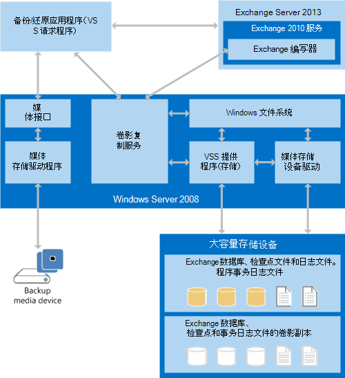

# 为 Exchange 2013 生成备份和还原应用程序

查找有关 Exchange 2013 的备份和还原应用程序的组件和体系结构的信息，以及创建备份和还原应用程序的系统要求。
  
**适用于：** Exchange Server 2013 
  
您可以在 Windows Server 的版本中使用[卷影复制服务（VSS）](https://msdn.microsoft.com/library/bb968832%28VS.85%29.aspx) ，并以 windows server 2008 开头，以创建备份和还原 Exchange Server 2013 数据的应用程序。 VSS 提供了一个基础结构，使您能够跨第三方存储管理系统、业务应用程序和硬件创建和管理卷影副本。 您可以基于使用卷影副本备份和还原一个或多个 Exchange 2013 数据库的 VSS 基础结构创建解决方案。 
  
## 备份和还原应用程序必备组件

为了使自定义备份和还原应用程序和 VSS 能够备份和还原 Exchange 2013 数据库，您的环境必须包含以下内容：
  
- 从 Windows Server 2008 开始的 Windows Server 版本 
    
- Exchange 2013
    
此外，如果要创建备份和还原应用程序，则应了解开发环境的以下限制：
  
- VSS 是一个非托管 COM API，可通过 COM 互操作程序集从 .NET Framework 托管代码进行访问。
    
- Exchange 命令行管理程序是通过 .NET Framework 托管代码访问的托管应用程序。
    
- 随 Exchange 2013 提供的 CHKSGFILES API 是本机代码64位 DLL。 不支持将 Exchange 2007 32-bit CHKSGFILES DLL 与 Exchange 2013 数据库结合使用。
    
## 备份和还原应用程序概述

VSS 协调以下组件之间的通信： 
  
- VSS 请求者，即备份应用程序
    
- VSS 编写器
    
- VSS 提供程序，它是创建卷影副本的系统、软件或硬件组件
    
若要使用 VSS 备份 Exchange 2013 数据，备份应用程序必须是可识别 Exchange 2013 的 VSS 请求者。 Exchange 2013 包括一个 VSS 书写器（称为 Microsoft Exchange 编写器），用于 Windows Server 备份程序;但是，Exchange 编写器仅备份整个卷。 它不会备份单独的 Exchange 2013 数据库。 如果需要更大的灵活性，可以使用第三方备份应用程序，该应用程序具有可用于各个 Exchange 数据库的 Exchange 感知 VSS 编写器，也可以创建自定义 VSS 请求者。
  
在您的应用程序调用 VSS 以启动备份之前，它必须获取有关其正在备份的 Exchange 2013 系统的存储配置的信息。 该信息存储在 Active Directory 域服务（AD DS）中。 您的备份应用程序可以通过使用 Exchange 命令行管理程序命令来获取 Exchange 存储配置数据。 有关详细信息，请参阅[Exchange Server PowerShell （Exchange 命令行管理程序）](https://docs.microsoft.com/powershell/exchange/exchange-server/exchange-management-shell?view=exchange-ps)。 
  
Exchange 2013 备份应用程序调用 VSS COM Api，以创建 Exchange 数据库的完整备份、副本备份和增量备份;它们不与 VSS 编写器直接交互。 Exchange 中的数据库可用性组（DAG）功能还使您的应用程序能够创建完全一致的备份，即使最初的完整备份和后续增量备份来自 DAG 中的不同服务器也是如此。 VSS 创建 Exchange 数据的副本后，备份应用程序将数据存储到预期的媒体上。
  
若要还原 Exchange 2013 数据库，还原应用程序将从备份媒体检索数据库和日志文件，并将其存储在 Exchange 服务器的活动磁盘存储上。 单个数据库不与特定的 Exchange 服务器相关联。 
  
备份和还原应用程序必须指定多个特定于 Exchange 2013 的参数，才能正确控制和管理由 VSS 对 Exchange 2013 数据库运行的操作。 例如，由于 Exchange 2013 支持最高为100个活动数据库，因此备份应用程序必须正确地指定和处理数据库文件、事务日志文件和检查点文件数据库组件。
  
若要重新构造自上次完整备份后发生了更改的数据库，还原应用程序需要来自不同备份的数据库和日志文件。 例如，它可能需要每周完整备份和一个或多个每日增量备份。 在使用 Dag 的 Exchange 2013 系统中，还原应用程序可以通过在同一 DAG 中的不同服务器上使用不同数据库副本中的备份来重建数据库。 但是，从备份中还原 DAG 数据库的唯一受支持方法是使用相同的数据还原数据库的所有主动副本和被动副本。
  
在所有数据都准备就绪后，还原应用程序会通知 Exchange 以检查数据库和日志文件的完整性。 如果数据库和日志文件已正确还原，则 Exchange 服务器可以重播数据库日志文件，以使数据库保持最新并装入它。 如果数据库已恢复到已装入数据库的主动副本的服务器，则该数据库将被视为恢复数据库。 如果数据库已恢复到另一台服务器上，则可以独立装入数据库，也可以将副本添加到 DAG 中。
  
## 备份和还原系统体系结构

VSS 通过第三方（或自定义）提供程序与 Windows Server 文件系统和大容量存储设备驱动程序进行通信。 硬件提供商确定将在何处创建卷影副本。 VSS 会对特定于硬件的卷影副本进行摘要，以便您的备份和还原应用程序无需了解有关硬件实现详细信息的信息即可访问卷影副本。 下图显示了备份和还原应用程序如何与 Exchange 2013 和 Windows Server 交互。
  
**图1。备份和还原系统体系结构**

  
备份和还原应用程序充当 VSS 请求者。 请求者与 VSS 通信，以获取有关 Exchange 2013 的信息，启动创建卷影副本，并获取备份数据的访问权限。 
  
Exchange 存储是 Exchange 2013 的一个组件，通过 Windows Server 文件系统访问 Exchange 2013 数据库。 在文件系统中，每个 Exchange 服务器可以同时使用其附带的数据库（.edb）文件、事务日志文件和检查点文件来装载最高为100的数据库。
  
为了支持 VSS，Exchange 2013 包括内置于 Exchange 存储中的 Exchange 书写器。 Exchange 编写器与 Exchange 存储区协调（代表请求者操作），以便在备份数据库之前冻结和卸除数据库，然后在备份完成后取消冻结和装载数据库。 在还原过程中，您的备份和还原应用程序指示 Exchange 编写器与 Exchange 存储区进行协调以卸除数据库、替换数据库文件、装入数据库，然后重播事务日志（如果需要）。
  
在还原过程中，请求者还与 VSS 进行通信，以便为还原准备系统，然后将数据放回大容量存储设备。 您的备份和还原应用程序还负责使用 Windows Server 读取数据，并将数据写入备份存储媒体，无论是磁带存档、存储区域网络还是其他备份媒体。
  
还原的数据库可以作为常规、活动的数据库或 Exchange 2013 恢复数据库进行装入。 只能将一个已装入的数据库指定为每个 Exchange 服务器上的恢复数据库。
  
在 Exchange 2013、VSS 和备份和还原应用程序中成功完成备份和还原操作所需的信息将作为 Exchange 编写器元数据的一部分进行传输。
  
## 本节内容

- [Exchange 2013 的备份操作类型](types-of-backup-operations-for-exchange-2013.md)
    
- [还原 Exchange 2013 数据库](restoring-exchange-2013-databases.md)
    
- [使用 Exchange 2013 中的 CHKSGFILES API 验证备份完整性](how-to-validate-backup-integrity-by-using-the-chksgfiles-api-in-exchange.md)
    
- [使用 Exchange 2013 中的 Eseutil 工具验证备份完整性](how-to-validate-backup-integrity-by-using-the-eseutil-tool-in-exchange-2013.md)
    
## 另请参阅

- [Exchange 备份和还原](backup-and-restore-for-exchange-2013.md) 
- [CChkSGFiles 类参考](cchksgfiles-class-reference.md) 
- [卷影复制服务](https://msdn.microsoft.com/library/bb968832%28VS.85%29.aspx) 
- [Windows PowerShell](https://msdn.microsoft.com/library/dd835506%28v=vs.85%29.aspx)
    

