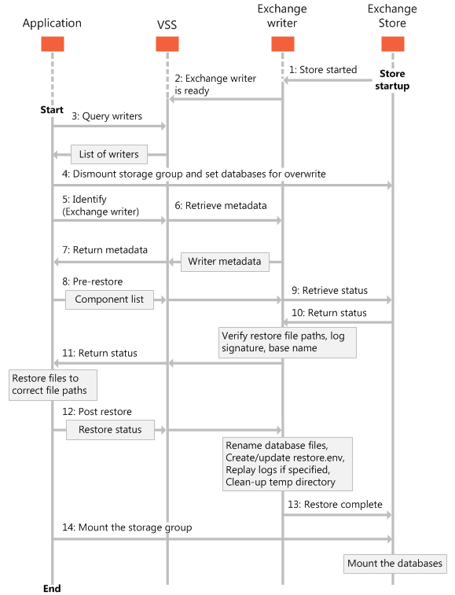

# 还原 Exchange 2013 数据库Restoring Exchange 2013 databases

查找有关可还原 Exchange 2013 数据库的不同方法的信息。Find information about the different ways that you can restore your Exchange 2013 databases. 
  
**适用于：** Exchange Server 2013**Applies to:** Exchange Server 2013 
  
Exchange Server 2013 中包含的 Exchange 编写器可为您还原 Exchange 数据库的方式提供一些灵活性。The Exchange writer that is included in Exchange Server 2013 allows for some flexibility in how you restore your Exchange databases. 通过使用 Exchange 2013 中的 Exchange 编写器，可以将卷影副本备份还原到以下位置：By using the Exchange writer in Exchange 2013, you can restore your shadow copy backups to the following locations:
  
- 原始数据库，无论数据库或事务日志文件路径配置是否已修改。The original database, regardless of whether the database or transaction log file path configuration has been modified.
    
- 恢复数据库。A recovery database.
    
- 任何生产数据库，而不管数据库显示名称是否与 VSS 备份集内的名称相匹配。Any production database, regardless of whether the database display name matches the name in a VSS backup set.
    
当还原应用程序将信息还原到原始数据库时，必须将日志文件还原到该数据库的 Active Directory 域服务（AD DS）中指定的目录路径。When your restore application restores information to the original database, the log files must be restored to the directory path specified in Active Directory Domain Services (AD DS) for that database. 如果应用程序将数据库还原到其他位置，则必须将日志文件还原到位于数据库日志文件目录内的名为 **_restoredLogs**的文件夹中。If your application restores a database to a different location, the log files must be restored to a folder named **_restoredLogs** that is located inside the database log file directory. 
  
当还原到与原始数据库不同的服务器或数据库时，还原应用程序必须确保提供给 VSS 的数据库目录路径与 AD DS 中的路径相匹配。When restoring to a server or database that is different than the original database, your restore application must make sure that the database directory paths provided to VSS match those in AD DS. 您可以使用[Set-mailboxdatabase](https://technet.microsoft.com/library/bb124924%28v=exchg.150%29.aspx)Exchange 命令行管理程序 cmdlet 来获取有关现有数据库的信息。You can use the [get-MailboxDatabase](https://technet.microsoft.com/library/bb124924%28v=exchg.150%29.aspx)Exchange Management Shell cmdlet to get information about existing databases. 有关 Exchange 命令行管理程序的详细信息，请参阅[Exchange Server PowerShell （Exchange 命令行管理程序）](https://docs.microsoft.com/powershell/exchange/exchange-server/exchange-management-shell?view=exchange-ps)。For more information about the Exchange Management Shell, see [Exchange Server PowerShell (Exchange Management Shell)](https://docs.microsoft.com/powershell/exchange/exchange-server/exchange-management-shell?view=exchange-ps). 
  
下图显示了由卷影复制服务（VSS）管理的 Exchange 数据库的典型还原中的事件序列。The following figure shows the sequence of events in a typical restore of an Exchange database that is managed by the Volume Shadow Copy Service (VSS).
  
**图1。还原数据库的事件的顺序****Figure 1. Sequence of events for restoring databases**

  
## 将 Exchange 数据库还原到原始位置Restoring Exchange databases to the original location

Exchange 编写器使应用程序能够将数据库和事务日志文件还原到其在 Exchange 服务器上的原始位置。The Exchange writer enables applications to restore databases and transaction log files to their original locations on the Exchange server. 默认情况下，在请求者确认在[OnPostRestore](https://msdn.microsoft.com/library/windows/desktop/aa381566%28v=vs.85%29.aspx)操作过程中完成还原后，Exchange 编写器将重播事务日志文件。By default, the Exchange writer replays the transaction log files after the requester confirms that the restore is complete during the [OnPostRestore](https://msdn.microsoft.com/library/windows/desktop/aa381566%28v=vs.85%29.aspx) operation. 还原应用程序必须使用 VSS [SetAdditionalRestores](https://msdn.microsoft.com/library/windows/desktop/aa382829%28v=vs.85%29.aspx)方法来阻止重播日志文件。The restore application must use the VSS [SetAdditionalRestores](https://msdn.microsoft.com/library/windows/desktop/aa382829%28v=vs.85%29.aspx) method to prevent having the log files replayed. 以后，当 Exchange 管理员或应用程序 remounts 还原的数据库时，可以重播日志文件。The log files can be replayed at a later time when the Exchange administrator or your application remounts the restored database. 
  
将数据库还原回其原始数据库对象时（如果数据库中的目标 Guid 与备份集中的 Guid 相匹配），但对于不同的文件路径，应用程序必须确定当前文件路径，并将备份文件还原到数据库属性中指定的相应文件路径。When restoring databases back to their original database objects (such that the target GUIDs in the database match those in the backup set) but to different file paths, the application must determine the current file paths and restore the backup files to the corresponding file paths specified in the database properties. 请求者必须调用[AddNewTarget](https://msdn.microsoft.com/library/windows/desktop/aa382648%28v=vs.85%29.aspx)方法以与 Exchange 编写器通信，以便在作者可以继续执行其余还原过程之前，还原文件的位置。The requester must call the [AddNewTarget](https://msdn.microsoft.com/library/windows/desktop/aa382648%28v=vs.85%29.aspx) method to communicate to the Exchange writer the location where the files are restored before the writer can continue with the rest of the restore process. 如果未调用**AddNewTarget** ，则 Exchange 编写器将假定将备份还原到备份元数据文档中指定的文件路径。If **AddNewTarget** is not called, the Exchange writer assumes that the backups are restored to the file paths specified in the backup metadata document. 
  
通常情况下，您的应用程序不必为从数据库可用性组（DAG）副本执行的备份指定新路径。Typically, your application does not have to specify a new path for backups that are performed from a Database Availability Group (DAG) copy. Exchange 管理员通常不会更改数据库或日志文件路径。Exchange administrators do not usually change database or log file paths. 但是，在 DAG 配置中，备份应用程序可能必须指定活动的数据库和日志路径，因为 DAG 复制路径始终不同于这些路径。In a DAG configuration, however, the backup application might have to specify the active database and log paths, because DAG copy paths are always different from those paths.
  
请注意，Exchange 2013 不支持还原非活动的 DAG 数据库副本。Note that Exchange 2013 does not support restoring inactive DAG database copies. 仅当还原了主动数据库副本时，才能从备份数据还原 DAG 副本。DAG copies can be restored from backup data only when the active database copy is restored. 使用不同的备份数据集或尝试还原数据库副本的子集可能导致数据库变得无法装入。Using different backup data sets or attempting to restore a subset of the database copies can cause the database to become unmountable. 在这种情况下，备份应用程序不必调用[SetRestoreOptions](https://msdn.microsoft.com/library/windows/desktop/aa382856%28v=vs.85%29.aspx)函数，因为备份会还原到创建它们的原始数据库对象。Backup applications do not have to call the [SetRestoreOptions](https://msdn.microsoft.com/library/windows/desktop/aa382856%28v=vs.85%29.aspx) function in this case, because the backups are restored to the original database objects they were created from. 但是，如果备份应用程序调用**SetRestoreOptions** ，并且 XML 元数据文档具有正确的参数，则结果不是错误。However, if the backup application calls **SetRestoreOptions** and the XML metadata document has the correct parameters, the result is not an error. 
  
## 将 Exchange 数据库还原到恢复数据库Restoring Exchange databases to a recovery database

Exchange 编写器使您能够将数据直接还原到恢复数据库。The Exchange writer enables you to restore data directly to a recovery database. 将恢复的数据作为恢复数据库装载，可以使 Exchange 管理员能够还原单个邮箱甚至邮箱中的单个项目。Mounting the recovered data as a recovery database allows the Exchange administrator to restore individual mailboxes, and even individual items in a mailbox.
  
如果已存在恢复数据库，则应用程序可以卸除数据库，将数据还原到恢复数据库和日志文件，然后重新装入数据库。If a recovery database already exists, your application can dismount the database, restore the data onto the recovery database and log files, and then remount the database.
  
每个 Exchange 2013 服务器允许一次仅装入一个恢复数据库。Each Exchange 2013 server allows for only one recovery database to be mounted at a time. 服务器可以包含任意数量的已恢复数据库，因为磁盘空间允许，但只能将其中一个装载为恢复数据库。The server can contain as many recovered databases as disk space allows, but only one can be mounted as the recovery database. 装载为恢复数据库的数据库将被计算为可一次装入的最大数据库数。The database mounted as the recovery database is counted in the maximum number of databases that can be mounted at a time. 作为服务器的恢复数据库挂载的恢复的数据库不会以任何方式与原始邮箱相关联。A recovered database mounted as a server's recovery database is not associated with the original mailbox in any way.
  
若要恢复到恢复数据库，您的应用程序必须调用[SetRestoreOptions](https://msdn.microsoft.com/library/windows/desktop/aa382856%28v=vs.85%29.aspx)方法，并提供一个指示源和目标数据库 GUID 的 XML 文档。To recover to a recovery database, your application must call the [SetRestoreOptions](https://msdn.microsoft.com/library/windows/desktop/aa382856%28v=vs.85%29.aspx) method and provide an XML document that indicates the source and target database GUIDs. 源 Guid 必须与备份集中的 Guid 相匹配，且目标 Guid 必须与 AD DS 中的目标数据库条目相匹配。The source GUIDs must match those from the backup set, and the target GUIDs must match the destination database entries in AD DS. 备份应用程序还必须调用[AddNewTarget](https://msdn.microsoft.com/library/windows/desktop/aa382648%28v=vs.85%29.aspx)方法来指定将文件还原到的目录路径。The backup application must also call the [AddNewTarget](https://msdn.microsoft.com/library/windows/desktop/aa382648%28v=vs.85%29.aspx) method to specify the directory path where the files are restored to. 如果需要重命名数据库文件，Exchange 编写器将在[OnPostRestore](https://msdn.microsoft.com/library/windows/desktop/aa381566%28v=vs.85%29.aspx)操作过程中重命名数据库。If the database files need to be renamed, the Exchange writer will rename the database during the [OnPostRestore](https://msdn.microsoft.com/library/windows/desktop/aa381566%28v=vs.85%29.aspx) operation. Exchange 要求将事务日志文件还原到当前事务日志文件路径下的子文件夹（ **_restoredLogs**）。Exchange requires the transaction log files to be restored to a subfolder ( **_restoredLogs**) under the current transaction log file path. 如果将日志文件还原到任何其他位置，则 Exchange 编写器将返回错误。If the log files are restored to any other location, the Exchange writer will return an error. 由于要作为恢复数据库而装载的数据库不会还原到其原始位置，因此需要将这些数据库置于干净关闭状态，然后才能装入它们。Because databases being mounted as the recovery database are not restored to their original location, they need to be brought into clean-shutdown state before they can be mounted. 默认情况下，在还原后，Exchange 编写器会将所有还原的数据库置于干净关闭状态。By default, the Exchange writer will bring all the restored databases into a clean-shutdown state during post-restore. 如果备份应用程序调用[SetAdditionalRestores](https://msdn.microsoft.com/library/windows/desktop/aa382829%28v=vs.85%29.aspx)方法，则 Exchange 编写器将不会重播日志文件，管理员或备份应用程序需要在挂载数据库之前将数据库置于干净关闭状态。If your backup application calls the [SetAdditionalRestores](https://msdn.microsoft.com/library/windows/desktop/aa382829%28v=vs.85%29.aspx) method, the Exchange writer will not replay the log files, and either the administrator or your backup application needs to bring the database into a clean-shutdown state prior to mounting the database. 
  
## 将 Exchange 数据库还原到恢复服务器Restoring Exchange databases to a recovery server

在某些情况下，您可能需要将备份集恢复到另一台服务器上;例如，您可能需要将邮箱数据库迁移到同一 Exchange 组织中的另一台 Exchange 2013 服务器，或还原到生产环境外部的专用服务器以恢复邮箱和公用文件夹数据，从而从灾难性的服务器故障中恢复。In some scenarios, you might need to recover a backup set to another server; For example, you might need to recover from a catastrophic server failure by porting the mailbox database to another Exchange 2013 server in the same Exchange organization, or restore to a dedicated server outside the production environment to recover mailbox and public folder data. 
  
在这些方案中，目标数据库的文件路径及其对象 Guid 与原始数据库的不同。In these scenarios, the file paths for the target database as well as its object GUIDs are different than those for the original database. 因此，您的应用程序必须使用 XML 文档调用[SetRestoreOptions](https://msdn.microsoft.com/library/windows/desktop/aa382856%28v=vs.85%29.aspx)方法，该文档指明源和目标数据库信息，并调用[AddNewTarget](https://msdn.microsoft.com/library/windows/desktop/aa382648%28v=vs.85%29.aspx)方法来指定要将备份文件还原到的目录路径。Therefore, your application has to call the [SetRestoreOptions](https://msdn.microsoft.com/library/windows/desktop/aa382856%28v=vs.85%29.aspx) method with an XML document that indicates the source and target database information, and call the [AddNewTarget](https://msdn.microsoft.com/library/windows/desktop/aa382648%28v=vs.85%29.aspx) method to specify the directory paths to restore the backup files to. 对于 Exchange 编写器，此还原与还原到恢复数据库相同。For the Exchange writer, this restore is the same as restoring to a recovery database. 有关详细信息，请参阅本文前面的[将 Exchange 数据库还原到恢复数据库](restoring-exchange-2013-databases.md#bk_RecoveryDatabase)。For more information, see [Restoring Exchange databases to a recovery database](restoring-exchange-2013-databases.md#bk_RecoveryDatabase) earlier in this article. 
  
## 另请参阅See also

- [Exchange 2013 的备份操作类型Types of backup operations for Exchange 2013](types-of-backup-operations-for-exchange-2013.md)
    
- [为 Exchange 2013 生成备份和还原应用程序Build backup and restore applications for Exchange 2013](build-backup-and-restore-applications-for-exchange-2013.md)
    
- [Exchange 2013 的备份和还原概念Backup and restore concepts for Exchange 2013](backup-and-restore-concepts-for-exchange-2013.md)
    
- [CChkSGFiles 类参考CChkSGFiles class reference](cchksgfiles-class-reference.md)
    

