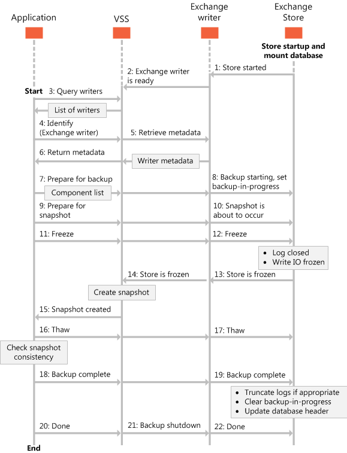

# Exchange 2013 的备份操作类型Types of backup operations for Exchange 2013

查找可以在 Exchange 2013 存储数据库上执行的不同类型的备份信息，包括完整备份、副本备份、增量备份和差异备份。Find information about the different types of backups you can perform on your Exchange 2013 store databases, including full, copy, incremental, and differential backups.
  
**适用于：** Exchange Server 2013**Applies to:** Exchange Server 2013 
  
本文提供了可在 Exchange Server 2013 数据库上执行的不同类型的备份的相关信息，以及这些备份对数据库文件的影响。This article provides information about the different types of backups you can perform on Exchange Server 2013 databases, and how those backups affect the database files. 
  
使用卷影复制服务 (VSS) 和 Exchange 编写器的备份和还原应用程序可以执行下表中列出的备份类型。Backup and restore applications that use the Volume Shadow Copy Service (VSS) and the Exchange writer can perform the types of backups listed in the following table.
  
**表 1. 备份操作的类型****Table 1. Types of backup operations**

|**备份类型****Backup type**|**说明****Description**|
|:-----|:-----|
|[完整备份Full backups](types-of-backup-operations-for-exchange-2013.md#bk_FullBackups)   |备份数据库（ \* .edb）、事务日志（ \* .log）、检查点文件（ \* .chk），然后截断特定数据库的事务日志。Backs up the databases (\*.edb), transaction logs (\*.log), checkpoint files (\*.chk), and then truncates the transaction logs for a specific database.    |
|[复制备份Copy backups](types-of-backup-operations-for-exchange-2013.md#bk_CopyBackups)   |备份数据库、事务日志和检查点文件。Backs up the database, transaction logs, and checkpoint files. 副本备份不会截断数据库的事务日志。Copy backups do not truncate the transaction logs for the database.    |
|[增量备份Incremental backups](types-of-backup-operations-for-exchange-2013.md#bk_IncrementalBackups)   |备份事务日志，记录自上次完整备份或增量备份以来的所有更改，然后再截断事务日志。Backs up the transaction logs to record changes since the last full or incremental backup, and then truncates the transaction logs.    |
|[差异备份Differential backups](types-of-backup-operations-for-exchange-2013.md#bk_DifferentialBackups)   |备份事务日志，记录自上次完整备份或增量备份以来的所有更改，并且不截断事务日志。Backs up the transaction logs to record changes since the last full or incremental backup, and does not truncate the transaction logs.    |
   
由 Exchange 编写器定义的组件或数据库文件表示的是 Exchange 2013 数据库中的数据库文件和事务日志。The components, or database files, defined by the Exchange writer represent the database files and transaction logs within Exchange 2013 databases. 这使您的备份和还原应用程序能够在备份操作过程中显示 Exchange 2013 数据库内组件的名称。This allows your backup and restore application to display the names of the components within an Exchange 2013 database during backup operations. 但是备份应用程序不能备份单个数据库组件；它只能备份整个数据库。Your backup application cannot back up individual database components, however; it can only back up whole databases. 
  
Exchange 编写器标准化数据库组件的逻辑路径，该路径在 Exchange 编写器元数据中指定。Exchange 编写器会根据需要向备份和还原应用程序返回逻辑路径。The Exchange writer standardizes the database component logical paths, which are specified in the Exchange writer metadata. The Exchange writer returns the logical paths to your backup and restore application as needed.
  
Exchange 编写器提供了以下形式的逻辑路径：The Exchange writer provides logical paths in the form: 
  
 `logicalPath = "Exchange Server\Microsoft Information Store\<Server name>"`
  
服务器和数据库组件是文件组的组件，但它们没有任何关联的文件。它们具有指定单个文件的子组件。数据库中仅包含一个名为 Logs 的日志组件。单个数据库组件的组件名称是显示为字符串的数据库的 Guid。The server and database components are file group components, but they do not have any associated files. They have subcomponents that specify the individual files. A database contains only one log component, named Logs. The component names of the individual database components are the GUIDs of the databases, shown as strings. 
  
Exchange 编写器基于 VSS 框架准则仅列出了可以进行备份的数据库。The Exchange writer only lists databases that can be backed up, based on VSS framework guidelines. 装载为 Exchange 2013 恢复数据库的数据库以及未装入的数据库都不能备份，因此不会在 Exchange 编写器的元数据中列出。Databases that are mounted as the Exchange 2013 recovery database, as well as databases that are not mounted, cannot be backed up, and therefore are not listed in the Exchange writer's metadata.
  
下图显示了 Exchange 编写器备份过程。The following figure shows the Exchange writer backup process. 
  
**图 1. 备份过程的事件序列****Figure 1. Sequence of events for the backup process**

  
## 完整备份Full backups

Exchange 数据库的完整备份涉及创建和存储数据库文件、事务日志和检查点文件的副本。A full backup of an Exchange database involves creating and storing a copy of the database file, transaction logs, and checkpoint files. Exchange 2013 数据库包含一组专用的事务日志文件。An Exchange 2013 database has one set of dedicated transaction log files.
  
已备份数据库之后，磁盘上的事务日志文件将被截断，以便仅保留发生在备份之后的数据库更改。在此过程中，基于对现已备份的数据库已处于包含多达最新检查点个数的所有更改的状态的假设，Exchange 编写器会删除多达检查点个数的所有日志条目。After the database has been backed up, the transaction log files on the disk are truncated so that only database changes that occurred after the backup was made will remain. During this process, the Exchange writer deletes all log entries up to the checkpoint, based on the assumption that the databases have now been backed up in a consistent state that contains all changes up to the most recent checkpoint. 
  
如果在备份操作过程中卸除要备份的数据库，则 Exchange 2013 将不会截断事务日志，并且结果将与复制备份操作（而不是完整备份操作）等效。If the database being backed up is dismounted during the backup operation, Exchange 2013 will not truncate the transaction logs and the result will be the equivalent of a copy backup operation, not a full backup operation. 
  
完整备份完成后，当前备份信息中将更新活动安装的数据库的标头。在已复制的部署中，此信息将被提交到事务日志文件并复制到数据库的其他 DAG 副本。由于该事务日志文件已重播到数据库副本，因此数据库的标头副本将被更新。When a full backup is completed, the headers of the active mounted database are updated with the current backup information. In replicated deployments, this information will be committed to a transaction log file and replicated to the other DAG copies of the database. Headers of the database copies are updated as this transaction log file is replayed into the database copy.
  
为了运行增量或差异卷影副本备份，完整的卷影副本备份是必需的。完整备份可以来自任何副本，只要它是卷影副本备份即可。A full shadow copy backup is required in order to run incremental or differential shadow copy backups. The full backups can be taken from any copy as long as it is a shadow copy backup.
  
在下列方案中使用完整备份：Full backups are used in the following scenarios:
  
- 数据库已损坏或丢失，但在磁盘上的事务日志文件保持不变。在此方案中，可以从完整备份还原受影响的数据库文件，并通过重播仍然在磁盘上的事务日志来进行恢复。A database becomes corrupted or is lost, but the transaction log files on disk are intact. In this scenario, the affected database files can be restored from the full backup, and then recovered by replaying the transaction logs that are still on disk. 
    
- 事务日志文件和磁盘上的数据库文件都已丢失。在此方案中，在进行完整备份时备份的事务日志文件会与数据库一起还原。Transaction log files, as well as the database file on disk, are lost. In this scenario, the transaction log files that were backed up at the time of the full backup are restored together with the database.
    
在 Exchange 2013 中，可以还原日志，而无需从完整备份集还原适用的数据库。In Exchange 2013, logs can be restored without having to restore the applicable database from a full backup set. 此选项对以前的完整备份进行还原以及与事务日志文件一起从最新的完整备份向前回滚。This option makes it possible for a previous full backup to be restored and combined with the transaction log files from the most recent full backup to roll forward.
  
当在 Exchange 编写器执行备份时，将 VSS 中的[VSS_BACKUP_TYPE](https://msdn.microsoft.com/library/windows/desktop/aa384679%28v=vs.85%29.aspx)枚举设置为**VSS_BT_FULL**时，备份中将包含以下组件：When the [VSS_BACKUP_TYPE](https://msdn.microsoft.com/library/windows/desktop/aa384679%28v=vs.85%29.aspx) enumeration in VSS is set to **VSS_BT_FULL** when the Exchange writer performs a backup, the following components are included in the backup: 
  
- 具有逻辑路径 Exchange Server\microsoft information store\ 信息存储 \\<服务器名称的数据库 \> \\<数据库 GUID\>A database with the logical path Exchange Server\Microsoft Information Store\\<Server Name\>\\<Database GUID\> 
    
- 包含逻辑路径 Exchange Server\microsoft information store\ 信息存储 \\<服务器名称的日志文件 \> \\<数据库 GUID\>A log file with the logical path Exchange Server\Microsoft Information Store\\<Server Name\>\\<Database GUID\> 
    
## 复制备份Copy backups

Exchange 数据库的副本备份涉及创建和存储与包含在完整备份中相同的元素。但是，与完整备份不同的是，备份结束时磁盘上的事务日志文件不会被截断。复制备份不是为了进行数据恢复。复制备份反而是提供数据图像，该图像可用于测试、问题诊断或为副本设定种子。A copy backup of an Exchange database involves creating and storing the same elements that are included in a full backup. However, unlike with a full backup, the transaction log files on disk are not truncated when the backup is complete. Copy backups are not intended for data recovery purposes. Instead, copy backups provide an image of the data for use in testing, problem diagnosis, or for seeding a replica.
  
例如，在 Exchange 存储中遇到问题的 Exchange 2013 管理员可以制作副本备份以在测试环境中使用，而不会影响生产系统。For example, an Exchange 2013 administrator who is experiencing problems with the Exchange store can make a copy backup for use in a test environment without affecting the production system. 复制备份不会影响常规备份计划；但是，因为副本备份也可将 Exchange 存储置于备份正在进行的状态，所以它会阻止其他计划的备份继续进行，直到完成或中止副本备份为止。Copy backups do not affect regular backup schedules; however, because a copy backup also puts the Exchange store in a backup-in-progress state, it blocks other scheduled backups from proceeding until the copy backup is completed or aborted. 
  
当 VSS 中的[VSS_BACKUP_TYPE](https://msdn.microsoft.com/library/windows/desktop/aa384679%28v=vs.85%29.aspx)枚举设置为**VSS_BT_COPY**时，副本备份中包含以下组件：When the [VSS_BACKUP_TYPE](https://msdn.microsoft.com/library/windows/desktop/aa384679%28v=vs.85%29.aspx) enumeration in VSS is set to **VSS_BT_COPY**, the following components are included in a copy backup: 
  
- 具有逻辑路径 Exchange Server\microsoft information store\ 信息存储 \\<服务器名称的数据库 \> \\<数据库 GUID\>A database with the logical path Exchange Server\Microsoft Information Store\\<Server Name\>\\<Database GUID\> 
    
- 包含逻辑路径 Exchange Server\microsoft information store\ 信息存储<服务器名称的日志文件组件 \\ \> \\<数据库 GUID\>A log file component with the logical path Exchange Server\Microsoft Information Store\\<Server Name\>\\<Database GUID\>
    
## 增量备份Incremental backups

Exchange 2013 数据库的增量备份会保存自上次完整备份或增量备份以来发生的对数据库所做的更改。An incremental backup of an Exchange 2013 database saves changes to the database that have occurred since the last full or incremental backup. 当所有的数据库文件和日志文件被还原到系统中时，就可恢复到上次增量备份发生时所处的状态。When all the database files and log files are restored to the system, they can be recovered to the state they were in at the time of the last incremental backup. 增量备份中存储的数据仅包含截至当前时间的事务日志文件。The data stored in an incremental backup includes only the transaction log files up to the current time. 
  
备份完成时，Exchange 服务器截断日志文件，并将备份时间标记在数据库标头中。使用增量备份恢复数据库要求至少要还原两个数据集：上次的完整备份，以及自上次完整备份后执行的每个增量备份。使用增量备份的优点是单独的备份会比完整备份小得多且单独的增量备份常常小于差异备份。When the backup is complete, the Exchange server truncates the log files and marks the backup time in the database headers. Using an incremental backup to recover a database requires at least two data sets to be restored: the last full backup, and then every incremental backup taken after the last full backup. The advantage to using incremental backups is that the individual backups are much smaller than a full backup and individual incremental backups are frequently smaller than differential backups. 
  
使用增量备份的缺点是，如果在完整备份中间执行许多增量备份，恢复 Exchange 存储可能会涉及恢复许多增量备份。如果没有以前的完整备份去建立增量更改的起始点，Exchange 就不会允许进行增量备份。The disadvantage to using incremental backups is that if many incremental backups were made between full backups, recovering the Exchange store may involve recovering many incremental backups. Exchange does not allow an incremental backup to occur when no previous full backup exists to establish the starting point for the incremental changes. 
  
从 DAG 副本位置执行的完整备份可以紧随从活动位置执行的增量备份，反之亦然。A full backup taken from a DAG copy location can be followed by an incremental backup from the active location and vice versa. 需要注意的限制之一是上次的备份状态保留在活动数据库的标头中，对数据库标头的更改被写入到事务日志中，并且和 DAG 部署中的所有其他事务日志一样被复制和重播在复制数据库位置中。One restriction to keep in mind is that the last backup state is maintained in the active database's header, and the changes to the database header are written to transaction logs, replicated, and replayed at the copy database location just like all other transaction logs in DAG deployments. 因为备份和还原可进行互操作，所以备份应用程序可以以独占方式在特定的 DAG 节点提供运行备份的功能，而与该节点是主动或被动无关，可以是以独占方式从被动节点运行备份，也可以是以独占方式从主动节点运行备份。Because backups and restores interoperate, backup applications can provide the functionality to run backups exclusively on a specific DAG node, regardless of whether the node is active or passive, as well as to run backups exclusively from the passive node or exclusively from the active node.
  
当 VSS 中的[VSS_BACKUP_TYPE](https://msdn.microsoft.com/library/windows/desktop/aa384679%28v=vs.85%29.aspx)枚举设置为**VSS_BT_INCREMENTAL**时，增量备份中将包含以下组件：When the [VSS_BACKUP_TYPE](https://msdn.microsoft.com/library/windows/desktop/aa384679%28v=vs.85%29.aspx) enumeration in VSS is set to **VSS_BT_INCREMENTAL**, the following components are included in an incremental backup: 
  
- 具有逻辑路径 Exchange Server\microsoft information store\ 信息存储 \\<服务器名称的数据库 \> \\<数据库 GUID\>A database with the logical path Exchange Server\Microsoft Information Store\\<Server Name\>\\<Database GUID\> 
    
- 包含逻辑路径 Exchange Server\microsoft information store\ 信息存储 \\<服务器名称的日志文件 \> \\<数据库 GUID\>A log file with the logical path Exchange Server\Microsoft Information Store\\<Server Name\>\\<Database GUID\>
    
## 差异备份Differential backups

Exchange 2013 数据库的差异备份会保存自上次完整备份或增量备份以来发生的对数据库所做的更改。A differential backup of an Exchange 2013 database saves changes to the database that have occurred since the last full or incremental backup. 数据库文件和日志文件一经系统还原，即可恢复到它们在上次差异备份时所处的状态。When the database files and log files are restored by the system, they can be recovered to the state they were in at the last differential backup. 
  
差异备份中存储的数据仅包括多达当前检查点数量的事务日志文件。差异备份不删除或更改日志文件或更改数据库标头。若要使用差异备份恢复数据库，您只需要还原两个数据集：上次的完整备份，以及最新的差异备份。The data stored in a differential backup includes only the transaction log files up to the current checkpoint. Differential backups do not delete or change the log files or change the database headers. To use a differential backup to recover a database, you only need to restore two data sets: the last full backup, and then the most recent differential backup. 
  
使用差异备份的缺点是，在执行完整备份之前，差异备份总是复制每个备份中的已备份数据。如果在完整备份中间执行许多差异备份，所需的存储空间可以超出相同数量的增量备份所需的存储空间。如果没有完整备份或增量备份来建立差异备份的起始点，Exchange 就不允许执行差异备份。The disadvantage to using differential backups is that the differential backups duplicate the backed up data in each backup until a full backup is performed. If many differential backups are taken between full backups, the storage space required can exceed that required by the same number of incremental backups. Exchange does not allow a differential backup to occur when there has not been a full or incremental backup to establish the starting point for differential backups.
  
从副本位置执行的完整备份可以紧随从活动位置执行的差异备份，反之亦然。需要注意的限制之一是上次的备份状态保留在活动数据库的标头中，对数据库标头的更改被写入到事务日志中，并且和 DAG 部署中的所有其他事务日志一样被复制和重播在复制数据库位置中。因为备份和还原可进行互操作，所以备份应用程序可以以独占方式在特定的 DAG 节点提供运行所有备份的功能，而与该节点是主动或被动无关，可以是以独占方式从被动节点运行备份，也可以是以独占方式从主动节点运行备份。A full backup taken from the copy location can be followed by a differential backup from the active location and vice versa. One restriction to keep in mind is that the last backup state is maintained in the active database's header, and the changes to the database header are written to transaction logs, replicated, and replayed at the copy database location just like all other transaction logs in DAG deployments. Because backups and restores interoperate, backup applications provide the functionality to run all backups exclusively on a specific DAG node, regardless of whether the node is active or passive, as well as to run backups exclusively from the passive node or exclusively from the active node.
  
当 VSS 中的[VSS_BACKUP_TYPE](https://msdn.microsoft.com/library/windows/desktop/aa384679%28v=vs.85%29.aspx)枚举设置为**VSS_BT_DIFFERENTIAL**时，差异备份中包含以下组件：When the [VSS_BACKUP_TYPE](https://msdn.microsoft.com/library/windows/desktop/aa384679%28v=vs.85%29.aspx) enumeration in VSS is set to **VSS_BT_DIFFERENTIAL**, the following components are included in a differential backup: 
  
- 具有逻辑路径 Exchange Server\microsoft information store\ 信息存储 \\<服务器名称的数据库 \> \\<数据库 GUID\>A database with the logical path Exchange Server\Microsoft Information Store\\<Server Name\>\\<Database GUID\> 
    
- 包含逻辑路径 Exchange Server\microsoft information store\ 信息存储 \\<服务器名称的日志文件 \> \\<数据库 GUID\>A log file with the logical path Exchange Server\Microsoft Information Store\\<Server Name\>\\<Database GUID\>
    
## 另请参阅See also

- [为 Exchange 2013 生成备份和还原应用程序Build backup and restore applications for Exchange 2013](build-backup-and-restore-applications-for-exchange-2013.md)
    
- [Exchange 2013 的备份和还原概念Backup and restore concepts for Exchange 2013](backup-and-restore-concepts-for-exchange-2013.md)
    
- [还原 Exchange 2013 数据库Restoring Exchange 2013 databases](restoring-exchange-2013-databases.md)
    
- [使用 Exchange 2013 中的 CHKSGFILES API 验证备份完整性Validate backup integrity by using the CHKSGFILES API in Exchange 2013](how-to-validate-backup-integrity-by-using-the-chksgfiles-api-in-exchange.md)
    
- [使用 Exchange 2013 中的 Eseutil 工具验证备份完整性Validate backup integrity by using the Eseutil tool in Exchange 2013](how-to-validate-backup-integrity-by-using-the-eseutil-tool-in-exchange-2013.md)
    

