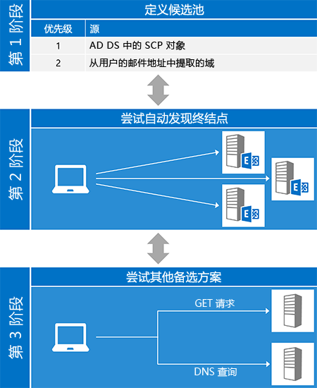
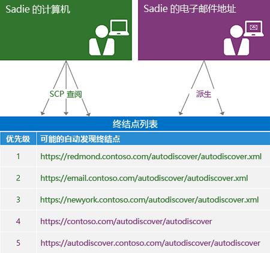
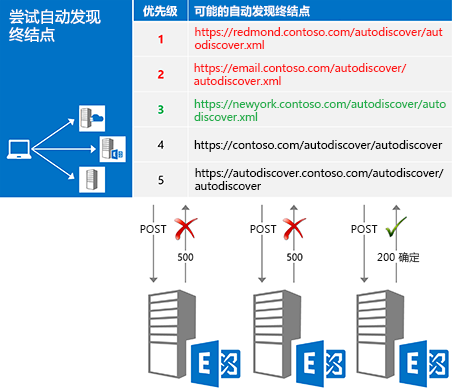
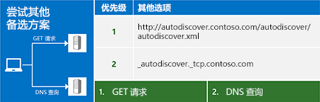

# Exchange 自动发现Autodiscover for Exchange

本文档可能包含与预发布功能或产品相关的内容，这些功能或产品在最终商业发布之前可能会有重大变化。本文档按"原样"提供，仅供参考，Microsoft 不在本文档中作出任何明示或暗示担保。 了解 Exchange 中的自动发现服务。Learn about the Autodiscover service in Exchange.
  
Exchange 自动发现服务为客户端应用程序提供一种在尽量减少用户输入的情况下对自身进行配置的简单方式。大多数用户都知道自己的电子邮件地址和密码，通过这两项信息，您可以检索您启动和运行所需的所有其他详细信息。对于 Exchange Web 服务 (EWS) 客户端，自动发现通常用于查找 EWS 终结点 URL，但自动发现也可以提供信息，以配置使用其他协议的客户端。自动发现适用于位于防火墙内部或外部的客户端应用程序，并且可在资源林和多个林方案中运行。The Exchange Autodiscover service provides an easy way for your client application to configure itself with minimal user input. Most users know their email address and password, and with those two pieces of information, you can retrieve all the other details you need to get up and running. For Exchange Web Services (EWS) clients, Autodiscover is typically used to find the EWS endpoint URL, but Autodiscover can also provide information to configure clients that use other protocols. Autodiscover works for client applications that are inside or outside firewalls and will work in resource forest and multiple forest scenarios.
  
## 自动发现过程的概述Overview of the Autodiscover process

自动发现过程基本分为三个阶段。在第一阶段，您生成潜在自动发现服务器列表，在第二阶段，您尝试列表中的每台服务器，直到您（有可能）收到成功的响应。如果您的候选服务器均未成功，您可以跳至第三阶段，这是查找自动发现终结点的"最后一招"。The Autodiscover process essentially has three phases. In phase one, you generate a list of potential Autodiscover servers, and in phase two, you try each server in your list until you (hopefully) get a successful response. If none of your candidates worked out, you move on to phase three, which represents a "last ditch" attempt to find an Autodiscover endpoint.
  
EWS Managed API 中的 [ExchangeService.AutodiscoverUrl](http://msdn.microsoft.com/zh-cn/library/microsoft.exchange.webservices.data.exchangeservice.autodiscoverurl%28v=exchg.80%29.aspx) 方法为您实施此过程的三个阶段，因此如果您使用 EWS Managed API，则无需担心需要自己实施自动发现。下图显示了自动发现过程的这三个阶段。The [ExchangeService.AutodiscoverUrl](http://msdn.microsoft.com/zh-cn/library/microsoft.exchange.webservices.data.exchangeservice.autodiscoverurl%28v=exchg.80%29.aspx) method in the EWS Managed API implements all three phases of this process for you, so if you are using the EWS Managed API, you don't need to worry about implementing Autodiscover yourself. The following figure shows the three phases of the Autodiscover process. 
  
**图 1. 自动发现过程的三个阶段****Figure 1. Three phases of the Autodiscover process**

  
### 阶段 1：定义候选池Phase 1: Defining the candidate pool

在使用自动发现之前，您必须为用户找到正确的自动发现服务器。幸运地是，自动发现定义了供您查找的有限数量的位置。如果找到多个候选服务器，自动发现还会定义[生成列表并进行优先排序的方式](how-to-generate-a-list-of-autodiscover-endpoints.md)。Before you can use Autodiscover, you have to locate the right Autodiscover server for your user. Luckily, Autodiscover defines a limited number of places for you to look. In the case where multiple candidates are found, Autodiscover also defines [a way to generate and prioritize the list](how-to-generate-a-list-of-autodiscover-endpoints.md).
  
**表 1：自动发现终结点候选源****Table 1: Autodiscover endpoint candidate sources**

|**查找位置****Place to look**|**您将找到的结果****What you'll find**|
|:-----|:-----|
|Active Directory 域服务 (AD DS)Active Directory Domain Services (AD DS)    |对于已加入域的客户端，这是要查找的第一个位置。Exchange 在 AD DS 中发布服务连接点 (SCP) 对象，这样就可以根据 Active Directory 站点将自动发现请求发送到服务器。[SCP 查找](how-to-find-autodiscover-endpoints-by-using-scp-lookup-in-exchange.md)的结果应位于候选列表顶部。  For domain-joined clients, this is the first place to look. Exchange publishes service connection point (SCP) objects in AD DS, which allows Autodiscover requests to be routed to servers based on Active Directory sites. The results of an [SCP lookup](how-to-find-autodiscover-endpoints-by-using-scp-lookup-in-exchange.md) should be at the top of your candidate list.    **注意**： SCP 查找不可用的未加入到域或不具有对 Active Directory 服务器访问的客户端。**NOTE**: SCP lookup isn't available for clients that are not joined to a domain or that do not have access to Active Directory servers. 在这种情况下，您应该跳过 SCP 查找。In this case, you should skip SCP lookup.  |
|用户的电子邮件地址域The user's email address domain    | 自动发现定义了从用户电子邮件地址的域部分派生的两个标准终结点 URL 格式：Autodiscover defines two standard endpoint URL forms that are derived from the domain portion of the user's email address:   `"https://" + domain + "/autodiscover/autodiscover" +  *fileExtension*`   `"https://autodiscover." + domain + "/autodiscover/autodiscover" +  *fileExtension*`    *文件扩展名*  的值取决于您使用的自动发现访问方法： [SOAP](http://msdn.microsoft.com/library/61c21ea9-7fea-4f56-8ada-bf80e1e6b074%28Office.15%29.aspx) 或 [POX](http://msdn.microsoft.com/library/877152f0-f4b1-4f63-b2ce-924f4bdf2d20%28Office.15%29.aspx)。SOAP 服务使用".svc"文件扩展名，POX 使用".xml"。  The value of  *fileExtension*  depends on which Autodiscover access method you are using, [SOAP](http://msdn.microsoft.com/library/61c21ea9-7fea-4f56-8ada-bf80e1e6b074%28Office.15%29.aspx) or [POX](http://msdn.microsoft.com/library/877152f0-f4b1-4f63-b2ce-924f4bdf2d20%28Office.15%29.aspx). The SOAP service uses a ".svc" file extension; POX uses ".xml".    |
   
下图演示如何生成自动发现终结点列表。The following figure shows how to generate an Autodiscover endpoint list.
  
**图 2. 生成自动发现终结点列表的过程****Figure 2. Process for generating an Autodiscover endpoint list**

  
### 阶段 2：尝试每个候选服务器Phase 2: Trying each candidate

生成潜在候选服务器的按顺序列表后，下一步是尝试列表中的每一台候选服务器，方法是[向 URL 发送请求](how-to-get-user-settings-from-exchange-by-using-autodiscover.md)并验证结果，如图 3 中所示。收到成功的响应时，即表示您已大功告成！After you generate an ordered list of potential candidates, the next step is try each one in the list by [sending a request to the URL](how-to-get-user-settings-from-exchange-by-using-autodiscover.md) and validating the results, as shown in Figure 3. When you get a successful response, you're done! 
  
**图 3. 按顺序尝试每个候选终结点****Figure 3. Trying each endpoint candidate in order**

  
向候选服务器发送请求之前，确保其可信。请记住，您是在发送用户的凭据，因此务必确保仅与您信任的服务器共享。至少您应确认以下事项：Before you send a request to a candidate, make sure it is trustworthy. Remember that you're sending the user's credentials, so it's important to make sure that you're only sharing them with a server you can trust. At a minimum, you should verify:
  
- 该终结点是 HTTPS 终结点。客户端应用程序不应进行身份验证，或将数据发送到非 SSL 终结点。That the endpoint is an HTTPS endpoint. Client applications should not authenticate or send data to a non-SSL endpoint.
    
- 服务器提供的 SSL 证书有效且来自受信任的颁发机构。That the SSL certificate presented by the server is valid and from a trusted authority.
    
> [!NOTE]
> 这些只是基本的安全建议。只要您使用身份验证，就应确保您的代码满足组织的安全要求。These are just basic security suggestions. Whenever you are working with authentication, make sure that your code meets the security requirements of your organization. 
  
您发送的请求类型取决于您访问自动发现服务的方式。The type of request you send depends on how you are accessing the Autodiscover service.
  
**表 2. 自动发现请求的类型****Table 2. Types of Autodiscover requests**

|**如果您使用…****If you are using…**|**通过以下方式发送请求…****Send a request by using…**|
|:-----|:-----|
|EWS Managed APIThe EWS Managed API    |[GetUserSettings](http://msdn.microsoft.com/zh-cn/library/microsoft.exchange.webservices.autodiscover.autodiscoverservice.getusersettings%28v=exchg.80%29.aspx) 方法。The [GetUserSettings](http://msdn.microsoft.com/zh-cn/library/microsoft.exchange.webservices.autodiscover.autodiscoverservice.getusersettings%28v=exchg.80%29.aspx) method.    |
|SOAP 自动发现服务The SOAP Autodiscover service    |[GetUserSettings](http://msdn.microsoft.com/library/758d965c-ef63-4de4-9120-e293abf14ff8%28Office.15%29.aspx) 操作。The [GetUserSettings](http://msdn.microsoft.com/library/758d965c-ef63-4de4-9120-e293abf14ff8%28Office.15%29.aspx) operation.    |
|POX 自动发现服务The POX Autodiscover service    |具有[自动发现请求正文](http://msdn.microsoft.com/library/75671b1d-f35b-497b-8d8c-706f3f2535fd%28Office.15%29.aspx)的 HTTP POST。An HTTP POST with an [Autodiscover request body](http://msdn.microsoft.com/library/75671b1d-f35b-497b-8d8c-706f3f2535fd%28Office.15%29.aspx).    |
   
### 阶段 3：尝试其他选择Phase 3: Trying other alternatives

在某些情况下，您可能尝试了列表中的所有终结点，但却发现所有终结点均返回错误。在放弃之前，您可以多尝试几种方法：您可以发送一个未经身份验证的 GET 请求，或者查询 DNS 以查找 SRV 记录。如果这些尝试都没有结果，则无法联系自动发现服务。In some cases you might try all the endpoints in your list, only to find that all of them return an error. Before throwing in the towel, you can try a couple more things: you can send an unauthenticated GET request, or query DNS for an SRV record. If these attempts also don't yield results, you cannot contact the Autodiscover service.
  
**阶段 4：尝试其他选择****Figure 4. Trying other alternatives**

  
#### 发送未经身份验证的 GET 请求Sending an unauthenticated GET request

尝试的第一件事就是向从用户电子邮件地址派生的终结点发送一个未经身份验证的 GET 请求。该终结点的格式为 "http://autodiscover." + 域 + "/autodiscover/autodiscover.xml"。请注意，这不是 SSL 终结点。如果 服务器返回 302 间接响应，您可以尝试向响应的位置头中的终结点 URL [重新发送自动发现请求](handling-autodiscover-error-messages.md#bk_ResendRequest)。The first thing to try is to send an unauthenticated GET request to an endpoint derived from the user's email address. The format of that endpoint is "http://autodiscover." + domain + "/autodiscover/autodiscover.xml". Note that this is NOT an SSL endpoint. If the server returns a 302 redirect response, you can then attempt to [resend the Autodiscover request](handling-autodiscover-error-messages.md#bk_ResendRequest) to the endpoint URL in the Location header of the response. 
  
#### 查询 DNS 以查找 SRV 记录Querying DNS for an SRV record

如果未经身份验证的 GET 请求不起作用，最后一件事是进行 DNS 查询以查找自动发现服务的 SRV 记录。记录格式将为 "_autodiscover._tcp." + 域。该查询可能返回多条记录，但您应该仅使用指向 SSL 终结点且具有最高优先级和权重的记录。If the unauthenticated GET request doesn't work out, the last thing to try is a DNS query for SRV records for the Autodiscover service. The record will take the form "_autodiscover._tcp." + domain. This query might return multiple records, but you should only use records that point to an SSL endpoint and that have the highest priority and weight.
  
## 使用自动发现的选项Options for using Autodiscover

您可以通过使用 SOAP 或 POX Web 服务访问自动发现。您使用的方法取决于您的要求和环境。但是，我们建议您尽可能使用 SOAP Web 服务。EWS Managed API 也是一个选项。它实施 SOAP 和 POX 自动发现服务的客户端部分。You can access Autodiscover either by using the SOAP or the POX web service. The method you use depends on your requirements and environment; however, we recommend using the SOAP web service, if possible. The EWS Managed API is also an option. It implements the client portion of both the SOAP and POX Autodiscover services.
  
**表 3：访问自动发现的选项****Table 3: Options for accessing Autodiscover**

|**选项****Option**|**优点****Pros**|**缺点****Cons**|
|:-----|:-----|:-----|
|[EWS Managed APIEWS Managed API](get-started-with-ews-managed-api-client-applications.md)   | 为您实施自动发现过程。Implements the Autodiscover process for you.  使用 SOAP 和 POX 自动发现服务。Uses both the SOAP and POX Autodiscover services.  适用于 Exchange Online、作为 Office 365 一部分的 Exchange Online 或从 Exchange 2007 SP1 起的 Exchange 版本。Works with Exchange Online, Exchange Online as part of Office 365, or a version of Exchange starting with Exchange 2007 SP1.  易于使用。Easy to use.    | 限制为 [Microsoft.Exchange.WebServices.Autodiscover.UserSettingName](http://msdn.microsoft.com/zh-cn/library/microsoft.exchange.webservices.autodiscover.usersettingname%28v=EXCHG.80%29.aspx) 枚举中可用的用户设置。Limited to the user settings that are available in the [Microsoft.Exchange.WebServices.Autodiscover.UserSettingName](http://msdn.microsoft.com/zh-cn/library/microsoft.exchange.webservices.autodiscover.usersettingname%28v=EXCHG.80%29.aspx) enumeration.  仅适用于 .NET Framework 应用程序。Only available for .NET Framework applications.    |
|[SOAP 自动发现SOAP Autodiscover](http://msdn.microsoft.com/library/61c21ea9-7fea-4f56-8ada-bf80e1e6b074%28Office.15%29.aspx)   | 独立于平台。Platform independent.  使您可以只请求您感兴趣的设置。Allows you to request just the settings you are interested in.    | 在 Exchange 2007 中不可用。Not available in Exchange 2007.    |
|[POX 自动发现POX Autodiscover](http://msdn.microsoft.com/library/877152f0-f4b1-4f63-b2ce-924f4bdf2d20%28Office.15%29.aspx)   | 独立于平台。Platform independent.  在 Exchange Online 中以及从 Exchange 2007 SP1 起的所有 Exchange 版本中受支持。Supported in Exchange Online and all versions of Exchange starting with Exchange 2007 SP1.    | 不允许您请求特定设置。Does not allow you to request specific settings.    |
   
## 本节内容In this section

- [在 Exchange 使用 SCP 查找来查找自动发现终结点Find Autodiscover endpoints by using SCP lookup in Exchange](how-to-find-autodiscover-endpoints-by-using-scp-lookup-in-exchange.md)
    
- [生成自动发现终结点的列表Generate a list of Autodiscover endpoints](how-to-generate-a-list-of-autodiscover-endpoints.md)
    
- [使用 Autodiscover 以查找连接点Use Autodiscover to find connection points](how-to-use-autodiscover-to-find-connection-points.md)
    
- [通过使用自动发现 Exchange 中获取用户设置Get user settings from Exchange by using Autodiscover](how-to-get-user-settings-from-exchange-by-using-autodiscover.md)
    
- [从 Exchange 服务器获取域设置Get domain settings from an Exchange server](how-to-get-domain-settings-from-an-exchange-server.md)
    
- [使用自动发现刷新配置信息Refresh configuration information by using Autodiscover](how-to-refresh-configuration-information-by-using-autodiscover.md)
    
- [处理自动发现错误消息Handling Autodiscover error messages](handling-autodiscover-error-messages.md)
    
- [为 Exchange 使用自动发现时提高性能Improving performance when using Autodiscover for Exchange](improving-performance-when-using-autodiscover-for-exchange.md)
    
## 另请参阅See also

- [Start using web services in ExchangeStart using web services in Exchange](start-using-web-services-in-exchange.md)    
- [Exchange 2013：使用自动发现获取用户设置Exchange 2013: Get user settings with Autodiscover](http://code.msdn.microsoft.com/Exchange-2013-Get-user-7e22c86e)
- [自动发现检查器示例Autodiscover Checker sample](http://code.msdn.microsoft.com/exchange/Autodiscover-Checker-e1ebca42)  
- [开发 Exchange Web 服务客户端Develop web service clients for Exchange](develop-web-service-clients-for-exchange.md)
    

