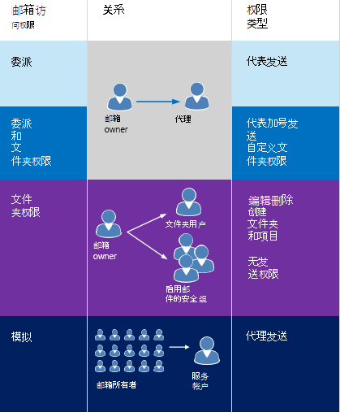
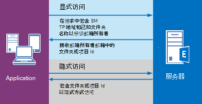

# <a name="delegate-access-and-ews-in-exchange"></a><span data-ttu-id="8a87f-103">代理访问和 Exchange 中的 EWS</span><span class="sxs-lookup"><span data-stu-id="8a87f-103">Delegate access and EWS in Exchange</span></span>

<span data-ttu-id="8a87f-104">了解如何在 Exchange 中使用 EWS 托管 API 和 EWS，以提供对用户邮箱的代理访问权限。</span><span class="sxs-lookup"><span data-stu-id="8a87f-104">Find out how to use the EWS Managed API and EWS in Exchange to provide delegate access to users' mailboxes.</span></span>
  
<span data-ttu-id="8a87f-105">您可以通过以下三种方式之一使用户能够访问其他用户的邮箱：</span><span class="sxs-lookup"><span data-stu-id="8a87f-105">You can enable users to access other users' mailboxes in one of three ways:</span></span> 
  
- <span data-ttu-id="8a87f-106">通过添加委派并为每个代理指定权限。</span><span class="sxs-lookup"><span data-stu-id="8a87f-106">By adding delegates and specifying permissions for each delegate.</span></span>
    
- <span data-ttu-id="8a87f-107">通过直接修改文件夹权限。</span><span class="sxs-lookup"><span data-stu-id="8a87f-107">By modifying folder permissions directly.</span></span>
    
- <span data-ttu-id="8a87f-108">通过使用模拟。</span><span class="sxs-lookup"><span data-stu-id="8a87f-108">By using impersonation.</span></span>
    
<span data-ttu-id="8a87f-109">委派和文件夹权限最适用于仅授予几个用户的访问权限，因为您必须将权限单独添加到每个邮箱。</span><span class="sxs-lookup"><span data-stu-id="8a87f-109">Delegation and folder permissions are best when you're only granting access to a few users, because you have to add permissions individually to each mailbox.</span></span> <span data-ttu-id="8a87f-110">当您处理邮箱数量时，模拟是最佳选择，因为您可以轻松地让一个服务帐户访问数据库中的每个邮箱。</span><span class="sxs-lookup"><span data-stu-id="8a87f-110">Impersonation is the best choice when you're dealing with quantities of mailboxes, because you can easily enable one service account to access every mailbox in a database.</span></span> <span data-ttu-id="8a87f-111">图1显示了每种类型的访问权限之间的一些差异。</span><span class="sxs-lookup"><span data-stu-id="8a87f-111">Figure 1 shows some of the differences between each type of access.</span></span>
  
<span data-ttu-id="8a87f-112">**图1。访问其他用户的邮箱的方法**</span><span class="sxs-lookup"><span data-stu-id="8a87f-112">**Figure 1. Ways to access other users' mailboxes**</span></span>


  
<span data-ttu-id="8a87f-116">在发送邮件或安排会议时，可以向代理人授予 "代表发送" 权限，以便代理发送的电子邮件或会议请求的收件人在收到 Outlook 中的电子邮件或会议请求时，将看到 "代表*邮箱所有者\*\*委派*"。</span><span class="sxs-lookup"><span data-stu-id="8a87f-116">When it comes to sending mail or scheduling meetings, delegates can be given "send on behalf of" permissions, so the recipient of an email or a meeting request that was sent by a delegate will see " *delegate*  on behalf of  *mailbox owner*  " when they receive the email or meeting request in Outlook.</span></span> <span data-ttu-id="8a87f-117">包括 "代表发送" 文本是客户端实现的详细信息，可以使用 "from" 和 "sender" 值创建。</span><span class="sxs-lookup"><span data-stu-id="8a87f-117">Including the "send on behalf of" text is a client implementation detail - and can be created by using the "from" and "sender" values.</span></span> <span data-ttu-id="8a87f-118">"发件人" 值指示邮箱所有者，"sender" 值指示发送邮件的代理。</span><span class="sxs-lookup"><span data-stu-id="8a87f-118">The "from" value indicates the mailbox owner, and the "sender" value indicates the delegate that sent the mail.</span></span> <span data-ttu-id="8a87f-119">如果某个服务帐户模拟用户发送电子邮件，或为邮箱所有者安排会议，则邮件将 "发送为" 邮箱所有者。</span><span class="sxs-lookup"><span data-stu-id="8a87f-119">If a service account impersonating a user sends an email or schedules a meeting for the mailbox owner, the message is "sent as" the mailbox owner.</span></span> <span data-ttu-id="8a87f-120">收件人无法知道该邮件是由服务帐户发送的。</span><span class="sxs-lookup"><span data-stu-id="8a87f-120">There is no way for the recipient to know the mail was sent by the service account.</span></span> <span data-ttu-id="8a87f-121">拥有文件夹权限而不是代理访问权限的用户无法 "代理发送" 或 "代表发送" 邮箱所有者。</span><span class="sxs-lookup"><span data-stu-id="8a87f-121">Users who are granted folder permissions and not delegate access are not able to "send as" or "send on behalf of" of a mailbox owner.</span></span> <span data-ttu-id="8a87f-122">他们有权访问邮箱文件夹，并且可能能够在文件夹中创建项目，但不能发送这些项目。</span><span class="sxs-lookup"><span data-stu-id="8a87f-122">They have access to the mailbox folders, and might be able to create items in the folders, but they cannot send the items.</span></span> 
  
<span data-ttu-id="8a87f-123">何时适合直接修改文件夹权限？</span><span class="sxs-lookup"><span data-stu-id="8a87f-123">When is it appropriate to modify folder permissions directly?</span></span> <span data-ttu-id="8a87f-124">通常情况下，当您希望提供用户对文件夹的访问权限时，如果您的权限要求未映射到[DelegateFolderPermissionLevel](https://msdn.microsoft.com/library/microsoft.exchange.webservices.data.delegatefolderpermissionlevel%28v=exchg.80%29.aspx) EWS 托管 API 枚举值或[PermissionLevel](https://msdn.microsoft.com/library/87978600-3523-451e-a725-ef092c543e2a%28Office.15%29.aspx) ews 元素值，或者您希望提供用户对单个自定义文件夹的访问权限，则不希望授予用户 "代表发送" 权限。</span><span class="sxs-lookup"><span data-stu-id="8a87f-124">Generally, when you want to provide a user access to a folder, but do not want to grant the user "send on behalf of" permissions, when your permissions requirements do not map to the [DelegateFolderPermissionLevel](https://msdn.microsoft.com/library/microsoft.exchange.webservices.data.delegatefolderpermissionlevel%28v=exchg.80%29.aspx) EWS Managed API enumeration values or the [PermissionLevel](https://msdn.microsoft.com/library/87978600-3523-451e-a725-ef092c543e2a%28Office.15%29.aspx) EWS element values, or when you want to provide a user access to a single custom folder.</span></span> 
  
<span data-ttu-id="8a87f-125">如果只需修改文件夹权限即可实现目标，而无需添加委派（即，不需要 "代表发送" 权限），请参阅[使用 Exchange 中的 EWS 为另一个用户设置文件夹权限](how-to-set-folder-permissions-for-another-user-by-using-ews-in-exchange.md)。</span><span class="sxs-lookup"><span data-stu-id="8a87f-125">If you only need to modify folder permissions to achieve your goal, and do not need to add a delegate (that is, you don't need "send on behalf of" permissions), see [Set folder permissions for another user by using EWS in Exchange](how-to-set-folder-permissions-for-another-user-by-using-ews-in-exchange.md).</span></span> 

<span data-ttu-id="8a87f-126">请注意，您还可以使用[Outlook](https://office.microsoft.com/outlook-help/allow-someone-else-to-manage-your-mail-and-calendar-HA102749417.aspx)或[exchange Server PowerShell （Exchange 命令行管理程序）](https://docs.microsoft.com/powershell/exchange/exchange-server/exchange-management-shell?view=exchange-ps)设置代理访问。</span><span class="sxs-lookup"><span data-stu-id="8a87f-126">Note that you can also use [Outlook](https://office.microsoft.com/outlook-help/allow-someone-else-to-manage-your-mail-and-calendar-HA102749417.aspx) or the [Exchange Server PowerShell (Exchange Management Shell)](https://docs.microsoft.com/powershell/exchange/exchange-server/exchange-management-shell?view=exchange-ps) to set up delegate access.</span></span> 

  
## <a name="how-does-delegate-access-work"></a><span data-ttu-id="8a87f-127">代理访问的工作原理是什么？</span><span class="sxs-lookup"><span data-stu-id="8a87f-127">How does delegate access work?</span></span>

<span data-ttu-id="8a87f-128">通过代理访问，用户可以访问邮箱所有者的部分或全部文件夹，并代表邮箱所有者执行操作。</span><span class="sxs-lookup"><span data-stu-id="8a87f-128">Delegate access enables users to access some or all of the mailbox owner's folders and act on behalf of the mailbox owner.</span></span> <span data-ttu-id="8a87f-129">邮箱所有者可以是用户，也可以是资源，如会议室。</span><span class="sxs-lookup"><span data-stu-id="8a87f-129">The mailbox owner can be a user, or a resource, like a conference room.</span></span> <span data-ttu-id="8a87f-130">例如，可以向接待员授予对会议室的 "日历" 文件夹的代理权限，以处理预订请求。</span><span class="sxs-lookup"><span data-stu-id="8a87f-130">For example, a receptionist can be granted delegate permissions to a conference room's calendar folder, to handle booking requests.</span></span> <span data-ttu-id="8a87f-131">您可以使用 EWS 托管 API 或 EWS 来启用邮箱所有者或系统管理员，以添加委派，指定代理可以访问的文件夹，然后指定该文件夹的权限。</span><span class="sxs-lookup"><span data-stu-id="8a87f-131">You can use the EWS Managed API or EWS to enable the mailbox owner or an administrator to add a delegate, specify what folders the delegate can access, and then specify permissions for that folder.</span></span> <span data-ttu-id="8a87f-132">可以授予代理对以下文件夹的访问权限：</span><span class="sxs-lookup"><span data-stu-id="8a87f-132">Delegates can be granted access to the following folders:</span></span> 
  
- <span data-ttu-id="8a87f-133">日历</span><span class="sxs-lookup"><span data-stu-id="8a87f-133">Calendar</span></span>
    
- <span data-ttu-id="8a87f-134">任务</span><span class="sxs-lookup"><span data-stu-id="8a87f-134">Tasks</span></span>
    
- <span data-ttu-id="8a87f-135">Inbox</span><span class="sxs-lookup"><span data-stu-id="8a87f-135">Inbox</span></span>
    
- <span data-ttu-id="8a87f-136">联系人</span><span class="sxs-lookup"><span data-stu-id="8a87f-136">Contacts</span></span>
    
- <span data-ttu-id="8a87f-137">注释</span><span class="sxs-lookup"><span data-stu-id="8a87f-137">Notes</span></span>
    
- <span data-ttu-id="8a87f-138">分类账</span><span class="sxs-lookup"><span data-stu-id="8a87f-138">Journal</span></span>
    
<span data-ttu-id="8a87f-139">当用户对其中一个或多个文件夹的代理访问时，他们可以创建、获取、更新、删除、复制和搜索该文件夹和任何子文件夹中的项目，具体取决于文件夹中设置的[权限](#bk_delegateperms)。</span><span class="sxs-lookup"><span data-stu-id="8a87f-139">When a user has delegate access to one or more of these folders, they can create, get, update, delete, copy, and search for items in that folder and any child folders, depending on the [permissions](#bk_delegateperms) set on the folder.</span></span> <span data-ttu-id="8a87f-140">应用程序执行这些操作的方式取决于是否需要[显式](#bk_explicit)或[隐式](#bk_implicit)访问。</span><span class="sxs-lookup"><span data-stu-id="8a87f-140">The way in which the application performs these actions depends on whether [explicit](#bk_explicit) or [implicit](#bk_implicit) access is required.</span></span> 
  
## <a name="delegate-permissions"></a><span data-ttu-id="8a87f-141">委派权限</span><span class="sxs-lookup"><span data-stu-id="8a87f-141">Delegate permissions</span></span>
<span data-ttu-id="8a87f-142"><a name="bk_delegateperms"> </a></span><span class="sxs-lookup"><span data-stu-id="8a87f-142"><a name="bk_delegateperms"> </a></span></span>

<span data-ttu-id="8a87f-143">当管理员或邮箱所有者向邮箱添加委派时，他们还可以为一个或多个文件夹设置权限级别。</span><span class="sxs-lookup"><span data-stu-id="8a87f-143">When an administrator or mailbox owner adds a delegate to a mailbox, they can also set the permission level for one or more folders.</span></span> <span data-ttu-id="8a87f-144">如果没有为文件夹设置权限级别，则 "权限" 值默认为 "无"。</span><span class="sxs-lookup"><span data-stu-id="8a87f-144">If a permission level is not set for a folder, the permission value defaults to None.</span></span> <span data-ttu-id="8a87f-145">多个用户可以在文件夹上具有相同的权限级别，并且用户可以具有不同文件夹的不同权限级别。</span><span class="sxs-lookup"><span data-stu-id="8a87f-145">Multiple users can have the same permission level on a folder, and users can have different permission levels for different folders.</span></span> <span data-ttu-id="8a87f-146">如果使用 EWS 托管 API，则使用[DelegateUser](https://msdn.microsoft.com/library/microsoft.exchange.webservices.data.delegateuser.permissions%28v=exchg.80%29.aspx)属性，该属性包含每个文件夹的[DelegateFolderPermissionLevel](https://msdn.microsoft.com/library/microsoft.exchange.webservices.data.delegatefolderpermissionlevel%28v=exchg.80%29.aspx)枚举值之一，以设置对文件夹的委派权限。</span><span class="sxs-lookup"><span data-stu-id="8a87f-146">If you're using the EWS Managed API, you use the [DelegateUser.Permissions](https://msdn.microsoft.com/library/microsoft.exchange.webservices.data.delegateuser.permissions%28v=exchg.80%29.aspx) property, which contains one of the [DelegateFolderPermissionLevel](https://msdn.microsoft.com/library/microsoft.exchange.webservices.data.delegatefolderpermissionlevel%28v=exchg.80%29.aspx) enumeration values for each folder, to set delegate permissions on folders.</span></span> <span data-ttu-id="8a87f-147">如果使用 EWS，则使用[DelegatePermissions](https://msdn.microsoft.com/library/292badc7-bab3-4368-9d7c-9a8b7edb279b%28Office.15%29.aspx)元素设置委派权限，使用[PermissionLevel](https://msdn.microsoft.com/library/87978600-3523-451e-a725-ef092c543e2a%28Office.15%29.aspx)元素定义权限级别。</span><span class="sxs-lookup"><span data-stu-id="8a87f-147">If you're using EWS, you use the [DelegatePermissions](https://msdn.microsoft.com/library/292badc7-bab3-4368-9d7c-9a8b7edb279b%28Office.15%29.aspx) element to set delegate permissions, and the [PermissionLevel](https://msdn.microsoft.com/library/87978600-3523-451e-a725-ef092c543e2a%28Office.15%29.aspx) element to define the permission level.</span></span> 
  
<span data-ttu-id="8a87f-148">**表2。委派权限级别**</span><span class="sxs-lookup"><span data-stu-id="8a87f-148">**Table 2. Delegate permission levels**</span></span>

|<span data-ttu-id="8a87f-149">**权限级别**</span><span class="sxs-lookup"><span data-stu-id="8a87f-149">**Permission level**</span></span>|<span data-ttu-id="8a87f-150">**说明**</span><span class="sxs-lookup"><span data-stu-id="8a87f-150">**Description**</span></span>|
|:-----|:-----|
|<span data-ttu-id="8a87f-151">无</span><span class="sxs-lookup"><span data-stu-id="8a87f-151">None</span></span>  <br/> |<span data-ttu-id="8a87f-152">这是所有文件夹的默认值。</span><span class="sxs-lookup"><span data-stu-id="8a87f-152">This is the default value for all folders.</span></span>  <br/> |
|<span data-ttu-id="8a87f-153">作者</span><span class="sxs-lookup"><span data-stu-id="8a87f-153">Author</span></span>  <br/> |<span data-ttu-id="8a87f-154">代理可以读取和创建项目，并修改和删除他们所创建的项目。</span><span class="sxs-lookup"><span data-stu-id="8a87f-154">A delegate can read and create items, and modify and delete items they create.</span></span> <span data-ttu-id="8a87f-155">例如，代理可以直接在邮箱所有者的 "任务" 或 "日历" 文件夹中创建任务请求和会议请求，然后代表邮箱所有者发送这两个项目中的任何一个。</span><span class="sxs-lookup"><span data-stu-id="8a87f-155">For example, a delegate can create task requests and meeting requests directly in the mailbox owner's Task or Calendar folder, and then send either item on the mailbox owner's behalf.</span></span>  <br/> |
|<span data-ttu-id="8a87f-156">编辑器</span><span class="sxs-lookup"><span data-stu-id="8a87f-156">Editor</span></span>  <br/> |<span data-ttu-id="8a87f-157">代理可以执行作者可以执行的所有操作，还可以修改和删除邮箱所有者创建的项目。</span><span class="sxs-lookup"><span data-stu-id="8a87f-157">A delegate can do everything an Author can do, and also modify and delete the items the mailbox owner created.</span></span>  <br/> |
|<span data-ttu-id="8a87f-158">Reviewer</span><span class="sxs-lookup"><span data-stu-id="8a87f-158">Reviewer</span></span>  <br/> |<span data-ttu-id="8a87f-159">代理人可以读取项目;例如，具有审阅者权限的代理可以阅读他人的 "收件箱" 中的邮件。</span><span class="sxs-lookup"><span data-stu-id="8a87f-159">A delegate can read items; for example a delegate with Reviewer permission can read messages in another person's Inbox.</span></span>  <br/> |
|<span data-ttu-id="8a87f-160">自定义警报</span><span class="sxs-lookup"><span data-stu-id="8a87f-160">Custom</span></span>  <br/> |<span data-ttu-id="8a87f-161">邮箱所有者已向代理授予了一组自定义权限。</span><span class="sxs-lookup"><span data-stu-id="8a87f-161">The mailbox owner has granted a custom set of permissions to the delegate.</span></span>  <br/> |
   
<span data-ttu-id="8a87f-162">[ViewPrivateItems](https://msdn.microsoft.com/library/microsoft.exchange.webservices.data.delegateuser.viewprivateitems%28v=exchg.80%29.aspx) EWS Managed API 属性和[ViewPrivateItems](https://msdn.microsoft.com/library/80b949ac-440c-4a01-b428-ebafb5b1b802%28Office.15%29.aspx) ews 元素是一个全局设置，它会影响邮箱所有者的所有文件夹，包括所有邮件、联系人、日历、任务、便笺和日记文件夹。</span><span class="sxs-lookup"><span data-stu-id="8a87f-162">The [DelgateUser.ViewPrivateItems](https://msdn.microsoft.com/library/microsoft.exchange.webservices.data.delegateuser.viewprivateitems%28v=exchg.80%29.aspx) EWS Managed API property and the [ViewPrivateItems](https://msdn.microsoft.com/library/80b949ac-440c-4a01-b428-ebafb5b1b802%28Office.15%29.aspx) EWS element is a global setting that affects all the mailbox owner's folders, including all Mail, Contacts, Calendar, Tasks, Notes, and Journal folders.</span></span> <span data-ttu-id="8a87f-163">您不能只允许访问一个文件夹中的私人项目。</span><span class="sxs-lookup"><span data-stu-id="8a87f-163">You cannot allow access to private items in only one folder.</span></span> 
  
## <a name="explicit-access"></a><span data-ttu-id="8a87f-164">显式访问</span><span class="sxs-lookup"><span data-stu-id="8a87f-164">Explicit access</span></span>
<span data-ttu-id="8a87f-165"><a name="bk_explicit"> </a></span><span class="sxs-lookup"><span data-stu-id="8a87f-165"><a name="bk_explicit"> </a></span></span>

<span data-ttu-id="8a87f-166">简单地说，显式访问是委派对邮箱所有者的文件夹或项目执行操作的入口方法。</span><span class="sxs-lookup"><span data-stu-id="8a87f-166">Simply put, explicit access is the entry way for delegates to perform actions on a mailbox owner's folders or items.</span></span> <span data-ttu-id="8a87f-167">如果代理包括邮箱所有者文件夹的已知文件夹名称以及邮箱所有者的 SMTP 地址在对服务器的请求中，则会向该代理授予显式访问权限。</span><span class="sxs-lookup"><span data-stu-id="8a87f-167">Explicit access is granted to a delegate when they include the well-known folder name for a mailbox owner's folder along with the mailbox owner's SMTP address in a request to the server.</span></span> <span data-ttu-id="8a87f-168">因为代理的请求明确声明方法或操作的上下文是邮箱所有者的邮箱，而不是代理的邮箱，所以访问是显式的。</span><span class="sxs-lookup"><span data-stu-id="8a87f-168">The access is explicit because the delegate's request explicitly states that the context for the method or operation is the mailbox owner's mailbox, and not the delegate's mailbox.</span></span>
  
<span data-ttu-id="8a87f-169">显式访问定义对要向前移动的文件夹或项目执行的所有方法或操作的上下文。</span><span class="sxs-lookup"><span data-stu-id="8a87f-169">Explicit access defines the context for all methods or operations performed on the folders or items moving forward.</span></span> <span data-ttu-id="8a87f-170">当显式访问设置唯一标识属于邮箱所有者（尽管不是任何人可读格式）时，将返回所有项目和文件夹 Id。</span><span class="sxs-lookup"><span data-stu-id="8a87f-170">All item and folder IDs returned when the explicit access is set uniquely identify themselves as belonging to the mailbox owner (although not in any human readable format).</span></span> <span data-ttu-id="8a87f-171">这样，应用程序无需再次指定邮箱所有者的 SMTP 地址。上下文在标识符中是隐藏的。</span><span class="sxs-lookup"><span data-stu-id="8a87f-171">This way, the application doesn't need to specify the mailbox owner's SMTP address again and again; the context is hidden in the identifiers.</span></span> <span data-ttu-id="8a87f-172">在标识项或文件夹之后，委托实际使用[隐式访问](#bk_implicit)修改项。</span><span class="sxs-lookup"><span data-stu-id="8a87f-172">After an item or folder is identified, a delegate actually uses [implicit access](#bk_implicit) to modify the item.</span></span> <span data-ttu-id="8a87f-173">下图显示了获取显式和隐式访问的过程。</span><span class="sxs-lookup"><span data-stu-id="8a87f-173">The following figure shows the process of getting explicit and implicit access.</span></span> 
  
<span data-ttu-id="8a87f-174">**图2。请求显式和隐式访问项或文件夹**</span><span class="sxs-lookup"><span data-stu-id="8a87f-174">**Figure 2. Requesting explicit and implicit access to an item or folder**</span></span>


  
<span data-ttu-id="8a87f-176">您可以在许多不同的方案中设置显式访问。</span><span class="sxs-lookup"><span data-stu-id="8a87f-176">You can set explicit access in many different scenarios.</span></span> <span data-ttu-id="8a87f-177">实质上，任何时候在方法或操作中发送文件夹 ID 时，都可以设置显式访问。</span><span class="sxs-lookup"><span data-stu-id="8a87f-177">Essentially, any time you're sending a folder ID in a method or operation, you can set explicit access.</span></span> <span data-ttu-id="8a87f-178">这可能包括查找文件夹、查找约会、获取项目、查找对话等。</span><span class="sxs-lookup"><span data-stu-id="8a87f-178">This can include finding folders, finding appointments, getting items, finding conversations, and so on.</span></span>
  
### <a name="explicit-access-and-the-ews-managed-api"></a><span data-ttu-id="8a87f-179">显式访问和 EWS 托管 API</span><span class="sxs-lookup"><span data-stu-id="8a87f-179">Explicit access and the EWS Managed API</span></span>
<span data-ttu-id="8a87f-180"><a name="bk_explicitewsma"> </a></span><span class="sxs-lookup"><span data-stu-id="8a87f-180"><a name="bk_explicitewsma"> </a></span></span>

<span data-ttu-id="8a87f-181">您可以使用以下任一重载方法启动显式委派访问，这些方法采用[FolderId](https://msdn.microsoft.com/library/microsoft.exchange.webservices.data.folderid%28v=exchg.80%29.aspx)输入参数标识目标文件夹：</span><span class="sxs-lookup"><span data-stu-id="8a87f-181">You can initiate explicit delegate access by using any of the following overloaded methods that take a [FolderId](https://msdn.microsoft.com/library/microsoft.exchange.webservices.data.folderid%28v=exchg.80%29.aspx) input parameter to identify the target folder:</span></span> 
  
- [<span data-ttu-id="8a87f-182">文件夹。绑定</span><span class="sxs-lookup"><span data-stu-id="8a87f-182">Folder.Bind</span></span>](https://msdn.microsoft.com/library/microsoft.exchange.webservices.data.folder.bind%28v=exchg.80%29.aspx)
    
- [<span data-ttu-id="8a87f-183">ExchangeService。 FindItems</span><span class="sxs-lookup"><span data-stu-id="8a87f-183">ExchangeService.FindItems</span></span>](https://msdn.microsoft.com/library/microsoft.exchange.webservices.data.exchangeservice.finditems%28v=exchg.80%29.aspx)
    
- [<span data-ttu-id="8a87f-184">ExchangeService。 FindAppointments</span><span class="sxs-lookup"><span data-stu-id="8a87f-184">ExchangeService.FindAppointments</span></span>](https://msdn.microsoft.com/library/microsoft.exchange.webservices.data.exchangeservice.findappointments%28v=exchg.80%29.aspx)
    
- [<span data-ttu-id="8a87f-185">ExchangeService。 FindFolders</span><span class="sxs-lookup"><span data-stu-id="8a87f-185">ExchangeService.FindFolders</span></span>](https://msdn.microsoft.com/library/microsoft.exchange.webservices.data.exchangeservice.findfolders%28v=exchg.80%29.aspx)
    
- <span data-ttu-id="8a87f-186">更多！</span><span class="sxs-lookup"><span data-stu-id="8a87f-186">And more!</span></span>
    
<span data-ttu-id="8a87f-187">可以在上述每种方法中使用**FolderId**参数来标识邮箱所有者的目标文件夹，如下所示。</span><span class="sxs-lookup"><span data-stu-id="8a87f-187">You can use the **FolderId** parameter in each of these methods to identify the mailbox owner's target folder, as follows.</span></span> 
  
```cs
new FolderId(WellKnownFolderName.Calendar, "primary@contoso.com");
```

<span data-ttu-id="8a87f-188">例如，若要绑定到 "日历" 文件夹，此**绑定**方法中的**FolderId**指定了已知的文件夹名称和邮箱所有者的 SMTP 地址。</span><span class="sxs-lookup"><span data-stu-id="8a87f-188">For example, to bind to the Calendar folder, the **FolderId** in this **Bind** method specifies the well-known folder name, and the mailbox owner's SMTP address.</span></span> 
  
```cs
CalendarFolder calendar = CalendarFolder.Bind(service, new FolderId(WellKnownFolderName.Calendar, "primary@contoso.com"), new PropertySet());
```

<span data-ttu-id="8a87f-189">通过指定已知的文件夹名称和 SMTP 地址，代理可以绑定到邮箱所有者的 "日历" 文件夹，从而获得对该文件夹的显式访问权限。</span><span class="sxs-lookup"><span data-stu-id="8a87f-189">By specifying the well-known folder name and the SMTP address, the delegate can bind to the mailbox owner's Calendar folder — thereby gaining explicit access to the folder.</span></span> <span data-ttu-id="8a87f-190">随后对文件夹中的项目的[隐式访问](#bk_implicit)请求将依赖于在项目 id 和文件夹 id 中返回的上下文。</span><span class="sxs-lookup"><span data-stu-id="8a87f-190">All subsequent requests for [implicit access](#bk_implicit) to items in the folder then rely on the context returned in the item IDs and folder IDs.</span></span> <span data-ttu-id="8a87f-191">标识符实质上包含隐含代理访问调用的上下文。</span><span class="sxs-lookup"><span data-stu-id="8a87f-191">Essentially, the identifiers contain the context for the implied delegate access calls.</span></span> <span data-ttu-id="8a87f-192">或者，若要检索符合特定条件的项目的项目 ID，请使用以下。</span><span class="sxs-lookup"><span data-stu-id="8a87f-192">Or, to retrieve the item ID of an item that meets specific criteria, use the following.</span></span> 
  
```cs
FindItemsResults<Item> results = service.FindItems(new FolderId(WellKnownFolderName.Calendar, "primary@contoso.com"), filter, view);
```

<span data-ttu-id="8a87f-193">在这种情况下，将返回项目 ID，然后代理可以使用 "隐式访问" 通过使用项目 ID 对项目进行更改。</span><span class="sxs-lookup"><span data-stu-id="8a87f-193">In this case the item ID is returned, and then the delegate can then use implicit access to make changes to the item by using the item ID.</span></span>
  
<span data-ttu-id="8a87f-194">您无需再次启动显式访问，除非您需要通过现有的显式访问访问的项 ID 或文件夹 ID。</span><span class="sxs-lookup"><span data-stu-id="8a87f-194">You don't have to initiate explicit access again until you require an item ID or a folder ID that you didn't access via the existing explicit access.</span></span> 
  
### <a name="explicit-access-and-ews"></a><span data-ttu-id="8a87f-195">显式访问和 EWS</span><span class="sxs-lookup"><span data-stu-id="8a87f-195">Explicit access and EWS</span></span>
<span data-ttu-id="8a87f-196"><a name="bk_explicitewsma"> </a></span><span class="sxs-lookup"><span data-stu-id="8a87f-196"><a name="bk_explicitewsma"> </a></span></span>

<span data-ttu-id="8a87f-197">您可以使用[GetFolder](https://msdn.microsoft.com/library/355bcf93-dc71-4493-b177-622afac5fdb9%28Office.15%29.aspx)、 [FindItem](https://msdn.microsoft.com/library/ebad6aae-16e7-44de-ae63-a95b24539729%28Office.15%29.aspx)或[FindFolder](https://msdn.microsoft.com/library/7a9855aa-06cc-45ba-ad2a-645c15b7d031%28Office.15%29.aspx)操作启动显式访问。</span><span class="sxs-lookup"><span data-stu-id="8a87f-197">You can initiate explicit access by using the [GetFolder](https://msdn.microsoft.com/library/355bcf93-dc71-4493-b177-622afac5fdb9%28Office.15%29.aspx), [FindItem](https://msdn.microsoft.com/library/ebad6aae-16e7-44de-ae63-a95b24539729%28Office.15%29.aspx), or [FindFolder](https://msdn.microsoft.com/library/7a9855aa-06cc-45ba-ad2a-645c15b7d031%28Office.15%29.aspx) operations.</span></span> <span data-ttu-id="8a87f-198">这些操作提供了使用[DistinguishedFolderId](https://msdn.microsoft.com/library/50018162-2941-4227-8a5b-d6b4686bb32f%28Office.15%29.aspx)元素标识目标文件夹的选项。</span><span class="sxs-lookup"><span data-stu-id="8a87f-198">These operations provide the option to use the [DistinguishedFolderId](https://msdn.microsoft.com/library/50018162-2941-4227-8a5b-d6b4686bb32f%28Office.15%29.aspx) element to identify the target folder.</span></span> <span data-ttu-id="8a87f-199">**DistinguishedFolderId**元素具有一个可选子元素，即[邮箱](https://msdn.microsoft.com/library/befc70fd-51cb-4258-884c-80c9050f0e82%28Office.15%29.aspx)元素。</span><span class="sxs-lookup"><span data-stu-id="8a87f-199">The **DistinguishedFolderId** element has a single optional child element, the [Mailbox](https://msdn.microsoft.com/library/befc70fd-51cb-4258-884c-80c9050f0e82%28Office.15%29.aspx) element.</span></span> <span data-ttu-id="8a87f-200">当将**邮箱**元素用作**DistinguishedFolderId**元素的子元素时，将指定要访问的代理的邮箱。</span><span class="sxs-lookup"><span data-stu-id="8a87f-200">The **Mailbox** element, when used as a child of the **DistinguishedFolderId** element, specifies the mailbox for the delegate to access.</span></span> <span data-ttu-id="8a87f-201">如果呼叫用户有权访问邮箱所有者的文件夹，则响应将包含该邮箱中的项目或文件夹的标识符的集合。</span><span class="sxs-lookup"><span data-stu-id="8a87f-201">If the calling user has permission to access the mailbox owner's folder, the response will contain a collection of identifiers to items or folders in that mailbox.</span></span> <span data-ttu-id="8a87f-202">在响应中返回的项和文件夹标识符可用于隐式代理访问。</span><span class="sxs-lookup"><span data-stu-id="8a87f-202">The item and folder identifiers that are returned in the response can be used for implicit delegate access.</span></span> 
  
## <a name="implicit-access"></a><span data-ttu-id="8a87f-203">隐式访问</span><span class="sxs-lookup"><span data-stu-id="8a87f-203">Implicit access</span></span>
<span data-ttu-id="8a87f-204"><a name="bk_implicit"> </a></span><span class="sxs-lookup"><span data-stu-id="8a87f-204"><a name="bk_implicit"> </a></span></span>

<span data-ttu-id="8a87f-205">当代理已检索邮箱所有者邮箱中的项目或文件夹的 ID，并且该代理要更新、删除或复制项目时，将使用隐式访问。</span><span class="sxs-lookup"><span data-stu-id="8a87f-205">Implicit access is used after a delegate has retrieved the ID for an item or folder in the mailbox owner's mailbox and the delegate wants to update, delete, or copy the item.</span></span> <span data-ttu-id="8a87f-206">当代理在请求中使用该项目或文件夹 ID 时，将对邮箱所有者邮箱中的项目进行更改。</span><span class="sxs-lookup"><span data-stu-id="8a87f-206">When the delegate uses that item or folder ID in a request, the changes are made to the item in the mailbox owner's mailbox.</span></span> <span data-ttu-id="8a87f-207">代理不必包含邮箱所有者的 SMTP 地址。</span><span class="sxs-lookup"><span data-stu-id="8a87f-207">The delegate does not have to include the mailbox owner's SMTP address.</span></span> 
  
<span data-ttu-id="8a87f-208">例如，当代理具有某个邮箱所有者文件夹的 ID 时，该代理可以使用文件夹 ID 对该文件夹执行**FindItem**操作，而无需显式标识邮箱所有者的邮箱。</span><span class="sxs-lookup"><span data-stu-id="8a87f-208">For example, when a delegate has the ID of one of the mailbox owner's folders, the delegate can perform a **FindItem** operation on that folder by using the folder ID, without explicitly identifying the mailbox owner's mailbox.</span></span> <span data-ttu-id="8a87f-209">在这种情况下，代理可以使用响应中返回的 Id 对邮箱所有者的文件夹执行操作。</span><span class="sxs-lookup"><span data-stu-id="8a87f-209">At that point, the delegate can perform actions on the mailbox owner's folder by using the IDs that are returned in the responses.</span></span> 
  
### <a name="implicit-access-and-the-ews-managed-api"></a><span data-ttu-id="8a87f-210">隐式访问和 EWS 托管 API</span><span class="sxs-lookup"><span data-stu-id="8a87f-210">Implicit access and the EWS Managed API</span></span>

<span data-ttu-id="8a87f-211">如果[FindItems](https://msdn.microsoft.com/library/microsoft.exchange.webservices.data.exchangeservice.finditems%28v=exchg.80%29.aspx)方法检索到一个项 id，则可以在后续项中使用该项目 Id [。绑定](https://msdn.microsoft.com/library/microsoft.exchange.webservices.data.item.bind%28v=exchg.80%29.aspx)到项的绑定方法调用。</span><span class="sxs-lookup"><span data-stu-id="8a87f-211">If an item ID was retrieved by the [FindItems](https://msdn.microsoft.com/library/microsoft.exchange.webservices.data.exchangeservice.finditems%28v=exchg.80%29.aspx) method, that item ID can be used in a subsequent [Item.Bind](https://msdn.microsoft.com/library/microsoft.exchange.webservices.data.item.bind%28v=exchg.80%29.aspx) method call to bind to the item.</span></span> <span data-ttu-id="8a87f-212">然后，您可以调用[项目（更新](https://msdn.microsoft.com/library/office/microsoft.exchange.webservices.data.item.update%28v=exchg.80%29.aspx)、[项目、删除](https://msdn.microsoft.com/library/office/microsoft.exchange.webservices.data.item.delete%28v=exchg.80%29.aspx)或[项目复制](https://msdn.microsoft.com/library/office/microsoft.exchange.webservices.data.item.copy%28v=exchg.80%29.aspx)方法）或需要项目 ID 的任何方法调用，以完成您的任务。</span><span class="sxs-lookup"><span data-stu-id="8a87f-212">You can then call the [Item.Update](https://msdn.microsoft.com/library/office/microsoft.exchange.webservices.data.item.update%28v=exchg.80%29.aspx), [Item.Delete](https://msdn.microsoft.com/library/office/microsoft.exchange.webservices.data.item.delete%28v=exchg.80%29.aspx), or [Item.Copy](https://msdn.microsoft.com/library/office/microsoft.exchange.webservices.data.item.copy%28v=exchg.80%29.aspx) method — or any method call that requires an item ID — as needed to complete your task.</span></span> <span data-ttu-id="8a87f-213">只要代理对包含该项目的文件夹具有适当的权限（如果适用，该文件夹将移动到该文件夹），代理就可以根据其权限级别进行更改。</span><span class="sxs-lookup"><span data-stu-id="8a87f-213">As long as the delegate has appropriate permissions to the folder that contains the item (and, if applicable, the folder the item is moving to), the delegate can make changes according to their permission levels.</span></span> 
  
### <a name="implicit-access-and-ews"></a><span data-ttu-id="8a87f-214">隐式访问和 EWS</span><span class="sxs-lookup"><span data-stu-id="8a87f-214">Implicit access and EWS</span></span>

<span data-ttu-id="8a87f-215">如果[FindItem](https://msdn.microsoft.com/library/ebad6aae-16e7-44de-ae63-a95b24539729%28Office.15%29.aspx)操作检索到某个项目 id，则可以在随后的[GetItem](https://msdn.microsoft.com/library/e3590b8b-c2a7-4dad-a014-6360197b68e4%28Office.15%29.aspx)操作中使用该项目 id 绑定到该项目。</span><span class="sxs-lookup"><span data-stu-id="8a87f-215">If an item ID was retrieved by the [FindItem](https://msdn.microsoft.com/library/ebad6aae-16e7-44de-ae63-a95b24539729%28Office.15%29.aspx) operation, that item ID can be used in subsequent [GetItem](https://msdn.microsoft.com/library/e3590b8b-c2a7-4dad-a014-6360197b68e4%28Office.15%29.aspx) operations to bind to the item.</span></span> <span data-ttu-id="8a87f-216">然后，可以根据需要调用[UpdateItem](https://msdn.microsoft.com/library/5d027523-e0bc-4da2-b60b-0cb9fc1fdfe4%28Office.15%29.aspx)、 [DeleteItem](../web-service-reference/deleteitem-operation.md)或[CopyItem](https://msdn.microsoft.com/library/bcc68f9e-d511-4c29-bba6-ed535524624a%28Office.15%29.aspx)操作或任何需要项目 ID 的操作，以完成您的任务。</span><span class="sxs-lookup"><span data-stu-id="8a87f-216">You can then call the [UpdateItem](https://msdn.microsoft.com/library/5d027523-e0bc-4da2-b60b-0cb9fc1fdfe4%28Office.15%29.aspx), [DeleteItem](../web-service-reference/deleteitem-operation.md), or [CopyItem](https://msdn.microsoft.com/library/bcc68f9e-d511-4c29-bba6-ed535524624a%28Office.15%29.aspx) operation — or any operation that requires an item ID — as needed to complete your task.</span></span> <span data-ttu-id="8a87f-217">只要代理对包含该项目的文件夹具有适当的权限（如果适用，该文件夹将移动到该文件夹），代理就可以根据其权限级别进行更改。</span><span class="sxs-lookup"><span data-stu-id="8a87f-217">As long as the delegate has appropriate permissions to the folder that contains the item (and, if applicable, the folder the item is moving to), the delegate can make changes according to their permission levels.</span></span> 
  
## <a name="in-this-section"></a><span data-ttu-id="8a87f-218">本节内容</span><span class="sxs-lookup"><span data-stu-id="8a87f-218">In this section</span></span>
<span data-ttu-id="8a87f-219"><a name="bk_implicit"> </a></span><span class="sxs-lookup"><span data-stu-id="8a87f-219"><a name="bk_implicit"> </a></span></span>

- [<span data-ttu-id="8a87f-220">使用 Exchange 中的 EWS 添加和删除委派</span><span class="sxs-lookup"><span data-stu-id="8a87f-220">Add and remove delegates by using EWS in Exchange</span></span>](how-to-add-and-remove-delegates-by-using-ews-in-exchange.md)
    
- [<span data-ttu-id="8a87f-221">在 Exchange 中使用 EWS 作为代理访问日历</span><span class="sxs-lookup"><span data-stu-id="8a87f-221">Access a calendar as a delegate by using EWS in Exchange</span></span>](how-to-access-a-calendar-as-a-delegate-by-using-ews-in-exchange.md)
    
- [<span data-ttu-id="8a87f-222">在 Exchange 中使用 EWS 以代理的形式访问联系人</span><span class="sxs-lookup"><span data-stu-id="8a87f-222">Access contacts as a delegate by using EWS in Exchange</span></span>](how-to-access-contacts-as-a-delegate-by-using-ews-in-exchange.md)
    
- [<span data-ttu-id="8a87f-223">在 Exchange 中使用 EWS 以代理的形式访问电子邮件</span><span class="sxs-lookup"><span data-stu-id="8a87f-223">Access email as a delegate by using EWS in Exchange</span></span>](how-to-access-email-as-a-delegate-by-using-ews-in-exchange.md)
    
- [<span data-ttu-id="8a87f-224">使用 Exchange 中的 EWS 为另一个用户设置文件夹权限</span><span class="sxs-lookup"><span data-stu-id="8a87f-224">Set folder permissions for another user by using EWS in Exchange</span></span>](how-to-set-folder-permissions-for-another-user-by-using-ews-in-exchange.md)
    
- [<span data-ttu-id="8a87f-225">在 Exchange 中处理 EWS 中与委派相关的错误</span><span class="sxs-lookup"><span data-stu-id="8a87f-225">Handling delegation-related errors in EWS in Exchange</span></span>](handling-delegation-related-errors-in-ews-in-exchange.md)
    
## <a name="see-also"></a><span data-ttu-id="8a87f-226">另请参阅</span><span class="sxs-lookup"><span data-stu-id="8a87f-226">See also</span></span>


- [<span data-ttu-id="8a87f-227">开发 Exchange Web 服务客户端</span><span class="sxs-lookup"><span data-stu-id="8a87f-227">Develop web service clients for Exchange</span></span>](develop-web-service-clients-for-exchange.md)

- [<span data-ttu-id="8a87f-228">允许其他人管理您的邮件和日历</span><span class="sxs-lookup"><span data-stu-id="8a87f-228">Allow someone else to manage your mail and calendar</span></span>](https://office.microsoft.com/outlook-help/allow-someone-else-to-manage-your-mail-and-calendar-HA102749417.aspx)  

- [<span data-ttu-id="8a87f-229">外接 Add-mailboxpermission</span><span class="sxs-lookup"><span data-stu-id="8a87f-229">Add- MailboxPermission</span></span>](https://technet.microsoft.com/library/bb124097%28v=exchg.150%29.aspx)
    