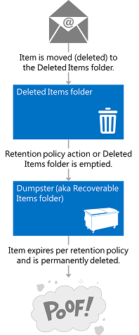
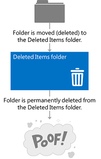
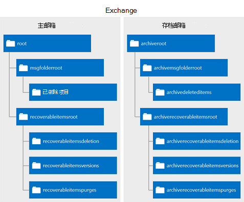

# 使用 EWS 在 Exchange 中删除项Deleting items by using EWS in Exchange

了解如何使用 EWS 托管 API 或删除 Exchange 中的 EWS 项可通过将它们移动到已删除邮件文件夹或转储程序。Find out how you can use the EWS Managed API or EWS in Exchange to delete items either by moving them to the Deleted Items folder or to the dumpster.
  
具有以往任何时候都要求您自己的区别是什么之间将项目移动到已删除邮件文件夹中，并移到转储程序？Have you ever asked yourself what the difference is between moving items to the Deleted Items folder, and moving them to the dumpster? 您可能希望了解处理删除项和如何在您的应用程序中实现这些选项的不同选项。You might be curious about the different options for handling deleted items and how to implement those options in your application. Exchange Web Services (EWS) 包括三个选项的处理删除项目。Exchange Web Services (EWS) includes three options for handling deleted items. 本文提供将清除任何混淆情况，您可能必须有关它们之间的差异。This article will hopefully clear up any confusion you might have about the differences between them.
  
## 删除项目-我的选项是什么？Deleting items - what are my options?

您可以了解删除项的总体形势之前，请务必识别以下区别：Before you can understand the overall landscape for deleting items, it's important to recognize the difference between the following:
  
- 已删除邮件文件夹中的删除邮箱中的项时，这是他们在哪里。The Deleted Items folder - When you delete items in a mailbox, this is where they go.
    
- 转储程序 （也称为可恢复邮件文件夹）-当您从邮箱中删除项目时，这是他们在哪里。The dumpster (aka the Recoverable Items folder) - When you remove items from a mailbox, this is where they go.
    
图 1 和 2 显示项和文件夹邮箱中的删除过程的外观。Figures 1 and 2 show what the deletion process looks like for items and folders in a mailbox. 

**图 1。从邮箱中删除项的过程****Figure 1. Process for deleting items from a mailbox**

 

**图 2。过程的邮箱中删除文件夹****Figure 2. Process for deleting folders from a mailbox**

   
您可以删除项目和文件夹三种不同方法，具体取决于如何"永久"您想要删除。You can delete items and folders three different ways, depending on how "permanent" you would like the deletion to be.
  
**表 1： 通过使用 EWS 删除项选项****Table 1: Options for deleting items by using EWS**

|**选项****Option**|**时会发生什么情况****What happens**|
|:-----|:-----|
|将移动到已删除邮件文件夹Move to the Deleted Items folder    |这是最小的永久方式，若要删除项。This is the least permanent way to delete items.  这就像您桌面的回收站中放置一张纸。This is like putting a piece of paper in the recycle bin by your desk. 如果您再次需要可以轻松会获得其情况。You can easily grab it if you need it again.  您可以使用实现移动到已删除邮件文件夹选项才能执行此操作的任何[删除操作](deleting-items-by-using-ews-in-exchange.md#bk_howdoIdeleteitems)。You can use any [deletion operation](deleting-items-by-using-ews-in-exchange.md#bk_howdoIdeleteitems) that implements the move to the Deleted Items folder option to perform this action.  您还可以使用[MoveItem 操作](http://msdn.microsoft.com/library/dcf40fa7-7796-4a5c-bf5b-7a509a18d208%28Office.15%29.aspx)( [Item.Move()](http://msdn.microsoft.com/zh-cn/library/microsoft.exchange.webservices.data.item.move%28v=exchg.80%29.aspx)) 或[MoveFolder 操作](http://msdn.microsoft.com/library/c7233966-6c87-4a14-8156-b1610760176d%28Office.15%29.aspx)( [Folder.Move()](http://msdn.microsoft.com/zh-cn/library/microsoft.exchange.webservices.data.folder.move%28v=exchg.80%29.aspx)) 移动到已删除邮件文件夹的项目或文件夹。You can also use the [MoveItem operation](http://msdn.microsoft.com/library/dcf40fa7-7796-4a5c-bf5b-7a509a18d208%28Office.15%29.aspx) ( [Item.Move()](http://msdn.microsoft.com/zh-cn/library/microsoft.exchange.webservices.data.item.move%28v=exchg.80%29.aspx)) or the [MoveFolder operation](http://msdn.microsoft.com/library/c7233966-6c87-4a14-8156-b1610760176d%28Office.15%29.aspx) ( [Folder.Move()](http://msdn.microsoft.com/zh-cn/library/microsoft.exchange.webservices.data.folder.move%28v=exchg.80%29.aspx)) to move an item or folder to the Deleted Items folder.    |
|软删除Soft delete    |项目移动到中的删除文件夹转储程序。The item is moved to the Deletions folder in the dumpster.  这就像您 curbside 容器到清空回收站。This is like emptying your recycle bin into your curbside container. 如果需要仍可以访问的项目，只需有点更加复杂。You can still access the item if you need to, it's just a little harder.    有关详细信息转储程序 （也称为可恢复邮件文件夹） 和方案如电子数据展示或诉讼保留项，请参阅 TechNet 上的[Recoverable Items Folder](http://technet.microsoft.com/zh-cn/library/ee364755%28v=exchg.150%29.aspx) 。For more about the dumpster (also called the Recoverable Items folder) and scenarios such as eDiscovery or litigation holds, see [Recoverable Items Folder](http://technet.microsoft.com/zh-cn/library/ee364755%28v=exchg.150%29.aspx) on TechNet.  软删除 Exchange 2007 的目标不建议用于应用程序。Soft deletions aren't recommended for applications that target Exchange 2007. 在 Exchange 2007，软删除的处理有点项上的设置，以指示将移至转储程序在未指定的时间。In Exchange 2007, soft deletions are handled by setting a bit on the item to indicate that it will be moved to the dumpster at an unspecified time.  在 Exchange Online 中，Exchange Online 作为 Office 365 的一部分和版本的 Exchange 启动与 Exchange 2010 不支持软删除遍历或在已软[FindItem 操作](http://msdn.microsoft.com/library/ebad6aae-16e7-44de-ae63-a95b24539729%28Office.15%29.aspx)，通过删除的项的搜索。Soft delete traversals, or searches of items that have been soft deleted via the [FindItem operation](http://msdn.microsoft.com/library/ebad6aae-16e7-44de-ae63-a95b24539729%28Office.15%29.aspx), are not supported in Exchange Online, Exchange Online as part of Office 365, and versions of Exchange starting with Exchange 2010.    **注意**： 不能软删除文件夹。**NOTE**:  Folders cannot be soft deleted.           |
|硬删除Hard delete    |永久删除项目或文件夹。The item or folder is permanently deleted.  硬已删除邮件被清除文件夹中放置转储程序。Hard-deleted items are placed in the Purges folder of the dumpster. 这就像回收卡车时清空 curbside 回收站容器。This is like when the recycling truck empties your curbside recycle container. 无法从 Outlook 或 Outlook Web App，如电子邮件客户端访问项目，并且没有保留邮箱上设置，除非将设定的时间段后永久删除项目。The items cannot be accessed from an email client like Outlook or Outlook Web App, and, unless there is a hold set on the mailbox, the items will be permanently deleted after a set period of time.  您可以阅读更多有关[配置删除项目的保留和可恢复项目配额](http://technet.microsoft.com/zh-cn/library/ee364752%28v=exchg.150%29.aspx)一文中的项目保留。You can read more about item retention in the article [Configure Deleted Item Retention and Recoverable Items Quotas](http://technet.microsoft.com/zh-cn/library/ee364752%28v=exchg.150%29.aspx).  **注意**： 硬被删除时的文件夹不放置在清除文件夹中。**NOTE**:  Folders are not placed in the Purges folder when they are hard deleted. 从邮箱中删除硬删除文件夹。Hard-deleted folders are removed from the mailbox.  |
   
移动到已删除邮件文件夹和硬删除选项是事务性的这意味着，web 服务调用完成时，该项目已移至已删除邮件文件夹或转储程序。The move to the Deleted Items folder and the hard delete options are transactional, which means that by the time the web service call finishes, the item has been moved to the Deleted Items folder or the dumpster.
  
为了帮助您更好地了解用于存储已删除的项目的文件夹的生态系统下, 图显示可以包含的文件夹的层次结构中删除项目。To help you better understand the ecosystem of folders that are used to store deleted items, the following figure shows the hierarchy of folders that can contain deleted items. 文件夹名称是在**DistinguishedFolderIdNameType**架构类型或在 EWS 托管 API **WellKnownFolderName**枚举中的显示。The folder names are as they appear in the **DistinguishedFolderIdNameType** schema type, or the **WellKnownFolderName** enumeration in the EWS Managed API. 
  
**图 3。包含已删除的项目的文件夹层次结构****Figure 3. Hierarchy of folders that contain deleted items**

  
**表 2： 包含的文件夹中删除项目****Table 2: Folders that contain deleted items**

|**文件夹名称****Folder name**|**引入版本****Introduced in**|**说明****Description**|
|:-----|:-----|:-----|
|DeletedItemsdeleteditems    |Exchange 2007Exchange 2007    |默认删除邮件文件夹中。The default Deleted Items folder. 直到它们是软或硬-删除或已超出保留期，项目保留在此文件夹中。Items remain in this folder until they are soft- or hard-deleted or until a retention period has been exceeded. 然后他们会移动到文件夹中转储程序。Then they are moved to a folder in the dumpster. 已删除文件夹放置在已删除邮件文件夹中，并且他们何时软或硬-删除，它们从邮箱中永久删除和不可恢复。Deleted folders are placed in the Deleted Items folder, and when they are soft- or hard-deleted, they are permanently removed from the mailbox and are not recoverable.    |
|recoverableitemsrootrecoverableitemsroot    |Exchange 2010Exchange 2010    |根目录转储程序，或可恢复邮件文件夹。The root of the dumpster, or the Recoverable Items folder. 在 Exchange 2010 中的 EWS 中已实现转储程序访问。Dumpster access was implemented in EWS in Exchange 2010. 此文件夹的显示名称是"可恢复项目"。The display name for this folder is "Recoverable Items".    |
|recoverableitemsdeletionsrecoverableitemsdeletions    |Exchange 2010Exchange 2010    |主转储程序邮箱的文件夹。The main dumpster folder for a mailbox. 软删除项目和项目的保留策略移动从已删除邮件文件夹位于此文件夹中。Soft-deleted items and items moved from the Deleted Items folder by a retention policy are placed in this folder. 此文件夹的显示名称是"删除"。The display name for this folder is "Deletions".    |
|recoverableitemsversionsrecoverableitemsversions    |Exchange 2010Exchange 2010    |较旧版本的项目存储在何处。Where older versions of an item are stored. 更新项目时创建一个项目的旧版本。Old versions of an item are created when an item is updated. 草稿项目版本不会保存到此文件夹中。Draft item versions are not saved to this folder. 此文件夹的显示名称为"版本"。The display name of this folder is "Versions".    |
|recoverableitemspurgesrecoverableitemspurges    |Exchange 2010Exchange 2010    |从删除文件夹中删除的项目存储在何处。Where items that are removed from the Deletions folder are stored. 存储硬已删除的所有项目都移至该文件夹中。All store hard-deleted items are moved to this folder. 此文件夹的显示名称为"清除"。The display name for this folder is "Purges".    |
|archiveddeletedtitemsarchiveddeletedtitems    |Exchange 2010Exchange 2010    |存档邮箱的默认删除邮件文件夹。The default Deleted Items folder for an archive mailbox.    |
|archiverecoverablesitemsrootarchiverecoverablesitemsroot    |Exchange 2010Exchange 2010    |根转储程序存档邮箱的文件夹。The root dumpster folder for an archive mailbox. 存档的项目的软删除移到此文件夹中的子文件夹。Archived items that are soft-deleted are moved to a subfolder in this folder.    |
|archiverecoverableitemsdeletionsarchiverecoverableitemsdeletions    |Exchange 2010Exchange 2010    |主转储程序存档邮箱的文件夹。The main dumpster folder for an archive mailbox. 项目移动到已存档转储程序放在此处。Archived items moved to the dumpster are placed here.    |
|archiverecoverableitemsversionsarchiverecoverableitemsversions    |Exchange 2010Exchange 2010    |较旧版本已存档的项目的存储在何处。Where older versions of archived items are stored.    |
|archiverecoverableitemspurgesarchiverecoverableitemspurges    |Exchange 2010Exchange 2010    |其中项将被硬删除从存档删除文件夹中的转储程序存储。Where items that are hard-deleted from the archive Deletions folder in the dumpster are stored. 硬删除存储的存档的所有项目都移至该文件夹中。All store hard-deleted archived items are moved to this folder.    |
   
## 如何删除项目？How do I delete items?

使用下列任一以指示是否将项目移至已删除邮件文件夹，或执行软删除或硬删除：Use one of the following to indicate whether to move an item to the Deleted Items folder or perform a soft delete or a hard delete:
  
- 在**DisposalType**简单类型，如果您使用 EWS 访问 Exchange。The **DisposalType** simple type, if you use EWS to access Exchange. 
    
- [DeleteMode 枚举](http://msdn.microsoft.com/zh-cn/library/exchange/microsoft.exchange.webservices.data.deletemode%28v=exchg.80%29.aspx)，如果您使用 EWS 托管 API。The [DeleteMode enumeration](http://msdn.microsoft.com/zh-cn/library/exchange/microsoft.exchange.webservices.data.deletemode%28v=exchg.80%29.aspx), if you use the EWS Managed API.
    
许多不同的 EWS 操作或 EWS 托管 API 方法可用于从邮箱中删除项目和文件夹。You can use a number of different EWS operations or EWS Managed API methods to delete items and folders from a mailbox.
  
**表 3: EWS 操作和用于删除项的 EWS 托管 API 方法****Table 3: EWS operations and EWS Managed API methods for deleting items**

|**EWS 操作****EWS operation**|**EWS 托管的 API 方法****EWS Managed API method**|**引入版本****Introduced in**|**它的用途****What it does**|
|:-----|:-----|:-----|:-----|
|[DeleteFolder 操作DeleteFolder operation](http://msdn.microsoft.com/library/b0f92682-4895-4bcf-a4a1-e4c2e8403979%28Office.15%29.aspx)   |[Folder.Delete 方法Folder.Delete method](http://msdn.microsoft.com/zh-cn/library/exchange/microsoft.exchange.webservices.data.folder.delete%28v=exchg.80%29.aspx)   |Exchange 2007Exchange 2007    |从邮箱中删除文件夹。Deletes folders from a mailbox. 使用 EWS，您可以批处理删除文件夹。With EWS, you can batch delete folders. 使用 EWS 托管 API，您只能删除单个文件夹每个呼叫。With the EWS Managed API, you can only delete a single folder per call.    |
|[删除项操作DeleteItem operation](http://msdn.microsoft.com/library/3e26c416-fa12-476e-bfd2-5c1f4bb7b348%28Office.15%29.aspx)   |[Item.Delete 方法Item.Delete method](http://msdn.microsoft.com/zh-cn/library/exchange/microsoft.exchange.webservices.data.item.delete%28v=exchg.80%29.aspx)  [ExchangeService.DeleteItems 方法ExchangeService.DeleteItems method](http://msdn.microsoft.com/zh-cn/library/exchange/microsoft.exchange.webservices.data.exchangeservice.deleteitems%28v=exchg.80%29.aspx)   |Exchange 2007Exchange 2007    |从邮箱中删除项目。Deletes items from a mailbox.    |
|[EmptyFolder 操作EmptyFolder operation](http://msdn.microsoft.com/library/98161486-e2f2-480f-8d5d-708ba81b208a%28Office.15%29.aspx)   |[Folder.Empty 方法Folder.Empty method](http://msdn.microsoft.com/zh-cn/library/exchange/microsoft.exchange.webservices.data.folder.empty%28v=exchg.80%29.aspx)   |Exchange 2010Exchange 2010    |删除文件夹中的所有项目，并 （可选） 都删除文件夹中的所有子文件夹。Deletes all the items in a folder, and, optionally, deletes all subfolders in a folder.    |
|[ApplyConversationAction 操作ApplyConversationAction operation](http://msdn.microsoft.com/library/73d7943d-d361-4f8b-9948-d85f886efa1a%28Office.15%29.aspx)   |[Conversation.EnableAlwaysDeleteItems 方法Conversation.EnableAlwaysDeleteItems method](http://msdn.microsoft.com/zh-cn/library/exchange/microsoft.exchange.webservices.data.conversation.enablealwaysdeleteitems%28v=exchg.80%29.aspx)  [Conversation.DeleteItems 方法Conversation.DeleteItems method](http://msdn.microsoft.com/zh-cn/library/exchange/microsoft.exchange.webservices.data.conversation.deleteitems%28v=exchg.80%29.aspx)   |Exchange 2010Exchange 2010    |设置删除处理电子邮件对话中的操作，以便被删除。Sets a delete processing action on email messages in a conversation so that they are deleted.    |
|[DeleteUserConfiguration 操作DeleteUserConfiguration operation](http://msdn.microsoft.com/library/93e44690-be2d-4fdb-96a8-4ded3c193aed%28Office.15%29.aspx)   |[UserConfiguration.Delete 方法UserConfiguration.Delete method](http://msdn.microsoft.com/zh-cn/library/exchange/microsoft.exchange.webservices.data.userconfiguration.delete%28v=exchg.80%29.aspx)   |Exchange 2010Exchange 2010    |删除项关联的文件夹，并将其移转储程序。Deletes a folder associated item and moves it to the dumpster.    |
|[CreateItem 操作CreateItem operation](http://msdn.microsoft.com/library/78a52120-f1d0-4ed7-8748-436e554f75b6%28Office.15%29.aspx)   |[Appointment.Accept 方法Appointment.Accept method](http://msdn.microsoft.com/zh-cn/library/microsoft.exchange.webservices.data.appointment.accept%28v=exchg.80%29.aspx)   [Appointment.AcceptTentatively 方法Appointment.AcceptTentatively method](http://msdn.microsoft.com/zh-cn/library/microsoft.exchange.webservices.data.appointment.accepttentatively%28v=exchg.80%29.aspx)  [Appointment.CancelMeeting 方法Appointment.CancelMeeting method](http://msdn.microsoft.com/zh-cn/library/microsoft.exchange.webservices.data.appointment.cancelmeeting%28v=exchg.80%29.aspx)  [Appointment.DeclineAppointment.Decline](http://msdn.microsoft.com/zh-cn/library/microsoft.exchange.webservices.data.appointment.decline%28v=exchg.80%29.aspx)  [MeetingRequest.Accept 方法MeetingRequest.Accept method](http://msdn.microsoft.com/zh-cn/library/microsoft.exchange.webservices.data.meetingrequest.accept%28v=exchg.80%29.aspx)  [MeetingRequest.AcceptTentatively 方法MeetingRequest.AcceptTentatively method](http://msdn.microsoft.com/zh-cn/library/microsoft.exchange.webservices.data.meetingrequest.accepttentatively%28v=exchg.80%29.aspx)  [MeetingRequest.Decline 方法MeetingRequest.Decline method](http://msdn.microsoft.com/zh-cn/library/microsoft.exchange.webservices.data.meetingrequest.decline%28v=exchg.80%29.aspx)   |Exchange 2007Exchange 2007    |间接到已删除邮件文件夹移动项目发送响应会议请求或约会上设置响应。Indirectly moves an item to the Deleted Items folder whenever a response to a meeting request is sent or the response is set on the appointment.  删除类型不是设置此操作。The deletion type is not set on this operation. 会议邮件移动到已删除邮件文件夹时服务成功处理响应对象。The meeting messages are moved to the Deleted Items folder when a response object is successfully processed by the service.    |
   
您可以通过使用收件箱规则将项目移至已删除邮件文件夹。You can also move items to the Deleted Items folder by using Inbox rules. 例如，您可以[创建规则](inbox-management-and-ews-in-exchange.md)已删除操作。For example, you can [create rules](inbox-management-and-ews-in-exchange.md) that have a delete action. 
  
有关删除项注意一些事项：Some points to note about deleting items:
  
- 删除重复项匹配项不会触发移动到已删除邮件文件夹或转储程序。Deleting an occurrence of a recurring item does not trigger a move to the Deleted Items folder or the dumpster. 这将导致更新到定期系列的定期主项目。This results in an update to the recurring master item of the recurring series.
    
- 无法从邮箱中删除默认文件夹。You cannot delete default folders from the mailbox.
    
- 避免删除会议或会议的邮件，如会议请求和或会议更新。Avoid deleting meetings or meeting messages, such as meeting requests and or meeting updates. 而是使用响应对象响应这些项。Instead, respond to these items by using response objects. 这种方式，关联的日历项目将更新以反映响应器的或组织者的操作。This way, the associated calendar items are updated to reflect the responder's or organizer's actions.
    
- 当项目移至已删除邮件或删除文件夹未更新的项目更改密钥。An item's change key is not updated when the item is moved to the Deleted Items or Deletions folder.
    
- 如果您执行硬，删除项目，然后调用[SyncFolderHierarchy 操作](http://msdn.microsoft.com/library/b31916b1-bc6c-4451-a475-b7c5417f752d%28Office.15%29.aspx)或[SyncFolderHierarchy](http://msdn.microsoft.com/zh-cn/library/microsoft.exchange.webservices.data.exchangeservice.syncfolderhierarchy%28v=exchg.80%29.aspx) EWS 托管 API 方法或[SyncFolderItems 操作](http://msdn.microsoft.com/library/7f0de089-8876-47ec-a871-df118ceae75d%28Office.15%29.aspx)或[SyncFolderItems](http://msdn.microsoft.com/zh-cn/library/microsoft.exchange.webservices.data.exchangeservice.syncfolderitems%28v=exchg.80%29.aspx)方法中，**删除**更改将返回条目。If you perform a hard delete on an item and then call a [SyncFolderHierarchy operation](http://msdn.microsoft.com/library/b31916b1-bc6c-4451-a475-b7c5417f752d%28Office.15%29.aspx) or [SyncFolderHierarchy](http://msdn.microsoft.com/zh-cn/library/microsoft.exchange.webservices.data.exchangeservice.syncfolderhierarchy%28v=exchg.80%29.aspx) EWS Managed API method, or a [SyncFolderItems operation](http://msdn.microsoft.com/library/7f0de089-8876-47ec-a871-df118ceae75d%28Office.15%29.aspx) or [SyncFolderItems](http://msdn.microsoft.com/zh-cn/library/microsoft.exchange.webservices.data.exchangeservice.syncfolderitems%28v=exchg.80%29.aspx) method, a **Delete** change entry will be returned. 如果将项目移动到已删除邮件文件夹中，则返回的**更新**更改条目。If you move an item to the Deleted Items folder, an **Update** change entry is returned. 这是因为的项目或文件夹将具有新的[ParentFolderId](http://msdn.microsoft.com/library/258f4b1f-367e-4c7d-9c29-eb775a2398c7%28Office.15%29.aspx)属性值。This is because the item or folder will have a new [ParentFolderId](http://msdn.microsoft.com/library/258f4b1f-367e-4c7d-9c29-eb775a2398c7%28Office.15%29.aspx) property value. [了解更多关于同步](mailbox-synchronization-and-ews-in-exchange.md)如果同步已删除项目属于您的方案。[Read more about synchronization](mailbox-synchronization-and-ews-in-exchange.md) if synchronizing deleted items is part of your scenario. 
    
## 找出有关删除项的详细信息Find out more about deleting items

- [在 Exchange 拉 EWS 删除相关邮箱事件通知Pull notifications for EWS deletion-related mailbox events in Exchange](pull-notifications-for-ews-deletion-related-mailbox-events-in-exchange.md)
    
- [在 Exchange 处理删除相关 EWS 中的错误Handling deletion-related errors in EWS in Exchange](handling-deletion-related-errors-in-ews-in-exchange.md)
    
## 另请参阅See also

- [文件夹和交换中的 EWS 中的项目Folders and items in EWS in Exchange](folders-and-items-in-ews-in-exchange.md)    
- [开发 Exchange Web 服务客户端Develop web service clients for Exchange](develop-web-service-clients-for-exchange.md)    
- [可恢复的项目文件夹Recoverable Items Folder](http://technet.microsoft.com/zh-cn/library/ee364755.aspx)    
- [Exchange Server 2010 中的单个项目恢复Single Item Recovery in Exchange Server 2010](http://blogs.technet.com/b/exchange/archive/2009/09/25/3408389.aspx#_Single_Item_Recovery)    
- [Exchange 2013： 删除定期系列以编程方式从 Exchange 服务器Exchange 2013: Delete a recurring series programmatically from Exchange servers](http://code.msdn.microsoft.com/exchange/Exchange-2013-Delete-a-e1c7b89d)    
- [Exchange 2013： 从 Exchange 服务器上的帐户中删除任务以编程方式Exchange 2013: Delete tasks from an account on Exchange servers programmatically](http://code.msdn.microsoft.com/exchange/Exchange-2013-Delete-tasks-13824637)    
- [Exchange 2013： 以编程方式清空 Exchange 服务器上的文件夹Exchange 2013: Empty folders on Exchange servers programmatically](http://code.msdn.microsoft.com/exchange/Exchange-2013-Empty-6487df37)    
- [Exchange 2013： 删除文件夹以编程方式从 Exchange 服务器Exchange 2013: Delete folders programmatically from Exchange servers](http://code.msdn.microsoft.com/exchange/Exchange-2013-Delete-aa1a5823)    
- [Exchange 2013： 删除多个项目以编程方式从 Exchange 服务器Exchange 2013: Delete many items programmatically from Exchange servers](http://code.msdn.microsoft.com/exchange/Exchange-2013-Delete-many-064f8760)    
- [Exchange 2013： 删除联系人以编程方式从 Exchange 服务器Exchange 2013: Delete contacts programmatically from Exchange servers](http://code.msdn.microsoft.com/exchange/Exchange-2013-Delete-3b8b0640)    
- [删除约会，并在 Exchange 使用 EWS 取消会议Delete appointments and cancel meetings by using EWS in Exchange](how-to-delete-appointments-and-cancel-meetings-by-using-ews-in-exchange.md)    
- [在 Exchange 中使用 EWS 管理持久的应用程序设置Manage persistent application settings by using EWS in Exchange](how-to-manage-persistent-application-settings-by-using-ews-in-exchange.md)
    

