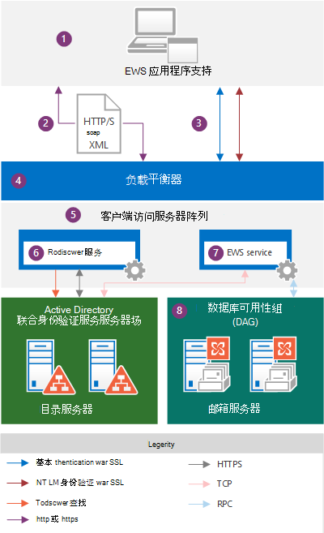
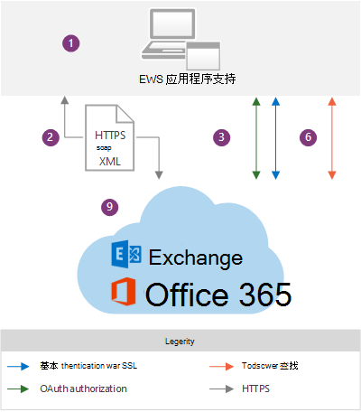

# EWS 应用程序和 Exchange 体系结构EWS applications and the Exchange architecture

了解 EWS 在 Exchange 体系结构中的工作方式，并找出 EWS 所依赖的协议。Learn about how EWS works within the Exchange architecture, and find out which protocols EWS relies on.
  
Exchange Web 服务（EWS）是跨平台 API，它使应用程序能够访问邮箱项目，例如来自 Exchange Online 的电子邮件、会议和联系人、exchange Online （作为 Office 365 的一部分）或 Exchange Online 版（从 Exchange Server 2007 开始）。Exchange Web Services (EWS) is a cross-platform API that enables applications to access mailbox items such as email messages, meetings, and contacts from Exchange Online, Exchange Online as part of Office 365, or on-premises versions of Exchange starting with Exchange Server 2007. [EWS 应用程序](ews-application-types.md)可以通过在基于 SOAP 的 XML 消息中发送请求，在本地或远程访问邮箱项。[EWS applications](ews-application-types.md) can access mailbox items locally or remotely by sending a request in a SOAP-based XML message. 在应用程序和服务器之间发送时，将在 HTTP 消息中嵌入 SOAP 消息，这意味着只要您的应用程序可以通过 HTTP 发布 XML，它就可以使用 EWS 访问 Exchange。The SOAP message is embedded in an HTTP message when sent between the application and the server, which means that as long as your application can post XML through HTTP, it can use EWS to access Exchange. 
  
## Exchange 体系结构概述Exchange architecture overview

下图显示了在与 Exchange 2013 和 Exchange Online 通信时，EWS 应用程序使用的身份验证方法和通信路径。The following diagrams show the authentication methods and communication paths used by EWS applications when communicating with Exchange 2013 and Exchange Online. 从 EWS 应用程序的角度来看，通信路径完全相同，身份验证方法仅略有不同;主要区别是您对 Exchange 后端的可见性。From the EWS application perspective, the communication paths are identical and the authentication methods only vary slightly; the main difference is the visibility you have into the Exchange backend.
  
**图1。EWS 应用程序和 Exchange 本地体系结构****Figure 1. EWS application and the Exchange on-premises architecture**

  
图2显示了图1中所示的相同通信路径，与 Exchange Online 通信时，由 EWS 应用程序使用。Figure 2 shows the same communication paths shown in Figure 1, as used by EWS applications when communicating with Exchange Online.
  
**图2。EWS 应用程序和 Exchange Online 体系结构****Figure 2. EWS application and the Exchange Online architecture**

  
图中显示了以下组件：The following are the components that are shown in the diagrams:
  
1. EWS 应用程序—这可以是[客户端、门户或服务应用程序](ews-application-types.md)，也可以安装在客户端或 Exchange 本地客户端访问服务器上。EWS application — This can be a [client, portal, or service application](ews-application-types.md) and it can be installed on a client or on an Exchange on-premises Client Access server. 如果使用 EWS 托管 API 开发 EWS 应用程序，则必须在客户端上安装 EWS 托管 API 程序集，并[由应用程序](redistribution-requirements-for-the-ews-managed-api.md)对其进行重新分配。If you use the EWS Managed API to develop the EWS application, the EWS Managed API assemblies have to be installed on the client and [redistributed by your application](redistribution-requirements-for-the-ews-managed-api.md).
    
2. Soap XML 消息（SOAP 信封中的 XML 消息）嵌入在 HTTP/S 消息中，该消息符合客户端访问服务器上的服务 .wsdl 文件。The SOAP XML message — An XML message, in a SOAP envelope, embedded in an HTTP/S message that conforms to the Services.wsdl file on the Client Access server. 建议对 Exchange 内部部署使用 HTTPS，对于 Exchange Online，此为必需。HTTPS is recommended for Exchange on-premises and is required for Exchange Online. 
    
3. 身份验证方法— EWS 邮件包括基本、NTLM （Windows 集成身份验证）或作为 HTTP 有效负载一部分的 OAuth 身份验证信息。Authentication methods — EWS messages include basic, NTLM (Windows Integrated authentication), or OAuth authentication information as part of the HTTP payload. 
    
4. 负载平衡器—负载平衡器将邮件分发到客户端访问服务器阵列中的客户端访问服务器。Load balancer — The load balancer distributes the message to a Client Access server in the Client Access server array. 此组件仅在 Exchange 内部部署体系结构中可见。This component is only visible in the Exchange on-premises architecture.
    
5. 客户端访问服务器阵列-客户端访问服务器被组织到一个称为客户端访问服务器阵列的负载平衡组中。Client Access server array — Client Access servers are organized into a load-balanced group called a Client Access server array. 单个客户端访问服务器提供身份验证、有限重定向和代理服务。Individual Client Access servers provide authentication, limited redirection, and proxy services. 客户端访问服务器本身不会进行任何数据呈现，也不会在客户端访问服务器上对数据进行排队或存储-它是瘦且无状态的;它只是对请求进行身份验证，执行自动发现查找，然后将请求代理到邮箱服务器。The Client Access servers themselves don't do any data rendering, and no data is queued or stored on a Client Access server - it is thin and stateless; it simply authenticates the request, performs an Autodiscover lookup, and then proxies the request to the Mailbox server. 客户端访问服务器与承载用户数据的邮箱服务器之间维护的关系为1:1。The Client Access server does maintain a 1:1 relationship with the Mailbox server that hosts the user's data. 在客户端访问服务器和邮箱服务器之间使用 HTTP 协议（通过使用自签名证书的 SSL 进行了安全保护）。The HTTP protocol (secured via SSL using a self-signed certificate) is used between the Client Access server and Mailbox server. 此组件仅在 Exchange 内部部署体系结构中可见。This component is only visible in the Exchange on-premises architecture.
    
6. 自动发现服务—自动发现服务通过访问 Active Directory 域服务（AD DS）来检索邮箱版本以及承载用户数据的主动副本的邮箱服务器的位置，从而执行服务发现。Autodiscover service — The Autodiscover service performs a service discovery by accessing Active Directory Domain Services (AD DS) to retrieve the mailbox version and the location of the Mailbox server that is hosting the active copy of the user's data.
    
7. EWS 服务-EWS 服务由三个文件： wsdl.exe、消息 .xsd 和类型 .xsd 以及 EWS 托管 API 程序集进行描述。EWS service —The EWS service is described by three files: Services.wsdl, Messages.xsd, and Types.xsd, as well as the EWS Managed API assemblies. "Wsdl" 描述客户端和服务器之间的协定，消息 .xsd 定义请求和响应 SOAP 消息，类型 .xsd 定义在 SOAP 消息中使用的元素。Services.wsdl describes the contract between the client and server, Messages.xsd defines the request and response SOAP messages, and Types.xsd defines the elements used in the SOAP messages. 无论早期版本的架构是什么，xsd 和类型都始终包含架构的最新版本。Messages.xsd and Types.xsd always contain the latest versions of the schema, although earlier versions of the schema exist. 请注意，在客户端访问服务器上提供了服务 wsdl、消息 .xsd 和类型 .xsd，但实际上并不用于架构验证，仅提供这些功能仅供参考。Note that Services.wsdl, Messages.xsd, and Types.xsd are made available on the Client Access server, but are not actually used for schema validation — they are provided for reference only. EWS 托管 API 程序集是为服务器端 EWS 客户端应用程序提供的，并且部署在所有 Exchange 服务器角色上，而不只是在客户端访问服务器上部署。The EWS Managed API assemblies are provided for server-side EWS client applications and are deployed on all Exchange Server roles, not just the Client Access servers. 此组件仅在 Exchange 内部部署体系结构中可见。This component is only visible in the Exchange on-premises architecture.
    
    功能可用性基于应用程序的目标 EWS 架构版本。Feature availability is based on the EWS schema version that your application targets. 由于 EWS 架构是向后和向前兼容的，因此，如果您创建一个面向早期架构版本的应用程序（如 Exchange 2007 SP1），则您的应用程序还将针对更高版本的架构版本（如 Exchange 2010 SP2 服务）以及 Exchange Online 运行。Because EWS schemas are backward- and forward-compatible, if you create an application that targets an earlier schema version, such as Exchange 2007 SP1, your application will also work against a later schema version, such as the Exchange 2010 SP2 service, as well as Exchange Online. 由于功能和功能更新由架构驱动，因此我们建议使用针对要在客户端应用程序中实现的 EWS 功能的最早通用基本代码。Because features and feature updates are driven by the schema, we recommend that you use the earliest common code base that targets the EWS features that you want to implement in your client application. 由于 Exchange 2007 SP1 架构包含几乎所有用于在 Exchange 存储中处理项目和文件夹的核心 Exchange 功能，因此许多应用程序可以面向 Exchange2007_SP1 版本。Many applications can target the Exchange2007_SP1 version, because the Exchange 2007 SP1 schema contains almost all the core Exchange functionality for working with items and folders in the Exchange store. 有关详细信息，请参阅[EWS 客户端功能](ews-client-design-overview-for-exchange.md#EWSFeatures)。For more information, see [EWS client features](ews-client-design-overview-for-exchange.md#EWSFeatures).
    
8. 数据库可用性组（DAG）—邮箱服务器被组织到一个高度可用的 DAG 中，可在一个或多个数据中心部署。Database Availability Group (DAG) — Mailbox servers are organized into a highly available DAG, which can be deployed in one or more datacenters. 邮箱服务器包含邮箱数据库，并处理该服务器上的活动邮箱的所有活动。The Mailbox server contains the mailbox database and handles all activity for the active mailboxes on that server. 处理、呈现和存储数据的所有组件都位于邮箱服务器上。All components that process, render, and store data are on the Mailbox server. 客户端不直接连接到邮箱服务器;所有连接都由客户端访问服务器处理。Clients do not connect directly to the Mailbox server; all connections are handled by the Client Access server. 此组件仅在 Exchange 内部部署体系结构中可见。This component is only visible in the Exchange on-premises architecture.
    
9. Exchange Online 和 Exchange Online 作为 Office 365 的一部分—将 Exchange 功能作为基于云的服务提供的托管邮件解决方案。Exchange Online and Exchange Online as part of Office 365 — The hosted messaging solution that delivers Exchange features as a cloud-based service.
    
当 EWS 应用程序请求来自 Exchange 存储的信息时，将创建符合 SOAP 标准的 XML 请求邮件并将其发送到 Exchange 服务器。When an EWS application requests information from the Exchange store, an XML request message that complies with the SOAP standard is created and sent to the Exchange server. 当 Exchange 服务器收到请求时，它会验证客户端提供的凭据，并自动分析请求的数据的 XML。When the Exchange server receives the request, it verifies the credentials that are provided by the client and automatically parses the XML for the requested data. 然后，服务器生成包含表示所请求的强类型对象及其属性的 XML 数据的 SOAP 响应。The server then builds a SOAP response that contains XML data that represents the requested strongly typed objects and their properties. 将 XML 数据发送回 HTTP 响应中的应用程序。The XML data is sent back to the application in an HTTP response. 然后，应用程序将 XML 反序列化并使用数据来重新对强类型对象进行改革。The application then deserializes the XML and uses the data to reform the strongly typed objects.
  
## EWS 应用程序必须支持的协议和标准Protocols and standards that EWS applications must support

若要与 Exchange 服务器通信，EWS 应用程序必须支持以下协议和标准。To communicate with an Exchange server, EWS applications must support the following protocols and standards.
  
**表1。协议****Table 1. Protocols**

|**协议****Protocol**|**如何使用****How it's used**|
|:-----|:-----|
|HTTP/SHTTP/S    |使 EWS 应用程序可以通过网络访问 Exchange 数据库数据，而不管客户端是在 Internet 上还是在 intranet 上。Enables EWS applications to access Exchange database data over the network, regardless of whether the client is on the Internet or intranet.    |
|SOAP 1。0SOAP 1.0    |在邮件传递负载周围形成信封。Forms an envelope around the messaging payload. EWS 通过使用 SOAP 信封的不同部分来实现 SOAP 协议，以启用不同的功能。EWS implements the SOAP protocol by using different parts of the SOAP envelope to enable different functionality. SOAP 标头用于模拟并提供版本控制数据。The SOAP header is used for impersonation and to provide versioning data. SOAP body 提供有关要运行的操作和提交到操作的数据的信息。The SOAP body provides information about the operation to run and the data that is submitted to the operation. SOAP 依赖 WSDL 来描述要调用的操作。SOAP relies on WSDL to describe the operations to call.    |
|WSDL 1。0WSDL 1.0    |介绍了在 wsdl.exe 文件中用于调用 EWS 操作的绑定、操作和属性。Describes the bindings, the operations, and the properties that are used to call EWS operations, in the Services.wsdl file. 此文件和引用的架构文件（包括 EWS 应用程序和 Exchange 服务器之间的协定），通常与供应商特定的工具一起使用，以创建特定于平台的应用程序。This file, along with the referenced schema files, comprises the contract between an EWS application and the Exchange server, and is often used along with vendor-specific tools to create platform-specific applications. WSDL 文件位于 EWS 虚拟目录中，该目录位于网站的根目录中。The WSDL file is located in the EWS virtual directory, which is at the root of the website.    |
|传输层安全性（TLS）/SSLTransport Layer Security (TLS)/SSL    |在 Internet 或 intranet 上提供安全的 web 通信。Provides secure web communications on the Internet or on intranet. TLS 使应用程序能够对服务器进行身份验证，也可以选择通过服务器对 EWS 应用程序进行身份验证。TLS enables applications to authenticate servers or, optionally, servers to authenticate EWS applications. 它还通过对通信进行加密来提供安全通道。It also provides a security channel by encrypting communications. TLS 是安全套接字层 (SSL) 协议的最新版本。TLS is the latest version of the Secure Sockets Layer (SSL) protocol.    |
|XML/XSDXML/XSD    |为 Exchange 服务器和客户端之间的信息交换提供通用邮件格式。Provides a universal message format for the exchange of information between the Exchange server and the client. XML 向客户端应用程序提供复杂的 Exchange 数据库数据，但采用定义的结构。XML provides complex Exchange database data to client applications, but in a defined structure. XML 的优点是，即使 EWS 应用程序和服务器不共享一个通用平台，也可以对数据进行交换。The beauty of XML is that it allows for the exchange of data even when an EWS application and server do not share a common platform.    |
   
此外，EWS 应用程序必须支持以下身份验证标准：In addition, EWS applications must support the following authentication standards:
  
- 基于 SSL 的基本身份验证，适用于面向 Exchange Online 或本地 Exchange 的应用程序。Basic authentication over SSL, for applications that target Exchange Online or Exchange on-premises.
    
- 通过 SSL 的 NTLM 身份验证，适用于支持本地 Exchange 的应用程序。NTLM authentication over SSL, for applications that support Exchange on-premises.
    
- 适用于受信任合作伙伴应用程序的 OAuth 2.0 令牌身份验证以及与 Lync Server 2013 和 SharePoint Server 2013 的互操作性。OAuth 2.0 token authentication, for trusted partner applications and interoperability with Lync Server 2013 and SharePoint Server 2013.
    
## 另请参阅See also

- [开始使用 Exchange 中的 Web 服务Start using web services in Exchange](start-using-web-services-in-exchange.md)
    
- [EWS 应用程序类型EWS application types](ews-application-types.md)
    
- [Exchange 的 EWS 客户端设计概述EWS client design overview for Exchange](ews-client-design-overview-for-exchange.md)
    

