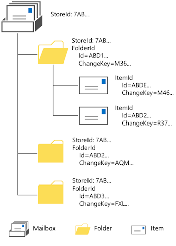

# Exchange 中的 EWS 标识符EWS Identifiers in Exchange

了解有关 Exchange 和如何您 EWS 托管 API 和 EWS 应用程序中使用它们的标识符。Find out about identifiers in Exchange and how you can use them in your EWS Managed API and EWS applications.
  
Exchange 存储中的每个对象具有唯一标识符。Every object in the Exchange store has a unique identifier. 若要引用对象，并以区别于其他对象，可以使用对象的标识符。You can use an object's identifier to reference the object and to distinguish it from other objects. 您可能会使用两个最常见标识符是文件夹和项标识符。The two most common identifiers that you might work with are folder and item identifiers. 
  
若要了解标识符和如何它们对您的应用程序，是有助于在 Exchange 了解对象之间的关系。In order to understand identifiers and how they're important to your application, it's helpful to understand the relationship between objects in Exchange. 与 Exchange，您 EWS 托管 API 或 EWS 应用程序进行通信，您使用对象层次结构，其中包含邮箱、 文件夹和项目对象。When your EWS Managed API or EWS application communicates with Exchange, you work with an object hierarchy that includes mailbox, folder, and item objects. 存储可以是任何一种这些对象类型。A store can be any one of these object types. 大多数情况下，它是在 Exchange 服务器上，邮箱，但也可以是 Exchange 服务器上的公用文件夹。Most commonly, it is a mailbox on the Exchange server, but it can also be a public folder on the Exchange server. （请记住，在 Exchange Online，Exchange Online 作为 Office 365 的一部分和版本的 Exchange 开头 Exchange 2013、 公用文件夹是刚其他类型的邮箱和不不同类型的存储）存储区包含文件夹和文件夹中包含的项目，每个这些文件夹和项目都有一个标识符，如下图所示。(Keep in mind that in Exchange Online, Exchange Online as part of Office 365, and versions of Exchange starting with Exchange 2013, public folders are just another type of mailbox and not a different kind of store.) The store contains folders and the folders contain items, and each of these folders and items has an identifier, as shown in the following figure. 
  
**图 1。邮箱、 文件夹和项目层次结构****Figure 1. Mailbox, folder, and item hierarchy**

  
## EWS 标识符EWS identifiers

EWS 标识符或 EwsIds 称为 EWS 使用文件夹和项目的标识符。Identifiers that EWS uses for folders and items are called EWS identifiers, or EwsIds. EwsIds 可以找到位于内 EWS，许多不同的对象，但调用其他对于不同的对象。EwsIds can be found in many different objects within EWS, but are called something different for different objects. 因为您可能在您的应用程序中使用这些对象，您需要了解 EwsId 这些对象的标识符的关联方式。Because you might use these objects in your application, you'll want to understand how the identifiers for these objects relate to the EwsId. 
  
EWS 中的标识符是不适用于 EWS 托管 API 以及。The identifiers in EWS are applicable to the EWS Managed API as well. EWS 托管 API 中标识符是对象的属性和内部托管将映射到 EWS 元素。In the EWS Managed API, the identifiers are properties of the objects and are internally managed to map to the EWS elements.
  
**表 1。EWS 中的对象标识符****Table 1. Object identifiers in EWS**

|**对象****Object**|**标识符****Identifier**|**它与 EwsId 有何关系？****How does it relate to EwsId?**|
|:-----|:-----|:-----|
|[日历项目CalendarItem](http://msdn.microsoft.com/library/b0c1fd27-b6da-46e5-88b8-88f00c71ba80%28Office.15%29.aspx)   |[ItemId](http://msdn.microsoft.com/library/3350b597-57a0-4961-8f44-8624946719b4%28Office.15%29.aspx)子元素包含的日历项目的唯一标识符。The [ItemId](http://msdn.microsoft.com/library/3350b597-57a0-4961-8f44-8624946719b4%28Office.15%29.aspx) child element contains the unique identifier of the calendar item.    |针对此项目 EwsId 相同的[ItemId](http://msdn.microsoft.com/library/3350b597-57a0-4961-8f44-8624946719b4%28Office.15%29.aspx)子元素。The [ItemId](http://msdn.microsoft.com/library/3350b597-57a0-4961-8f44-8624946719b4%28Office.15%29.aspx) child element is the same as the EwsId for this item.    |
|[ConversationIdConversationId](http://msdn.microsoft.com/library/d5f1ddb3-9af3-4677-a6ba-111b304a951e%28Office.15%29.aspx)   |**Id**属性包含此项是的一部分的会话的标识符。The **Id** attribute contains the identifier for the conversation that this item is part of.    |针对此项目 EwsId 相同的**Id**属性。The **Id** attribute is the same as the EwsId for this item.    |
|[AttachmentIdAttachmentId](http://msdn.microsoft.com/library/55a5fd77-60d1-40fa-8144-770600cedc6a%28Office.15%29.aspx)   |提供的附件的唯一标识符。Provides the unique identifier of the attachment. [RootItemId](http://msdn.microsoft.com/library/f613c705-17ce-48ce-aa64-4dc2cea25e31%28Office.15%29.aspx)属性包含附件附加到根存储项的唯一标识符。The [RootItemId](http://msdn.microsoft.com/library/f613c705-17ce-48ce-aa64-4dc2cea25e31%28Office.15%29.aspx) attribute contains the unique identifier of the root store item to which the attachment is attached.    |附件可案例[AttachmentId](http://msdn.microsoft.com/library/55a5fd77-60d1-40fa-8144-770600cedc6a%28Office.15%29.aspx)是 EwsId 相同的 Exchange 存储中的其他项。Attachments can be other items in the Exchange store, in which case the [AttachmentId](http://msdn.microsoft.com/library/55a5fd77-60d1-40fa-8144-770600cedc6a%28Office.15%29.aspx) is the same as the EwsId. 在所有情况下， [RootItemId](http://msdn.microsoft.com/library/f613c705-17ce-48ce-aa64-4dc2cea25e31%28Office.15%29.aspx)是 EwsId，因为它引用存储中的项。In all cases, the [RootItemId](http://msdn.microsoft.com/library/f613c705-17ce-48ce-aa64-4dc2cea25e31%28Office.15%29.aspx) is an EwsId because it references an item in the store.    |
|[PersonaIdPersonaId](http://msdn.microsoft.com/library/eec3a468-afd5-4d72-a61e-cd1964fb686c%28Office.15%29.aspx)   |**Id**属性返回一个字符串，包含角色的标识符。The **Id** attribute returns a string that contains the identifier of the persona.    |为该角色 EwsId 相同的**Id**属性。The **Id** attribute is the same as the EwsId for the persona.    |
|[ContactIdContactId](http://msdn.microsoft.com/library/86f66275-1e39-48ed-bd89-ac3bffc465a7%28Office.15%29.aspx)   |**Id**属性返回一个字符串，包含该联系人的标识符。The **Id** attribute returns a string that contains the identifier of the contact.    |为该联系人 EwsId 相同的**Id**属性。The **Id** attribute is the same as the EwsId for the contact.    |
|[GroupIdGroupId](http://msdn.microsoft.com/library/656d9b9a-8a65-4a75-8466-5b0d96512dab%28Office.15%29.aspx)   |**Id**属性返回一个字符串，包含组的标识符。The **Id** attribute returns a string that contains the identifier of the group.    |组 EwsId 相同的**Id**属性。The **Id** attribute is the same as the EwsId for the group.    |
|[AssociatedCalendarItemIdAssociatedCalendarItemId](http://msdn.microsoft.com/library/5b29898c-ea59-4e6a-914c-c011ec754032%28Office.15%29.aspx)   |**Id**属性标识与[MeetingMessage](http://msdn.microsoft.com/library/c95956a8-7505-44b4-bea4-11d1f5182796%28Office.15%29.aspx)、 [MeetingRequest](http://msdn.microsoft.com/library/c44f8804-a355-473d-a837-48cc91617251%28Office.15%29.aspx)、 [MeetingResponse](http://msdn.microsoft.com/library/9f798e79-dafd-4d4d-9967-95fd8e5c0502%28Office.15%29.aspx)或[MeetingCancellation](http://msdn.microsoft.com/library/a9c61f7f-2ecd-4b21-9dce-24d9f61aeeea%28Office.15%29.aspx)相关联的日历项。The **Id** attribute identifies the calendar item that is associated with a [MeetingMessage](http://msdn.microsoft.com/library/c95956a8-7505-44b4-bea4-11d1f5182796%28Office.15%29.aspx), [MeetingRequest](http://msdn.microsoft.com/library/c44f8804-a355-473d-a837-48cc91617251%28Office.15%29.aspx), [MeetingResponse](http://msdn.microsoft.com/library/9f798e79-dafd-4d4d-9967-95fd8e5c0502%28Office.15%29.aspx), or [MeetingCancellation](http://msdn.microsoft.com/library/a9c61f7f-2ecd-4b21-9dce-24d9f61aeeea%28Office.15%29.aspx).    |对于日历项 EwsId 相同的**Id**属性。The **Id** attribute is the same as the EwsId for the calendar item.    |
|[UserConfigurationPropertiesUserConfigurationProperties](http://msdn.microsoft.com/library/c143a6ec-62ad-4d48-b844-b1ad88054bc1%28Office.15%29.aspx)   |此元素的**Id**值指定的 identifier 属性。The **Id** value for this element specifies the identifier property.    |此标识符没有直接映射到 EwsId 以来属性标识符和不项目。This identifier does not directly map to the EwsId since it an property identifier and not an item.    |
|[OccurrenceItemIdOccurrenceItemId](http://msdn.microsoft.com/library/4a15bbc3-5b93-4193-b9ec-da32f0a9a552%28Office.15%29.aspx)   |**RecurringMasterId**属性标识定期项目的母的版。The **RecurringMasterId** attribute identifies the master of a recurring item.    |**OccurrenceItemId**值不直接映射到 EwsId，但**RecurringMasterId**原因是它引用定期项目的顶级对象。The **OccurrenceItemId** value does not map directly to the EwsId, but the **RecurringMasterId** does because it references the top-level object of the recurring item.    |
|[StoreEntryIdStoreEntryId](http://msdn.microsoft.com/library/f536e264-8c4d-4cc5-bab8-22a4fa38de39%28Office.15%29.aspx)   |包含项目的 Exchange 存储区标识符。Contains the Exchange store identifier of an item.    |**StoreEntryId**值没有映射到 EwsId，但它确实为提供了保留项的位置的存储的标识符。The **StoreEntryId** value does not map to the EwsId, but it does give the identifier of the store where the items are kept.    |
   
## 使用标识符Working with identifiers

Exchange server 处理大量的不同方法中的标识符。The Exchange server handles identifiers in a lot of different ways. 开发您的 EWS 托管 API 或 EWS 应用程序时，考虑以下事项：Consider the following when you develop your EWS Managed API or EWS application:
  
- 文件夹和项目的**ItemID**元素值区分大小写。The **ItemID** element value for folders and items is case-sensitive. 如果您看一下文件夹或由[FindItem 操作](http://msdn.microsoft.com/library/ebad6aae-16e7-44de-ae63-a95b24539729%28Office.15%29.aspx)（或[FindItems](http://msdn.microsoft.com/en-us/library/microsoft.exchange.webservices.data.exchangeservice.finditems%28v=exchg.80%29.aspx) EWS 托管 API 方法） 返回的项的项 ID，您可能会认为，它是重复的另一个项目 ID;但是，在两个项目的项 Id 中的一个或多个字符将具有不同的案例。If you look at the item ID for a folder or item that is returned by the [FindItem operation](http://msdn.microsoft.com/library/ebad6aae-16e7-44de-ae63-a95b24539729%28Office.15%29.aspx) (or the [FindItems ](http://msdn.microsoft.com/en-us/library/microsoft.exchange.webservices.data.exchangeservice.finditems%28v=exchg.80%29.aspx) EWS Managed API method), you might think that it is a duplicate of another item ID; however, one or more characters in the item IDs for the two items will have a different case. 
    
- 如果您打算在以后要检索的数据库中存储的项 ID，我们建议该字段大小是 512 字节，以使它位于足以容纳 GUID。If you are going to store the item ID in a database to retrieve later, we recommend that the field size be 512 bytes, so that it's large enough to hold the GUID.
    
- 不要假设您的 ID 将始终为有效的如果您需要在以后检索项目。Don't assume that your ID will always be valid if you need to retrieve the item at a later time. 如果将项目移动存储区中，ID 可以更改由于移动的处理的方式。If an item is moved in the store, the ID can change because of the way a move is handled. 项目实际复制，并生成新的 ID，然后[删除原始项目](deleting-items-by-using-ews-in-exchange.md)。An item is actually copied, and a new ID is generated, and then [the original item is deleted](deleting-items-by-using-ews-in-exchange.md).
    
- Exchange 中的标识符是不透明的。Identifiers in Exchange are opaque. 例如，从以下几条信息不是作为开发人员，对您重要但重要 Exchange 中创建 EwsId。For example, the EwsId is created from several pieces of information that are not important to you as the developer, but are important to Exchange.
    
- 在 Exchange 处理项，另一个值，请记住时**更改密钥**属性。When you work with items in Exchange, another value to keep in mind is the **ChangeKey** attribute. 除了项目 ID，此值，用于跟踪的项的状态。This value, in addition to the item ID, is used to keep track of the state of an item. 生成的随时更改项目，新更改密钥。Any time an item is changed, a new change key is generated. 执行[UpdateItem 操作](http://msdn.microsoft.com/library/5d027523-e0bc-4da2-b60b-0cb9fc1fdfe4%28Office.15%29.aspx)时，例如，可以使用**更改密钥**属性来让服务器了解正在更新应用于项目的最新版本。When you perform an [UpdateItem operation](http://msdn.microsoft.com/library/5d027523-e0bc-4da2-b60b-0cb9fc1fdfe4%28Office.15%29.aspx), for example, you can use the **ChangeKey** attribute to let the server know that your update is being applied to the most current version of the item. 如果另一个应用程序对您要更新的项目进行更改，更改密钥不匹配，您将无法执行更新。If another application made a change to the item you're updating, the change keys won't match and you will not be able to perform the update. 
    
## 可分辨的文件夹 IdDistinguished folder IDs

Exchange 包括的多个预定义的邮箱文件夹，其中每个分配的标识符，称为可分辨的文件夹 id。Exchange includes a number of predefined mailbox folders, each of which is assigned an identifier, known as the distinguished folder ID. 这些[WellKnownFolderName](http://msdn.microsoft.com/en-us/library/office/microsoft.exchange.webservices.data.wellknownfoldername%28v=exchg.80%29.aspx) EWS 托管 API 枚举和[DistinguishedFolderId](http://msdn.microsoft.com/library/50018162-2941-4227-8a5b-d6b4686bb32f%28Office.15%29.aspx) EWS 元素来定义。These are defined by the [WellKnownFolderName](http://msdn.microsoft.com/en-us/library/office/microsoft.exchange.webservices.data.wellknownfoldername%28v=exchg.80%29.aspx) EWS Managed API enumeration and the [DistinguishedFolderId](http://msdn.microsoft.com/library/50018162-2941-4227-8a5b-d6b4686bb32f%28Office.15%29.aspx) EWS element. 您可以使用这些可分辨的文件夹 Id 以更轻松地引用某个预定义的文件夹。You can use these distinguished folder IDs to more easily reference one of the predefined folders. 例如，对于收件箱文件夹中，您可以只使用"收件箱"的标识符，而不是确定文件夹标识符。For example, for the Inbox folder, you can simply use "inbox" for the identifier, rather than determining the folder identifier. 
  
创建组织电子邮件项目的其他文件夹还可以对该文件夹是唯一的 ID。Other folders that you create to organize email items also have an ID that is unique to that folder. 即使您更改文件夹上的其他属性，该 ID 将不会更改。That ID does not change even if you change other properties on the folder.
  
您可以使用可分辨的文件夹 Id 作为的入口点代理访问。You can use distinguished folder IDs as an entry point for delegate access. 在启动代理访问时，您的项目或文件夹搜索，并提供要指定搜索位置的可分辨的文件夹 ID。When you initiate delegate access, you search for items or folders and provide the distinguished folder ID to specify where to search. 当代理用户访问的服务器时， **DistinguishedFolderId**元素的子元素的[邮箱](http://msdn.microsoft.com/library/befc70fd-51cb-4258-884c-80c9050f0e82%28Office.15%29.aspx)元素用于明确指定的代理访问的邮箱。When a delegate user accesses the server, a [Mailbox](http://msdn.microsoft.com/library/befc70fd-51cb-4258-884c-80c9050f0e82%28Office.15%29.aspx) element that is a child of the **DistinguishedFolderId** element is used to explicitly specify the mailbox for the delegate to access. 
  
## 处理错误Handling errors

每个程序绑定和不时，获取错误和基于 EWS 的应用程序 （这适用于） 不例外。Every program is bound to get an error every now and then, and EWS-based applications are no exception (pun intended). [ResponseCode](http://msdn.microsoft.com/library/4b84d670-74c9-4d6d-84e7-f0a9f76f0d93%28Office.15%29.aspx) EWS 元素中或作为的一部分，您可能会收到一些标识符相关错误 EWS 托管 API 枚举的[服务错误](http://msdn.microsoft.com/en-us/library/office/microsoft.exchange.webservices.data.serviceerror%28v=exchg.80%29.aspx)。You might receive some identifier-related errors in the [ResponseCode](http://msdn.microsoft.com/library/4b84d670-74c9-4d6d-84e7-f0a9f76f0d93%28Office.15%29.aspx) EWS element or as part of the of the [ServiceError](http://msdn.microsoft.com/en-us/library/office/microsoft.exchange.webservices.data.serviceerror%28v=exchg.80%29.aspx) EWS Managed API enumeration. 
  
EWS 托管 API 或 EWS 应用程序中发生以下错误。The following errors can occur in your EWS Managed API or EWS application. 如果您正在使用 EWS 托管 API 应用程序，这些错误通常属性值; 问题对于 EWS 应用程序，错误是与 XML 元素的值或操作关联。If you're working with an EWS Managed API application, the errors are typically issues with property values; for EWS applications, the errors are associated with XML element values or operations.
  
**表 2。与标识符相关的错误****Table 2. Identifier-related errors**

|**Error****Error**|**发生此事件时...****Occurs when…**|**说明****Description**|
|:-----|:-----|:-----|
|ErrorCalendarCannotUseIdForOccurrenceIdErrorCalendarCannotUseIdForOccurrenceId    |**OccurenceID**的值不对应于有效的定期日历项目。The value of the **OccurenceID** does not correspond to a valid recurring calendar item.    |**OccurenceId**请求中指定的值可能是有效的结构，但请求未能匹配它到现有定期主控形状。The value of the **OccurenceId** that was specified in the request might be valid in structure, but the request could not match it to an existing recurring master. 定期项目可能会移除从日历。The recurring item might be removed from the calendar. 确保项目仍存在并且正在使用的正确的标识符。Verify that the item still exists and that you are using the correct identifier.    |
|ErrorCalendarCannotUseIdForRecurringMasterIdErrorCalendarCannotUseIdForRecurringMasterId    |**RecurringMasterId**属性不对应于**OccurrenceId**元素有效匹配项。The **RecurringMasterId** attribute does not correspond to a valid occurrence of the **OccurrenceId** element.    |**RecurringMasterId**请求中指定的值可能是有效的结构，但请求未能匹配它到现有项目的事件。The value of the **RecurringMasterId** that was specified in the request might be valid in structure, but the request could not match it to an existing occurrence of the item. 日历中，可能会删除项的匹配项。The occurrence of the item might be removed from the calendar. 确保项目仍存在并且正在使用的正确的标识符。Verify that the item still exists and that you are using the correct identifier.    |
|ErrorCannotUseFolderIdForItemIdErrorCannotUseFolderIdForItemId    |**ID**传递表示而不是项目的文件夹。The **ID** that was passed represents a folder instead of an item.    |该标识符可能是有效的格式，但不是什么服务器所需要的操作。The identifier might be valid in format, but not what the server was expecting for the operation. 确认您引用的正确操作的标识符。Verify that you are referencing the correct identifier for the operation.    |
|ErrorCannotUseItemIdForFolderIdErrorCannotUseItemIdForFolderId    |中传递**ID**表示项目而不是一个文件夹。The **ID** that was passed in represents an item instead of a folder.    |该标识符可能是有效的格式，但不是什么服务器所需要的操作。The identifier might be valid in format, but not what the server was expecting for the operation. 确认您引用的操作正确的**ID** 。Verify that you are referencing the correct **ID** for the operation.    |
|ErrorChangeKeyRequiredForWriteOperationsErrorChangeKeyRequiredForWriteOperations    |执行某些更新操作时，必须提供有效的更改键。A valid change key must be provided when you are performing certain update operations.    |可以请求进行更新，或更改密钥不正确时省略**更改密钥**值。Either you omitted a **ChangeKey** value when you requested an update, or the change key was incorrect. 验证已正确更改密钥时执行的 update 操作。Verify that you have the correct change key when you perform update operations.    |
|ErrorInvalidAttachmentIdErrorInvalidAttachmentId    |项目的 attachments 集合中找不到该附件。The attachment was not found within the attachments collection for the item.    |如果您有附件**ID**然后删除附件并尝试对附件 id。 调用[GetAttachment 操作](http://msdn.microsoft.com/library/24d10a15-b942-415e-9024-a6375708f326%28Office.15%29.aspx)，您可能会收到此响应代码You might receive this response code if you have an attachment **ID** and then the attachment is deleted and you try to call the [GetAttachment operation](http://msdn.microsoft.com/library/24d10a15-b942-415e-9024-a6375708f326%28Office.15%29.aspx) on the attachment ID. 验证附件的附件集合中存在。Verify that the attachment exists in the attachment collection.    |
|ErrorInvalidChangeKeyErrorInvalidChangeKey    |无效的更改密钥传递了。An invalid change key was passed in.    |请注意，许多操作和方法不需要更改密钥传递。Note that many operations and methods do not require a change key to be passed. 但是，如果提供更改密钥，它必须是有效的但它不一定是最新。However, if you do provide a change key, it must be valid, although it does not necessarily have to be up-to-date.    |
|ErrorInvalidFolderIdErrorInvalidFolderId    |文件夹**ID**已损坏。The folder **ID** is corrupted.    |确保正确格式化且有效的标识符。Make sure you have a properly formatted and valid identifier.    |
|ErrorInvalidIdErrorInvalidId    |内部不一致的**ID**和/或更改密钥的结构。The structure of the **ID** and/or change key is internally inconsistent.    |它已分析后，Exchange 遇到**ID**问题。Exchange encountered a problem with the **ID** after it was parsed. 有可能已错误转换中。There might have been an error in the conversion. 此问题，例如，如果您有项目**IdFormatType.HexEntryId**在 Outlook 中，但将其转换为 EwsId 考虑过**IdFormatType.EntryId**格式。This can occur, for example, if you have an **IdFormatType.HexEntryId** for an item in Outlook, but you convert it to an EwsId thinking it was an **IdFormatType.EntryId** format. 请确保使用正确的转换类型。Make sure you use the correct conversion type.    |
|ErrorInvalidIdEmptyErrorInvalidIdEmpty    |指定的应用程序的**ID**为空。The application specified an **ID** that is empty.    |您的应用程序中为空字符串传递为标识符。Your application passed in an empty string for the identifier. 确保正确格式化且有效的标识符。Make sure you have a properly formatted and valid identifier.    |
|ErrorInvalidIdMalformedErrorInvalidIdMalformed    |内部不一致的**ID**的结构。The structure of the **ID** is internally inconsistent.    |它已分析后，Exchange 遇到**ID**问题。Exchange encountered a problem with the **ID** after it was parsed. 可能不正确转换 ID。The ID might not have been converted correctly. 请确保使用正确的转换类型。Make sure you use the correct conversion type.    |
|ErrorInvalidIdMalformedEwsLegacyIdFormatErrorInvalidIdMalformedEwsLegacyIdFormat    |版本的 Exchange 2007 SP1 或更高版本请求指定的文件夹或项目使用的 Exchange 2007 格式的**ID** 。A folder or item **ID** that is using the Exchange 2007 format was specified for a request with a version of Exchange 2007 SP1 or later.    |不能使用 Exchange 2007 SP1 或更高版本的请求中的 Exchange 2007 Id。You cannot use Exchange 2007 IDs in Exchange 2007 SP1 or later requests. 您必须使用[ConvertId](http://msdn.microsoft.com/library/47d96cf6-9e2f-4fc0-9682-7258d3fbf918%28Office.15%29.aspx) EWS 操作或[ConvertId](http://msdn.microsoft.com/en-us/library/microsoft.exchange.webservices.data.exchangeservice.convertid%28v=exchg.80%29.aspx) EWS 托管 API 方法首先将转换。You must use the [ConvertId](http://msdn.microsoft.com/library/47d96cf6-9e2f-4fc0-9682-7258d3fbf918%28Office.15%29.aspx) EWS operation or the [ConvertId](http://msdn.microsoft.com/en-us/library/microsoft.exchange.webservices.data.exchangeservice.convertid%28v=exchg.80%29.aspx) EWS Managed API method to convert them first.    |
|ErrorInvalidIdNotAnItemAttachmentIdErrorInvalidIdNotAnItemAttachmentId    |**AttachmentId**属性不引用项目附件。The **AttachmentId** property does not refer to an item attachment.    |该标识符可能是有效的格式，但不是什么服务器所需要的操作。The identifier might be valid in format, but not what the server was expecting for the operation. 确认您引用的正确操作的标识符。Verify that you are referencing the correct identifier for the operation.    |
|ErrorInvalidIdReturnedByResolveNamesErrorInvalidIdReturnedByResolveNames    |您的邮箱中的联系人已损坏。A contact in your mailbox is corrupt.    |[ResolveNames](http://msdn.microsoft.com/library/6b4eb4b3-9ad6-4804-a09f-7e20cfea4dbb%28Office.15%29.aspx) EWS 操作或[ResolveName](http://msdn.microsoft.com/en-us/library/microsoft.exchange.webservices.data.exchangeservice.resolvename%28v=exchg.80%29.aspx) EWS 托管 API 方法返回一个或多个标识符，但它们不是有效。The [ResolveNames](http://msdn.microsoft.com/library/6b4eb4b3-9ad6-4804-a09f-7e20cfea4dbb%28Office.15%29.aspx) EWS operation or the [ResolveName](http://msdn.microsoft.com/en-us/library/microsoft.exchange.webservices.data.exchangeservice.resolvename%28v=exchg.80%29.aspx) EWS Managed API method returned one or more identifiers, but they are not valid. 您可能需要重新创建联系人。You might need to recreate the contact.    |
|ErrorInvalidIdStoreObjectIdTooLongErrorInvalidIdStoreObjectIdTooLong    |内部不一致的**ID**的结构。The structure of the **ID** is internally inconsistent.    |它已分析后，Exchange 遇到**ID**问题。Exchange encountered a problem with the **ID** after it was parsed. 可能不正确转换**ID** 。The **ID** might not have been converted correctly. 请确保使用正确的转换类型。Make sure you use the correct conversion type.    |
|ErrorInvalidIdTooManyAttachmentLevelsErrorInvalidIdTooManyAttachmentLevels    |附件层次结构超过 255 个深度的最大。The attachment hierarchies exceed the maximum of 255 levels deep.    |已请求中指定**AttachmentId**属性的值可能是有效的结构，但请求的附件太深层次结构中。The value of the **AttachmentId** property that was specified in the request might be valid in structure, but the requested attachment is too deep in the hierarchy. 您的代码可能尝试附加超过 255 层的限制的项目。Your code might have tried to attach an item beyond the limit of 255 levels.    |
|ErrorInvalidImContactIdErrorInvalidImContactId    |使用[RemoveImContactFromGroup 操作](http://msdn.microsoft.com/library/a190bbec-c71b-4e6a-880b-55854c724d8c%28Office.15%29.aspx)时，不能在 IM 组中找到该联系人时，可以返回此错误。This error can be returned when the contact cannot be found in the IM group when you use the [RemoveImContactFromGroup operation](http://msdn.microsoft.com/library/a190bbec-c71b-4e6a-880b-55854c724d8c%28Office.15%29.aspx). 此错误适用于 Exchange Online 和 Exchange 开头 Exchange 2013 版本的目标设定的客户端。This error applies to clients that target Exchange Online and versions of Exchange starting with Exchange 2013.    |已请求中指定**ContactId**属性的值可能是有效的结构，但没有邮箱中的联系人匹配此结构。The value of the **ContactId** property that was specified in the request might be valid in structure, but no contacts in the mailbox match this structure. 联系人可能已被已删除。The contact might have been removed already.    |
|ErrorInvalidImGroupIdErrorInvalidImGroupId    |组不能发现邮箱中，当您使用[RemoveImGroup 操作](http://msdn.microsoft.com/library/5e788016-68e0-4a3f-9243-03f6b6c6b389%28Office.15%29.aspx)时，可以返回此错误。This error can be returned when the group cannot be found in the mailbox when you use the [RemoveImGroup operation](http://msdn.microsoft.com/library/5e788016-68e0-4a3f-9243-03f6b6c6b389%28Office.15%29.aspx). 此错误适用于 Exchange Online 和 Exchange 开头 Exchange 2013 版本的目标设定的客户端。This error applies to clients that target Exchange Online and versions of Exchange starting with Exchange 2013.    |已请求中指定**GroupId**属性的值可能是有效的结构，但没有邮箱中的组匹配此结构。The value of the **GroupId** property that was specified in the request might be valid in structure, but no groups in the mailbox match this structure. 组可能已被已删除。The group might have been removed already.    |
|ErrorInvalidReferenceItemErrorInvalidReferenceItem    |**MessageType**或**ExchangeWebServices.CalendarItemTypeType**，或其后代之一，该引用的项标识符不是。The referenced item identifier is not a **MessageType** or **ExchangeWebServices.CalendarItemTypeType**, or one of their descendants. 引用的项标识符是**CalendarItemType**对象，组织者尝试向答复或全部答复。The reference item identifier is for a **CalendarItemType** object and the organizer is trying to Reply or ReplyAll.    |该标识符可能是有效的格式，但不是什么服务器所需要的操作。The identifier might be valid in format, but not what the server was expecting for the operation. 确认您引用的正确操作的标识符。Verify that you are referencing the correct identifier for the operation.    |
|ErrorMissingManagedFolderIdErrorMissingManagedFolderId    |Id 属性的策略，该文件夹的属性标记 0x6732 遗漏。The policy IDs property, property tag 0x6732, for the folder is missing.    |文件夹已损坏。The folder is corrupted. 请考虑重新创建它。Consider recreating it.    |
   
## 转换标识符Converting identifiers

您可能需要将标识符从一种格式转换为另一个。You might need to convert an identifier from one format to another. 例如，您可能需要将标识符转换从外部 EWS，如来自的 MAPI 连接，为您的应用程序可以使用的格式的标识符。For example, you might need to convert an identifier from outside EWS, such as an identifier that comes from a MAPI connection, to a format that your application can use. 要执行此操作，您可以使用[ConvertId](http://msdn.microsoft.com/library/47d96cf6-9e2f-4fc0-9682-7258d3fbf918%28Office.15%29.aspx) EWS 操作或[ConvertId](http://msdn.microsoft.com/en-us/library/microsoft.exchange.webservices.data.exchangeservice.convertid%28v=exchg.80%29.aspx) EWS 托管 API 方法。To do this, you can use the [ConvertId](http://msdn.microsoft.com/library/47d96cf6-9e2f-4fc0-9682-7258d3fbf918%28Office.15%29.aspx) EWS operation, or the [ConvertId](http://msdn.microsoft.com/en-us/library/microsoft.exchange.webservices.data.exchangeservice.convertid%28v=exchg.80%29.aspx) EWS Managed API method. 
  
例如，EntryID 是由时保存项目分配由存储的 MAPI 邮件存储区生成的唯一标识符。For example, an EntryID is a unique identifier generated by the MAPI message store that is assigned by the store when the item is saved. 若要在您的应用程序中使用 EntryID，首先需要将其转换为 EwsId。To use an EntryID in your application, you first need to convert it to an EwsId. 
  
Outlook Web 应用程序使用它自己的标识符，在 Url 以访问文件夹和项目中称为 OwaId，版本。Outlook Web App uses its own version of identifiers, called OwaId, in URLs to access folders and items. 如果您的应用程序需要访问 Outlook Web App 中的项，您需要 OwaId 转换 EwsId。If your application needs to access items in Outlook Web App, you need to convert the OwaId into an EwsId.
  
您可以使用**ConvertId**操作或方法将几种不同的标识符格式转换。You can use the **ConvertId** operation or method to convert several different identifier formats. 
  
**表 3。在 Exchange 兑换标识符格式****Table 3. Convertible identifier formats in Exchange**

|**Format****Format**|**说明****Description**|
|:-----|:-----|
|EwsLegacyIdEwsLegacyId    |适用于 Exchange 2007 EwsId。The EwsId that applies to Exchange 2007.    |
|EwsIdEwsId    |适用于 Exchange Online 和 Exchange 2007 sp1 开始的 Exchange 版本 EwsId。The EwsId that applies to Exchange Online and versions of Exchange starting with Exchange 2007 SP1.    |
|StoreIdStoreId    |Exchange 存储区标识符的文件夹和项目的存储位置。The Exchange store identifier where the folders and items are stored.    |
|OwaIdOwaId    |使用与 Exchange 2007 和 Exchange 2010 中的 Outlook Web App 的 Outlook Web App 标识符。The Outlook Web App identifier used with Outlook Web App in Exchange 2007 and Exchange 2010.    > [!NOTE]> Exchange Online 和 Exchange 开头 Exchange 2013 版本用于 Outlook Web App EwsId。> [!NOTE]> Exchange Online and versions of Exchange starting with Exchange 2013 use the EwsId for Outlook Web App.           |
|EntryIdEntryId    |通常被称为 MAPI 邮件的**PR_ENTRYID**属性 MAPI 标识符。A MAPI identifier that is commonly known as the **PR_ENTRYID** property of a MAPI message.    |
|HexEntryIdHexEntryId    |**PR_ENTRYID**属性用于可用性日历事件标识符的十六进制编码表示形式。A hexadecimal-encoded representation of the **PR_ENTRYID** property that is used for the availability calendar event identifier. 这也是 Outlook 使用标识符格式。This is also the identifier format that Outlook uses.    |
   
## 另请参阅See also

- [开发 Exchange Web 服务客户端Develop web service clients for Exchange](develop-web-service-clients-for-exchange.md)
    
- [ConvertId 操作ConvertId operation](http://msdn.microsoft.com/library/47d96cf6-9e2f-4fc0-9682-7258d3fbf918%28Office.15%29.aspx)
    
- [服务错误枚举ServiceError enumeration](http://msdn.microsoft.com/en-us/library/office/microsoft.exchange.webservices.data.serviceerror%28v=exchg.80%29.aspx)
    
- [通过在 Exchange 使用 EWS 中删除项目Deleting items by using EWS in Exchange](deleting-items-by-using-ews-in-exchange.md)
    

