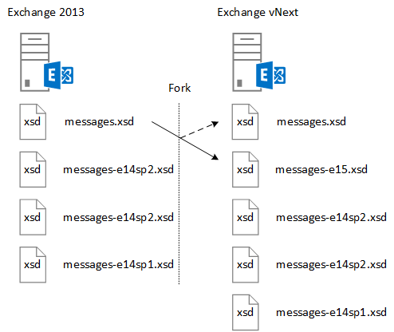

# <a name="ews-schema-versions-in-exchange"></a>Exchange 中的 EWS 架构版本

了解 EWS 架构和如何设计您的应用程序以使用它，以及与每个架构版本，可用的功能和架构与 Exchange 服务版本的方式。
  
EWS 架构定义了可以发送到并由 Exchange 返回的数据结构。 每个新的 Exchange 版本的包含对 EWS 功能的重大更改将包含新的架构。 EWS 和 EWS 架构都是向后，并在某些情况下，向前兼容-设计针对早期版本的 EWS 的应用程序将工作，在大多数情况下，使用更高版本的 EWS，和针对更高版本的 EWS 应用程序将工作如果相同早期版本中包含的功能。 本文将帮助您了解 EWS 架构的角色，架构版本控制的工作原理，架构版本和服务版本之间的关系以及如何设计您的应用程序以使用 EWS 架构。 
  
## <a name="role-of-the-ews-schema"></a>EWS 架构的角色

EWS 架构将执行以下操作：
  
- 定义可供客户端的功能集。 客户端可以通过使用 SOAP[自动发现服务](autodiscover-for-exchange.md)获取的受支持的架构版本的列表。 客户端然后可以确定哪些功能，它可以访问的因为每个架构版本代表[EWS 功能集](ews-schema-versions-in-exchange.md#bk_features)。 发布 EWS 的每个新架构包含从以前版本以及任何新功能的架构定义的架构实体。 这种方式，EWS 支持针对早期版本的 EWS 应用程序。
    
- 提供 API 合同的一般说明。 您可以使用本合同确定可以为发送和接收从交换的数据结构。
    
- 提供用于发送请求的版本控制机制。 Exchange server 包含所有的支持的 EWS 架构版本在其虚拟目录中。 
    
## <a name="designing-your-application-with-schema-version-in-mind"></a>设计应用程序与记住的架构版本

设计您的应用程序以使用不同版本的 EWS 架构时，请牢记以下几点：
  
- 打开/关闭基于架构版本的功能。 您需要将客户端的功能映射到的架构版本，然后在某些情况下，为服务的版本。 下面的示例将返回的[属性集](http://msdn.microsoft.com/en-us/library/office/microsoft.exchange.webservices.data.propertyset%28v=exchg.80%29.aspx)根据架构和服务的版本。 
    
  ```cs
  private static PropertySet InitPropertySetByVersion(ExchangeService service)
  {
      PropertySet props;
      // The schema version to target to access the NormalizedBody property 
      // is Exchange2013 or later. The server version to target to access the 
      // NormalizedBody property on an email is 15 or later, which 
      // equates to Exchange 2013.
      if (service.RequestedServerVersion >= ExchangeVersion.Exchange2013 &amp;&amp;
          service.ServerInfo.MajorVersion >= 15)
      {
          props = new PropertySet(EmailMessageSchema.NormalizedBody);
      }
      else
      {
          props = new PropertySet(EmailMessageSchema.Body);
      }
      return props;
  }
  ```

- 版本想要使用您的请求的 EWS 架构的支持功能的最低版本。 这将使您的客户端适用于更多的潜在的 Exchange 服务器。 这不是很重要如果正在开发的业务线应用程序来设定仅，贵组织的服务器，但如果您正在构建应用程序的更多 Exchange 访问群体非常重要。
    
## <a name="features-by-schema-version"></a>架构版本的功能
<a name="bk_features"> </a>

标识位于 types.xsd 架构**ExchangeVersionType**简单类型中可供客户端的架构版本。 **ExchangeVersionType**由[RequestServerVersion](http://msdn.microsoft.com/library/af4032d5-42b3-463e-9d0a-8236d78e5b75%28Office.15%29.aspx)元素实现。 客户端针对**RequestServerVersion**元素将发送所有 EWS 请求以指示到服务器的架构的版本中。 反过来，这标识可供客户端的功能集。 
  
**按产品和架构版本的表 1: EWS 功能**

|**产品版本**|**关联的架构版本**|**功能**|
|:-----|:-----|:-----|
|Exchange Online  |最新的架构版本。  |除了新功能才会为联机客户端添加当前版本的 Exchange 中包括所有功能。 |
|Exchange 2013 SP1 |Exchange2013_SP1 | Exchange 2013 中包括所有功能。<br/><br/>Exchange 2013 SP1 中引入了以下功能： <ul><li>[邮箱保留策略](http://msdn.microsoft.com/en-us/library/office/microsoft.exchange.webservices.data.exchangeservice.setholdonmailboxes%28v=exchg.80%29.aspx) </li><li> [建议新时间](how-to-propose-a-new-meeting-time-by-using-ews-in-exchange.md) </li><li>  阅读回执更新的[更新](http://msdn.microsoft.com/EN-US/library/office/dn600559%28v=exchg.80%29.aspx)和[删除](http://msdn.microsoft.com/EN-US/library/office/dn600557%28v=exchg.80%29.aspx)项目  </li><li> 对话的[IRM 的信息](http://msdn.microsoft.com/EN-US/library/office/microsoft.exchange.webservices.data.conversation.hasirm%28v=exchg.80%29.aspx)更新  </li></ul> |
|Exchange 2013   |Exchange2013   | 包含在 Exchange 2007 和 Exchange 2010 中引入的所有功能。 <br/><br/>Exchange 2013 中引入了以下功能：<ul><li>存档  </li><li>  电子数据展示  </li><li>  角色  </li><li>  保留策略  </li><li>  统一的联系人存储库  </li><li>  用户照片  </li></ul> |
|Exchange 2010 SP2   |Exchange2010_SP2 | 包含在 Exchange 2010 SP1 中引入的所有功能。 <br/><br/>Exchange 2010 SP2 中引入了以下功能：<ul><li>获取密码过期  </li><li>  DateTime 精度  </li><li>  联系人的更新的属性标识符  </li><li>  新模拟方案  </li></ul> |
|Exchange 2010 SP1  |Exchange2010_SP1   | 包含在 Exchange 2010 中引入的所有功能。 <br/><br/>Exchange 2010 SP1 中引入了以下功能：<ul><li>创建、 检索和修改收件箱规则  </li><li>  对存档邮箱的编程访问  </li><li>  对话操作  </li><li>  防火墙遍历通知  </li><li>  改进的管理功能  </li><li>  改进的混合的版本支持  </li><li>  限制保护支持  </li><li>  应用程序访问 EWS 的控制权  </li><li>  客户端证书身份验证支持  </li></ul> |
|Exchange 2010  |Exchange2010   | 包含在 Exchange 2007 SP1 中引入的所有功能。 <br/><br/>初始发行版的 Exchange 2010 中引入了以下功能：<ul><li>完整的私有通讯组列表  </li><li>  用户配置对象  </li><li>  文件夹关联的项目  </li><li>  邮件跟踪  </li><li>  统一消息  </li><li>  SOAP 自动发现  </li><li>  所在的时区的增强的支持  </li><li>  会议室资源可用性信息  </li><li>  索引的搜索  </li><li>  转储程序访问  </li><li>  邮件提示信息  </li></ul> |
|Exchange 2007 SP1   |Exchange2007_SP1  | 包括所有 Exchange 2007 中引入的功能。 <br/><br/>Exchange 2007 SP1 中引入了以下功能：<ul><li>管理工作委派给  </li><li>  文件夹权限  </li><li>  公用文件夹  </li><li>  发布项目  </li><li>  ID 转换  </li></ul>|
|Exchange 2007  |Exchange2007 | 初始发行版 Exchange 2007 中引入了以下功能：<ul><li>对项目、 文件夹和附件 （创建、 获取、 更新和删除） 完全访问权限  </li><li>  可用性  </li><li>  利用 Office 设置  </li><li>  通知  </li><li>  Synchronization  </li><li>  名称解析  </li><li>  通讯组列表 (DL) 扩展  </li><li>  搜索  </li></ul> |
   
## <a name="relationship-between-the-ews-schema-and-the-service-version"></a>EWS 架构和的服务版本之间的关系
<a name="bk_features"> </a>

EWS 架构版本相关的 EWS 服务的服务器正在运行的版本。 与本地版本的 Exchange 相关 EWS 架构的命名图案。 例如，初始版本的 Exchange 2013 具有 15.00.0516.032 和架构名称**Exchange2013**的服务版本。 Exchange 2013 已更新的模式，因为 Exchange 2013 和 Exchange Online 服务版本的 15.00.0516.032 及更高版本具有最新的架构的相同版本名称。 在早期版本的 Exchange，使用累积更新 （以前称为汇总） 未更新的 EWS 架构。 但累积更新较频繁更新 Exchange 以支持 Exchange Online，因为 ews 的架构更新现在包含。 架构文件的名称和关联的架构版本名称，仅更新与 service pack 或 Exchange 内部部署的主要版本。
  
同时的 EWS 架构定义合同，在某些情况下，对服务版本是确定如何应该与该服务进行交互的客户端的唯一方式。 只能通过在所有 EWS 响应中返回的服务版本确定服务不会反映在架构中的行为更改。 例如时[公用文件夹](public-folder-access-with-ews-in-exchange.md)已在 Exchange 2013 中重新设计，, 这些操作的用于移动和复制公用文件夹更改。 如果设计将公用文件夹复制 Exchange 2010 中的客户端，您需要使用不同的操作以获取 Exchange 2013 中的相同的结果对其进行更新。 
  
## <a name="how-the-ews-schema-is-updated"></a>如何更新 EWS 架构
<a name="bk_features"> </a>

运行 Exchange 启动与 Exchange 2007 版本的 Exchange 服务器承载 EWS 服务的虚拟目录中包括的 EWS 架构。 由的 types.xsd 和 messages.xsd 文件始终表示当前架构版本。 图 1 显示了如何 messages.xsd 架构分为两路时开发架构的新版本。 添加新功能之前，是包含一份原始 messages.xsd 架构并将其重命名以表示架构的以前版本。 Messages.xsd 文件然后更新为新版本的服务说明。
  
**图 1。如何更新 EWS 架构**


  
EWS 架构更新的新版本之前，当前版本的架构分为两路，并使用以下约定重命名：
  
`<schemaname>-<majorserverversion><servicepack>.xsd`
  
原始文件名然后表示的最新的架构。 所有新功能添加到最新的架构，除外更新和修补程序与早期版本的架构。 
  
## <a name="see-also"></a>另请参阅

- [Exchange 中的 EWS 架构版本](ews-schema-versions-in-exchange.md) 
- [Exchange 自动发现](autodiscover-for-exchange.md) 
- [开发 Exchange Web 服务客户端](develop-web-service-clients-for-exchange.md)
    

