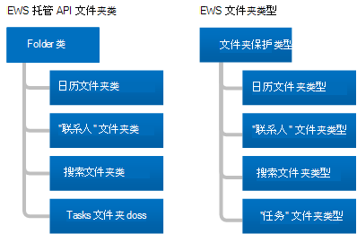
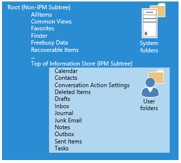

# 文件夹和交换中的 EWS 中的项目

了解文件夹和邮箱项目以及 EWS 托管 API 或 EWS 客户端如何代表它们。
  
文件夹是 Exchange 邮箱的组织元素。 文件夹可以包含邮箱项目（如电子邮件、联系人、约会、会议和任务），也可以包含其他文件夹。 Exchange 包含不同类型的文件夹，但文件夹类型彼此类似。 它们的主要区别在于它们所包含的项目的类型。
  
但是，项具有唯一的类型。 每个项目类型都有一组不同的属性或架构来定义它。 在本文中，我们将讨论可用的文件夹和项目的类型以及它们之间的差异。

## Folders

所有文件夹都从相同的基类或基类型、EWS 托管 API 中的[folder](https://msdn.microsoft.com/library/microsoft.exchange.webservices.data.folder%28v=EXCHG.80%29.aspx)类或 ews 中的[文件夹](https://msdn.microsoft.com/library/812948d8-c7db-45ce-bb3a-77233a53a974%28Office.15%29.aspx)类型派生。 下图显示 EWS 托管 API 类和 EWS 类型。 
  
**图1。EWS 托管 API 文件夹类和 EWS 文件夹类型**

  
每个 folder 类和文件夹类型之间的主要区别在于，您只能在每种类型的文件夹中创建特定类型的项目。 另一个不同之处在于客户端显示文件夹中的信息的方式。 例如，Exchange 允许您在 "日历" 文件夹中创建约会。 您可以在创建日历文件夹中移动其他类型的项目，但 Outlook 不会显示这些项目。 Outlook 仅在 "日历" 文件夹中显示日历项目（如约会和会议），[即使文件夹中存在其他类型的项目](folders-and-items-in-ews-in-exchange.md#bk_item)也是如此。 
  
**表1。EWS 托管 API 文件夹类和 EWS 文件夹类型**

|**EWS 托管 API 类**|**EWS 类型**|**FolderClass 值**|**Contains**|**备注**|
|:-----|:-----|:-----|:-----|:-----|
|[Folder](https://msdn.microsoft.com/library/microsoft.exchange.webservices.data.folder%28v=exchg.80%29.aspx)   |[Folder](https://msdn.microsoft.com/library/812948d8-c7db-45ce-bb3a-77233a53a974%28Office.15%29.aspx)   |限.便笺    |电子邮件或文件夹。    | 这是用于以下 EWS 托管 API [WellKnownFolderName](https://msdn.microsoft.com/library/microsoft.exchange.webservices.data.wellknownfoldername%28v=exchg.80%29.aspx) FOLDERS 和 ews [DistinguishedFolderId](https://msdn.microsoft.com/library/50018162-2941-4227-8a5b-d6b4686bb32f%28Office.15%29.aspx)文件夹的通用 folder 类或类型： <ul><li>  根（IPM 子树）</li><li>NonIpmSubtree</li><li>Inbox</li><li>已删除邮件</li><li>草稿</li><li>分类账</li><li>注释  </li><li>发件箱</li><li>已发送邮件</li><li>邮件文件夹</li><li>垃圾邮件</li><li>语音邮件</li></ul> |
|[CalendarFolder](https://msdn.microsoft.com/library/microsoft.exchange.webservices.data.calendarfolder%28v=exchg.80%29.aspx)   |[CalendarFolder](https://msdn.microsoft.com/library/48687a78-e757-4c04-9641-bf4302c6b565%28Office.15%29.aspx)   |限.日程    |约会和会议。    |当用户响应会议请求时，该约会将添加到 EWS 托管 API [WellKnownFolderName](https://msdn.microsoft.com/library/microsoft.exchange.webservices.data.wellknownfoldername%28v=exchg.80%29.aspx)或 ews DistinguishedFolderId。仅[CalendarFolder](https://msdn.microsoft.com/library/50018162-2941-4227-8a5b-d6b4686bb32f%28Office.15%29.aspx) 。 这些是仅支持与会议请求和响应自动交互的文件夹。    此文件夹类或文件夹类型支持使用 "日历" 视图，通过使用 EWS 托管 API [Folder FindItem](https://msdn.microsoft.com/library/microsoft.exchange.webservices.data.folder.finditems%28v=EXCHG.80%29.aspx)方法和结束日期来返回基于开始日期和结束日期的约会和会议。方法和[CalendarView](https://msdn.microsoft.com/library/microsoft.exchange.webservices.data.calendarview%28v=exchg.80%29.aspx)类，或者 Ews [FindItem](https://msdn.microsoft.com/library/ebad6aae-16e7-44de-ae63-a95b24539729%28Office.15%29.aspx)操作和[CalendarView](https://msdn.microsoft.com/library/a4a953b8-0710-416c-95ef-59e51eba9982%28Office.15%29.aspx)元素。    |
|[ContactsFolder](https://msdn.microsoft.com/library/microsoft.exchange.webservices.data.contactsfolder%28v=exchg.80%29.aspx)   |[ContactsFolder](https://msdn.microsoft.com/library/6c299de8-2087-4aeb-8e66-2bc7586509a6%28Office.15%29.aspx)   |限.信息    |联系人和通讯组列表。    |无。    |
|[SearchFolder](https://msdn.microsoft.com/library/microsoft.exchange.webservices.data.searchfolder%28v=exchg.80%29.aspx)   |[SearchFolder](https://msdn.microsoft.com/library/1a7d408b-2e98-4391-8834-085ed6d5757c%28Office.15%29.aspx)   |限.便笺    |内容由限制或筛选器决定。 搜索文件夹没有子文件夹。    |满足搜索条件的项目实际上并不包含在搜索文件夹中;相反，它们位于邮箱中的其他位置。    若要确保 "搜索文件夹" 在 Outlook 中可用，请在 "Finder" 文件夹中创建它们。    |
|[TasksFolder](https://msdn.microsoft.com/library/microsoft.exchange.webservices.data.tasksfolder%28v=exchg.80%29.aspx)   |[TasksFolder](https://msdn.microsoft.com/library/5a9a4612-8064-4986-b467-c44f268c64df%28Office.15%29.aspx)   |限.任务    |包含要完成的工作项。    |无。    |
   
### 文件夹结构

文件夹提供了邮箱结构。 这包括 IPM 子树（称为 EWS 中的信息存储区），大多数用户都与其邮箱进行交互，大多数用户都不会看到的系统文件夹在 EWS 的非 IPM 子树或根目录中。 下图显示了用户的文件夹结构，并指示了用户的项目以及系统文件夹的文件夹。
  
**图2。邮箱中的项目和系统文件夹**

  
### 众所周知的文件夹

对于邮箱中的文件夹，有些是特殊文件夹。 它们等同于 EWS 托管 API 中的已知文件夹或 EWS 中的可分辨文件夹。 其中一些文件夹对文件夹名称有限制，它们位于文件夹结构中，以及是否可以删除它们。 其他 "常规" （非特殊）文件夹不具有相同的限制。 您必须熟悉以下已知或可分辨文件夹，这一点非常重要，因为它们是根系统、用户和搜索文件夹，并且适用于大多数实现。 
  
**表2。主要的知名和可分辨文件夹**

|**友好名称**|**EWS 托管 API **WellKnownFolderName**值**|**EWS **DistinguishedFolderId**值**|**说明**|
|:-----|:-----|:-----|:-----|
|根（非 IPM 子树）    |WellKnownFolderName    |DistinguishedFolderId    |包含邮箱的根文件夹（也称为非 IPM 子树）。 此文件夹没有父文件夹，您无法移动、复制、重命名或删除它。 每个邮件存储区仅包含一个根文件夹。    |
|信息存储（IPM 子树）顶部    |WellKnownFolderName.MsgFolderRoot    |DistinguishedFolderId.msgfolderroot    |包含 "收件箱" 和其他用户文件夹。    |
|查找器（搜索文件夹）    |WellKnownFolderName。 SearchFolders    |DistinguishedFolderId. searchfolders。    |包含在 Outlook 中可见的搜索文件夹。    |
   
有关 EWS 托管 API [WellKnownFolderName](https://msdn.microsoft.com/library/microsoft.exchange.webservices.data.folder.wellknownfoldername%28v=exchg.80%29.aspx)属性值的完整列表，请参阅[WellKnownFolderName](https://msdn.microsoft.com/library/microsoft.exchange.webservices.data.wellknownfoldername%28v=EXCHG.80%29.aspx)枚举。 有关 EWS **DistinguishedFolderId**值的完整列表，请参阅[DistinguishedFolderId](https://msdn.microsoft.com/library/50018162-2941-4227-8a5b-d6b4686bb32f%28Office.15%29.aspx)。
  
### 文件夹属性

在 EWS 托管 API 中，[文件夹属性](https://msdn.microsoft.com/library/microsoft.exchange.webservices.data.folder_properties%28v=exchg.80%29.aspx)均派生自基[文件夹](https://msdn.microsoft.com/library/microsoft.exchange.webservices.data.folder%28v=EXCHG.80%29.aspx)类。 在 EWS 中，所有文件夹都使用可用于[文件夹](https://msdn.microsoft.com/library/812948d8-c7db-45ce-bb3a-77233a53a974%28Office.15%29.aspx)类型的 folder 元素。 大多数与文件夹相关的属性和元素都简单明了（父文件夹 ID、显示名称等），但少数只需要更多说明。 
  
以下注意事项适用于 EWS 托管 API[文件夹 FolderClass](https://msdn.microsoft.com/library/microsoft.exchange.webservices.data.folder.folderclass%28v=EXCHG.80%29.aspx)属性或 ews [FolderClass](https://msdn.microsoft.com/library/0041d135-2869-4612-89a5-d1aa86aa1093%28Office.15%29.aspx)元素： 
  
- 如果设置，则属性或元素的值必须与该文件夹的派生类或类型一致。 例如， **FolderClass**属性或元素不能指示文件夹是 "联系人" 文件夹，而文件夹的类或类型指示该文件夹为 "日历" 文件夹。 
    
- 您可以创建特定类型的[文件夹](how-to-work-with-folders-by-using-ews-in-exchange.md#bk_createfolderewsma)，而无需设置**FolderClass**属性或元素，也可以创建具有通用文件夹类型的文件夹，并指定**FolderClass**属性或元素。 这两个选项都创建相同的结果。 
    
- 在通过创建特定类型的文件夹或通过设置**FolderClass**属性或元素本身设置**FolderClass**值后，不能更改它。 例如，不能更改 IPF。注意文件夹到 IPF。"联系人" 文件夹。 但是，您可以将其更改为 IPF。请注意，Contoso 文件夹。 
    
- 任何不使用预定义前缀之一的**FolderClass**值将被视为 IPF。便笺文件夹。 例如，IAmAFolderClass 的**FolderClass**值被视为 IPF。便笺文件夹。 
    
文件夹类值是可扩展的。 这意味着表1中列出的默认**FolderClass**值将被视为前缀，并且您可以添加自定义值。 例如，您可以创建一个**FolderClass**值为 IPF 的文件夹。Contoso，并将其视为 "联系人" 文件夹。 
  
您可以使用 EWS 托管 API [Folder EffectiveRights](https://msdn.microsoft.com/library/microsoft.exchange.webservices.data.folder.effectiverights%28v=EXCHG.80%29.aspx)属性或 ews [EffectiveRights](https://msdn.microsoft.com/library/bf5278eb-3a1a-4d27-9d16-b8be043bb023%28Office.15%29.aspx)元素来确定客户端对文件夹的权限，如删除、读取和修改。 
  
### 公用文件夹

公用文件夹专为共享访问设计，为收集、组织信息及与您的工作组或组织中的其他人共享信息提供了一种轻松、有效的方式。 您还可以使用公用文件夹来存档通讯组的内容。 有关公用文件夹的详细信息，请参阅[Exchange 中与 EWS 的公用文件夹访问](public-folder-access-with-ews-in-exchange.md)。

### 隐藏文件夹

Exchange 在邮箱根目录中创建的所有文件夹都是隐藏的，并且您可以使用 EWS 托管 API 或 EWS 隐藏信息存储顶部下的其他文件夹。 有关隐藏文件夹的详细信息，请参阅[使用 Exchange 中的 EWS 处理隐藏文件夹](how-to-work-with-hidden-folders-by-using-ews-in-exchange.md)。 

### 搜索文件夹

搜索文件夹与常规文件夹一样，只是它们具有定义搜索筛选器的属性或元素。 您可以在 Exchange 邮箱中的任何文件夹中创建搜索文件夹，创建这些文件夹的方式与创建任何其他文件夹的方式相同。 但是，在 Outlook、Outlook Web App 或 Outlook Live 中显示的搜索文件夹中，使用 EWS 托管 API 创建的[SearchFolder](https://msdn.microsoft.com/library/microsoft.exchange.webservices.data.searchfolder%28v=exchg.80%29.aspx)对象必须位于[WellKnownFolderName](https://msdn.microsoft.com/library/microsoft.exchange.webservices.data.wellknownfoldername%28v=exchg.80%29.aspx)文件夹中，并且使用 ews 创建的[SearchFolder](https://msdn.microsoft.com/library/1a7d408b-2e98-4391-8834-085ed6d5757c%28Office.15%29.aspx)类型必须位于[DistinguishedFolderId](https://msdn.microsoft.com/library/50018162-2941-4227-8a5b-d6b4686bb32f%28Office.15%29.aspx)文件夹中。 如果在其他位置创建了搜索文件夹，则该文件夹仍可用，并且您可以在自定义客户端应用程序中进行查看。 

## 项目

Exchange 中的 EWS 使用**项目**来表示邮箱中的各个电子邮件、约会、会议、联系人、通讯组列表、任务、帖子和其他项目。 项是强类型的，这意味着它们具有特定的关联类或架构，或者不是强类型（也称为 "泛型项"）。 泛型项是 EWS 托管 API 中的[项](https://msdn.microsoft.com/library/microsoft.exchange.webservices.data.item%28v=exchg.80%29.aspx)对象和 ews 中的[项](https://msdn.microsoft.com/library/4dfe8f48-e7b4-444d-bdf9-a34e180f598b%28Office.15%29.aspx)类型。 常见项目（如电子邮件、联系人、通讯组列表、帖子和任务）是强类型的，您可以在其上设置特定的架构化属性或元素。 
  
**表3。强类型项**

|**EWS 托管 API 项目类型**|**EWS 项元素**|
|:-----|:-----|
|[约会](https://msdn.microsoft.com/library/microsoft.exchange.webservices.data.appointment%28v=exchg.80%29.aspx)   |[CalendarItem](https://msdn.microsoft.com/library/b0c1fd27-b6da-46e5-88b8-88f00c71ba80%28Office.15%29.aspx)   |
|[联系人](https://msdn.microsoft.com/library/microsoft.exchange.webservices.data.contact%28v=exchg.80%29.aspx)   |[联系人](https://msdn.microsoft.com/library/66bfff50-7a91-4d81-b6a0-610b9962f677%28Office.15%29.aspx)   |
|[ContactGroup](https://msdn.microsoft.com/library/microsoft.exchange.webservices.data.contactgroup%28v=exchg.80%29.aspx)   |[DistributionList](https://msdn.microsoft.com/library/f65aea01-e870-44a2-8571-fa6c001341cc%28Office.15%29.aspx)   |
|[EmailMessage](https://msdn.microsoft.com/library/microsoft.exchange.webservices.data.emailmessage%28v=exchg.80%29.aspx)   |[消息](https://msdn.microsoft.com/library/2400b33c-43b2-4fc2-b6fb-275a99e0e810%28Office.15%29.aspx)   |
|[PostItem](https://msdn.microsoft.com/library/microsoft.exchange.webservices.data.postitem%28v=exchg.80%29.aspx)   |[PostItem](https://msdn.microsoft.com/library/7727ed84-9591-4a1c-bb04-12129926499b%28Office.15%29.aspx)   |
|[任务](https://msdn.microsoft.com/library/microsoft.exchange.webservices.data.task%28v=exchg.80%29.aspx)   |[任务](https://msdn.microsoft.com/library/7c84927e-db28-4c5d-b0b5-cbcc2b88d869%28Office.15%29.aspx)   |
   
EWS 托管 API 强类型项派生自基[项](https://msdn.microsoft.com/library/microsoft.exchange.webservices.data.item%28v=EXCHG.80%29.aspx)类。 但是，通常使用表3中列出的一个派生类型，而不是直接与**Item**类一起使用。 但是，在使用[ItemCollection](https://msdn.microsoft.com/library/dd634001%28v=EXCHG.80%29.aspx)类时，可以直接处理**Item**类的实例。 在这种情况下，应实现确定**item**类的实例所代表的存储区中的项目类型的逻辑。 若要使用该项目，应使用表示该项目的类的实例绑定到该项目。 
  
### 文件夹中的项目

某些文件夹对其可以包含的项目类型有限制。 这些限制是 Exchange 邮箱数据库适用于文件夹，而不是客户端视图限制。 
  
**表4。文件夹的项目限制**

|**EWS 托管 API 文件夹类**|**EWS 文件夹类型**|**限制**|
|:-----|:-----|:-----|
|[基文件夹类](https://msdn.microsoft.com/library/microsoft.exchange.webservices.data.folder%28v=exchg.80%29.aspx)   |[Folder](https://msdn.microsoft.com/library/812948d8-c7db-45ce-bb3a-77233a53a974%28Office.15%29.aspx)   |您只能在通用文件夹中创建新的 EWS 托管 API [EmailMessage](https://msdn.microsoft.com/library/microsoft.exchange.webservices.data.emailmessage%28v=exchg.80%29.aspx)对象和[PostItem](https://msdn.microsoft.com/library/microsoft.exchange.webservices.data.postitem%28v=exchg.80%29.aspx)对象，或 EWS[邮件](https://msdn.microsoft.com/library/2400b33c-43b2-4fc2-b6fb-275a99e0e810%28Office.15%29.aspx)类型或**PostItem**类型。 您可以将其他项目类型移动到通用文件夹中，但客户端可能不会显示它们。    |
|[CalendarFolder](https://msdn.microsoft.com/library/microsoft.exchange.webservices.data.calendarfolder%28v=exchg.80%29.aspx)   |[CalendarFolder](https://msdn.microsoft.com/library/48687a78-e757-4c04-9641-bf4302c6b565%28Office.15%29.aspx)   |您只能在 "日历" 文件夹中创建新的 EWS 托管 API[约会](https://msdn.microsoft.com/library/microsoft.exchange.webservices.data.appointment%28v=exchg.80%29.aspx)对象和 EWS [CalendarItem](https://msdn.microsoft.com/library/b0c1fd27-b6da-46e5-88b8-88f00c71ba80%28Office.15%29.aspx)类型。 您可以将其他项目类型移动到 "日历" 文件夹中，但客户端可能不会显示它们。    |
|[ContactsFolder](https://msdn.microsoft.com/library/microsoft.exchange.webservices.data.contactsfolder%28v=exchg.80%29.aspx)   |[ContactsFolder](https://msdn.microsoft.com/library/6c299de8-2087-4aeb-8e66-2bc7586509a6%28Office.15%29.aspx)   |您只能在 "联系人" 文件夹中创建新的 EWS 托管 API [Contact](https://msdn.microsoft.com/library/microsoft.exchange.webservices.data.contact%28v=exchg.80%29.aspx)和[ContactGroup](https://msdn.microsoft.com/library/microsoft.exchange.webservices.data.contactgroup%28v=exchg.80%29.aspx)对象，或者 EWS[联系人](https://msdn.microsoft.com/library/66bfff50-7a91-4d81-b6a0-610b9962f677%28Office.15%29.aspx)类型或[DistributionList](https://msdn.microsoft.com/library/f65aea01-e870-44a2-8571-fa6c001341cc%28Office.15%29.aspx)类型。 您可以将其他项类型移动到 "联系人" 文件夹中，但客户端可能不会显示它们    |
|[SearchFolder](https://msdn.microsoft.com/library/microsoft.exchange.webservices.data.searchfolder%28v=exchg.80%29.aspx)   |[SearchFolder](https://msdn.microsoft.com/library/1a7d408b-2e98-4391-8834-085ed6d5757c%28Office.15%29.aspx)   |无限制。 项目实际上并不位于搜索文件夹中;它们位于邮箱中的其他位置。    |
|[TasksFolder](https://msdn.microsoft.com/library/microsoft.exchange.webservices.data.tasksfolder%28v=exchg.80%29.aspx)   |[TasksFolder](https://msdn.microsoft.com/library/5a9a4612-8064-4986-b467-c44f268c64df%28Office.15%29.aspx)   |您只能在 "任务" 文件夹中创建新的 EWS 托管 API[任务](https://msdn.microsoft.com/library/microsoft.exchange.webservices.data.task%28v=exchg.80%29.aspx)对象或 EWS[任务](https://msdn.microsoft.com/library/7c84927e-db28-4c5d-b0b5-cbcc2b88d869%28Office.15%29.aspx)类型。 您可以将其他项类型移动到 "任务" 文件夹中，但客户端可能不会显示它们    |

## 从以前的产品版本升级

在早期和当前产品版本中，文件夹的大部分部分保持不变。 但是请注意，早期版本的 Exchange 使用托管文件夹执行邮件记录管理（MRM）。 Exchange Online、作为 Office 365 的一部分的 exchange Online 和从 Exchange 2013 开始的 Exchange 版本使用 MRM 的保留策略。 您可以[升级托管文件夹以使用保留策略](https://technet.microsoft.com/library/dd298032%28v=exchg.150%29.aspx)。 
  
早期和当前产品版本中的项目尚未更改。

## 本节内容

- [使用 Exchange 中的 EWS 处理文件夹](how-to-work-with-folders-by-using-ews-in-exchange.md)
    
- [使用 Exchange 中的 EWS 处理隐藏的文件夹](how-to-work-with-hidden-folders-by-using-ews-in-exchange.md)
    
- [使用 Exchange 中的 EWS 处理 Exchange 邮箱项目](how-to-work-with-exchange-mailbox-items-by-using-ews-in-exchange.md)
    
- [使用 Exchange 中的 EWS 删除项目](deleting-items-by-using-ews-in-exchange.md)
    
- [使用 Exchange 中的 EWS 导出和导入项目](exporting-and-importing-items-by-using-ews-in-exchange.md)
    
## 另请参阅

- [开发 Exchange Web 服务客户端](develop-web-service-clients-for-exchange.md)   
- [Start using web services in Exchange](start-using-web-services-in-exchange.md)   
- [Exchange 的 EWS 客户端设计概述](ews-client-design-overview-for-exchange.md)
    

