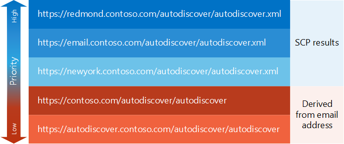

# 生成自动发现终结点的列表

了解如何生成自动发现终结点的优先级的列表。
  
[自动发现过程](autodiscover-for-exchange.md)的第一个任务是生成的应用程序尝试自动发现终结点列表。 这些自动发现终结点可以来自[SCP 查找](how-to-find-autodiscover-endpoints-by-using-scp-lookup-in-exchange.md)或可从用户的电子邮件地址。 最后，您可以结尾数量较大的终结点。 我们来看一下如何按优先级组织它们。 
  
## 启动 SCP 查找

来自[SCP 查找](how-to-find-autodiscover-endpoints-by-using-scp-lookup-in-exchange.md)的自动发现终结点列表中应有最高的优先级。 管理员可以配置要路由到最接近或最适合您自动发现终结点，您的客户端，使其与这些终结点开始，最好的 SCP 对象。 SCP 查找过程具有自己的优先顺序方案，因为 SCP 查找的结果是已确定优先级、，如下所示： 
  
1. 从 SCP 对象范围内的客户端计算机所属的 Active Directory 站点的自动发现终结点。
    
2. 从 SCP 对象不到任何 Active Directory 站点范围的自动发现终结点。
    
3. 从 SCP 对象范围内的客户端计算机所属的网站与不同的 Active Directory 站点的自动发现终结点。
    
SCP 查找过程的结果后，您可以添加用户的电子邮件地址派生的终结点。 这些可以作为没有 SCP 结果或从 SCP 查找返回的终结点没有足够的情况下，默认设置的终结点和后备。
  
## 添加源自用户的电子邮件地址的终结点

当 SCP 查找操作不起作用，或在 SCP 查找返回的终结点不返回成功响应时，您可以从用户的电子邮件地址派生一默认自动发现终结点。 这些终结点应为较低的优先级高于任何来自 SCP 查找，但您可能需要如果 SCP 查找未成功完成。
  
### 派生自动发现终结点

1. 从用户的电子邮件地址中提取的域名。 例如，如果用户的电子邮件地址，Sadie.Daniels@contoso.com 域名称将为 contoso.com。
    
2. 构造无采用以下格式的文件扩展名的终结点 Url:
    
  - "https://"+ 域 +"/ 自动发现/自动发现"
    
  - "https://autodiscover." 域 +"/ 自动发现/自动发现"
    
编译从 SCP 查找和用户的电子邮件地址中获得的终结点 Url 的列表后，您可能需要修改这些 Url，具体取决于是否正在使用[SOAP 自动发现 web 服务](http://msdn.microsoft.com/library/61c21ea9-7fea-4f56-8ada-bf80e1e6b074%28Office.15%29.aspx)或[POX 中的文件扩展名自动发现 web 服务](http://msdn.microsoft.com/library/877152f0-f4b1-4f63-b2ce-924f4bdf2d20%28Office.15%29.aspx)。
  
## 添加或替换终结点 Url 中的文件扩展名

您可以使用 SOAP 自动发现 web 服务或 POX 自动发现 web 服务访问的自动发现服务。 每个服务将类似的终结点 Url，使用唯一的区别在于文件扩展名。 SOAP 自动发现 web 服务使用".svc"文件扩展名和 POX 自动发现 web 服务使用".xml"文件扩展名。
  
默认情况下，自动发现终结点 Url 返回从 SCP 查找是 POX Url。 但是，如果您使用 SOAP 自动发现，可以只需更改文件扩展名从".xml"为".svc"，并尝试 SOAP 请求。
  
派生的自动发现终结点 url，省略的文件扩展名。 添加适当的文件扩展名之前尝试 URL 使用自动发现 web 服务。
  
## 示例： 生成自动发现终结点的列表

我们来看看一个示例。 Sadie Daniels (Sadie.Daniels@contoso.com) 首次使用 Exchange Web Services (EWS) 应用程序。 应用程序使用自动发现配置本身。 Sadie 的计算机加入到 contoso.com 域和雷德蒙德 Active Directory 站点中。 应用程序生成图 1 中显示的自动发现终结点的列表。
  
**图 1： 的自动发现终结点的示例列表**

  
此示例中的 EWS 应用喜欢 SOAP 自动发现 web 服务，因此它将更改 SCP 结果的文件扩展名为".svc"发送给他们的 SOAP 请求之前。
  
## 后续步骤

生成的自动发现终结点列表后，尝试它们通过[发送到这些终结点的请求](how-to-get-user-settings-from-exchange-by-using-autodiscover.md)。
  
## 另请参阅

- [Exchange 自动发现](autodiscover-for-exchange.md)
    
- [在 Exchange 使用 SCP 查找来查找自动发现终结点](how-to-find-autodiscover-endpoints-by-using-scp-lookup-in-exchange.md)
    
- [处理自动发现错误消息](handling-autodiscover-error-messages.md)
    

