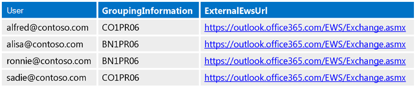
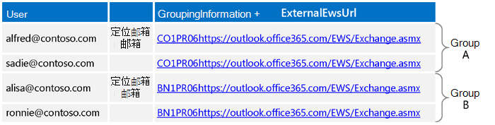
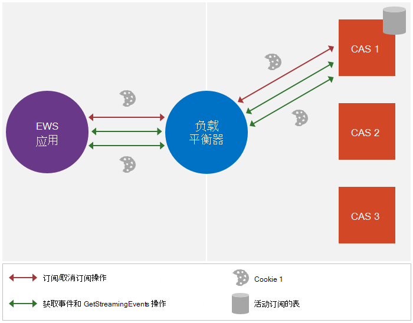
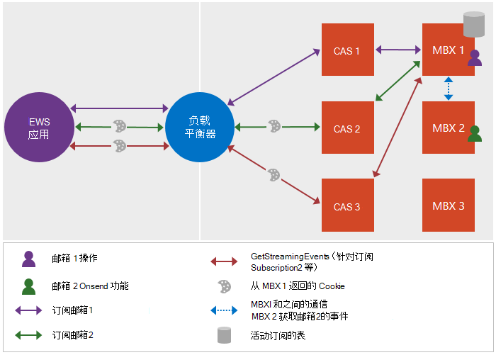

# <a name="maintain-affinity-between-a-group-of-subscriptions-and-the-mailbox-server-in-exchange"></a><span data-ttu-id="c571f-103">维护 Exchange 中的一组订阅和邮箱服务器之间的相关性</span><span class="sxs-lookup"><span data-stu-id="c571f-103">Maintain affinity between a group of subscriptions and the Mailbox server in Exchange</span></span>

<span data-ttu-id="c571f-104">了解有关维护一组订阅和邮箱服务器之间的相关性的信息。</span><span class="sxs-lookup"><span data-stu-id="c571f-104">Find out about maintaining the affinity between a group of subscriptions and the Mailbox server.</span></span>
  
<span data-ttu-id="c571f-105">相关性是对特定邮箱服务器的一系列请求和响应消息的关联。</span><span class="sxs-lookup"><span data-stu-id="c571f-105">Affinity is the association of a sequence of request and response messages with a particular Mailbox server.</span></span> <span data-ttu-id="c571f-106">对于 Exchange 中的大多数功能，相关性由服务器处理。</span><span class="sxs-lookup"><span data-stu-id="c571f-106">For most functionality in Exchange, affinity is handled by the server.</span></span> <span data-ttu-id="c571f-107">但是，通知是一个例外。</span><span class="sxs-lookup"><span data-stu-id="c571f-107">Notifications, however, are an exception.</span></span> <span data-ttu-id="c571f-108">客户端负责维护邮箱服务器的与通知订阅的关联。</span><span class="sxs-lookup"><span data-stu-id="c571f-108">The client is responsible for maintaining the affinity with the Mailbox server for notification subscriptions.</span></span> <span data-ttu-id="c571f-109">此相关性使客户端和服务器之间的负载平衡器和客户端访问服务器能够将通知订阅和相关请求路由到维护订阅的邮箱服务器。</span><span class="sxs-lookup"><span data-stu-id="c571f-109">This affinity enables the load balancer and Client Access servers between the client and the server to route notification subscriptions and related requests to the Mailbox server that maintains the subscription.</span></span> <span data-ttu-id="c571f-110">如果没有关联，请求可能会路由到不包含客户端订阅的不同邮箱服务器，这可能会导致返回[ErrorSubscriptionNotFound](https://msdn.microsoft.com/library/4b84d670-74c9-4d6d-84e7-f0a9f76f0d93%28Office.15%29.aspx)错误。</span><span class="sxs-lookup"><span data-stu-id="c571f-110">Without affinity, the request might get routed to a different Mailbox server that does not include the client's subscriptions, which can cause an [ErrorSubscriptionNotFound](https://msdn.microsoft.com/library/4b84d670-74c9-4d6d-84e7-f0a9f76f0d93%28Office.15%29.aspx) error to be returned.</span></span> 
  
## <a name="how-is-affinity-maintained"></a><span data-ttu-id="c571f-111">相关性是如何维护的？</span><span class="sxs-lookup"><span data-stu-id="c571f-111">How is affinity maintained?</span></span>
<span data-ttu-id="c571f-112"><a name="bk_howmaintained"> </a></span><span class="sxs-lookup"><span data-stu-id="c571f-112"><a name="bk_howmaintained"> </a></span></span>

<span data-ttu-id="c571f-113">Exchange 中的相关性是基于 cookie 的。</span><span class="sxs-lookup"><span data-stu-id="c571f-113">Affinity in Exchange is cookie based.</span></span> <span data-ttu-id="c571f-114">客户端通过在订阅请求中包含特定标头来触发 cookie 的创建，然后订阅响应包含 cookie。</span><span class="sxs-lookup"><span data-stu-id="c571f-114">The client triggers the creation of the cookie by including specific headers in the subscription request, and then the subscription response contains the cookie.</span></span> <span data-ttu-id="c571f-115">然后，客户端在后续请求中发送该 cookie，以确保将该请求路由到正确的邮箱服务器。</span><span class="sxs-lookup"><span data-stu-id="c571f-115">The client then sends that cookie in subsequent requests to ensure that the request is routed to the right Mailbox server.</span></span>
  
<span data-ttu-id="c571f-116">更具体地说，通过以下方式处理 Exchange 中的相关性：</span><span class="sxs-lookup"><span data-stu-id="c571f-116">More specifically, affinity in Exchange is handled by the following:</span></span> 
  
- <span data-ttu-id="c571f-117">X-anchormailbox —初始订阅请求中包含的 HTTP 标头。</span><span class="sxs-lookup"><span data-stu-id="c571f-117">X-AnchorMailbox — An HTTP header that is included in the initial subscription request.</span></span> <span data-ttu-id="c571f-118">它标识与同一邮箱服务器共享相关性的一组邮箱中的第一个邮箱。</span><span class="sxs-lookup"><span data-stu-id="c571f-118">It identifies the first mailbox in a group of mailboxes that share affinity with the same Mailbox server.</span></span>
    
- <span data-ttu-id="c571f-119">PreferServerAffinity —使用 X-anchormailbox 标头的初始订阅请求中包含的 HTTP 标头，并将其设置为 true，以指示客户端请求与邮箱服务器一起维护相关性。</span><span class="sxs-lookup"><span data-stu-id="c571f-119">X-PreferServerAffinity — An HTTP header that is included in the initial subscription request with the X-AnchorMailbox header and is set to true to indicate that the client is requesting that affinity be maintained with the Mailbox server.</span></span>
    
- <span data-ttu-id="c571f-120">BackEndOverrideCookie —初始订阅响应中包含的 cookie，其中包含负载平衡器和客户端访问服务器用于将后续请求路由到同一个邮箱服务器的 cookie。</span><span class="sxs-lookup"><span data-stu-id="c571f-120">X-BackEndOverrideCookie — A cookie that is included in the initial subscription response and contains a cookie that the load balancer and Client Access server use to route subsequent requests to the same Mailbox server.</span></span>
    
## <a name="how-do-i-maintain-affinity-by-using-the-ews-managed-api-or-ews"></a><span data-ttu-id="c571f-121">如何使用 EWS 托管 API 或 EWS 维护相关性？</span><span class="sxs-lookup"><span data-stu-id="c571f-121">How do I maintain affinity by using the EWS Managed API or EWS?</span></span>
<span data-ttu-id="c571f-122"><a name="bk_howdoimaintain"> </a></span><span class="sxs-lookup"><span data-stu-id="c571f-122"><a name="bk_howdoimaintain"> </a></span></span>

<span data-ttu-id="c571f-123">您可以使用相同的步骤来维护多个邮箱订阅及其邮箱服务器的相关性，而不管您使用的是流式传输、请求通知还是推送通知，无论您是面向 Exchange 本地服务器还是 Exchange Online，都是如此。</span><span class="sxs-lookup"><span data-stu-id="c571f-123">You can use the same steps to maintain affinity for multiple mailbox subscriptions and their Mailbox servers, regardless of whether you are using streaming, pull, or push notifications, and regardless of whether you're targeting an Exchange on-premises server or Exchange Online.</span></span>
  
1. <span data-ttu-id="c571f-124">对于每个邮箱，[调用自动发现](how-to-get-user-settings-from-exchange-by-using-autodiscover.md)并获取 GroupingInformation 和 ExternalEwsUrl 用户设置。</span><span class="sxs-lookup"><span data-stu-id="c571f-124">For each mailbox, [call Autodiscover](how-to-get-user-settings-from-exchange-by-using-autodiscover.md) and get the GroupingInformation and ExternalEwsUrl user settings.</span></span> <span data-ttu-id="c571f-125">对于 SOAP 自动发现，可以使用[Setting](https://msdn.microsoft.com/library/43db26e1-f7be-49fd-b26b-fc1b10bd3458%28Office.15%29.aspx)元素，对于 POX 自动发现，可以使用[GroupingInformation](https://msdn.microsoft.com/library/2d8a007f-d79c-43c8-90e3-2c6d883f3a7c%28Office.15%29.aspx)元素。</span><span class="sxs-lookup"><span data-stu-id="c571f-125">For SOAP Autodiscover, you use the [Setting](https://msdn.microsoft.com/library/43db26e1-f7be-49fd-b26b-fc1b10bd3458%28Office.15%29.aspx) element, and for POX Autodiscover, you use the [GroupingInformation](https://msdn.microsoft.com/library/2d8a007f-d79c-43c8-90e3-2c6d883f3a7c%28Office.15%29.aspx) element.</span></span> 
    
2. <span data-ttu-id="c571f-126">使用自动发现响应中的 GroupingInformation 和 ExternalEwsUrl 设置，将具有相同 ExternalEwsUrl 和 GroupingInformation 串联值的邮箱放在同一组中。</span><span class="sxs-lookup"><span data-stu-id="c571f-126">Using the GroupingInformation and ExternalEwsUrl settings from the Autodiscover responses, place mailboxes with the same ExternalEwsUrl and GroupingInformation concatenated value in the same group.</span></span> <span data-ttu-id="c571f-127">如果任何组的邮箱数超过200，则将组进一步分解，以便每个组的邮箱数不超过200。</span><span class="sxs-lookup"><span data-stu-id="c571f-127">If any groups have more than 200 mailboxes, break the groups down further so that each group has no more than 200 mailboxes.</span></span>
    
3. <span data-ttu-id="c571f-128">为过程的其余部分创建和使用一个[ExchangeService](https://msdn.microsoft.com/library/microsoft.exchange.webservices.data.exchangeservice%28v=EXCHG.80%29.aspx)对象。</span><span class="sxs-lookup"><span data-stu-id="c571f-128">Create and use one [ExchangeService](https://msdn.microsoft.com/library/microsoft.exchange.webservices.data.exchangeservice%28v=EXCHG.80%29.aspx) object for the rest of the procedure.</span></span> <span data-ttu-id="c571f-129">当您使用相同的**ExchangeService**对象时，会自动维护 cookie 和标题（设置时）。</span><span class="sxs-lookup"><span data-stu-id="c571f-129">When you use the same **ExchangeService** object, cookies and headers (when they are set) are automatically maintained.</span></span> <span data-ttu-id="c571f-130">请注意，如果不打算将流式订阅分组到单个连接中，则可以为每个模拟用户自由创建不同的**ExchangeService**对象。</span><span class="sxs-lookup"><span data-stu-id="c571f-130">Note that if you do not intend to group streaming subscriptions into a single connection, you are free to create a different **ExchangeService** object for each impersonated user.</span></span> 
    
4. <span data-ttu-id="c571f-131">为用户[发送订阅](notification-subscriptions-mailbox-events-and-ews-in-exchange.md)请求，在按字母顺序对组中的所有用户进行排序（我们将把此用户称为定位邮箱用户）时，首先显示该用户的用户名。</span><span class="sxs-lookup"><span data-stu-id="c571f-131">[Send a subscription](notification-subscriptions-mailbox-events-and-ews-in-exchange.md) request for the user whose user name appears first when all users in the group are sorted alphabetically (we'll refer to this user as the anchor mailbox user).</span></span> <span data-ttu-id="c571f-132">请执行以下操作：</span><span class="sxs-lookup"><span data-stu-id="c571f-132">Do the following:</span></span> 
    
  - <span data-ttu-id="c571f-133">包含 X-anchormailbox 标头，其值设置为定位邮箱用户的 SMTP 地址。</span><span class="sxs-lookup"><span data-stu-id="c571f-133">Include the X-AnchorMailbox header with a value set to the SMTP address of the anchor mailbox user.</span></span>
    
  - <span data-ttu-id="c571f-134">包含值设置为 true 的 PreferServerAffinity 标头。</span><span class="sxs-lookup"><span data-stu-id="c571f-134">Include the X-PreferServerAffinity header with a value set to true.</span></span>
    
  - <span data-ttu-id="c571f-135">使用[ApplicationImpersonation](https://technet.microsoft.com/library/dd776119%28v=exchg.150%29.aspx)角色（ [ExchangeImpersonation](https://msdn.microsoft.com/library/d8cbac49-47d0-4745-a2a7-545d33f8da93%28Office.15%29.aspx)类型）。</span><span class="sxs-lookup"><span data-stu-id="c571f-135">Use the [ApplicationImpersonation](https://technet.microsoft.com/library/dd776119%28v=exchg.150%29.aspx) role (the [ExchangeImpersonation](https://msdn.microsoft.com/library/d8cbac49-47d0-4745-a2a7-545d33f8da93%28Office.15%29.aspx) type).</span></span> 
    
5. <span data-ttu-id="c571f-136">在订阅响应中，获取 X-BackEndOverrideCookie 值。</span><span class="sxs-lookup"><span data-stu-id="c571f-136">In the subscription response, get the X-BackEndOverrideCookie value.</span></span> <span data-ttu-id="c571f-137">在此组中的用户的每个后续订阅请求中包含此值。</span><span class="sxs-lookup"><span data-stu-id="c571f-137">Include this value in each of the subsequent subscription requests for users in this group.</span></span>
    
6. <span data-ttu-id="c571f-138">对于组中的每个其他用户，发送订阅请求并执行以下操作：</span><span class="sxs-lookup"><span data-stu-id="c571f-138">For each additional user in the group, send a subscription request and do the following:</span></span>
    
  - <span data-ttu-id="c571f-139">包含一个设置为组的定位邮箱用户的 SMTP 地址的值的 X-anchormailbox 标头。</span><span class="sxs-lookup"><span data-stu-id="c571f-139">Include the X-AnchorMailbox header with a value set to the SMTP address of the anchor mailbox user for the group.</span></span>
    
  - <span data-ttu-id="c571f-140">包含值设置为 true 的 PreferServerAffinity 标头。</span><span class="sxs-lookup"><span data-stu-id="c571f-140">Include the X-PreferServerAffinity header with a value set to true.</span></span>
    
  - <span data-ttu-id="c571f-141">包括在锚定邮箱用户的订阅响应中返回的 X-BackEndOverrideCookie。</span><span class="sxs-lookup"><span data-stu-id="c571f-141">Include the X-BackEndOverrideCookie that was returned in the anchor mailbox user's subscription response.</span></span>
    
  - <span data-ttu-id="c571f-142">使用[ApplicationImpersonation](https://technet.microsoft.com/library/dd776119%28v=exchg.150%29.aspx)角色（ [ExchangeImpersonation](https://msdn.microsoft.com/library/d8cbac49-47d0-4745-a2a7-545d33f8da93%28Office.15%29.aspx)类型）。</span><span class="sxs-lookup"><span data-stu-id="c571f-142">Use the [ApplicationImpersonation](https://technet.microsoft.com/library/dd776119%28v=exchg.150%29.aspx) role (the [ExchangeImpersonation](https://msdn.microsoft.com/library/d8cbac49-47d0-4745-a2a7-545d33f8da93%28Office.15%29.aspx) type).</span></span> 
    
    <span data-ttu-id="c571f-143">请注意，服务器会将 PreferServerAffinity 和 BackendOverrideCookie 值一起使用，以执行到邮箱服务器的路由。</span><span class="sxs-lookup"><span data-stu-id="c571f-143">Note that the server uses the X-PreferServerAffinity and X-BackendOverrideCookie values together to perform the routing to the mailbox server.</span></span> <span data-ttu-id="c571f-144">X-X-anchormailbox 标头也是必需的，但如果其他两个值有效，则服务器将忽略该标头。</span><span class="sxs-lookup"><span data-stu-id="c571f-144">The X-AnchorMailbox header is also required, but is ignored by the server if the other two values are valid.</span></span> <span data-ttu-id="c571f-145">如果 X-X-anchormailbox 和 X-PreferServerAffinity 位于请求中，并且不包含 X-BackendOverrideCookie，则使用 X-X-anchormailbox 值路由请求。</span><span class="sxs-lookup"><span data-stu-id="c571f-145">If X-AnchorMailbox and X-PreferServerAffinity are in a request and X-BackendOverrideCookie is not included, the X-AnchorMailbox value is used to route the requests.</span></span>
    
    <span data-ttu-id="c571f-146">由于 PreferServerAffinity 和 X BackendOverrideCookie 值执行路由，如果定位邮箱移动到另一个组或服务器，则逻辑不会更改，因为 X-BackendOverrideCookie 会将请求路由到组的正确服务器。</span><span class="sxs-lookup"><span data-stu-id="c571f-146">Because the X-PreferServerAffinity and X-BackendOverrideCookie values perform the routing, if the anchor mailbox ever moves to another group or server, the logic does not change because the X-BackendOverrideCookie will route the request to the correct server for the group.</span></span>
    
7. <span data-ttu-id="c571f-147">向组发送单个[GetStreamingEvents](https://msdn.microsoft.com/library/dbe83857-c4f8-4d98-813f-e03c289697a1%28Office.15%29.aspx)或[GetEvents](https://msdn.microsoft.com/library/22d4da6b-d8a8-484f-82c4-3e4b8f5431cd%28Office.15%29.aspx)请求，并执行以下操作：</span><span class="sxs-lookup"><span data-stu-id="c571f-147">Send a single [GetStreamingEvents](https://msdn.microsoft.com/library/dbe83857-c4f8-4d98-813f-e03c289697a1%28Office.15%29.aspx) or [GetEvents](https://msdn.microsoft.com/library/22d4da6b-d8a8-484f-82c4-3e4b8f5431cd%28Office.15%29.aspx) requests for the group, and do the following:</span></span> 
    
  - <span data-ttu-id="c571f-148">在组中每个邮箱的各个订阅响应中包括返回的[SubscriptionId](https://msdn.microsoft.com/library/3f86c178-2311-4844-82db-c2a0e469d116%28Office.15%29.aspx)值。</span><span class="sxs-lookup"><span data-stu-id="c571f-148">Include the [SubscriptionId](https://msdn.microsoft.com/library/3f86c178-2311-4844-82db-c2a0e469d116%28Office.15%29.aspx) values returned in each of the individual subscription responses for mailboxes in the group.</span></span> 
    
  - <span data-ttu-id="c571f-149">如果组中存在多于200个订阅，请创建多个请求。</span><span class="sxs-lookup"><span data-stu-id="c571f-149">If more than 200 subscriptions exist for the group, create multiple requests.</span></span> <span data-ttu-id="c571f-150">要包含在请求中的最大[订阅](https://msdn.microsoft.com/library/3f86c178-2311-4844-82db-c2a0e469d116%28Office.15%29.aspx)数值为200。</span><span class="sxs-lookup"><span data-stu-id="c571f-150">The maximum number of [SubscriptionId](https://msdn.microsoft.com/library/3f86c178-2311-4844-82db-c2a0e469d116%28Office.15%29.aspx) values to include in a request is 200.</span></span> 
    
  - <span data-ttu-id="c571f-151">如果需要的连接数超过了目标邮箱可用的数目，请使用服务帐户模拟组的定位邮箱;否则，请勿使用模拟。</span><span class="sxs-lookup"><span data-stu-id="c571f-151">If you need more connections than are available to the target mailbox, use the service account to impersonate the anchor mailbox for the group; otherwise, do not use impersonation.</span></span> <span data-ttu-id="c571f-152">理想情况下，您想要模拟每个[GetStreamingEvents](https://msdn.microsoft.com/library/dbe83857-c4f8-4d98-813f-e03c289697a1%28Office.15%29.aspx)或[GetEvents](https://msdn.microsoft.com/library/22d4da6b-d8a8-484f-82c4-3e4b8f5431cd%28Office.15%29.aspx)请求的唯一邮箱，以便您永远不会遇到限制限制。</span><span class="sxs-lookup"><span data-stu-id="c571f-152">Ideally, you want to impersonate a unique mailbox per [GetStreamingEvents](https://msdn.microsoft.com/library/dbe83857-c4f8-4d98-813f-e03c289697a1%28Office.15%29.aspx) or [GetEvents](https://msdn.microsoft.com/library/22d4da6b-d8a8-484f-82c4-3e4b8f5431cd%28Office.15%29.aspx) request so that you never encounter throttling limits.</span></span> 
    
  - <span data-ttu-id="c571f-153">如果需要[的连接数多于目标邮箱可用的连接](how-to-maintain-affinity-between-group-of-subscriptions-and-mailbox-server.md#bk_throttling)数，请使用 ApplicationImpersonation;否则，请不要使用 ApplicationImpersonation。</span><span class="sxs-lookup"><span data-stu-id="c571f-153">Use ApplicationImpersonation if you need [more connections than are available to the target mailbox](how-to-maintain-affinity-between-group-of-subscriptions-and-mailbox-server.md#bk_throttling); otherwise, do not use ApplicationImpersonation.</span></span>
    
  - <span data-ttu-id="c571f-154">包含 PreferServerAffinity 标头并将其设置为 true。</span><span class="sxs-lookup"><span data-stu-id="c571f-154">Include the X-PreferServerAffinity header and set it to true.</span></span> <span data-ttu-id="c571f-155">如果使用的是在步骤2中创建的**ExchangeService**对象，则此值将自动包括在内。</span><span class="sxs-lookup"><span data-stu-id="c571f-155">This value is automatically included if you are using the **ExchangeService** object that you created in step 2.</span></span> 
    
  - <span data-ttu-id="c571f-156">包含组的 X-BackEndOverrideCookie （在锚点邮箱用户的订阅响应中返回的 X-BackEndOverrideCookie）。</span><span class="sxs-lookup"><span data-stu-id="c571f-156">Include the X-BackEndOverrideCookie for the group (the X-BackEndOverrideCookie that was returned in the anchor mailbox user's subscription response).</span></span> <span data-ttu-id="c571f-157">如果使用的是在步骤2中创建的**ExchangeService**对象，则此值将自动包括在内。</span><span class="sxs-lookup"><span data-stu-id="c571f-157">This value is automatically included if you are using the **ExchangeService** object that you created in step 2.</span></span> 
    
8. <span data-ttu-id="c571f-158">将返回的事件传递到单独的线程以进行处理。</span><span class="sxs-lookup"><span data-stu-id="c571f-158">Pass the returned events to a separate thread for processing.</span></span>
    
## <a name="what-throttling-values-do-i-need-to-take-into-consideration"></a><span data-ttu-id="c571f-159">我需要考虑哪些限制值？</span><span class="sxs-lookup"><span data-stu-id="c571f-159">What throttling values do I need to take into consideration?</span></span>
<span data-ttu-id="c571f-160"><a name="bk_throttling"> </a></span><span class="sxs-lookup"><span data-stu-id="c571f-160"><a name="bk_throttling"> </a></span></span>

<span data-ttu-id="c571f-161">在规划通知实现过程中，需要考虑两个值：连接数和订阅数。</span><span class="sxs-lookup"><span data-stu-id="c571f-161">As you plan your notification implementation, you'll want to take two values into consideration: the number of connections, and the number of subscriptions.</span></span> <span data-ttu-id="c571f-162">下表列出了每个[限制](ews-throttling-in-exchange.md)设置的默认值以及这些设置的使用方式。</span><span class="sxs-lookup"><span data-stu-id="c571f-162">The following table lists the default values for each [throttling](ews-throttling-in-exchange.md) setting and how the settings are used.</span></span> <span data-ttu-id="c571f-163">对于每个值，将预算分配给目标邮箱。</span><span class="sxs-lookup"><span data-stu-id="c571f-163">For each value, the budget is allocated to the target mailbox.</span></span> <span data-ttu-id="c571f-164">因此，在很多情况下，使用模拟获取额外的连接是必需的步骤。</span><span class="sxs-lookup"><span data-stu-id="c571f-164">For this reason, using impersonation to gain additional connections is a required step in many scenarios.</span></span> 
  
<span data-ttu-id="c571f-165">**表1。默认限制值**</span><span class="sxs-lookup"><span data-stu-id="c571f-165">**Table 1. Default throttling values**</span></span>

|<span data-ttu-id="c571f-166">**注意事项区域**</span><span class="sxs-lookup"><span data-stu-id="c571f-166">**Area of consideration**</span></span>|<span data-ttu-id="c571f-167">**限制设置**</span><span class="sxs-lookup"><span data-stu-id="c571f-167">**Throttling setting**</span></span>|<span data-ttu-id="c571f-168">**默认值**</span><span class="sxs-lookup"><span data-stu-id="c571f-168">**Default value**</span></span>|<span data-ttu-id="c571f-169">**说明**</span><span class="sxs-lookup"><span data-stu-id="c571f-169">**Description**</span></span>|
|:-----|:-----|:-----|:-----|
|<span data-ttu-id="c571f-170">流式连接</span><span class="sxs-lookup"><span data-stu-id="c571f-170">Streaming connections</span></span>  <br/> |<span data-ttu-id="c571f-171">默认悬挂连接限制</span><span class="sxs-lookup"><span data-stu-id="c571f-171">Default hanging connection limit</span></span>  <br/> |<span data-ttu-id="c571f-172">10（适用于 Exchange Online）</span><span class="sxs-lookup"><span data-stu-id="c571f-172">10 for Exchange Online</span></span>  <br/> <span data-ttu-id="c571f-173">3对于 Exchange 2013</span><span class="sxs-lookup"><span data-stu-id="c571f-173">3 for Exchange 2013</span></span>  <br/> |<span data-ttu-id="c571f-174">一个帐户可以一次在服务器上打开的并发流式连接的最大数量。</span><span class="sxs-lookup"><span data-stu-id="c571f-174">The maximum number of concurrent streaming connections that an account can have open on the server at one time.</span></span> <span data-ttu-id="c571f-175">若要在此限制内工作，请使用为目标邮箱分配了 ApplicationImpersonation 角色的服务帐户，并在获取流式处理事件时模拟每个订阅 ID 组中的第一个用户。</span><span class="sxs-lookup"><span data-stu-id="c571f-175">To work within this limit, use a service account with the ApplicationImpersonation role assigned for the target mailboxes, and impersonate the first user in each subscription ID group when getting streamed events.</span></span>  <br/> |
|<span data-ttu-id="c571f-176">Pull 或 push 连接</span><span class="sxs-lookup"><span data-stu-id="c571f-176">Pull or push connections</span></span>  <br/> |<span data-ttu-id="c571f-177">限制</span><span class="sxs-lookup"><span data-stu-id="c571f-177">EWSMaxConcurrency</span></span>  <br/> |<span data-ttu-id="c571f-178">27</span><span class="sxs-lookup"><span data-stu-id="c571f-178">27</span></span>  <br/> |<span data-ttu-id="c571f-179">一个帐户可以一次在服务器上打开的并发拉取或推送连接（已接收但尚未响应的请求）的最大数量。</span><span class="sxs-lookup"><span data-stu-id="c571f-179">The maximum number of concurrent pull or push connections (requests that have been received but not yet responded to) that an account can have open on the server at one time.</span></span>  <br/> |
|<span data-ttu-id="c571f-180">订阅</span><span class="sxs-lookup"><span data-stu-id="c571f-180">Subscriptions</span></span>  <br/> |<span data-ttu-id="c571f-181">EWSMaxSubscriptions</span><span class="sxs-lookup"><span data-stu-id="c571f-181">EWSMaxSubscriptions</span></span>  <br/> |<span data-ttu-id="c571f-182">20 for Exchange Online</span><span class="sxs-lookup"><span data-stu-id="c571f-182">20 for Exchange Online</span></span>  <br/> <span data-ttu-id="c571f-183">适用于 Exchange 2013 的5000</span><span class="sxs-lookup"><span data-stu-id="c571f-183">5000 for Exchange 2013</span></span>  <br/> |<span data-ttu-id="c571f-184">一个帐户一次可以拥有的最大 nonexpired 订阅数。</span><span class="sxs-lookup"><span data-stu-id="c571f-184">The maximum number of nonexpired subscriptions that an account can have at one time.</span></span> <span data-ttu-id="c571f-185">在服务器上创建订阅时，此值会减少。</span><span class="sxs-lookup"><span data-stu-id="c571f-185">This value is decremented when the subscription is created on the server.</span></span>  <br/> |
   
<span data-ttu-id="c571f-186">下面的示例展示了在为目标邮箱分配了[ApplicationImpersonation](https://technet.microsoft.com/library/dd776119%28v=exchg.150%29.aspx)角色的任何目标邮箱和服务帐户之间如何处理预算。</span><span class="sxs-lookup"><span data-stu-id="c571f-186">The following example shows how budgets are handled between any target mailbox and the service account that has the [ApplicationImpersonation](https://technet.microsoft.com/library/dd776119%28v=exchg.150%29.aspx) role assigned for the target mailboxes.</span></span> 
  
- <span data-ttu-id="c571f-187">ServiceAccount1 （sa1）模拟许多用户（m1、m2、m3 等）并为每个邮箱创建订阅。</span><span class="sxs-lookup"><span data-stu-id="c571f-187">ServiceAccount1 (sa1) impersonates many users (m1, m2, m3, and so on) and creates subscriptions for each mailbox.</span></span> <span data-ttu-id="c571f-188">请注意，在创建订阅时，订阅所有者是 sa1，因此当 sa1 打开与订阅的连接时，EWS 将强制这些订阅归 sa1 所有。</span><span class="sxs-lookup"><span data-stu-id="c571f-188">Note that when the subscriptions are created, the subscription owner is sa1, so when sa1 opens a connection with the subscriptions, EWS enforces that the subscriptions are owned by sa1.</span></span>
    
- <span data-ttu-id="c571f-189">Sa1 可以通过以下方式打开连接：</span><span class="sxs-lookup"><span data-stu-id="c571f-189">Sa1 can open the connection in the following ways:</span></span>
    
1. <span data-ttu-id="c571f-190">不进行模拟，因此将针对 sa1 对连接收费。</span><span class="sxs-lookup"><span data-stu-id="c571f-190">Without impersonation, so the connection is charged against sa1.</span></span>
    
2. <span data-ttu-id="c571f-191">通过模拟任何用户—例如 m1，以便根据 m1's 预算的副本对连接进行计费。</span><span class="sxs-lookup"><span data-stu-id="c571f-191">By impersonating any of the users — m1 for example — so that the connection is charged against a copy of m1's budget.</span></span> <span data-ttu-id="c571f-192">（M1 本身可以通过使用 Exchange Online 打开10个连接，所有服务帐户模拟 M1 可以使用复制的预算打开10个连接。）</span><span class="sxs-lookup"><span data-stu-id="c571f-192">(M1 itself can open ten connections by using Exchange Online, and all service accounts impersonating m1 can open ten connections by using the copied budget.)</span></span>
    
- <span data-ttu-id="c571f-193">如果点击了连接限制，则可以使用以下解决方法：</span><span class="sxs-lookup"><span data-stu-id="c571f-193">If the connection limit is hit, the following workarounds are available:</span></span>
    
  - <span data-ttu-id="c571f-194">如果使用选项1，则管理员可以创建多个服务帐户以模拟其他用户。</span><span class="sxs-lookup"><span data-stu-id="c571f-194">If option 1 is used, the administrator can create multiple service accounts to impersonate additional users.</span></span>
    
  - <span data-ttu-id="c571f-195">如果使用选项2，则代码可以模拟其他用户（例如，m2）。</span><span class="sxs-lookup"><span data-stu-id="c571f-195">If option 2 is used, the code can impersonate another user — m2 for example.</span></span>
    
## <a name="example-maintaining-affinity-between-a-group-of-subscriptions-and-the-mailbox-server"></a><span data-ttu-id="c571f-196">示例：维护一组订阅与邮箱服务器之间的相关性</span><span class="sxs-lookup"><span data-stu-id="c571f-196">Example: Maintaining affinity between a group of subscriptions and the Mailbox server</span></span>
<span data-ttu-id="c571f-197"><a name="bk_ce"> </a></span><span class="sxs-lookup"><span data-stu-id="c571f-197"><a name="bk_ce"> </a></span></span>

<span data-ttu-id="c571f-198">好了，让我们看看它在操作中。</span><span class="sxs-lookup"><span data-stu-id="c571f-198">Okay, let's see it in action.</span></span> <span data-ttu-id="c571f-199">下面的代码示例演示如何对用户进行分组，以及如何使用 X-anchormailbox 和 PreferServerAffinity 标头和 X BackendOverrideCookie cookie 维护与邮箱服务器的相关性。</span><span class="sxs-lookup"><span data-stu-id="c571f-199">The following code example shows you how to group users and use the X-AnchorMailbox and X-PreferServerAffinity headers and the X-BackendOverrideCookie cookie to maintain affinity with the Mailbox server.</span></span> <span data-ttu-id="c571f-200">由于标头和 cookie 在相关性情景中是主要的重要性，因此本示例重点介绍 EWS XML 请求和响应。</span><span class="sxs-lookup"><span data-stu-id="c571f-200">Because the headers and the cookie are of primary importance in the affinity story, this example focuses on the EWS XML requests and responses.</span></span> <span data-ttu-id="c571f-201">若要使用 EWS 托管 API 创建订阅请求和响应的正文，请参阅通过 exchange[中的 ews 在 exchange 中使用 ews](how-to-stream-notifications-about-mailbox-events-by-using-ews-in-exchange.md)和[有关邮箱事件的拉取通知](how-to-pull-notifications-about-mailbox-events-by-using-ews-in-exchange.md)中的有关邮箱事件的流通知。</span><span class="sxs-lookup"><span data-stu-id="c571f-201">To use the EWS Managed API to create the body of the subscription requests and responses, see [Stream notifications about mailbox events by using EWS in Exchange](how-to-stream-notifications-about-mailbox-events-by-using-ews-in-exchange.md) and [Pull notifications about mailbox events by using EWS in Exchange](how-to-pull-notifications-about-mailbox-events-by-using-ews-in-exchange.md).</span></span> <span data-ttu-id="c571f-202">本节包含特定于维护相关性并将邮件头添加到请求中的其他步骤。</span><span class="sxs-lookup"><span data-stu-id="c571f-202">This section includes additional steps particular to maintaining affinity and adding the headers to your requests.</span></span>
  
<span data-ttu-id="c571f-203">此示例包含四个用户： alfred@contoso.com、alisa@contoso.com、ronnie@contoso.com 和 sadie@contoso.com。</span><span class="sxs-lookup"><span data-stu-id="c571f-203">This example has four users: alfred@contoso.com, alisa@contoso.com, ronnie@contoso.com, and sadie@contoso.com.</span></span> <span data-ttu-id="c571f-204">下图显示了用户的 GroupingInformation 和 ExternalEwsUrl[自动发现设置](how-to-get-user-settings-from-exchange-by-using-autodiscover.md)。</span><span class="sxs-lookup"><span data-stu-id="c571f-204">The following figure shows the GroupingInformation and ExternalEwsUrl [Autodiscover settings](how-to-get-user-settings-from-exchange-by-using-autodiscover.md) for the users.</span></span> 
  
<span data-ttu-id="c571f-205">**图1。用于对邮箱进行分组的自动发现设置**</span><span class="sxs-lookup"><span data-stu-id="c571f-205">**Figure 1. Autodiscover settings used to group mailboxes**</span></span>


  
<span data-ttu-id="c571f-207">使用自动发现响应中的设置，将按 GroupingInformation 和 ExternalEwsUrl 设置的串联值对邮箱进行分组。</span><span class="sxs-lookup"><span data-stu-id="c571f-207">Using the settings from the Autodiscover responses, the mailboxes are grouped by the concatenated value of the GroupingInformation and ExternalEwsUrl settings.</span></span> <span data-ttu-id="c571f-208">在此示例中，Alfred 和 Sadie 具有相同的值，因此它们位于一个组中，Alisa 和 Ronnie 共享相同的值，因此它们位于另一个组中。</span><span class="sxs-lookup"><span data-stu-id="c571f-208">In this example, Alfred and Sadie have the same values, so they are in one group, and Alisa and Ronnie share the same values, so they are in another group.</span></span>
  
<span data-ttu-id="c571f-209">**图2。创建邮箱组**</span><span class="sxs-lookup"><span data-stu-id="c571f-209">**Figure 2. Creating mailbox groups**</span></span>


  
<span data-ttu-id="c571f-211">出于本示例的目的，我们将重点放在 A 组上。对组 B 使用相同的步骤，但对该组使用不同的 X X-anchormailbox 值。</span><span class="sxs-lookup"><span data-stu-id="c571f-211">For the purpose of this example, we'll focus on Group A. We would use the same steps for group B, but use a different X-AnchorMailbox value for that group.</span></span>
  
<span data-ttu-id="c571f-212">使用[ApplicationImpersonation](https://technet.microsoft.com/library/dd776119%28v=exchg.150%29.aspx)为定位邮箱（alfred@contoso.com）创建订阅请求，并将 x-x-anchormailbox 标头设置为其电子邮件地址，并将 x-PreferServerAffinity 标头值设置为 true。</span><span class="sxs-lookup"><span data-stu-id="c571f-212">Using [ApplicationImpersonation](https://technet.microsoft.com/library/dd776119%28v=exchg.150%29.aspx), create the subscription request for the anchor mailbox (alfred@contoso.com), with the X-AnchorMailbox header set to the their email address and an X-PreferServerAffinity header value of true.</span></span> <span data-ttu-id="c571f-213">设置这两个标头值将触发服务器为响应创建 X-BackEndOverrideCookie。</span><span class="sxs-lookup"><span data-stu-id="c571f-213">Setting these two header values will trigger the server to create an X-BackEndOverrideCookie for the response.</span></span>
  
<span data-ttu-id="c571f-214">如果使用 EWS 托管 API，请使用[HttpHeaders](https://msdn.microsoft.com/library/microsoft.exchange.webservices.data.exchangeservice_members%28v=exchg.80%29.aspx)[add](https://msdn.microsoft.com/library/cy7xta5e)方法将这两个标头添加到订阅请求中，如下所示。</span><span class="sxs-lookup"><span data-stu-id="c571f-214">If you're using the EWS Managed API, use the [HttpHeaders](https://msdn.microsoft.com/library/microsoft.exchange.webservices.data.exchangeservice_members%28v=exchg.80%29.aspx)[Add](https://msdn.microsoft.com/library/cy7xta5e) method to add the two headers to your subscription request, as shown.</span></span> 
  
```cs
service.HttpHeaders.Add("X-AnchorMailbox", Mailbox.SMTPAddress);
service.HttpHeaders.Add("X-PreferServerAffinity", "true");
```

<span data-ttu-id="c571f-215">因此，Alfred 的订阅请求如下所示。</span><span class="sxs-lookup"><span data-stu-id="c571f-215">So Alfred's subscription request looks like this.</span></span>
  
```XML
POST https://outlook.office365.com/EWS/Exchange.asmx HTTP/1.1
Content-Type: text/xml; charset=utf-8
Accept: text/xml
User-Agent: ExchangeServicesClient/15.00.0516.014
X-AnchorMailbox: alfred@contoso.com
X-PreferServerAffinity: true
Host: outlook.office365.com
<?xml version="1.0" encoding="utf-8"?>
<soap:Envelope xmlns:xsi="http://www.w3.org/2001/XMLSchema-instance" xmlns:m="https://schemas.microsoft.com/exchange/services/2006/messages" xmlns:t="https://schemas.microsoft.com/exchange/services/2006/types" xmlns:soap="https://schemas.xmlsoap.org/soap/envelope/">
  <soap:Header>
    <t:RequestServerVersion Version="Exchange2013" />
    <t:ExchangeImpersonation>
      <t:ConnectingSID>
        <t:SmtpAddress>alfred@contoso.com</t:SmtpAddress>
      </t:ConnectingSID>
    </t:ExchangeImpersonation>
  </soap:Header>
  <soap:Body>
    <m:Subscribe>
      <m:StreamingSubscriptionRequest>
        <t:FolderIds>
          <t:DistinguishedFolderId Id="inbox" />
        </t:FolderIds>
        <t:EventTypes>
          <t:EventType>NewMailEvent</t:EventType>
        </t:EventTypes>
      </m:StreamingSubscriptionRequest>
    </m:Subscribe>
  </soap:Body>
</soap:Envelope>
```

<span data-ttu-id="c571f-216">下面的 XML 消息是对 Alfred 的订阅请求的响应，它包含 X-BackEndOverrideCookie。</span><span class="sxs-lookup"><span data-stu-id="c571f-216">The following XML message is the response to Alfred's subscription request, and it includes the X-BackEndOverrideCookie.</span></span> <span data-ttu-id="c571f-217">为此组中的用户的所有后续请求重新发送此 cookie。</span><span class="sxs-lookup"><span data-stu-id="c571f-217">Resend this cookie for all subsequent requests for users in this group.</span></span> <span data-ttu-id="c571f-218">请注意，该响应还包含其他 cookie，如 Exchange 2010 使用的 exchangecookie cookie。</span><span class="sxs-lookup"><span data-stu-id="c571f-218">Notice that the response also contains additional cookies, such as the exchangecookie cookie used by Exchange 2010.</span></span> <span data-ttu-id="c571f-219">Exchange Online、Exchange Online （作为 Office 365 的一部分）以及从 Exchange 2013 开始的 Exchange 版本，如果在后续订阅请求中包含，则忽略 exchangecookie。</span><span class="sxs-lookup"><span data-stu-id="c571f-219">Exchange Online, Exchange Online as part of Office 365, and versions of Exchange starting with Exchange 2013, ignore exchangecookie if it is included in subsequent subscription requests.</span></span>
  
```XML
HTTP/1.1 200 OK
Content-Type: text/xml; charset=utf-8
Set-Cookie: exchangecookie=ddb8c383aef34c7694132aa679744feb; expires=Thu, 25-Sep-2014 18:42:45 GMT; path=/;
    HttpOnly
Set-Cookie: X-BackEndOverrideCookie=CO1PR06MB222.namprd06.prod.outlook.com~1941996295; path=/; secure; HttpOnly
Set-Cookie: X-BackEndCookie=alfred@contoso.com=Ox8XKzcXLxg==; 
    expires=Wed, 25-Sep-2013 18:52:49 GMT; path=/EWS; secure; HttpOnly
<?xml version="1.0" encoding="utf-8"?>
<s:Envelope xmlns:s="https://schemas.xmlsoap.org/soap/envelope/">
  <s:Header>
    <h:ServerVersionInfo MajorVersion="15"
                         MinorVersion="0"
                         MajorBuildNumber="775"
                         MinorBuildNumber="7"
                         Version="V2_4"
                         xmlns:h="https://schemas.microsoft.com/exchange/services/2006/types"
                         xmlns="https://schemas.microsoft.com/exchange/services/2006/types"
                         xmlns:xsd="http://www.w3.org/2001/XMLSchema"
                         xmlns:xsi="http://www.w3.org/2001/XMLSchema-instance"/>
  </s:Header>
  <s:Body xmlns:xsi="http://www.w3.org/2001/XMLSchema-instance"
          xmlns:xsd="http://www.w3.org/2001/XMLSchema">
    <m:SubscribeResponse xmlns:m="https://schemas.microsoft.com/exchange/services/2006/messages"
                         xmlns:t="https://schemas.microsoft.com/exchange/services/2006/types">
      <m:ResponseMessages>
        <m:SubscribeResponseMessage ResponseClass="Success">
          <m:ResponseCode>NoError</m:ResponseCode>
          <m:SubscriptionId>JgBjbzFwcjA2bWIyMjIubmFtcHJkMDYucHJvZC5vdXRsb29rLmNvbRAAAAAUeGk+7JFdSaFM8/NI/gQQpVdgZX6H0Ag=</m:SubscriptionId>
        </m:SubscribeResponseMessage>
      </m:ResponseMessages>
    </m:SubscribeResponse>
  </s:Body>
</s:Envelope>
```

<span data-ttu-id="c571f-220">使用来自 Alfred 的响应和 X X-anchormailbox 标头的 BackEndOverrideCookie，订阅请求是为 Sadie 创建的。 Sadie 的订阅请求的另一个成员如下所示。</span><span class="sxs-lookup"><span data-stu-id="c571f-220">Using the X-BackEndOverrideCookie from Alfred's response and the X-AnchorMailbox header, the subscription request is created for Sadie, the other member of Group A. Sadie's subscription request looks like this.</span></span>
  
```XML
POST https://outlook.office365.com/EWS/Exchange.asmx HTTP/1.1
Content-Type: text/xml; charset=utf-8
Accept: text/xml
User-Agent: ExchangeServicesClient/15.00.0516.014
X-AnchorMailbox: alfred@contoso.com
X-PreferServerAffinity: true
Host: outlook.office365.com
Cookie: X-BackEndOverrideCookie=CO1PR06MB222.namprd06.prod.outlook.com~1941996295
<?xml version="1.0" encoding="utf-8"?>
<soap:Envelope xmlns:xsi="http://www.w3.org/2001/XMLSchema-instance" xmlns:m="https://schemas.microsoft.com/exchange/services/2006/messages" xmlns:t="https://schemas.microsoft.com/exchange/services/2006/types" xmlns:soap="https://schemas.xmlsoap.org/soap/envelope/">
  <soap:Header>
    <t:RequestServerVersion Version="Exchange2013" />
    <t:ExchangeImpersonation>
      <t:ConnectingSID>
        <t:SmtpAddress>sadie@contoso.com </t:SmtpAddress>
      </t:ConnectingSID>
    </t:ExchangeImpersonation>
  </soap:Header>
  <soap:Body>
    <m:Subscribe>
      <m:StreamingSubscriptionRequest>
        <t:FolderIds>
          <t:DistinguishedFolderId Id="inbox" />
        </t:FolderIds>
        <t:EventTypes>
          <t:EventType>NewMailEvent</t:EventType>
        </t:EventTypes>
      </m:StreamingSubscriptionRequest>
    </m:Subscribe>
  </soap:Body>
</soap:Envelope>

```

<span data-ttu-id="c571f-221">Sadie 的订阅响应如下所示。</span><span class="sxs-lookup"><span data-stu-id="c571f-221">Sadie's subscription response looks like this.</span></span> <span data-ttu-id="c571f-222">请注意，它不包含 X-BackEndOverrideCookie。</span><span class="sxs-lookup"><span data-stu-id="c571f-222">Note that it does not include the X-BackEndOverrideCookie.</span></span> <span data-ttu-id="c571f-223">客户端负责为未来的请求缓存该值。</span><span class="sxs-lookup"><span data-stu-id="c571f-223">The client is responsible for caching that value for future requests.</span></span>
  
```XML
HTTP/1.1 200 OK
Content-Type: text/xml; charset=utf-8
Set-Cookie: exchangecookie=640ea858f69d47ff8cce8b44c337f6d9; path=/
Set-Cookie: X-BackEndCookie=alfred@contoso.com=Ox8XKzcXLxg==; 
   expires= Wed, 25-Sep-2013 18:53:06 GMT; path=/EWS; secure; HttpOnly
<?xml version="1.0" encoding="utf-8"?>
<s:Envelope xmlns:s="https://schemas.xmlsoap.org/soap/envelope/">
  <s:Header>
    <h:ServerVersionInfo MajorVersion="15"
                         MinorVersion="0"
                         MajorBuildNumber="775"
                         MinorBuildNumber="7"
                         Version="V2_4"
                         xmlns:h="https://schemas.microsoft.com/exchange/services/2006/types"
                         xmlns="https://schemas.microsoft.com/exchange/services/2006/types"
                         xmlns:xsd="http://www.w3.org/2001/XMLSchema"
                         xmlns:xsi="http://www.w3.org/2001/XMLSchema-instance"/>
  </s:Header>
  <s:Body xmlns:xsi="http://www.w3.org/2001/XMLSchema-instance"
          xmlns:xsd="http://www.w3.org/2001/XMLSchema">
    <m:SubscribeResponse xmlns:m="https://schemas.microsoft.com/exchange/services/2006/messages"
                         xmlns:t="https://schemas.microsoft.com/exchange/services/2006/types">
      <m:ResponseMessages>
        <m:SubscribeResponseMessage ResponseClass="Success">
          <m:ResponseCode>NoError</m:ResponseCode>
          <m:SubscriptionId>JgBjbzFwcjA2bWIyMjIubmFtcHJkMDYucHJvZC5vdXRsb29rLmNvbRAAAAB4EQOy2pfrQJfM3hzs/nZJIZssan6H0Ag=</m:SubscriptionId>
        </m:SubscribeResponseMessage>
      </m:ResponseMessages>
    </m:SubscribeResponse>
  </s:Body>
</s:Envelope>
```

<span data-ttu-id="c571f-224">使用订阅响应中的[SubscriptionId](https://msdn.microsoft.com/library/3f86c178-2311-4844-82db-c2a0e469d116%28Office.15%29.aspx)值，为组中的所有订阅创建了[GetStreamingEvents](https://msdn.microsoft.com/library/dbe83857-c4f8-4d98-813f-e03c289697a1%28Office.15%29.aspx)操作请求。</span><span class="sxs-lookup"><span data-stu-id="c571f-224">Using the [SubscriptionId](https://msdn.microsoft.com/library/3f86c178-2311-4844-82db-c2a0e469d116%28Office.15%29.aspx) values from the subscription responses, a [GetStreamingEvents](https://msdn.microsoft.com/library/dbe83857-c4f8-4d98-813f-e03c289697a1%28Office.15%29.aspx) operation request was created for all the subscriptions in the group.</span></span> <span data-ttu-id="c571f-225">由于此组中的订阅数少于200个，因此将在一个请求中发送这些订阅。</span><span class="sxs-lookup"><span data-stu-id="c571f-225">Because there are less than 200 subscriptions in this group, they are all sent in one request.</span></span> <span data-ttu-id="c571f-226">将 X-PreferServerAffinity 标头设置为 true，并包含 X-BackEndOverrideCookie。</span><span class="sxs-lookup"><span data-stu-id="c571f-226">The X-PreferServerAffinity header is set to true and the X-BackEndOverrideCookie is included.</span></span> 
  
```XML
POST https://outlook.office365.com/EWS/Exchange.asmx HTTP/1.1
Content-Type: text/xml; charset=utf-8
Accept: text/xml
User-Agent: ExchangeServicesClient/15.00.0516.014
X-AnchorMailbox: alfred@contoso.com
X-PreferServerAffinity: true
Host: outlook.office365.com
Cookie: X-BackEndOverrideCookie=CO1PR06MB222.namprd06.prod.outlook.com~1941996295
<?xml version="1.0" encoding="utf-8"?>
<soap:Envelope xmlns:xsi="http://www.w3.org/2001/XMLSchema-instance" xmlns:m="https://schemas.microsoft.com/exchange/services/2006/messages" xmlns:t="https://schemas.microsoft.com/exchange/services/2006/types" xmlns:soap="https://schemas.xmlsoap.org/soap/envelope/">
  <soap:Header>
    <t:RequestServerVersion Version="Exchange2013" />
    <t:ExchangeImpersonation>
      <t:ConnectingSID>
        <t:SmtpAddress>sadie@contoso.com</t:SmtpAddress>
      </t:ConnectingSID>
    </t:ExchangeImpersonation>
  </soap:Header>
  <soap:Body>
    <m:GetStreamingEvents>
      <m:SubscriptionIds>
        <t:SubscriptionId>JgBjbzFwcjA2bWIyMjIubmFtcHJkMDYucHJvZC5vdXRsb29rLmNvbRAAAAB4EQOy2pfrQJfM3hzs/nZJIZssan6H0Ag=</t:SubscriptionId>
        <t:SubscriptionId>JgBjbzFwcjA2bWIyMjIubmFtcHJkMDYucHJvZC5vdXRsb29rLmNvbRAAAAAUeGk+7JFdSaFM8/NI/gQQpVdgZX6H0Ag=</t:SubscriptionId>
      </m:SubscriptionIds>
      <m:ConnectionTimeout>10</m:ConnectionTimeout>
    </m:GetStreamingEvents>
  </soap:Body>
</soap:Envelope>
```

<span data-ttu-id="c571f-227">然后，将返回的事件传递给单独的线程以进行处理。</span><span class="sxs-lookup"><span data-stu-id="c571f-227">The returned events are then passed to a separate thread for processing.</span></span>
  
## <a name="how-has-affinity-changed"></a><span data-ttu-id="c571f-228">关系如何更改？</span><span class="sxs-lookup"><span data-stu-id="c571f-228">How has affinity changed?</span></span>
<span data-ttu-id="c571f-229"><a name="bk_howchanged"> </a></span><span class="sxs-lookup"><span data-stu-id="c571f-229"><a name="bk_howchanged"> </a></span></span>

<span data-ttu-id="c571f-230">在 Exchange 2010 中，订阅在客户端访问服务器上进行维护，如图3中所示。</span><span class="sxs-lookup"><span data-stu-id="c571f-230">In Exchange 2010, subscriptions are maintained on the Client Access server, as shown in Figure 3.</span></span> <span data-ttu-id="c571f-231">在低于 Exchange 2010 的 Exchange 版本中，订阅在邮箱服务器上进行维护，如图4所示。</span><span class="sxs-lookup"><span data-stu-id="c571f-231">In versions of Exchange later than Exchange 2010, subscriptions are maintained on the Mailbox server, as shown in Figure 4.</span></span>
  
<span data-ttu-id="c571f-232">**图3。在 Exchange 2010 中维护相关性的过程**</span><span class="sxs-lookup"><span data-stu-id="c571f-232">**Figure 3. Process for maintaining affinity in Exchange 2010**</span></span>


  
<span data-ttu-id="c571f-234">**图4。在 Exchange Online 和 Exchange 2013 中维护相关性的过程**</span><span class="sxs-lookup"><span data-stu-id="c571f-234">**Figure 4. Process for maintaining affinity in Exchange Online and Exchange 2013**</span></span>


  
<span data-ttu-id="c571f-236">在 Exchange 2010 中，客户端只知道负载平衡器的地址，服务器返回的 exchangecookie 确保将请求路由到正确的客户端访问服务器。</span><span class="sxs-lookup"><span data-stu-id="c571f-236">In Exchange 2010, the client only knows the address of the load balancer, and the exchangecookie that is returned by the server ensures that the request is routed to the right Client Access server.</span></span> <span data-ttu-id="c571f-237">但是，在更高版本中，负载平衡器和客户端访问服务器角色都必须在到达邮箱服务器之前适当地路由请求。</span><span class="sxs-lookup"><span data-stu-id="c571f-237">However, in later versions, the load balancer and the Client Access server roles both have to route the requests appropriately before they get to the Mailbox server.</span></span> <span data-ttu-id="c571f-238">为此，需要额外的信息，这就是引入新标头和 cookie 的原因。</span><span class="sxs-lookup"><span data-stu-id="c571f-238">To do that, additional information is required, which is why the new headers and cookie were introduced.</span></span> <span data-ttu-id="c571f-239">[Exchange 中的文章通知订阅、邮箱事件和 EWS](notification-subscriptions-mailbox-events-and-ews-in-exchange.md)说明了如何在 exchange 2013 中维护订阅。</span><span class="sxs-lookup"><span data-stu-id="c571f-239">The article [Notification subscriptions, mailbox events, and EWS in Exchange](notification-subscriptions-mailbox-events-and-ews-in-exchange.md) explains how subscriptions are maintained in Exchange 2013.</span></span> 
  
<span data-ttu-id="c571f-240">您可能会注意到，Exchange 2010 使用的 exchangecookie 仍将由更高版本返回。</span><span class="sxs-lookup"><span data-stu-id="c571f-240">You might notice that the exchangecookie that Exchange 2010 uses is still returned by later versions.</span></span> <span data-ttu-id="c571f-241">不会对在请求中包含此 cookie 造成危害，但更高版本的 Exchange 将忽略它。</span><span class="sxs-lookup"><span data-stu-id="c571f-241">There's no harm in including this cookie in requests, but later versions of Exchange ignore it.</span></span>
  
## <a name="see-also"></a><span data-ttu-id="c571f-242">另请参阅</span><span class="sxs-lookup"><span data-stu-id="c571f-242">See also</span></span>

- [<span data-ttu-id="c571f-243">Notification subscriptions, mailbox events, and EWS in Exchange</span><span class="sxs-lookup"><span data-stu-id="c571f-243">Notification subscriptions, mailbox events, and EWS in Exchange</span></span>](notification-subscriptions-mailbox-events-and-ews-in-exchange.md)
- [<span data-ttu-id="c571f-244">在 Exchange 中使用 EWS 流式处理有关邮箱事件的通知</span><span class="sxs-lookup"><span data-stu-id="c571f-244">Stream notifications about mailbox events by using EWS in Exchange</span></span>](how-to-stream-notifications-about-mailbox-events-by-using-ews-in-exchange.md)
- [<span data-ttu-id="c571f-245">使用 Exchange 中的 EWS 获取有关邮箱事件的通知</span><span class="sxs-lookup"><span data-stu-id="c571f-245">Pull notifications about mailbox events by using EWS in Exchange</span></span>](how-to-pull-notifications-about-mailbox-events-by-using-ews-in-exchange.md)
- [<span data-ttu-id="c571f-246">在 Exchange 中处理 EWS 中与通知相关的错误</span><span class="sxs-lookup"><span data-stu-id="c571f-246">Handling notification-related errors in EWS in Exchange</span></span>](handling-notification-related-errors-in-ews-in-exchange.md)
- [<span data-ttu-id="c571f-247">管理 EWS 订阅的相关性方面的更改 .。。</span><span class="sxs-lookup"><span data-stu-id="c571f-247">Changes in Managing Affinity for EWS Subscriptions…</span></span>](https://blogs.msdn.com/b/mstehle/archive/2013/04/17/changes-in-managing-affinity-for-ews-subscriptions.aspx)
- [<span data-ttu-id="c571f-248">Exchange 中的 EWS 限制</span><span class="sxs-lookup"><span data-stu-id="c571f-248">EWS throttling in Exchange</span></span>](ews-throttling-in-exchange.md)
    

