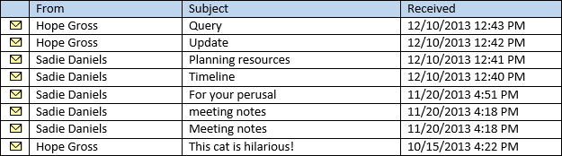
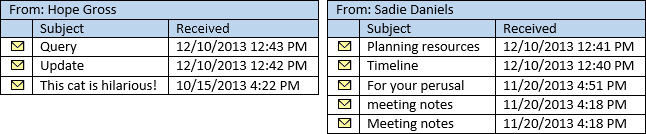
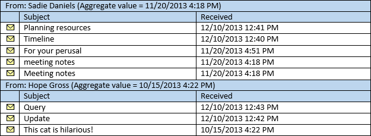

# <a name="perform-grouped-searches-by-using-ews-in-exchange"></a><span data-ttu-id="d518b-103">在 Exchange 使用 EWS 执行分组的搜索</span><span class="sxs-lookup"><span data-stu-id="d518b-103">Perform grouped searches by using EWS in Exchange</span></span>

<span data-ttu-id="d518b-104">了解如何在您的 EWS 托管 API 或 Exchange 的 EWS 应用程序执行分组的搜索。</span><span class="sxs-lookup"><span data-stu-id="d518b-104">Find out how to perform grouped searches in your EWS Managed API or EWS application that targets Exchange.</span></span>
  
<span data-ttu-id="d518b-105">它们使您能够控制搜索结果如何组织，组合的搜索非常有用。</span><span class="sxs-lookup"><span data-stu-id="d518b-105">Grouped searches are useful in that they gives you control over how search results are organized.</span></span> <span data-ttu-id="d518b-106">组织的搜索结果会使您的应用程序处理结果或易于管理的方式将其显示给最终用户可以更轻松。</span><span class="sxs-lookup"><span data-stu-id="d518b-106">Organized search results can make it easier for your application to process results or display them to an end user in a manageable way.</span></span>
  
<span data-ttu-id="d518b-107">通过将放在结果集中所有具有到某个组的特定字段相同的值的项目的分组方式。</span><span class="sxs-lookup"><span data-stu-id="d518b-107">Grouping works by putting all items within the result set that have the same value of a specific field into a group.</span></span> <span data-ttu-id="d518b-108">例如，您可以按发件人，您结果进行分组的同一个人的所有项目都将在单独的组中，并将根据您在视图中指定的顺序排序每个组内的项目。</span><span class="sxs-lookup"><span data-stu-id="d518b-108">For example, you can group your results by the sender, and all items from the same person will be in a separate group, and the items within each group will be sorted according to the order you specify on the view.</span></span> <span data-ttu-id="d518b-109">按聚合值基于您选择的字段排序自己的组。</span><span class="sxs-lookup"><span data-stu-id="d518b-109">The groups themselves are sorted by an aggregate value based on a field you choose.</span></span>
  
<span data-ttu-id="d518b-110">**表 1。EWS 托管 API 方法和组织的 EWS 操作的搜索结果**</span><span class="sxs-lookup"><span data-stu-id="d518b-110">**Table 1. EWS Managed API methods and EWS operations for organizing search results**</span></span>

|<span data-ttu-id="d518b-111">**如果您希望...**</span><span class="sxs-lookup"><span data-stu-id="d518b-111">**If you want to…**</span></span>|<span data-ttu-id="d518b-112">**EWS 托管 API，在使用...**</span><span class="sxs-lookup"><span data-stu-id="d518b-112">**In the EWS Managed API, use…**</span></span>|<span data-ttu-id="d518b-113">**EWS，在使用...**</span><span class="sxs-lookup"><span data-stu-id="d518b-113">**In EWS, use…**</span></span>|
|:-----|:-----|:-----|
|<span data-ttu-id="d518b-114">将使用您的结果中的特定属性中的相同值的项目组织到组</span><span class="sxs-lookup"><span data-stu-id="d518b-114">Organize items with the same value in a specific property in your results into groups</span></span>  <br/> |[<span data-ttu-id="d518b-115">Grouping.GroupOn</span><span class="sxs-lookup"><span data-stu-id="d518b-115">Grouping.GroupOn</span></span>](http://msdn.microsoft.com/zh-cn/library/microsoft.exchange.webservices.data.grouping.groupon%28v=exchg.80%29.aspx) <br/> |<span data-ttu-id="d518b-116">[FieldURI](http://msdn.microsoft.com/library/24af8e3b-3074-4c8c-8d0a-52446508d044%28Office.15%29.aspx)元素作为[GroupBy](http://msdn.microsoft.com/library/9728619b-4674-4b9d-9f6c-e75c6165966c%28Office.15%29.aspx)元素的子元素</span><span class="sxs-lookup"><span data-stu-id="d518b-116">[FieldURI](http://msdn.microsoft.com/library/24af8e3b-3074-4c8c-8d0a-52446508d044%28Office.15%29.aspx) element as a child of the [GroupBy](http://msdn.microsoft.com/library/9728619b-4674-4b9d-9f6c-e75c6165966c%28Office.15%29.aspx) element</span></span>  <br/> |
|<span data-ttu-id="d518b-117">对每个组中的项目中的特定属性的值进行排序</span><span class="sxs-lookup"><span data-stu-id="d518b-117">Sort items within each group by the value in a specific property</span></span>  <br/> |[<span data-ttu-id="d518b-118">ItemView.OrderBy</span><span class="sxs-lookup"><span data-stu-id="d518b-118">ItemView.OrderBy</span></span>](http://msdn.microsoft.com/zh-cn/library/microsoft.exchange.webservices.data.itemview.orderby%28v=exchg.80%29.aspx) <br/> |<span data-ttu-id="d518b-119">[SortOrder](http://msdn.microsoft.com/library/c2413f0b-8c03-46ae-9990-13338b3c53a6%28Office.15%29.aspx)元素</span><span class="sxs-lookup"><span data-stu-id="d518b-119">[SortOrder](http://msdn.microsoft.com/library/c2413f0b-8c03-46ae-9990-13338b3c53a6%28Office.15%29.aspx) element</span></span>  <br/> |
|<span data-ttu-id="d518b-120">排序组</span><span class="sxs-lookup"><span data-stu-id="d518b-120">Sort the groups</span></span>  <br/> |[<span data-ttu-id="d518b-121">Grouping.AggregateOn</span><span class="sxs-lookup"><span data-stu-id="d518b-121">Grouping.AggregateOn</span></span>](http://msdn.microsoft.com/zh-cn/library/microsoft.exchange.webservices.data.grouping.aggregateon%28v=exchg.80%29.aspx) <br/><br/> [<span data-ttu-id="d518b-122">Grouping.AggregateType</span><span class="sxs-lookup"><span data-stu-id="d518b-122">Grouping.AggregateType</span></span>](http://msdn.microsoft.com/zh-cn/library/microsoft.exchange.webservices.data.grouping.aggregatetype%28v=exchg.80%29.aspx) <br/><br/> [<span data-ttu-id="d518b-123">Grouping.SortDirection</span><span class="sxs-lookup"><span data-stu-id="d518b-123">Grouping.SortDirection</span></span>](http://msdn.microsoft.com/zh-cn/library/microsoft.exchange.webservices.data.grouping.sortdirection%28v=exchg.80%29.aspx) <br/> |<span data-ttu-id="d518b-124">**FieldURI**元素作为[AggregateOn](http://msdn.microsoft.com/library/9b0a03f2-3282-46e1-b1a0-cbb9a0fbe9bb%28Office.15%29.aspx)元素的子元素</span><span class="sxs-lookup"><span data-stu-id="d518b-124">**FieldURI** element as a child of the [AggregateOn](http://msdn.microsoft.com/library/9b0a03f2-3282-46e1-b1a0-cbb9a0fbe9bb%28Office.15%29.aspx) element</span></span><br/><br/> <span data-ttu-id="d518b-125">**聚合** **AggregateOn**元素的属性</span><span class="sxs-lookup"><span data-stu-id="d518b-125">**Aggregate** attribute on the **AggregateOn** element</span></span><br/><br/><span data-ttu-id="d518b-126">**GroupBy**元素的**顺序**属性</span><span class="sxs-lookup"><span data-stu-id="d518b-126">**Order** attribute on the **GroupBy** element</span></span>  <br/> |
   
<span data-ttu-id="d518b-127">我们来看它循序渐进。</span><span class="sxs-lookup"><span data-stu-id="d518b-127">Let's take it step by step.</span></span>
  
## <a name="group-results-by-a-specific-property"></a><span data-ttu-id="d518b-128">结果分组依据特定的属性</span><span class="sxs-lookup"><span data-stu-id="d518b-128">Group results by a specific property</span></span>
<span data-ttu-id="d518b-129"><a name="bk_GroupResults"> </a></span><span class="sxs-lookup"><span data-stu-id="d518b-129"></span></span>

<span data-ttu-id="d518b-130">使用分组的第一步是选择一个属性，或属性中的 Exchange 存储，分组依据的项目。</span><span class="sxs-lookup"><span data-stu-id="d518b-130">The first step to using grouping is to select a property, or attribute on the items in the Exchange store, to group by.</span></span> <span data-ttu-id="d518b-131">EWS 托管 API 公开这些作为类属性对应的类，而 EWS 将它们公开作为 XML 元素。</span><span class="sxs-lookup"><span data-stu-id="d518b-131">The EWS Managed API exposes these as class properties on the corresponding classes, while EWS exposes them as XML elements.</span></span> <span data-ttu-id="d518b-132">您可以选择任何属性，包括自定义或扩展属性，但有助于您了解如何项目进行分组根据您选择的属性的值。</span><span class="sxs-lookup"><span data-stu-id="d518b-132">You can choose any property, including custom or extended properties, but it is helpful to understand how items are grouped based on the value of the property you choose.</span></span> 

<span data-ttu-id="d518b-133">选择要作为分组依据的属性中具有相同的值的所有项目将都组合在一起。</span><span class="sxs-lookup"><span data-stu-id="d518b-133">All items that have the same value in the property you choose to group by will be grouped together.</span></span> <span data-ttu-id="d518b-134">这看起来可能明显，但很重要的详细信息。</span><span class="sxs-lookup"><span data-stu-id="d518b-134">This might seem obvious, but it is an important detail.</span></span> <span data-ttu-id="d518b-135">时会发生什么情况，请考虑您如果按日期/时间属性，如[Item.DateTimeReceived](http://msdn.microsoft.com/zh-cn/library/microsoft.exchange.webservices.data.item.datetimereceived%28v=exchg.80%29.aspx) EWS 托管 API 中或 EWS 中的[DateTimeReceived](http://msdn.microsoft.com/library/8f489bd4-2434-4d0a-91fe-1b5ba7eb5765%28Office.15%29.aspx)元素分组。</span><span class="sxs-lookup"><span data-stu-id="d518b-135">Consider what happens if you group by a date/time property, such as [Item.DateTimeReceived](http://msdn.microsoft.com/zh-cn/library/microsoft.exchange.webservices.data.item.datetimereceived%28v=exchg.80%29.aspx) in the EWS Managed API, or the [DateTimeReceived](http://msdn.microsoft.com/library/8f489bd4-2434-4d0a-91fe-1b5ba7eb5765%28Office.15%29.aspx) element in EWS.</span></span> <span data-ttu-id="d518b-136">意图可能要将结果组织到组中，每个组包含从同一天的项目。</span><span class="sxs-lookup"><span data-stu-id="d518b-136">The intent might be to organize the results into groups, with each group containing items from the same day.</span></span> <span data-ttu-id="d518b-137">但是，分组查看整个值，其中包括时间。</span><span class="sxs-lookup"><span data-stu-id="d518b-137">However, grouping looks at the entire value, which includes the time.</span></span> 

<span data-ttu-id="d518b-138">最终结果是将项目进行分组，以便在同一时间，向第二个，收到的项都处于自己的组。</span><span class="sxs-lookup"><span data-stu-id="d518b-138">The end result is that the items will be grouped so that items received at the same time, down to the second, are in their own groups.</span></span> <span data-ttu-id="d518b-139">很可能将到大量的组中的小型每个组中的项目数对结果进行排序。</span><span class="sxs-lookup"><span data-stu-id="d518b-139">The results will most likely be sorted into a large number of groups with a small number of items in each group.</span></span> 
  
<span data-ttu-id="d518b-140">若要获得的结果设置为较少的组和更多的每个组中的项目，选择是可能的值，如[EmailMessage.From](http://msdn.microsoft.com/zh-cn/library/microsoft.exchange.webservices.data.emailmessage.from%28v=exchg.80%29.aspx)或[Item.Categories](http://msdn.microsoft.com/zh-cn/library/microsoft.exchange.webservices.data.item.categories%28v=exchg.80%29.aspx) EWS 托管 API，或[从](http://msdn.microsoft.com/library/5a52d644-3677-4049-874c-12bd5c3080dc%28Office.15%29.aspx)中较小个数的属性或 EWS 中的[类别](http://msdn.microsoft.com/library/d84d4927-b524-4e62-bf3d-1f12fec8c21a%28Office.15%29.aspx)。</span><span class="sxs-lookup"><span data-stu-id="d518b-140">To get a results set with a smaller number of groups and a larger number of items in each group, choose a property that is likely to have a smaller number of values, such as [EmailMessage.From](http://msdn.microsoft.com/zh-cn/library/microsoft.exchange.webservices.data.emailmessage.from%28v=exchg.80%29.aspx) or [Item.Categories](http://msdn.microsoft.com/zh-cn/library/microsoft.exchange.webservices.data.item.categories%28v=exchg.80%29.aspx) in the EWS Managed API, or [From](http://msdn.microsoft.com/library/5a52d644-3677-4049-874c-12bd5c3080dc%28Office.15%29.aspx) or [Categories](http://msdn.microsoft.com/library/d84d4927-b524-4e62-bf3d-1f12fec8c21a%28Office.15%29.aspx) in EWS.</span></span> <span data-ttu-id="d518b-141">下图显示收件箱中显示的电子邮件的列表。</span><span class="sxs-lookup"><span data-stu-id="d518b-141">The following figure shows a list of emails that appear in an Inbox.</span></span> 
  
<span data-ttu-id="d518b-142">**图 1。收件箱中的邮件**</span><span class="sxs-lookup"><span data-stu-id="d518b-142">**Figure 1. Messages in an Inbox**</span></span>


  
<span data-ttu-id="d518b-144">如果由**EmailMessage.From**属性图 1 中的项目进行分组，结果将两个组，一个由跃点总数计价发送的邮件，一个由 Sadie Daniels 发送的邮件。</span><span class="sxs-lookup"><span data-stu-id="d518b-144">If you group the items in Figure 1 by the **EmailMessage.From** property, the result will be two groups, one for messages sent by Hope Gross, and one for messages sent by Sadie Daniels.</span></span> 
  
<span data-ttu-id="d518b-145">**图 2。邮件分为组基于 From 属性**</span><span class="sxs-lookup"><span data-stu-id="d518b-145">**Figure 2. Messages separated into groups based on the From property**</span></span>


  
## <a name="sort-the-items-within-groups"></a><span data-ttu-id="d518b-147">组中的项进行排序</span><span class="sxs-lookup"><span data-stu-id="d518b-147">Sort the items within groups</span></span>
<span data-ttu-id="d518b-148"><a name="bk_SortItems"> </a></span><span class="sxs-lookup"><span data-stu-id="d518b-148"></span></span>

<span data-ttu-id="d518b-149">您可以控制项使用 EWS 托管 API 中的[ItemView.OrderBy](http://msdn.microsoft.com/zh-cn/library/microsoft.exchange.webservices.data.itemview.orderby%28v=exchg.80%29.aspx)属性或 EWS 中的[SortOrder](http://msdn.microsoft.com/library/c2413f0b-8c03-46ae-9990-13338b3c53a6%28Office.15%29.aspx)元素的排序每个组中。</span><span class="sxs-lookup"><span data-stu-id="d518b-149">You can control how items are sorted within each group by using the [ItemView.OrderBy](http://msdn.microsoft.com/zh-cn/library/microsoft.exchange.webservices.data.itemview.orderby%28v=exchg.80%29.aspx) property in the EWS Managed API, or the [SortOrder](http://msdn.microsoft.com/library/c2413f0b-8c03-46ae-9990-13338b3c53a6%28Office.15%29.aspx) element in EWS.</span></span> <span data-ttu-id="d518b-150">相同的顺序应用于每个组。</span><span class="sxs-lookup"><span data-stu-id="d518b-150">The same ordering applies to each group.</span></span> <span data-ttu-id="d518b-151">例如，如果排序**Item.DateTimeReceived**属性，按降序顺序在图 1 中的项目项最近收到来自跃点总数计价将跃点总数计价组中，第一个和最近收到来自 Sadie Daniels 项将Sadie Daniels 组中的第一个。</span><span class="sxs-lookup"><span data-stu-id="d518b-151">For example, if you sort the items from Figure 1 by the **Item.DateTimeReceived** property, in descending order, the item most recently received from Hope Gross will be first in the Hope Gross group, and the item most recently received from Sadie Daniels will be first in the Sadie Daniels group.</span></span> <span data-ttu-id="d518b-152">为方便起见，图 2 中的组的已排序这种方式。</span><span class="sxs-lookup"><span data-stu-id="d518b-152">Conveniently, the groups in Figure 2 are already sorted this way.</span></span> 
  
## <a name="sort-the-groups"></a><span data-ttu-id="d518b-153">排序组</span><span class="sxs-lookup"><span data-stu-id="d518b-153">Sort the groups</span></span>
<span data-ttu-id="d518b-154"><a name="bk_SortGroups"> </a></span><span class="sxs-lookup"><span data-stu-id="d518b-154"></span></span>

<span data-ttu-id="d518b-155">既然您已经您就可以处理的组，最后一步排序自己的组。</span><span class="sxs-lookup"><span data-stu-id="d518b-155">Now that you have your groups settled, the final step is sorting the groups themselves.</span></span> <span data-ttu-id="d518b-156">组自己未不包含任何特定值，因为分组过程必须为每个组分配排序值。</span><span class="sxs-lookup"><span data-stu-id="d518b-156">Because the groups themselves have no specific values, the grouping process has to assign a sort value to each group.</span></span> <span data-ttu-id="d518b-157">这是通过 EWS 托管 API 或[FieldURI](http://msdn.microsoft.com/library/24af8e3b-3074-4c8c-8d0a-52446508d044%28Office.15%29.aspx)元素中的[Grouping.AggregateOn](http://msdn.microsoft.com/zh-cn/library/microsoft.exchange.webservices.data.grouping.aggregateon%28v=exchg.80%29.aspx)属性指定为 ews [AggregateOn](http://msdn.microsoft.com/library/9b0a03f2-3282-46e1-b1a0-cbb9a0fbe9bb%28Office.15%29.aspx)元素的子元素的每个组中的特定属性的值的聚合。</span><span class="sxs-lookup"><span data-stu-id="d518b-157">This is done by aggregation of the values of a specific property within each group, specified by the [Grouping.AggregateOn](http://msdn.microsoft.com/zh-cn/library/microsoft.exchange.webservices.data.grouping.aggregateon%28v=exchg.80%29.aspx) property in the EWS Managed API, or the [FieldURI](http://msdn.microsoft.com/library/24af8e3b-3074-4c8c-8d0a-52446508d044%28Office.15%29.aspx) element as a child of the [AggregateOn](http://msdn.microsoft.com/library/9b0a03f2-3282-46e1-b1a0-cbb9a0fbe9bb%28Office.15%29.aspx) element in EWS.</span></span> <span data-ttu-id="d518b-158">EWS 托管 API （或 EWS 中的**AggregateOn**元素上的**聚合**属性） 中的[Grouping.AggregateType](http://msdn.microsoft.com/zh-cn/library/microsoft.exchange.webservices.data.grouping.aggregatetype%28v=exchg.80%29.aspx)属性指定每个组内的项目中的值分配给组的排序值 — 任一最大值或最小值。</span><span class="sxs-lookup"><span data-stu-id="d518b-158">The [Grouping.AggregateType](http://msdn.microsoft.com/zh-cn/library/microsoft.exchange.webservices.data.grouping.aggregatetype%28v=exchg.80%29.aspx) property in the EWS Managed API (or the **Aggregate** attribute on the **AggregateOn** element in EWS) specifies which value from the items within each group is assigned to the sort value for the group — either the largest value or the smallest value.</span></span> <span data-ttu-id="d518b-159">最后，通过 EWS 托管 API 或**Order**属性[GroupBy](http://msdn.microsoft.com/library/9728619b-4674-4b9d-9f6c-e75c6165966c%28Office.15%29.aspx)元素中的 ews 中[Grouping.SortDirection](http://msdn.microsoft.com/zh-cn/library/microsoft.exchange.webservices.data.grouping.sortdirection%28v=exchg.80%29.aspx)属性指定排序顺序 （降序或升序）。</span><span class="sxs-lookup"><span data-stu-id="d518b-159">Finally, the sort order (descending or ascending) is specified by the [Grouping.SortDirection](http://msdn.microsoft.com/zh-cn/library/microsoft.exchange.webservices.data.grouping.sortdirection%28v=exchg.80%29.aspx) property in the EWS Managed API, or the **Order** attribute on the [GroupBy](http://msdn.microsoft.com/library/9728619b-4674-4b9d-9f6c-e75c6165966c%28Office.15%29.aspx) element in EWS.</span></span> 
  
<span data-ttu-id="d518b-160">例如，如果从图 2 组按聚合**Item.DateTimeReceived**属性上，使用最小值，并以降序排序中返回的项目在图 3 中显示的顺序。</span><span class="sxs-lookup"><span data-stu-id="d518b-160">For example, if the groups from Figure 2 are sorted by aggregating on the **Item.DateTimeReceived** property, using the smallest value, and sorting in descending order, the items are returned in the order in shown Figure 3.</span></span> 
  
<span data-ttu-id="d518b-161">**图 3。与组的 DateTimeReceived 属性排序的分组的搜索结果**</span><span class="sxs-lookup"><span data-stu-id="d518b-161">**Figure 3. Grouped search results with the groups sorted by the DateTimeReceived property**</span></span>


  
<span data-ttu-id="d518b-163">以下各节显示如何拉分组和排序一起在代码中。</span><span class="sxs-lookup"><span data-stu-id="d518b-163">The next sections show you how you might pull grouping and sorting together in code.</span></span>
  
## <a name="example-perform-a-grouped-search-by-using-the-ews-managed-api"></a><span data-ttu-id="d518b-164">示例： 使用 EWS 托管 API 执行分组的搜索</span><span class="sxs-lookup"><span data-stu-id="d518b-164">Example: Perform a grouped search by using the EWS Managed API</span></span>
<span data-ttu-id="d518b-165"><a name="bk_GroupSearchEWSMA"> </a></span><span class="sxs-lookup"><span data-stu-id="d518b-165"></span></span>

<span data-ttu-id="d518b-166">以下 EWS 托管 API 方法可以使用分组：</span><span class="sxs-lookup"><span data-stu-id="d518b-166">The following EWS Managed API methods can use grouping:</span></span>
  
- [<span data-ttu-id="d518b-167">ExchangeService.FindItems</span><span class="sxs-lookup"><span data-stu-id="d518b-167">ExchangeService.FindItems</span></span>](http://msdn.microsoft.com/zh-cn/library/microsoft.exchange.webservices.data.exchangeservice.finditems%28v=exchg.80%29.aspx)
    
- [<span data-ttu-id="d518b-168">Folder.FindItems</span><span class="sxs-lookup"><span data-stu-id="d518b-168">Folder.FindItems</span></span>](http://msdn.microsoft.com/zh-cn/library/microsoft.exchange.webservices.data.folder.finditems%28v=exchg.80%29.aspx)
    
<span data-ttu-id="d518b-169">下面的示例使用**ExchangeService.FindItems**方法;但是，相同的规则和概念适用于**Folder.FindItems**方法。</span><span class="sxs-lookup"><span data-stu-id="d518b-169">The following example uses the **ExchangeService.FindItems** method; however, the same rules and concepts apply to the **Folder.FindItems** method.</span></span> <span data-ttu-id="d518b-170">本示例中，定义调用**GroupItemsByFrom**的方法。</span><span class="sxs-lookup"><span data-stu-id="d518b-170">In this example, a method called **GroupItemsByFrom** is defined.</span></span> <span data-ttu-id="d518b-171">它将[ExchangeService](http://msdn.microsoft.com/zh-cn/library/microsoft.exchange.webservices.data.exchangeservice%28v=exchg.80%29.aspx)对象和[WellKnownFolderName](http://msdn.microsoft.com/zh-cn/library/microsoft.exchange.webservices.data.wellknownfoldername%28v=exchg.80%29.aspx)对象作为参数。</span><span class="sxs-lookup"><span data-stu-id="d518b-171">It takes an [ExchangeService](http://msdn.microsoft.com/zh-cn/library/microsoft.exchange.webservices.data.exchangeservice%28v=exchg.80%29.aspx) object and a [WellKnownFolderName](http://msdn.microsoft.com/zh-cn/library/microsoft.exchange.webservices.data.wellknownfoldername%28v=exchg.80%29.aspx) object as parameters.</span></span> <span data-ttu-id="d518b-172">它请求的文件夹中，按降序排序的**Item.DateTimeReceived**属性排序的**EmailMessage.From**属性分组的前 50 个项目。</span><span class="sxs-lookup"><span data-stu-id="d518b-172">It requests the first 50 items in the folder, grouped by the **EmailMessage.From** property, sorted by the **Item.DateTimeReceived** property in descending order.</span></span> <span data-ttu-id="d518b-173">按其项目，按降序顺序的最小**Item.DateTimeReceived**属性值排序自己的组。</span><span class="sxs-lookup"><span data-stu-id="d518b-173">The groups themselves are sorted by the smallest **Item.DateTimeReceived** property value on their items, in descending order.</span></span> 
  
<span data-ttu-id="d518b-174">本示例假定已初始化**ExchangeService**对象，在[凭据](http://msdn.microsoft.com/zh-cn/library/microsoft.exchange.webservices.data.exchangeservicebase.credentials%28v=exchg.80%29.aspx)和[Url](http://msdn.microsoft.com/zh-cn/library/microsoft.exchange.webservices.data.exchangeservice.url%28v=exchg.80%29.aspx)属性的有效值。</span><span class="sxs-lookup"><span data-stu-id="d518b-174">This example assumes that the **ExchangeService** object has been initialized with valid values in the [Credentials](http://msdn.microsoft.com/zh-cn/library/microsoft.exchange.webservices.data.exchangeservicebase.credentials%28v=exchg.80%29.aspx) and [Url](http://msdn.microsoft.com/zh-cn/library/microsoft.exchange.webservices.data.exchangeservice.url%28v=exchg.80%29.aspx) properties.</span></span> 
  
```cs
static void GroupItemsByFrom(ExchangeService service, WellKnownFolderName folder)
{
    // Limit the result set to 50 items.
    ItemView view = new ItemView(50);
    view.PropertySet = new PropertySet(ItemSchema.Subject,
                                       ItemSchema.DateTimeReceived,
                                       EmailMessageSchema.From,
                                       ItemSchema.Categories);
    // Item searches do not support Deep traversal.
    view.Traversal = ItemTraversal.Shallow;
    // Specify the sorting done within the groups.
    view.OrderBy.Add(ItemSchema.DateTimeReceived, SortDirection.Descending);
    // Configure grouping.
    Grouping groupByFrom = new Grouping();
    groupByFrom.GroupOn = EmailMessageSchema.From;
    groupByFrom.AggregateOn = ItemSchema.DateTimeReceived;
    groupByFrom.AggregateType = AggregateType.Minimum;
    groupByFrom.SortDirection = SortDirection.Descending;
    try
    {
        GroupedFindItemsResults<Item> results = service.FindItems(folder,
            view, groupByFrom);
        foreach (ItemGroup<Item> group in results.ItemGroups)
        {
            Console.WriteLine("Group: {0}", group.GroupIndex);
            foreach (Item item in group.Items)
            {
                if (item is EmailMessage)
                {
                    EmailMessage message = item as EmailMessage;
                    Console.WriteLine("From: {0}", message.From);
                    Console.WriteLine("Subject: {0}", message.Subject);
                    Console.WriteLine("Id: {0}\n", message.Id.ToString());
                }
            }
        }
    }
    catch (Exception ex)
    {
        Console.WriteLine("Exception while enumerating results: {0}", ex.Message);
    }
}
```

## <a name="example-perform-a-grouped-search-by-using-ews"></a><span data-ttu-id="d518b-175">示例： 使用 EWS 执行分组的搜索</span><span class="sxs-lookup"><span data-stu-id="d518b-175">Example: Perform a grouped search by using EWS</span></span>
<span data-ttu-id="d518b-176"><a name="bk_GroupSearchEWS"> </a></span><span class="sxs-lookup"><span data-stu-id="d518b-176"></span></span>

<span data-ttu-id="d518b-177">下面的请求示例演示在文件夹中，**从**元素，按降序排序的**DateTimeReceived**元素分组的前 50 个项目的[FindItem 操作](http://msdn.microsoft.com/library/ebad6aae-16e7-44de-ae63-a95b24539729%28Office.15%29.aspx)请求。</span><span class="sxs-lookup"><span data-stu-id="d518b-177">The following request example shows a [FindItem operation](http://msdn.microsoft.com/library/ebad6aae-16e7-44de-ae63-a95b24539729%28Office.15%29.aspx) request for the first 50 items in the folder, grouped by the **From** element, sorted by the **DateTimeReceived** element in descending order.</span></span> <span data-ttu-id="d518b-178">按其项目，按降序顺序的最小**DateTimeReceived**元素值排序自己的组。</span><span class="sxs-lookup"><span data-stu-id="d518b-178">The groups themselves are sorted by the smallest **DateTimeReceived** element value on their items, in descending order.</span></span> 
  
```XML
<?xml version="1.0" encoding="utf-8"?>
<soap:Envelope xmlns:xsi="http://www.w3.org/2001/XMLSchema-instance" 
    xmlns:m="http://schemas.microsoft.com/exchange/services/2006/messages" 
    xmlns:t="http://schemas.microsoft.com/exchange/services/2006/types" 
    xmlns:soap="http://schemas.xmlsoap.org/soap/envelope/">
  <soap:Header>
    <t:RequestServerVersion Version="Exchange2007_SP1" />
    <t:TimeZoneContext>
      <t:TimeZoneDefinition Id="Eastern Standard Time" />
    </t:TimeZoneContext>
  </soap:Header>
  <soap:Body>
    <m:FindItem Traversal="Shallow">
      <m:ItemShape>
        <t:BaseShape>IdOnly</t:BaseShape>
        <t:AdditionalProperties>
          <t:FieldURI FieldURI="item:Subject" />
          <t:FieldURI FieldURI="item:DateTimeReceived" />
          <t:FieldURI FieldURI="message:From" />
          <t:FieldURI FieldURI="item:Categories" />
        </t:AdditionalProperties>
      </m:ItemShape>
      <m:IndexedPageItemView MaxEntriesReturned="50" Offset="0" BasePoint="Beginning" />
      <m:GroupBy Order="Descending">
        <t:FieldURI FieldURI="message:From" />
        <t:AggregateOn Aggregate="Minimum">
          <t:FieldURI FieldURI="item:DateTimeReceived" />
        </t:AggregateOn>
      </m:GroupBy>
      <m:SortOrder>
        <t:FieldOrder Order="Descending">
          <t:FieldURI FieldURI="item:DateTimeReceived" />
        </t:FieldOrder>
      </m:SortOrder>
      <m:ParentFolderIds>
        <t:DistinguishedFolderId Id="inbox" />
      </m:ParentFolderIds>
    </m:FindItem>
  </soap:Body>
</soap:Envelope>
```

<span data-ttu-id="d518b-179">服务器将返回以下响应。</span><span class="sxs-lookup"><span data-stu-id="d518b-179">The server returns the following response.</span></span>
  
```XML
<?xml version="1.0" encoding="utf-8"?>
<s:Envelope xmlns:s="http://schemas.xmlsoap.org/soap/envelope/">
  <s:Header>
    <h:ServerVersionInfo MajorVersion="15" MinorVersion="0" MajorBuildNumber="712" MinorBuildNumber="22" Version="V2_3" 
        xmlns:h="http://schemas.microsoft.com/exchange/services/2006/types" 
        xmlns="http://schemas.microsoft.com/exchange/services/2006/types" 
        xmlns:xsd="http://www.w3.org/2001/XMLSchema" 
        xmlns:xsi="http://www.w3.org/2001/XMLSchema-instance" />
  </s:Header>
  <s:Body xmlns:xsi="http://www.w3.org/2001/XMLSchema-instance" xmlns:xsd="http://www.w3.org/2001/XMLSchema">
    <m:FindItemResponse xmlns:m="http://schemas.microsoft.com/exchange/services/2006/messages" 
      xmlns:t="http://schemas.microsoft.com/exchange/services/2006/types">
      <m:ResponseMessages>
        <m:FindItemResponseMessage ResponseClass="Success">
          <m:ResponseCode>NoError</m:ResponseCode>
          <m:RootFolder IndexedPagingOffset="10" TotalItemsInView="8" IncludesLastItemInRange="true">
            <t:Groups>
              <t:GroupedItems>
                <t:GroupIndex>0</t:GroupIndex>
                <t:Items>
                  <t:Message>
                    <t:ItemId Id="AAMkAGM2..." ChangeKey="CQAAABYA..." />
                    <t:Subject>Planning resources</t:Subject>
                    <t:DateTimeReceived>2013-12-10T17:41:05Z</t:DateTimeReceived>
                    <t:From>
                      <t:Mailbox>
                        <t:Name>Sadie Daniels</t:Name>
                        <t:EmailAddress>/O=FIRST ORGANIZATION/OU=EXCHANGE ADMINISTRATIVE GROUP (FYDIBOHF23SPDLT)/CN=RECIPIENTS/CN=8D84A3F4CBB34D48838A3AECF99795C0-SADIE</t:EmailAddress>
                        <t:RoutingType>EX</t:RoutingType>
                      </t:Mailbox>
                    </t:From>
                  </t:Message>
                  <t:Message>
                    <t:ItemId Id="AAMkAGM2..." ChangeKey="CQAAABYA..." />
                    <t:Subject>Timeline</t:Subject>
                    <t:DateTimeReceived>2013-12-10T17:40:37Z</t:DateTimeReceived>
                    <t:Categories>
                      <t:String>Project</t:String>
                    </t:Categories>
                    <t:From>
                      <t:Mailbox>
                        <t:Name>Sadie Daniels</t:Name>
                        <t:EmailAddress>/O=FIRST ORGANIZATION/OU=EXCHANGE ADMINISTRATIVE GROUP (FYDIBOHF23SPDLT)/CN=RECIPIENTS/CN=8D84A3F4CBB34D48838A3AECF99795C0-SADIE</t:EmailAddress>
                        <t:RoutingType>EX</t:RoutingType>
                      </t:Mailbox>
                    </t:From>
                  </t:Message>
                  <t:Message>
                    <t:ItemId Id="AAMkAGM2..." ChangeKey="CQAAABYA..." />
                    <t:Subject>For your perusal</t:Subject>
                    <t:DateTimeReceived>2013-11-20T21:51:16Z</t:DateTimeReceived>
                    <t:From>
                      <t:Mailbox>
                        <t:Name>Sadie Daniels</t:Name>
                        <t:EmailAddress>/O=FIRST ORGANIZATION/OU=EXCHANGE ADMINISTRATIVE GROUP (FYDIBOHF23SPDLT)/CN=RECIPIENTS/CN=8D84A3F4CBB34D48838A3AECF99795C0-SADIE</t:EmailAddress>
                        <t:RoutingType>EX</t:RoutingType>
                      </t:Mailbox>
                    </t:From>
                  </t:Message>
                  <t:Message>
                    <t:ItemId Id="AAMkAGM2..." ChangeKey="CQAAABYA..." />
                    <t:Subject>meeting notes</t:Subject>
                    <t:DateTimeReceived>2013-11-20T21:18:51Z</t:DateTimeReceived>
                    <t:Categories>
                      <t:String>Blue category</t:String>
                    </t:Categories>
                    <t:From>
                      <t:Mailbox>
                        <t:Name>Sadie Daniels</t:Name>
                        <t:EmailAddress>/O=FIRST ORGANIZATION/OU=EXCHANGE ADMINISTRATIVE GROUP (FYDIBOHF23SPDLT)/CN=RECIPIENTS/CN=8D84A3F4CBB34D48838A3AECF99795C0-SADIE</t:EmailAddress>
                        <t:RoutingType>EX</t:RoutingType>
                      </t:Mailbox>
                    </t:From>
                  </t:Message>
                  <t:Message>
                    <t:ItemId Id="AAMkAGM2..." ChangeKey="CQAAABYA..." />
                    <t:Subject>Meeting notes</t:Subject>
                    <t:DateTimeReceived>2013-11-20T21:18:51Z</t:DateTimeReceived>
                    <t:From>
                      <t:Mailbox>
                        <t:Name>Sadie Daniels</t:Name>
                        <t:EmailAddress>/O=FIRST ORGANIZATION/OU=EXCHANGE ADMINISTRATIVE GROUP (FYDIBOHF23SPDLT)/CN=RECIPIENTS/CN=8D84A3F4CBB34D48838A3AECF99795C0-SADIE</t:EmailAddress>
                        <t:RoutingType>EX</t:RoutingType>
                      </t:Mailbox>
                    </t:From>
                  </t:Message>
                </t:Items>
              </t:GroupedItems>
              <t:GroupedItems>
                <t:GroupIndex>1</t:GroupIndex>
                <t:Items>
                  <t:Message>
                    <t:ItemId Id="AAMkAGM2..." ChangeKey="CQAAABYA..." />
                    <t:Subject>Query</t:Subject>
                    <t:DateTimeReceived>2013-12-10T17:43:15Z</t:DateTimeReceived>
                    <t:From>
                      <t:Mailbox>
                        <t:Name>Hope Gross</t:Name>
                        <t:EmailAddress>/O=FIRST ORGANIZATION/OU=EXCHANGE ADMINISTRATIVE GROUP (FYDIBOHF23SPDLT)/CN=RECIPIENTS/CN=9B55E4100C064D9D8C5F72FF36802ED3-HOPE</t:EmailAddress>
                        <t:RoutingType>EX</t:RoutingType>
                      </t:Mailbox>
                    </t:From>
                  </t:Message>
                  <t:Message>
                    <t:ItemId Id="AAMkAGM2..." ChangeKey="CQAAABYA..." />
                    <t:Subject>Update</t:Subject>
                    <t:DateTimeReceived>2013-12-10T17:42:33Z</t:DateTimeReceived>
                    <t:Categories>
                      <t:String>Project</t:String>
                      <t:String>Blue category</t:String>
                    </t:Categories>
                    <t:From>
                      <t:Mailbox>
                        <t:Name>Hope Gross</t:Name>
                        <t:EmailAddress>/O=FIRST ORGANIZATION/OU=EXCHANGE ADMINISTRATIVE GROUP (FYDIBOHF23SPDLT)/CN=RECIPIENTS/CN=9B55E4100C064D9D8C5F72FF36802ED3-HOPE</t:EmailAddress>
                        <t:RoutingType>EX</t:RoutingType>
                      </t:Mailbox>
                    </t:From>
                  </t:Message>
                  <t:Message>
                    <t:ItemId Id="AAMkAGM2..." ChangeKey="CQAAABYA..." />
                    <t:Subject>This cat is hilarious!</t:Subject>
                    <t:DateTimeReceived>2013-10-15T20:22:12Z</t:DateTimeReceived>
                    <t:From>
                      <t:Mailbox>
                        <t:Name>Hope Gross</t:Name>
                        <t:EmailAddress>/O=FIRST ORGANIZATION/OU=EXCHANGE ADMINISTRATIVE GROUP (FYDIBOHF23SPDLT)/CN=RECIPIENTS/CN=9B55E4100C064D9D8C5F72FF36802ED3-HOPE</t:EmailAddress>
                        <t:RoutingType>EX</t:RoutingType>
                      </t:Mailbox>
                    </t:From>
                  </t:Message>
                </t:Items>
              </t:GroupedItems>
            </t:Groups>
          </m:RootFolder>
        </m:FindItemResponseMessage>
      </m:ResponseMessages>
    </m:FindItemResponse>
  </s:Body>
</s:Envelope>
```

## <a name="version-differences"></a><span data-ttu-id="d518b-180">版本差异</span><span class="sxs-lookup"><span data-stu-id="d518b-180">Version differences</span></span>
<span data-ttu-id="d518b-181"><a name="bk_VersionDiffs"> </a></span><span class="sxs-lookup"><span data-stu-id="d518b-181"></span></span>

<span data-ttu-id="d518b-182">与主要版本 15 中开始和结束的生成 15.0.775.38 返回**组**元素 （的类型**GroupedItemsType**） 代替[GroupedItems](http://msdn.microsoft.com/library/53170df4-4272-4b37-b23f-cd8e2d4a7396%28Office.15%29.aspx)元素的 SOAP 响应的 Exchange 版本。</span><span class="sxs-lookup"><span data-stu-id="d518b-182">Versions of Exchange starting with major version 15 and ending with build 15.0.775.38 return **Group** elements (of type **GroupedItemsType**) in place of [GroupedItems](http://msdn.microsoft.com/library/53170df4-4272-4b37-b23f-cd8e2d4a7396%28Office.15%29.aspx) elements in the SOAP response.</span></span> <span data-ttu-id="d518b-183">如果您使用 EWS 托管 API，这将导致[GroupedFindItemsResults.ItemGroups](http://msdn.microsoft.com/zh-cn/library/office/dd633961%28v=exchg.80%29.aspx)集合包含 0 对象。</span><span class="sxs-lookup"><span data-stu-id="d518b-183">If you are using the EWS Managed API, this will cause the [GroupedFindItemsResults.ItemGroups](http://msdn.microsoft.com/zh-cn/library/office/dd633961%28v=exchg.80%29.aspx) collection to contain 0 objects.</span></span> <span data-ttu-id="d518b-184">如果您使用 EWS，应为**GroupedItems**元素处理**组**元素。</span><span class="sxs-lookup"><span data-stu-id="d518b-184">If you are using EWS, **Group** elements should be handled as **GroupedItems** elements.</span></span> 
  
<span data-ttu-id="d518b-185">主要版本 15 开头的 Exchange 版本与**xsi: nil**属性设置为**true**的 SOAP 响应中返回额外的**组**或**GroupedItems**元素。</span><span class="sxs-lookup"><span data-stu-id="d518b-185">Versions of Exchange starting with major version 15 return extra **Group** or **GroupedItems** elements with the **xsi:nil** attribute set to **true** in the SOAP response.</span></span> <span data-ttu-id="d518b-186">如果您使用 EWS 托管 API，这些额外的元素将导致[ServiceXmlDeserializationException](http://msdn.microsoft.com/zh-cn/library/microsoft.exchange.webservices.data.servicexmldeserializationexception%28v=exchg.80%29.aspx)引发。</span><span class="sxs-lookup"><span data-stu-id="d518b-186">If you are using the EWS Managed API, these extra elements will cause a [ServiceXmlDeserializationException](http://msdn.microsoft.com/zh-cn/library/microsoft.exchange.webservices.data.servicexmldeserializationexception%28v=exchg.80%29.aspx) to be thrown.</span></span> <span data-ttu-id="d518b-187">如果您使用 EWS，应忽略这些额外的元素。</span><span class="sxs-lookup"><span data-stu-id="d518b-187">If you are using EWS, these extra elements should be ignored.</span></span> 
  
## <a name="see-also"></a><span data-ttu-id="d518b-188">另请参阅</span><span class="sxs-lookup"><span data-stu-id="d518b-188">See also</span></span>

- [<span data-ttu-id="d518b-189">搜索和交换中的 EWS</span><span class="sxs-lookup"><span data-stu-id="d518b-189">Search and EWS in Exchange</span></span>](search-and-ews-in-exchange.md)    
- [<span data-ttu-id="d518b-190">ExchangeService.FindItems</span><span class="sxs-lookup"><span data-stu-id="d518b-190">ExchangeService.FindItems</span></span>](http://msdn.microsoft.com/zh-cn/library/microsoft.exchange.webservices.data.exchangeservice.finditems%28v=exchg.80%29.aspx)    
- [<span data-ttu-id="d518b-191">Folder.FindItems</span><span class="sxs-lookup"><span data-stu-id="d518b-191">Folder.FindItems</span></span>](http://msdn.microsoft.com/zh-cn/library/microsoft.exchange.webservices.data.folder.finditems%28v=exchg.80%29.aspx)   
- [<span data-ttu-id="d518b-192">分组类</span><span class="sxs-lookup"><span data-stu-id="d518b-192">Grouping class</span></span>](http://msdn.microsoft.com/zh-cn/library/microsoft.exchange.webservices.data.grouping%28v=exchg.80%29.aspx)    
- [<span data-ttu-id="d518b-193">FindItem 操作</span><span class="sxs-lookup"><span data-stu-id="d518b-193">FindItem operation</span></span>](http://msdn.microsoft.com/library/ebad6aae-16e7-44de-ae63-a95b24539729%28Office.15%29.aspx)
    

