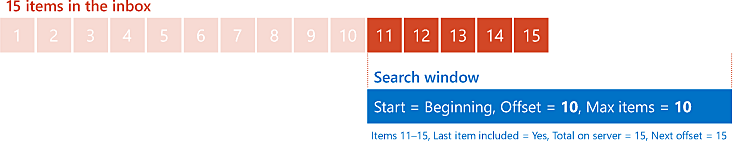
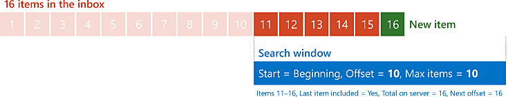
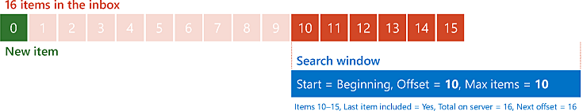

# <a name="perform-paged-searches-by-using-ews-in-exchange"></a>使用 Exchange 中的 EWS 执行分页搜索

了解如何在面向 Exchange 的 EWS 托管 API 或 EWS 应用程序中执行分页搜索。
  
分页是 EWS 中的一项功能，使您能够控制搜索结果的大小。 您可以检索多个 EWS 响应中的较小集，而不是在一个 EWS 响应中检索整个结果集。 例如，假设用户的收件箱中有10000封电子邮件。 Hypothetically，您可以在一个非常大的响应中检索所有10000电子邮件，但由于带宽或性能原因，您可能需要将其分解为更易于管理的区块。 分页为您提供了实现此目的的工具。
  
> [!NOTE]
> 虽然您可以 hypothetically 在一个请求中检索10000项，但实际上这不是由于 EWS 限制而造成的。 若要了解详细信息，请参阅[Exchange 中的 EWS 限制](ews-throttling-in-exchange.md)。 
  
**表1。EWS 托管 API 和 EWS 中的分页参数**

|**若要配置或检索 .。。**|**在 EWS 托管 API 中，使用 .。。**|**在 EWS 中，使用 .。。**|
|:-----|:-----|:-----|
|响应中的最大项目数或文件夹数  <br/> |[ItemView 构造函数](https://msdn.microsoft.com/library/microsoft.exchange.webservices.data.itemview.itemview%28v=exchg.80%29.aspx)或[FolderView 构造函数](https://msdn.microsoft.com/library/microsoft.exchange.webservices.data.folderview.folderview%28v=exchg.80%29.aspx)的**pageSize**参数 <br/> 或  <br/> [PageSize 属性 PagedView](https://msdn.microsoft.com/library/microsoft.exchange.webservices.data.pagedview.pagesize%28v=exchg.80%29.aspx)  <br/> |[IndexedPageItemView](https://msdn.microsoft.com/library/6d1b0b04-cc35-4a57-bd7a-824136d14fda%28Office.15%29.aspx)元素或[IndexedPageFolderView](https://msdn.microsoft.com/library/c6dac232-244b-4db0-9a15-5e01b8aa7a7d%28Office.15%29.aspx)元素上的**MaxEntriesReturned**属性  <br/> |
|项或文件夹列表中的起始点  <br/> |**ItemView**构造函数或**FolderView**构造函数的**offsetBasePoint**参数  <br/> 或  <br/> [OffsetBasePoint 属性 PagedView](https://msdn.microsoft.com/library/microsoft.exchange.webservices.data.pagedview.offsetbasepoint%28v=exchg.80%29.aspx)  <br/> |**IndexedPageItemView**元素或**IndexedPageFolderView**元素上的**BasePoint**属性  <br/> |
|起始点的偏移量  <br/> |**ItemView**构造函数或**FolderView**构造函数的**offset**参数  <br/> 或  <br/> [PagedView](https://msdn.microsoft.com/library/microsoft.exchange.webservices.data.pagedview.offset%28v=exchg.80%29.aspx)属性  <br/> |**IndexedPageItemView**元素或**IndexedPageFolderView**元素上的**Offset**属性  <br/> |
|服务器上的总结果数  <br/> |TotalCount 属性或[FindFoldersResults](https://msdn.microsoft.com/library/microsoft.exchange.webservices.data.findfoldersresults.totalcount%28v=exchg.80%29.aspx)属性[FindItemsResults](https://msdn.microsoft.com/library/dd635348%28v=exchg.80%29.aspx)  <br/> |[RootFolder （FindItemResponseMessage）](https://msdn.microsoft.com/library/187e009f-efaa-42a8-8962-329a645213ab%28Office.15%29.aspx)元素或[RootFolder （FindFolderResponseMessage）](https://msdn.microsoft.com/library/5089c815-663f-46be-bc59-aed9ee20f94a%28Office.15%29.aspx)元素上的**TotalItemsInView**属性  <br/> |
|当前响应中未包含的第一个项目或文件夹的偏移量  <br/> |NextPageOffset 属性或[FindFoldersResults](https://msdn.microsoft.com/library/microsoft.exchange.webservices.data.findfoldersresults.nextpageoffset%28v=exchg.80%29.aspx)属性[FindItemsResults](https://msdn.microsoft.com/library/ee693014%28v=exchg.80%29.aspx)  <br/> |**RootFolder**元素上的**IndexedPagingOffset**属性  <br/> |
|指示符，响应包含列表中的最后一个项目或文件夹  <br/> |MoreAvailable 属性或[FindFoldersResults](https://msdn.microsoft.com/library/microsoft.exchange.webservices.data.findfoldersresults.moreavailable%28v=exchg.80%29.aspx)属性[FindItemsResults](https://msdn.microsoft.com/library/dd635477%28v=exchg.80%29.aspx)  <br/> |**RootFolder**元素上的**IncludesLastItemInRange**属性  <br/> |
   
## <a name="how-paging-works"></a>分页的工作方式
<a name="bk_HowPagingWorks"> </a>

若要了解分页的工作方式，将文件夹中的邮件直观地可视化在房屋外部的字段中，将文件夹中的邮件可视化为 billboards。 您可以通过神奇窗口查看其中一些 billboards。 您可以更改窗口的大小（以同时查看更多或更少的 billboards）和移动窗口（以控制您可以查看的 billboards）。 对窗口的此操作进行分页。 
  
当您将请求发送到 Exchange 服务器时，请根据要返回的项目数指定窗口的大小。 您可以通过指定起始点（行的开头或结尾的行的开头）和从该起始点开始的偏移量（用多个项目表示）来设置窗口的位置。 窗口的开头是由起始点的偏移量指定的项目数。
  
在服务器的响应中，分页变得更有趣，以及应用程序如何使用该响应形状其下一个请求。 服务器提供了三个信息，可用于确定如何为下一个请求配置 "窗口"： 
  
- 响应中的结果是否包括服务器上的总体结果集中的最后一项。
    
- 服务器上的结果集中的项目总数。
    
- 下一个偏移值应是什么，如果您想要将窗口前进到结果集中不包含在当前响应中的下一项。
    
我们来看看一个简单的示例。 设想一下收件箱中有15封邮件。 您的应用程序发送初始请求，以检索最多10个项目（从邮件列表的开头开始）（因此偏移量为零）。 服务器响应前10封邮件，并指示响应不包含最后一项，共15个项目，并且下一个偏移量应为10。
  
**图1。从15个项目的列表开始处偏移量0请求10个项目**


  
然后，您的应用程序会将同一请求重新发送给服务器，只是偏移量现在为10。 服务器返回最后五个项目，并指示响应包含的最后一项，共15个项目，并且下一个偏移量应为15个（当然，您已经到达结束，因此不会出现下一个偏移量。）
  
**图2。在偏移量10处请求10个项目，从15个项目的列表开始**


  
## <a name="design-considerations-for-paging"></a>页面的设计注意事项
<a name="bk_DesignConsiderations"> </a>

在应用程序中最大限度地进行分页确实需要考虑一些事项。 例如，将 "窗口" 设置为多大？ 如果您在移动 "窗口" 时服务器上的结果发生了变化，该怎么办？
  
### <a name="determine-the-size-of-your-window"></a>确定窗口的大小

所有应用程序都应使用的最大条目数不是 "一种大小适合"。 确定适合您的应用程序的数量取决于几个不同的因素。 但是，请牢记以下准则，这很有帮助：
  
- 默认情况下，Exchange 会将单个请求中可返回的最大项目数限制为1000。
    
- 将最大条目数设置为较大的数将导致不得不发送较少的请求来获取所有项目，代价是需要等待更长时间进行响应。
    
- 将最大条目数设置为较小的数目会导致更快的响应速度，代价是需要发送更多请求来获取所有项目。
    
### <a name="handling-changes-to-the-result-set"></a>处理对结果集所做的更改

在本文前面的简单示例中，用户的收件箱中的项目数保持不变。 然而，实际上，收件箱中的项目数可能会经常更改。 可以随时删除或删除新邮件，也可以删除或移动项目。 但这对分页有何影响？ 让我们修改更早的示例方案以了解。
  
我们将再次从用户的收件箱中的15个项目开始，并发送相同的初始请求。 与之前一样，服务器会使用前10封邮件进行响应，并指示响应不包含最后一个项目，总共有15个项目，并且下一个偏移量应为10，如图1所示。
  
现在，当您的应用程序处理这10个项目时，新邮件到达收件箱中，并添加到服务器上的结果集中。 应用程序将同一请求重新发送给服务器（仅限偏移量设置为10）。 这次，服务器将返回六个项目，并指示结果集中共有16个项目。
  
此时，您可能会想知道这是否是一个问题。 毕竟，您可以通过两个响应获得16个项目，因此为什么要执行所有 fuss？ 答案取决于在列表中放置新项目的位置。 如果已对列表进行排序，以便首先使用最旧的项目（按接收日期/时间），则在这种情况下不会出现问题。 新项将放置在列表的末尾，并将包含在第二个响应中。
  
**图3。从16项列表的开头开始，在偏移量10处请求10个项目，列表中的第16项为新项**


  
如果对列表进行排序以使最新的项最先开始，则这是一个不同的情景。 在这种情况下，第二个请求中的第一项是上一个请求中的最后一项加上剩余的五个项目（来自原始15个项目）。 为了使其成为我们的假想神奇窗口，您将窗口的位置移动了10，但 billboards 本身也会移动1个。
  
**图4。从16项列表的开头开始，在偏移量10处请求10个项目，列表中的第一个项目为新项目**


  
在服务器上检测对结果所做的更改的一种方法是使用定位项的概念。 定位项是响应中未与结果的其余部分一起处理的其他项目，但用于与下一个结果进行比较，以查看这些项目本身是否发生了移位。 重新构建在简单的示例中，如果您的应用程序使用的是 "窗口" 大小为10，实际上是将要返回的最大项目数设置为11。 您的应用程序照常处理响应中的前10个项目。 对于最后一个项目，将该项目的标识符另存为一个锚点，然后发出偏移量为10的下一个请求。 如果数据未更改，则第二个响应中的第一项应具有与定位点匹配的项标识符。 如果项目标识符不匹配，则知道数据已被删除或插入到已 "分页" 的列表的部分。
  
即使您知道数据已更改，您仍需要决定如何反应。 没有一个适用于此问题的完全不适合的答案。 您的操作将取决于应用程序的性质以及捕获所有项目的关键程度。 您可以完全忽略它，重新启动进程，或再次跟踪，并尝试检测发生更改的位置。
  
## <a name="example-perform-a-paged-search-by-using-the-ews-managed-api"></a>示例：使用 EWS 托管 API 执行分页搜索
<a name="bk_PagedSearchEWSMA"> </a>

分页受以下 EWS 托管 API 方法支持：
  
- [ExchangeService。 FindFolders](https://msdn.microsoft.com/library/microsoft.exchange.webservices.data.exchangeservice.findfolders%28v=exchg.80%29.aspx)
    
- [ExchangeService。 FindItems](https://msdn.microsoft.com/library/microsoft.exchange.webservices.data.exchangeservice.finditems%28v=exchg.80%29.aspx)
    
- [FindFolders](https://msdn.microsoft.com/library/microsoft.exchange.webservices.data.folder.findfolders%28v=exchg.80%29.aspx)
    
- [FindFolders](https://msdn.microsoft.com/library/microsoft.exchange.webservices.data.folder.finditems%28v=exchg.80%29.aspx)
    
如果您使用 EWS 托管 API，应用程序将使用[ItemView](https://msdn.microsoft.com/library/microsoft.exchange.webservices.data.itemview%28v=exchg.80%29.aspx)或[FolderView](https://msdn.microsoft.com/library/microsoft.exchange.webservices.data.folderview%28v=exchg.80%29.aspx)类配置分页，并从来自[FindItemsResults](https://msdn.microsoft.com/library/dd635381%28v=exchg.80%29.aspx)或[FindFoldersResults](https://msdn.microsoft.com/library/microsoft.exchange.webservices.data.findfoldersresults%28v=exchg.80%29.aspx)类的有关页面的服务器接收相关信息。 
  
下面的示例使用分页搜索来检索文件夹中的所有项目，每个响应中返回5个项目。 它还会检索另一个项，以用作定位点，以检测对服务器上的结果所做的更改。 
  
此示例假定已使用[凭据](https://msdn.microsoft.com/library/microsoft.exchange.webservices.data.exchangeservicebase.credentials%28v=exchg.80%29.aspx)和[Url](https://msdn.microsoft.com/library/microsoft.exchange.webservices.data.exchangeservice.url%28v=exchg.80%29.aspx)属性中的有效值对**ExchangeService**对象进行了初始化。 
  
```cs
using Microsoft.Exchange.WebServices.Data;
static void PageSearchItems(ExchangeService service, WellKnownFolderName folder)
{
    int pageSize = 5;
    int offset = 0;
    // Request one more item than your actual pageSize.
    // This will be used to detect a change to the result
    // set while paging.
    ItemView view = new ItemView(pageSize + 1, offset);
    view.PropertySet = new PropertySet(ItemSchema.Subject);
    view.OrderBy.Add(ItemSchema.DateTimeReceived, SortDirection.Descending);
    view.Traversal = ItemTraversal.Shallow;
    bool moreItems = true;
    ItemId anchorId = null;
    while (moreItems)
    {
        try
        {
            FindItemsResults<Item> results = service.FindItems(folder, view);
            moreItems = results.MoreAvailable;
            if (moreItems &amp;&amp; anchorId != null)
            {
                // Check the first result to make sure it matches
                // the last result (anchor) from the previous page.
                // If it doesn't, that means that something was added
                // or deleted since you started the search.
                if (results.Items.First<Item>().Id != anchorId)
                {
                    Console.WriteLine("The collection has changed while paging. Some results may be missed.");
                }
            }
            if (moreItems)
                view.Offset += pageSize;
            anchorId = results.Items.Last<Item>().Id;
            // Because you're including an additional item on the end of your results
            // as an anchor, you don't want to display it.
            // Set the number to loop as the smaller value between
            // the number of items in the collection and the page size.
            int displayCount = results.Items.Count > pageSize ? pageSize : results.Items.Count;
            for (int i = 0; i < displayCount; i++)
            {
                Item item = results.Items[i];
                Console.WriteLine("Subject: {0}", item.Subject);
                Console.WriteLine("Id: {0}\n", item.Id.ToString());
            }
        }
        catch (Exception ex)
        {
            Console.WriteLine("Exception while paging results: {0}", ex.Message);
        }
    }
}
```

## <a name="example-perform-a-paged-search-by-using-ews"></a>示例：使用 EWS 执行分页搜索
<a name="bk_PagedSearchEWS"> </a>

分页由以下 EWS 操作支持：
  
- [FindFolder](https://msdn.microsoft.com/library/7a9855aa-06cc-45ba-ad2a-645c15b7d031%28Office.15%29.aspx)
    
- [FindItem](https://msdn.microsoft.com/library/ebad6aae-16e7-44de-ae63-a95b24539729%28Office.15%29.aspx)
    
如果使用的是 EWS，应用程序将使用[IndexedPageItemView](https://msdn.microsoft.com/library/6d1b0b04-cc35-4a57-bd7a-824136d14fda%28Office.15%29.aspx)元素或[IndexedPageFolderView](https://msdn.microsoft.com/library/c6dac232-244b-4db0-9a15-5e01b8aa7a7d%28Office.15%29.aspx)元素配置分页，并从来自[RootFolder （FindItemResponseMessage）](https://msdn.microsoft.com/library/187e009f-efaa-42a8-8962-329a645213ab%28Office.15%29.aspx)元素或[RootFolder （FindFolderResponseMessage）](https://msdn.microsoft.com/library/5089c815-663f-46be-bc59-aed9ee20f94a%28Office.15%29.aspx)元素的页面接收有关信息。 
  
在此请求示例中， **FindItem**请求最多为6个项目发送，从用户收件箱中的项目列表的开头偏移零处开始。 
  
```XML
<?xml version="1.0" encoding="utf-8"?>
<soap:Envelope xmlns:xsi="http://www.w3.org/2001/XMLSchema-instance" 
    xmlns:m="https://schemas.microsoft.com/exchange/services/2006/messages" 
    xmlns:t="https://schemas.microsoft.com/exchange/services/2006/types" 
    xmlns:soap="https://schemas.xmlsoap.org/soap/envelope/">
  <soap:Header>
    <t:RequestServerVersion Version="Exchange2007_SP1" />
    <t:TimeZoneContext>
      <t:TimeZoneDefinition Id="Eastern Standard Time" />
    </t:TimeZoneContext>
  </soap:Header>
  <soap:Body>
    <m:FindItem Traversal="Shallow">
      <m:ItemShape>
        <t:BaseShape>IdOnly</t:BaseShape>
        <t:AdditionalProperties>
          <t:FieldURI FieldURI="item:Subject" />
        </t:AdditionalProperties>
      </m:ItemShape>
      <m:IndexedPageItemView MaxEntriesReturned="6" Offset="0" BasePoint="Beginning" />
      <m:ParentFolderIds>
        <t:DistinguishedFolderId Id="inbox" />
      </m:ParentFolderIds>
    </m:FindItem>
  </soap:Body>
</soap:Envelope>
```

服务器返回以下响应，其中包含六个项目。 该响应还指示服务器上的结果中总共有八项，并且结果列表中的最后一项不存在于此响应中。
  
```XML
<?xml version="1.0" encoding="utf-8"?>
<s:Envelope xmlns:s="https://schemas.xmlsoap.org/soap/envelope/">
  <s:Header>
    <h:ServerVersionInfo MajorVersion="15" MinorVersion="0" MajorBuildNumber="775" MinorBuildNumber="35" Version="V2_4" 
        xmlns:h="https://schemas.microsoft.com/exchange/services/2006/types" 
        xmlns="https://schemas.microsoft.com/exchange/services/2006/types" 
        xmlns:xsd="http://www.w3.org/2001/XMLSchema" 
        xmlns:xsi="http://www.w3.org/2001/XMLSchema-instance" />
  </s:Header>
  <s:Body xmlns:xsi="http://www.w3.org/2001/XMLSchema-instance" xmlns:xsd="http://www.w3.org/2001/XMLSchema">
    <m:FindItemResponse xmlns:m="https://schemas.microsoft.com/exchange/services/2006/messages" 
        xmlns:t="https://schemas.microsoft.com/exchange/services/2006/types">
      <m:ResponseMessages>
        <m:FindItemResponseMessage ResponseClass="Success">
          <m:ResponseCode>NoError</m:ResponseCode>
          <m:RootFolder IndexedPagingOffset="6" TotalItemsInView="8" IncludesLastItemInRange="false">
            <t:Items>
              <t:Message>
                <t:ItemId Id="AAMkAGM2..." ChangeKey="CQAAABYA..." />
                <t:Subject>Query</t:Subject>
              </t:Message>
              <t:Message>
                <t:ItemId Id="AAMkAGM2..." ChangeKey="CQAAABYA..." />
                <t:Subject>Update</t:Subject>
              </t:Message>
              <t:Message>
                <t:ItemId Id="AAMkAGM2..." ChangeKey="CQAAABYA..." />
                <t:Subject>Planning resources</t:Subject>
              </t:Message>
              <t:Message>
                <t:ItemId Id="AAMkAGM2..." ChangeKey="CQAAABYA..." />
                <t:Subject>Timeline</t:Subject>
              </t:Message>
              <t:Message>
                <t:ItemId Id="AAMkAGM2..." ChangeKey="CQAAABYA..." />
                <t:Subject>For your perusal</t:Subject>
              </t:Message>
              <t:Message>
                <t:ItemId Id="AAMkAGM2..." ChangeKey="CQAAABYA..." />
                <t:Subject>meeting notes</t:Subject>
              </t:Message>
            </t:Items>
          </m:RootFolder>
        </m:FindItemResponseMessage>
      </m:ResponseMessages>
    </m:FindItemResponse>
  </s:Body>
</s:Envelope>
```

在此示例中，将发送相同的请求，但这次， **Offset**属性将更改为5，这表示服务器最多应从开头偏移量5处开始返回六个项目。 
  
```XML
<?xml version="1.0" encoding="utf-8"?>
<soap:Envelope xmlns:xsi="http://www.w3.org/2001/XMLSchema-instance" 
    xmlns:m="https://schemas.microsoft.com/exchange/services/2006/messages" 
    xmlns:t="https://schemas.microsoft.com/exchange/services/2006/types" 
    xmlns:soap="https://schemas.xmlsoap.org/soap/envelope/">
  <soap:Header>
    <t:RequestServerVersion Version="Exchange2007_SP1" />
    <t:TimeZoneContext>
      <t:TimeZoneDefinition Id="Eastern Standard Time" />
    </t:TimeZoneContext>
  </soap:Header>
  <soap:Body>
    <m:FindItem Traversal="Shallow">
      <m:ItemShape>
        <t:BaseShape>IdOnly</t:BaseShape>
        <t:AdditionalProperties>
          <t:FieldURI FieldURI="item:Subject" />
        </t:AdditionalProperties>
      </m:ItemShape>
      <m:IndexedPageItemView MaxEntriesReturned="6" Offset="5" BasePoint="Beginning" />
      <m:ParentFolderIds>
        <t:DistinguishedFolderId Id="inbox" />
      </m:ParentFolderIds>
    </m:FindItem>
  </soap:Body>
</soap:Envelope>
```

服务器发送以下响应，其中包含三个项目。 该响应还指示服务器上的结果中的项目总数仍为8，并且结果列表中的最后一个项目包含在此响应中。
  
```XML
<?xml version="1.0" encoding="utf-8"?>
<s:Envelope xmlns:s="https://schemas.xmlsoap.org/soap/envelope/">
  <s:Header>
    <h:ServerVersionInfo MajorVersion="15" MinorVersion="0" MajorBuildNumber="775" MinorBuildNumber="35" Version="V2_4" 
        xmlns:h="https://schemas.microsoft.com/exchange/services/2006/types" 
        xmlns="https://schemas.microsoft.com/exchange/services/2006/types" 
        xmlns:xsd="http://www.w3.org/2001/XMLSchema" 
        xmlns:xsi="http://www.w3.org/2001/XMLSchema-instance" />
  </s:Header>
  <s:Body xmlns:xsi="http://www.w3.org/2001/XMLSchema-instance" xmlns:xsd="http://www.w3.org/2001/XMLSchema">
    <m:FindItemResponse xmlns:m="https://schemas.microsoft.com/exchange/services/2006/messages" 
    xmlns:t="https://schemas.microsoft.com/exchange/services/2006/types">
      <m:ResponseMessages>
        <m:FindItemResponseMessage ResponseClass="Success">
          <m:ResponseCode>NoError</m:ResponseCode>
          <m:RootFolder IndexedPagingOffset="8" TotalItemsInView="8" IncludesLastItemInRange="true">
            <t:Items>
              <t:Message>
                <t:ItemId Id="AAMkAGM2..." ChangeKey="CQAAABYA..." />
                <t:Subject>meeting notes</t:Subject>
              </t:Message>
              <t:Message>
                <t:ItemId Id="AAMkAGM2..." ChangeKey="CQAAABYA..." />
                <t:Subject>Meeting notes</t:Subject>
              </t:Message>
              <t:Message>
                <t:ItemId Id="AAMkAGM2..." ChangeKey="CQAAABYA..." />
                <t:Subject>This cat is hilarious!</t:Subject>
              </t:Message>
            </t:Items>
          </m:RootFolder>
        </m:FindItemResponseMessage>
      </m:ResponseMessages>
    </m:FindItemResponse>
  </s:Body>
</s:Envelope>
```

## <a name="see-also"></a>另请参阅


- [搜索和交换中的 EWS](search-and-ews-in-exchange.md)
    
- [ExchangeService 方法](https://msdn.microsoft.com/library/microsoft.exchange.webservices.data.exchangeservice.findfolders%28v=exchg.80%29.aspx)
    
- [ExchangeService 方法](https://msdn.microsoft.com/library/microsoft.exchange.webservices.data.exchangeservice.finditems%28v=exchg.80%29.aspx)
    
- [FindFolders 方法](https://msdn.microsoft.com/library/microsoft.exchange.webservices.data.folder.findfolders%28v=exchg.80%29.aspx)
    
- [FindFolders 方法](https://msdn.microsoft.com/library/microsoft.exchange.webservices.data.folder.finditems%28v=exchg.80%29.aspx)
    
- [FindFolder 操作](https://msdn.microsoft.com/library/7a9855aa-06cc-45ba-ad2a-645c15b7d031%28Office.15%29.aspx)
    
- [FindItem 操作](https://msdn.microsoft.com/library/ebad6aae-16e7-44de-ae63-a95b24539729%28Office.15%29.aspx)
    
- [Exchange 中的 EWS 限制](ews-throttling-in-exchange.md)
    

