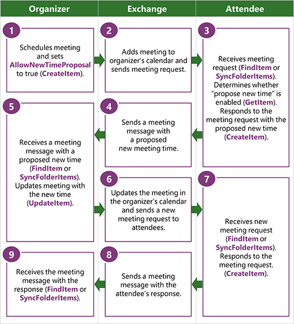

# <a name="propose-a-new-meeting-time-by-using-ews-in-exchange"></a><span data-ttu-id="01c31-103">建议在 Exchange 使用 EWS 的新的会议时间</span><span class="sxs-lookup"><span data-stu-id="01c31-103">Propose a new meeting time by using EWS in Exchange</span></span>

<span data-ttu-id="01c31-104">了解如何在 Exchange 使用 EWS 建议 Exchange 客户端应用程序中的新会议时间。</span><span class="sxs-lookup"><span data-stu-id="01c31-104">Find out how to propose new meeting times from your Exchange client application by using EWS in Exchange.</span></span>
  
<span data-ttu-id="01c31-105">建议新时间功能，参与者可以作为 Exchange 日历工作流的一部分建议会议组织者的新会议时间。</span><span class="sxs-lookup"><span data-stu-id="01c31-105">The propose new time feature enables attendees to propose new meeting times to the meeting organizer as part of the Exchange calendar workflow.</span></span> <span data-ttu-id="01c31-106">当与会者提出新的会议时，组织者可以使用建议的新会议时间更新会议并将更新发送给所有与会者。</span><span class="sxs-lookup"><span data-stu-id="01c31-106">When an attendee proposes a new meeting, the organizer can use the proposed new meeting time to update the meeting and send updates to all attendees.</span></span> <span data-ttu-id="01c31-107">您可以让与会者建议新的会议时间之前，您需要确定组织者是否允许建议新的时间。</span><span class="sxs-lookup"><span data-stu-id="01c31-107">Before you can enable attendees to propose new meeting times, you need to determine whether the organizer allows for new time proposals.</span></span> <span data-ttu-id="01c31-108">本文介绍如何确定是否您才能提出新时间以及如何使用 EWS 建议新时间。</span><span class="sxs-lookup"><span data-stu-id="01c31-108">This article describes how to determine whether you can propose a new time and how to use EWS to propose a new time.</span></span>
  
> [!NOTE]
> <span data-ttu-id="01c31-109">EWS 托管 API 无法实现此功能。</span><span class="sxs-lookup"><span data-stu-id="01c31-109">The EWS Managed API does not implement this functionality.</span></span> 
  
## <a name="determine-whether-you-can-propose-a-new-time-for-a-meeting-by-using-ews"></a><span data-ttu-id="01c31-110">确定您是否可以使用 EWS 建议会议的新时间</span><span class="sxs-lookup"><span data-stu-id="01c31-110">Determine whether you can propose a new time for a meeting by using EWS</span></span>
<span data-ttu-id="01c31-111"><a name="bk_Determine"> </a></span><span class="sxs-lookup"><span data-stu-id="01c31-111"></span></span>

<span data-ttu-id="01c31-112">您才能提出新的会议时间之前，您需要查找对该会议的引用，并确定会议组织者是否配置会议支持建议新的时间。</span><span class="sxs-lookup"><span data-stu-id="01c31-112">Before you can propose a new time for a meeting, you need to find a reference to that meeting and determine whether the meeting organizer configured the meeting to support new time proposals.</span></span> <span data-ttu-id="01c31-113">您可以通过执行以下任一操作来获取对会议的引用：</span><span class="sxs-lookup"><span data-stu-id="01c31-113">You can get a reference to a meeting by doing either of the following:</span></span> 
  
- <span data-ttu-id="01c31-114">在收件箱中查找会议请求</span><span class="sxs-lookup"><span data-stu-id="01c31-114">Finding the meeting request in the Inbox</span></span>
    
- <span data-ttu-id="01c31-115">在日历中查找约会</span><span class="sxs-lookup"><span data-stu-id="01c31-115">Finding the appointment in the calendar</span></span>
    
<span data-ttu-id="01c31-116">使用以下步骤可查找会议引用：</span><span class="sxs-lookup"><span data-stu-id="01c31-116">Use the following steps to find a meeting reference:</span></span>
  
1. <span data-ttu-id="01c31-117">使用[FindItem](http://msdn.microsoft.com/library/ebad6aae-16e7-44de-ae63-a95b24539729%28Office.15%29.aspx) EWS 操作 （或[Folder.FindItems](http://msdn.microsoft.com/zh-cn/library/microsoft.exchange.webservices.data.folder.finditems%28v=EXCHG.80%29.aspx) EWS 托管 API 方法） 查找目标会议请求或日历项目。</span><span class="sxs-lookup"><span data-stu-id="01c31-117">Use the [FindItem](http://msdn.microsoft.com/library/ebad6aae-16e7-44de-ae63-a95b24539729%28Office.15%29.aspx) EWS operation (or the [Folder.FindItems](http://msdn.microsoft.com/zh-cn/library/microsoft.exchange.webservices.data.folder.finditems%28v=EXCHG.80%29.aspx) EWS Managed API method) to find the target meeting request or calendar item.</span></span> <span data-ttu-id="01c31-118">或者，可以使用[SyncFolderItems](http://msdn.microsoft.com/library/7f0de089-8876-47ec-a871-df118ceae75d%28Office.15%29.aspx) EWS 操作来获取会议请求或日历项目的目标的标识符。</span><span class="sxs-lookup"><span data-stu-id="01c31-118">Alternatively, you can use the [SyncFolderItems](http://msdn.microsoft.com/library/7f0de089-8876-47ec-a871-df118ceae75d%28Office.15%29.aspx) EWS operation to get the identifier of the target meeting request or calendar item.</span></span> 
    
2. <span data-ttu-id="01c31-119">分析**FindItem**操作 （或**Folder.FindItems**方法） 若要获取的会议项目的项标识符的结果。</span><span class="sxs-lookup"><span data-stu-id="01c31-119">Parse the results of the **FindItem** operation (or **Folder.FindItems** method) to get the item identifier of the meeting item.</span></span> 
    
3. <span data-ttu-id="01c31-120">使用[GetItem](http://msdn.microsoft.com/library/e3590b8b-c2a7-4dad-a014-6360197b68e4%28Office.15%29.aspx) EWS 操作来获取会议响应对象。</span><span class="sxs-lookup"><span data-stu-id="01c31-120">Use the [GetItem](http://msdn.microsoft.com/library/e3590b8b-c2a7-4dad-a014-6360197b68e4%28Office.15%29.aspx) EWS operation to get the response objects for the meeting.</span></span> 
    
<span data-ttu-id="01c31-121">以下 XML 显示发送请求的响应对象的项目的内容。</span><span class="sxs-lookup"><span data-stu-id="01c31-121">The following XML shows what is sent to request the response objects on an item.</span></span>
  
```XML
<?xml version="1.0" encoding="utf-8"?>
<soap:Envelope xmlns:xsi="http://www.w3.org/2001/XMLSchema-instance"
               xmlns:xsd="http://www.w3.org/2001/XMLSchema"
               xmlns:soap="http://schemas.xmlsoap.org/soap/envelope/"
               xmlns:t="http://schemas.microsoft.com/exchange/services/2006/types"
               xmlns:m="http://schemas.microsoft.com/exchange/services/2006/messages">
  <soap:Header>
    <t:RequestServerVersion Version="Exchange2013" />
    <t:MailboxCulture>en-US</t:MailboxCulture>
  </soap:Header>
  <soap:Body>
    <m:GetItem>
      <m:ItemShape>
        <t:BaseShape>IdOnly</t:BaseShape>
        <t:AdditionalProperties>
          <t:FieldURI FieldURI="item:ResponseObjects"/>
          <t:FieldURI FieldURI="item:Subject"/>
          <t:FieldURI FieldURI="calendar:Start"/>
          <t:FieldURI FieldURI="calendar:End"/>
        </t:AdditionalProperties>
      </m:ItemShape>
      <m:ItemIds>
        <t:ItemId Id="AAMkADEzOTExYjJkL1AAA=" ChangeKey="CwAAAB/G6X"/>
      </m:ItemIds>
    </m:GetItem>
  </soap:Body>
</soap:Envelope>
```

<span data-ttu-id="01c31-122">如果您请求的项标识符，会议开始和结束时间，响应对象集合，并且如果组织者允许建议更改的会议时间的**GetItem**操作响应外观类似于下面的 XML。</span><span class="sxs-lookup"><span data-stu-id="01c31-122">The **GetItem** operation response will look similar to the following XML if you request the item identifier, the meeting start and end time, the response object collection, and if the organizer allows for proposed changes to the meeting time.</span></span> <span data-ttu-id="01c31-123">该响应对象集合，这表示[ResponseObjects](http://msdn.microsoft.com/library/ad29e064-3f3d-4b7b-aa4c-9ec27326381d%28Office.15%29.aspx)元素，包含有效的日历项目的响应组。</span><span class="sxs-lookup"><span data-stu-id="01c31-123">The response object collection, which is represented by the [ResponseObjects](http://msdn.microsoft.com/library/ad29e064-3f3d-4b7b-aa4c-9ec27326381d%28Office.15%29.aspx) element, contains the set of responses that are valid for the calendar item.</span></span> <span data-ttu-id="01c31-124">**ProposeNewTime**元素是指示用户可以建议会议的新时间响应对象。</span><span class="sxs-lookup"><span data-stu-id="01c31-124">The **ProposeNewTime** element is a response object that indicates that the user can propose a new time for the meeting.</span></span> <span data-ttu-id="01c31-125">[AcceptItem](http://msdn.microsoft.com/library/05a15431-77e1-411a-a16b-5481d364d3cc%28Office.15%29.aspx)、 [TentativelyAcceptItem](http://msdn.microsoft.com/library/ce6f50ef-ad8a-47e4-915a-487b2ef7a2e0%28Office.15%29.aspx)和[DeclineItem](http://msdn.microsoft.com/library/2d8d2389-924e-4d03-a324-35d56cf0d6b1%28Office.15%29.aspx)元素表示您可以使用建议新的会议时间，会议组织者的响应对象。</span><span class="sxs-lookup"><span data-stu-id="01c31-125">The [AcceptItem](http://msdn.microsoft.com/library/05a15431-77e1-411a-a16b-5481d364d3cc%28Office.15%29.aspx), [TentativelyAcceptItem](http://msdn.microsoft.com/library/ce6f50ef-ad8a-47e4-915a-487b2ef7a2e0%28Office.15%29.aspx), and [DeclineItem](http://msdn.microsoft.com/library/2d8d2389-924e-4d03-a324-35d56cf0d6b1%28Office.15%29.aspx) elements represent the response objects that you can use to propose a new meeting time to the meeting organizer.</span></span> 
  
```XML
<s:Envelope xmlns:s="http://schemas.xmlsoap.org/soap/envelope/">
  <s:Header>
    <h:ServerVersionInfo MajorVersion="15" 
                         MinorVersion="0" 
                         MajorBuildNumber="815" 
                         MinorBuildNumber="6" 
                         Version="V2_7" 
                         xmlns:h="http://schemas.microsoft.com/exchange/services/2006/types" 
                         xmlns="http://schemas.microsoft.com/exchange/services/2006/types" 
                         xmlns:xsd="http://www.w3.org/2001/XMLSchema" 
                         xmlns:xsi="http://www.w3.org/2001/XMLSchema-instance"/>
  </s:Header>
  <s:Body xmlns:xsi="http://www.w3.org/2001/XMLSchema-instance" 
          xmlns:xsd="http://www.w3.org/2001/XMLSchema">
    <m:GetItemResponse xmlns:m="http://schemas.microsoft.com/exchange/services/2006/messages" 
                       xmlns:t="http://schemas.microsoft.com/exchange/services/2006/types">
      <m:ResponseMessages>
        <m:GetItemResponseMessage ResponseClass="Success">
          <m:ResponseCode>NoError</m:ResponseCode>
          <m:Items>
            <t:MeetingRequest>
              <t:ItemId Id="AAMkADEzOTExYjJkL1AAA=" ChangeKey="CwAAAB/G6X"/>
              <t:Subject>Competitive analysis: kick off meeting</t:Subject>
              <t:ResponseObjects>
                <t:AcceptItem/>
                <t:TentativelyAcceptItem/>
                <t:DeclineItem/>
                <t:ProposeNewTime/>
                <t:ReplyToItem/>
                <t:ReplyAllToItem/>
                <t:ForwardItem/>
              </t:ResponseObjects>
              <t:Start>2013-11-09T17:00:00Z</t:Start>
              <t:End>2013-11-09T17:30:00Z</t:End>
            </t:MeetingRequest>
          </m:Items>
        </m:GetItemResponseMessage>
      </m:ResponseMessages>
    </m:GetItemResponse>
  </s:Body>
</s:Envelope>
```

## <a name="propose-a-new-meeting-time-by-using-ews"></a><span data-ttu-id="01c31-126">建议使用 EWS 的新的会议时间</span><span class="sxs-lookup"><span data-stu-id="01c31-126">Propose a new meeting time by using EWS</span></span>
<span data-ttu-id="01c31-127"><a name="bk_Propose"> </a></span><span class="sxs-lookup"><span data-stu-id="01c31-127"></span></span>

<span data-ttu-id="01c31-128">如果您使用**GetItem**操作获取日历项目或会议请求时，您会收到**ProposeNewTime** response 对象，则您可以使用建议的新会议时间响应。</span><span class="sxs-lookup"><span data-stu-id="01c31-128">If you received a **ProposeNewTime** response object when you used the **GetItem** operation to get a calendar item or meeting request, you can respond with a proposed new meeting time.</span></span> <span data-ttu-id="01c31-129">如果您未收到**ProposeNewTime** response 对象，您将无法建议新的会议时间的日历工作流的一部分。</span><span class="sxs-lookup"><span data-stu-id="01c31-129">If you didn't receive a **ProposeNewTime** response object, you won't be able to propose a new meeting time as part of the calendar workflow.</span></span> <span data-ttu-id="01c31-130">但是，可以回复组织者要请求新的会议时间。</span><span class="sxs-lookup"><span data-stu-id="01c31-130">You can, however, reply to the organizer to request a new meeting time.</span></span> <span data-ttu-id="01c31-131">如果您收到**ProposeNewTime** response 对象，可以通过引用其标识符，响应会议和建议组织者向新的会议时间。</span><span class="sxs-lookup"><span data-stu-id="01c31-131">If you receive a **ProposeNewTime** response object, you can respond to the meeting by referencing its identifier, and propose a new meeting time to the organizer.</span></span> <span data-ttu-id="01c31-132">这是其中**ProposeNewTime** response 对象是不同的典型响应对象模式，不响应与**ProposeNewTime**响应对象。</span><span class="sxs-lookup"><span data-stu-id="01c31-132">This is where the **ProposeNewTime** response object is different than the typical response object pattern in that you don't respond with a **ProposeNewTime** response object.</span></span> <span data-ttu-id="01c31-133">您使用的另一个会议响应对象，如**AcceptItem**、 **TentativelyAcceptItem**或**DeclineItem**，提出新的会议。</span><span class="sxs-lookup"><span data-stu-id="01c31-133">You use one of the other meeting response objects, such as **AcceptItem**, **TentativelyAcceptItem**, or **DeclineItem**, to propose a new meeting.</span></span> <span data-ttu-id="01c31-134">此示例使用**AcceptItem**响应对象。</span><span class="sxs-lookup"><span data-stu-id="01c31-134">This example uses the **AcceptItem** response object.</span></span> 
  
```XML
<?xml version="1.0" encoding="UTF-8"?>
<soap:Envelope xmlns:soap="http://schemas.xmlsoap.org/soap/envelope/"
               xmlns:t="http://schemas.microsoft.com/exchange/services/2006/types"
               xmlns:m="http://schemas.microsoft.com/exchange/services/2006/messages">
  <soap:Header>
    <t:RequestServerVersion Version="Exchange2013"/>
  </soap:Header>
  <soap:Body>
    <m:CreateItem>
      <m:Items>
        <t:AcceptItem>
          <t:Body BodyType="Text">This time works better for the HiPPO.</t:Body>
          <t:ReferenceItemId Id="AAMkADEzOTExYjJkL1AAA=" ChangeKey="CwAAAB/G6X"/>
          <t:ProposedStart>2013-11-28T04:00:00Z</t:ProposedStart>
          <t:ProposedEnd>2013-11-28T04:30:00Z</t:ProposedEnd>
        </t:AcceptItem>
      </m:Items>
    </m:CreateItem>
  </soap:Body>
</soap:Envelope>
```

<span data-ttu-id="01c31-135">对此请求的响应包含已添加到在与会者的日历的日历项目的标识符和的会议请求被放在与会者的已删除邮件文件夹的副本。</span><span class="sxs-lookup"><span data-stu-id="01c31-135">The response to this request contains the identifier of the calendar item that was added to the attendee's calendar and a copy of the meeting request that was placed in the attendee's Deleted Items folder.</span></span> <span data-ttu-id="01c31-136">建议新的时间响应邮件还保存在与会者的已发送邮件文件夹中 (需要查找会议响应消息获取句柄)。</span><span class="sxs-lookup"><span data-stu-id="01c31-136">The response message with the new time proposal was also saved in the attendee's Sent Items folder (you will need to find the meeting response message to get a handle on it).</span></span>
  
```XML
<s:Envelope xmlns:s="http://schemas.xmlsoap.org/soap/envelope/">
  <s:Header>
    <h:ServerVersionInfo MajorVersion="15" 
                         MinorVersion="0" 
                         MajorBuildNumber="815" 
                         MinorBuildNumber="6" 
                         Version="V2_7" 
                         xmlns:h="http://schemas.microsoft.com/exchange/services/2006/types" 
                         xmlns="http://schemas.microsoft.com/exchange/services/2006/types" 
                         xmlns:xsd="http://www.w3.org/2001/XMLSchema" 
                         xmlns:xsi="http://www.w3.org/2001/XMLSchema-instance"/>
  </s:Header>
  <s:Body xmlns:xsi="http://www.w3.org/2001/XMLSchema-instance" 
          xmlns:xsd="http://www.w3.org/2001/XMLSchema">
    <m:CreateItemResponse xmlns:m="http://schemas.microsoft.com/exchange/services/2006/messages" 
                          xmlns:t="http://schemas.microsoft.com/exchange/services/2006/types">
      <m:ResponseMessages>
        <m:CreateItemResponseMessage ResponseClass="Success">
          <m:ResponseCode>NoError</m:ResponseCode>
          <m:Items>
            <t:CalendarItem>
              <t:ItemId Id="AAMkAGRmOWE2OWAAA=" ChangeKey="DwAAJsmU"/>
            </t:CalendarItem>
            <t:MeetingRequest>
              <t:ItemId Id="AAMkAGRmOWE2AAABB=" ChangeKey="AAAGJu1A"/>
            </t:MeetingRequest>
          </m:Items>
        </m:CreateItemResponseMessage>
      </m:ResponseMessages>
    </m:CreateItemResponse>
  </s:Body>
</s:Envelope>
```

<span data-ttu-id="01c31-137">与会者使用建议的新会议时间响应时，组织者将收到[MeetingResponse](http://msdn.microsoft.com/library/9f798e79-dafd-4d4d-9967-95fd8e5c0502%28Office.15%29.aspx)消息。</span><span class="sxs-lookup"><span data-stu-id="01c31-137">The organizer will receive a [MeetingResponse](http://msdn.microsoft.com/library/9f798e79-dafd-4d4d-9967-95fd8e5c0502%28Office.15%29.aspx) message when the attendee responds with a proposed new meeting time.</span></span> <span data-ttu-id="01c31-138">**MeetingResponse**邮件包含建议的新会议组织者的日历中开始时间和结束时间，以及相关联的日历项目的标识符。</span><span class="sxs-lookup"><span data-stu-id="01c31-138">The **MeetingResponse** message contains the proposed new meeting start time and end time, and the identifier of the associated calendar item in the organizer's calendar.</span></span> <span data-ttu-id="01c31-139">组织者可以使用这些信息更新会议其现有日历项。</span><span class="sxs-lookup"><span data-stu-id="01c31-139">The organizer can use that information to update their existing calendar item for the meeting.</span></span> <span data-ttu-id="01c31-140">以下是组织者要为新的会议时间借此过程的**MeetingResponse**消息响应工作流：</span><span class="sxs-lookup"><span data-stu-id="01c31-140">The following is the workflow for the organizer to respond to a **MeetingResponse** message that proposes a new meeting time:</span></span> 
  
1. <span data-ttu-id="01c31-141">确定是否已在**MeetingResponse**设置**ProposedStart**或**ProposedEnd**元素。</span><span class="sxs-lookup"><span data-stu-id="01c31-141">Determine whether the **ProposedStart** or **ProposedEnd** elements have been set in the **MeetingResponse**.</span></span> <span data-ttu-id="01c31-142">如果是这样，转到步骤 2。</span><span class="sxs-lookup"><span data-stu-id="01c31-142">If so, go to step 2.</span></span> <span data-ttu-id="01c31-143">如果没有， **MeetingResponse**邮件仅指示参与者已接受、 暂时接受或拒绝会议。</span><span class="sxs-lookup"><span data-stu-id="01c31-143">If not, the **MeetingResponse** message only indicates whether the attendee has accepted, tentatively accepted, or declined the meeting.</span></span> 
    
2. <span data-ttu-id="01c31-144">通过使用**AssociatedCalendarItemId**元素中返回的 EWS 标识符获取会议组织者的现有日历项。</span><span class="sxs-lookup"><span data-stu-id="01c31-144">Get the organizer's existing calendar item for the meeting by using the EWS identifier returned in the **AssociatedCalendarItemId** element.</span></span> 
    
3. <span data-ttu-id="01c31-145">原始开始和结束时间与建议的新会议时间进行了比较。</span><span class="sxs-lookup"><span data-stu-id="01c31-145">Compare the original start and end time with the proposed new meeting time.</span></span> <span data-ttu-id="01c31-146">如果向组织者可接受建议的新会议时间，请转到步骤 4。</span><span class="sxs-lookup"><span data-stu-id="01c31-146">If the proposed new meeting time is acceptable to the organizer, go to step 4.</span></span> <span data-ttu-id="01c31-147">否则为会议组织者可以忽略的建议的会议时间，或者发送电子邮件响应建议新的会议时间的与会者。</span><span class="sxs-lookup"><span data-stu-id="01c31-147">Otherwise, the meeting organizer can either ignore the proposed meeting time, or send an email response to the attendee that proposed the new meeting time.</span></span>
    
4. <span data-ttu-id="01c31-148">（可选）执行[GetUserAvailability](http://msdn.microsoft.com/library/8da17226-5d3a-4525-9ffa-d83730f47bb1%28Office.15%29.aspx) EWS 操作呼叫以找出建议的时间将用于所有与会者，包括会议室和资源邮箱。</span><span class="sxs-lookup"><span data-stu-id="01c31-148">(Optional) Perform a [GetUserAvailability](http://msdn.microsoft.com/library/8da17226-5d3a-4525-9ffa-d83730f47bb1%28Office.15%29.aspx) EWS operation call to find out whether the proposed time will work for all attendees, including room and resource mailboxes.</span></span> <span data-ttu-id="01c31-149">（您还可用[ExchangeService.GetUserAvailability](http://msdn.microsoft.com/zh-cn/library/microsoft.exchange.webservices.data.exchangeservice.getuseravailability%28v=exchg.80%29.aspx) EWS 托管 API 方法来执行此操作。）</span><span class="sxs-lookup"><span data-stu-id="01c31-149">(You can also use the [ExchangeService.GetUserAvailability](http://msdn.microsoft.com/zh-cn/library/microsoft.exchange.webservices.data.exchangeservice.getuseravailability%28v=exchg.80%29.aspx) EWS Managed API method to do this.)</span></span> 
    
5. <span data-ttu-id="01c31-150">然后，组织者可以使用新的建议的会议时间内更新其会议，并通过[UpdateItem](http://msdn.microsoft.com/library/5d027523-e0bc-4da2-b60b-0cb9fc1fdfe4%28Office.15%29.aspx) EWS 操作 （或[Appointment.Update](http://msdn.microsoft.com/zh-cn/library/microsoft.exchange.webservices.data.appointment.update%28v=exchg.80%29.aspx) EWS 托管 API 方法） 将更新发送给所有与会者。</span><span class="sxs-lookup"><span data-stu-id="01c31-150">The organizer can then update their meeting with the new proposed meeting times and send the updates to all attendees by using the [UpdateItem](http://msdn.microsoft.com/library/5d027523-e0bc-4da2-b60b-0cb9fc1fdfe4%28Office.15%29.aspx) EWS operation (or the [Appointment.Update](http://msdn.microsoft.com/zh-cn/library/microsoft.exchange.webservices.data.appointment.update%28v=exchg.80%29.aspx) EWS Managed API method).</span></span> 
    
<span data-ttu-id="01c31-151">下图显示了会议组织者、 与会者和处理 EWS 调用的 Exchange 服务器之间发生的过程。</span><span class="sxs-lookup"><span data-stu-id="01c31-151">The following figure shows the process that occurs between the meeting organizer, the attendee, and the Exchange server that handled the EWS calls.</span></span>
  
<span data-ttu-id="01c31-152">**图 1。建议新的会议时间的过程**</span><span class="sxs-lookup"><span data-stu-id="01c31-152">**Figure 1. Process for proposing a new meeting time**</span></span>


  
## <a name="version-differences"></a><span data-ttu-id="01c31-155">版本差异</span><span class="sxs-lookup"><span data-stu-id="01c31-155">Version differences</span></span>
<span data-ttu-id="01c31-156"><a name="bk_Behavior"> </a></span><span class="sxs-lookup"><span data-stu-id="01c31-156"></span></span>

<span data-ttu-id="01c31-157">建议新时间功能是在 Exchange 内部版本 15.00.0800.007 中引入的。</span><span class="sxs-lookup"><span data-stu-id="01c31-157">The propose new time feature was introduced in Exchange build version 15.00.0800.007.</span></span> <span data-ttu-id="01c31-158">在早期版本的 Exchange，EWS 应用程序用户必须将单独的电子邮件发送到会议组织者请求不同的会议时间。</span><span class="sxs-lookup"><span data-stu-id="01c31-158">In earlier versions of Exchange, EWS application users have to send a separate email to the meeting organizer to request a different meeting time.</span></span> 
  
## <a name="see-also"></a><span data-ttu-id="01c31-159">另请参阅</span><span class="sxs-lookup"><span data-stu-id="01c31-159">See also</span></span>


- [<span data-ttu-id="01c31-160">Calendars and EWS in Exchange</span><span class="sxs-lookup"><span data-stu-id="01c31-160">Calendars and EWS in Exchange</span></span>](calendars-and-ews-in-exchange.md)
    
- [<span data-ttu-id="01c31-161">使用 Exchange 2013 中的 EWS 中创建约会和会议</span><span class="sxs-lookup"><span data-stu-id="01c31-161">Create appointments and meetings by using EWS in Exchange 2013</span></span>](how-to-create-appointments-and-meetings-by-using-ews-in-exchange-2013.md)
    
- [<span data-ttu-id="01c31-162">在 Exchange 使用 EWS 获取约会和会议</span><span class="sxs-lookup"><span data-stu-id="01c31-162">Get appointments and meetings by using EWS in Exchange</span></span>](how-to-get-appointments-and-meetings-by-using-ews-in-exchange.md)
    
- [<span data-ttu-id="01c31-163">在 Exchange 使用 EWS 更新约会和会议</span><span class="sxs-lookup"><span data-stu-id="01c31-163">Update appointments and meetings by using EWS in Exchange</span></span>](how-to-update-appointments-and-meetings-by-using-ews-in-exchange.md)
    
- [<span data-ttu-id="01c31-164">删除约会，并在 Exchange 使用 EWS 取消会议</span><span class="sxs-lookup"><span data-stu-id="01c31-164">Delete appointments and cancel meetings by using EWS in Exchange</span></span>](how-to-delete-appointments-and-cancel-meetings-by-using-ews-in-exchange.md)
    

