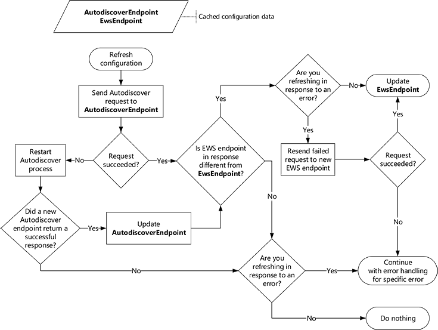

# 使用自动发现刷新配置信息

了解如何以及何时使用自动发现刷新 Exchange连接的配置信息。
  
当您的 EWS 应用程序首次运行时，自动发现为您提供了一种收集连接到用户邮箱所需的信息Exchange方法。 但自动发现并不仅仅是首次使用。 通过使应用程序能够响应部署中的更改，定期使用自动发现可帮助Exchange连接。
  
## 缓存自动发现终结点和 EWS 设置

虽然我们建议你定期使用自动发现，但定期使用它时需要考虑一些事项。 理想情况下，您可以在快速响应环境更改与生成过多不必要的网络流量之间取得平衡。 当应用程序第一次获得成功的自动发现响应时，应保存以下信息，以便每次发送 EWS 请求时都不需要重复自动发现过程。
  
**表 1.自动发现请求的缓存信息**

|**设置为缓存**|**对于...**|**详细信息**|
|:-----|:-----|:-----|
|自动发现终结点    |只要能正常工作    |保存返回成功响应的自动发现终结点时，在获得成功响应之前，不需要重复生成自动发现终结点列表并尝试这些终结点的过程。   **注意**：EWS 托管 API 不支持缓存自动发现终结点。           |
|从自动发现响应中检索到的 EWS URL 和任何其他设置    |一周    |通过保存 EWS URL 和其他相关设置，无需针对每个EWS 请求或应用程序重新启动发送新的自动发现请求。 但是，即使 EWS URL 适用于您的用户，服务器也可能更理想。   例如，用户的邮箱可能已移动到新的邮箱服务器，从而导致新的首选 EWS 终结点。 建议在自上次自动发现请求一周后发送新的自动发现请求来刷新用户设置。 可以调整此时间以满足应用程序的要求。    |
   
## 刷新缓存的配置信息

现在，你已经缓存了信息，让我们看一下如何保持缓存的新鲜度。 我们建议您在以下信息下刷新缓存信息：
  
- 信息的有效期到期。
    
- 发生 [与连接](#bk_ConnectionErrors) 相关的错误，并且缓存的信息上次刷新时间是在一小时之前。
    
若要刷新缓存的信息，请将自动发现请求发送到缓存的自动发现终结点，然后执行以下操作：
  
- 如果请求成功，请将响应中的 EWS 终结点与缓存的 EWS 终结点进行比较，然后执行以下操作：
    
  - 如果不同，请使用新的 EWS 终结点。 如果要刷新以从错误中恢复，请通过新终结点重试失败的请求。
    
  - 如果两者相同，请继续使用原始 EWS 终结点。 如果要刷新以从错误中恢复，请根据情况处理错误。
    
- 如果请求失败，请 [从头开始自动](autodiscover-for-exchange.md) 发现过程。 获得成功响应后，将缓存的自动发现终结点替换为已成功并继续使用新 EWS 终结点的自动发现终结点。 如果未获得成功响应，请继续使用原始自动发现终结点和 EWS 终结点。 如果要刷新以从错误中恢复，请根据情况处理错误。 
    
下图提供了此过程的直观表示形式。
  
**图 1.使用自动发现刷新配置信息的过程**

  
### 与连接相关的错误

刷新缓存的配置信息可以帮助处理某些错误，但不是全部错误。 
  
**表 2.通过刷新缓存解决的错误**

|**错误**|**EWS 托管 API 实现**|**注意**|
|:-----|:-----|:-----|
|DNS 或网络故障错误   示例：找不到主机名。    |[ServiceRemoteException](https://docs.microsoft.com/dotnet/api/microsoft.exchange.webservices.data.serviceremoteexception?view=exchange-ews-api)   |任何指示找不到或无法到达服务器的错误都可以通过尝试自动发现来解决。    缓存的 EWS 终结点可能不再有效，并且自动发现可能能够将您指向新服务器。    |
|HTTP 状态错误   示例：503 服务不可用    |[ServiceRemoteException](https://docs.microsoft.com/dotnet/api/microsoft.exchange.webservices.data.serviceremoteexception?view=exchange-ews-api)   |HTTP 状态错误可能由于许多不同的原因而发生。   但是，建议尝试自动发现以查看新的 EWS 终结点是否可供用户使用。    |
|EWS 错误代码    示例：ErrorConnectionFailed   |[ResponseCodeType](../web-service-reference/responsecode.md)   | 大多数 EWS 错误代码都不需要刷新配置信息。   但是，下面明确指示需要更新配置信息： - **ErrorConnectionFailed**  - **ErrorMailboxMoveInProgress**   |
   
## 另请参阅

- [Exchange 自动发现](autodiscover-for-exchange.md)  
- [生成自动发现终结点列表](how-to-generate-a-list-of-autodiscover-endpoints.md)   
- [使用自动发现从 Exchange 获取用户设置](how-to-get-user-settings-from-exchange-by-using-autodiscover.md)
    

