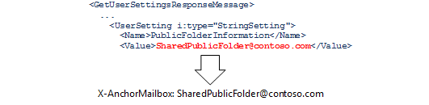
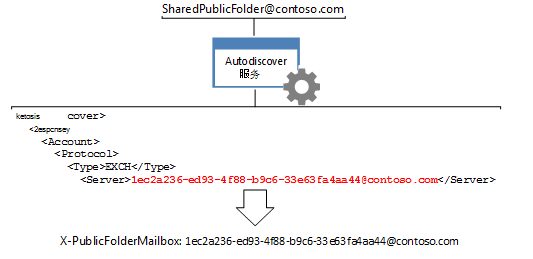

# <a name="route-public-folder-hierarchy-requests"></a><span data-ttu-id="b72b2-104">将公用文件夹层次结构请求路由</span><span class="sxs-lookup"><span data-stu-id="b72b2-104">Route public folder hierarchy requests</span></span>

<span data-ttu-id="b72b2-105">需要知道公用文件夹层次结构，如移动、 更新、 删除或查找公用文件夹的所有公用文件夹信息请求需要路由到给定用户的默认公用文件夹层次结构邮箱。</span><span class="sxs-lookup"><span data-stu-id="b72b2-105">All requests for public folder information that require knowledge of the public folder hierarchy, such as moving, updating, deleting, or finding public folders, need to be routed to the default public folder hierarchy mailbox for the given user.</span></span> <span data-ttu-id="b72b2-106">若要将请求路由到该邮箱，您需要设置为自动发现服务返回的特定值的**X AnchorMailbox**和**X PublicFolderMailbox**标头。</span><span class="sxs-lookup"><span data-stu-id="b72b2-106">To route the requests to that mailbox, you need to set the **X-AnchorMailbox** and **X-PublicFolderMailbox** headers to specific values returned by the Autodiscover service.</span></span> 
  
<span data-ttu-id="b72b2-107">**公用文件夹的概述**</span><span class="sxs-lookup"><span data-stu-id="b72b2-107">**Overview of public folders**</span></span>

|<span data-ttu-id="b72b2-108">标头</span><span class="sxs-lookup"><span data-stu-id="b72b2-108">Header</span></span>|<span data-ttu-id="b72b2-109">我需要什么？</span><span class="sxs-lookup"><span data-stu-id="b72b2-109">What do I need?</span></span>|<span data-ttu-id="b72b2-110">如何获得它？</span><span class="sxs-lookup"><span data-stu-id="b72b2-110">How do I get it?</span></span>|
|:-----|:-----|:-----|
|<span data-ttu-id="b72b2-111">**X AnchorMailbox**</span><span class="sxs-lookup"><span data-stu-id="b72b2-111">**X-AnchorMailbox**</span></span> <br/> |<span data-ttu-id="b72b2-112">从[GetUserSettings](http://msdn.microsoft.com/en-us/library/office/dd877096%28v=exchg.150%29.aspx)自动发现 SOAP 响应， **X AnchorMailbox**头的值，则将变成[PublicFolderInformation](http://msdn.microsoft.com/en-us/library/dn751006%28v=exchg.150%29.aspx)值。</span><span class="sxs-lookup"><span data-stu-id="b72b2-112">The [PublicFolderInformation](http://msdn.microsoft.com/en-us/library/dn751006%28v=exchg.150%29.aspx) value from a [GetUserSettings](http://msdn.microsoft.com/en-us/library/office/dd877096%28v=exchg.150%29.aspx) Autodiscover SOAP response, which becomes the value of the **X-AnchorMailbox** header.</span></span><br/><br/> <span data-ttu-id="b72b2-113"></span><span class="sxs-lookup"><span data-stu-id="b72b2-113"></span></span>| <span data-ttu-id="b72b2-114">1.发送**GetUserSetting**请求为用户的邮箱的 SMTP 地址。</span><span class="sxs-lookup"><span data-stu-id="b72b2-114">1. Send a **GetUserSetting** request with the SMTP address for the user's mailbox.</span></span><br/><br/><span data-ttu-id="b72b2-115">2.缓存**PublicFolderInformation**元素的自动发现服务返回的值。</span><span class="sxs-lookup"><span data-stu-id="b72b2-115">2. Cache the value of the **PublicFolderInformation** element that the Autodiscover service returns.</span></span> <span data-ttu-id="b72b2-116">这可以是从代码中，或新[EWS 托管 API GetUserSettings 呼叫](#bk_getpfinfoewsma)或[GetUserSettings SOAP 请求](#bk_getpfinfoews)中的现有自动发现调用缓存。</span><span class="sxs-lookup"><span data-stu-id="b72b2-116">This can be a cached from an existing Autodiscover call in your code, or a new [EWS Managed API GetUserSettings call](#bk_getpfinfoewsma) or a [GetUserSettings SOAP request](#bk_getpfinfoews).</span></span>  <br/><br/><span data-ttu-id="b72b2-117">3.使用**PublicFolderInformation**元素来填充**X AnchorMailbox**标头的值。</span><span class="sxs-lookup"><span data-stu-id="b72b2-117">3. Use the **PublicFolderInformation** element to populate the value of the **X-AnchorMailbox** header.</span></span> <span data-ttu-id="b72b2-118">**PublicFolderInformation**元素的值是 SMTP 地址。</span><span class="sxs-lookup"><span data-stu-id="b72b2-118">The value of the **PublicFolderInformation** element is an SMTP address.</span></span>  <br/> |
|<span data-ttu-id="b72b2-119">**X PublicFolderMailbox**</span><span class="sxs-lookup"><span data-stu-id="b72b2-119">**X-PublicFolderMailbox**</span></span> <br/> |<span data-ttu-id="b72b2-120">从[POX 自动发现响应](http://msdn.microsoft.com/en-us/library/bb204082%28v=exchg.150%29.aspx)， **X PublicFolderMailbox**头的值，则将变成[服务器](http://msdn.microsoft.com/en-us/library/bb204084%28v=exchg.150%29.aspx)值。</span><span class="sxs-lookup"><span data-stu-id="b72b2-120">The [Server](http://msdn.microsoft.com/en-us/library/bb204084%28v=exchg.150%29.aspx) value from a [POX Autodiscover response](http://msdn.microsoft.com/en-us/library/bb204082%28v=exchg.150%29.aspx), which becomes the value of the **X-PublicFolderMailbox** header.</span></span><br/><br/> <span data-ttu-id="b72b2-121"></span><span class="sxs-lookup"><span data-stu-id="b72b2-121"></span></span>|<span data-ttu-id="b72b2-122">1。[呼叫 POX 自动发现](#bk_makeautodrequest)服务使用的**X AnchorMailbox**电子邮件地址。</span><span class="sxs-lookup"><span data-stu-id="b72b2-122">1. [Call the POX Autodiscover](#bk_makeautodrequest) service using the **X-AnchorMailbox** email address.</span></span>  <br/><br/><span data-ttu-id="b72b2-123">2.使用自动发现服务返回的**服务器**元素来填充**X PublicFolderMailbox**标头的值。</span><span class="sxs-lookup"><span data-stu-id="b72b2-123">2. Use the **Server** element returned by the Autodiscover service to populate the value of the **X-PublicFolderMailbox** header.</span></span> <span data-ttu-id="b72b2-124">**X PublicFolderMailbox**值为 SMTP 地址，其中 username 是一个 GUID。</span><span class="sxs-lookup"><span data-stu-id="b72b2-124">The value of the **X-PublicFolderMailbox** is an SMTP address where the username is a GUID.</span></span>  <br/> |

<br/>

<span data-ttu-id="b72b2-125">您已确定的标头值后，请[进行的公用文件夹层次结构请求时](#bk_setheadervalues)进行包括。</span><span class="sxs-lookup"><span data-stu-id="b72b2-125">After you have determined the header values, include them [when you make public folder hierarchy requests](#bk_setheadervalues).</span></span>
  
<span data-ttu-id="b72b2-126">本文中的步骤是特定于公用文件夹层次结构请求。</span><span class="sxs-lookup"><span data-stu-id="b72b2-126">The steps in this article are specific to public folder hierarchy requests.</span></span> <span data-ttu-id="b72b2-127">若要确定您的请求是公用文件夹层次结构或内容的请求，请参阅[路由的公用文件夹请求](public-folder-access-with-ews-in-exchange.md#bk_routing)。</span><span class="sxs-lookup"><span data-stu-id="b72b2-127">To determine whether your request is a public folder hierarchy or content request, see [Routing public folder requests](public-folder-access-with-ews-in-exchange.md#bk_routing).</span></span>
  
## <a name="determine-the-value-of-the-x-anchormailbox-header-by-using-the-ews-managed-api"></a><span data-ttu-id="b72b2-128">通过使用 EWS 托管 API 来确定 X AnchorMailbox 头的值</span><span class="sxs-lookup"><span data-stu-id="b72b2-128">Determine the value of the X-AnchorMailbox header by using the EWS Managed API</span></span>
<span data-ttu-id="b72b2-129"><a name="bk_getpfinfoewsma"> </a></span><span class="sxs-lookup"><span data-stu-id="b72b2-129"></span></span>

<span data-ttu-id="b72b2-130">若要使用 EWS 托管 API 检索[PublicFolderInformation (POX)](http://msdn.microsoft.com/library/a221aa9e-b4ac-4ec5-aa42-7e2a69e8eaa6%28Office.15%29.aspx)值，您可以缓存返回对自动发现服务的现有调用， **PublicFolderInformation**元素的值或发起新呼叫。</span><span class="sxs-lookup"><span data-stu-id="b72b2-130">To retrieve the [PublicFolderInformation (POX)](http://msdn.microsoft.com/library/a221aa9e-b4ac-4ec5-aa42-7e2a69e8eaa6%28Office.15%29.aspx) value by using the EWS Managed API, you can either cache the value of the **PublicFolderInformation** element that an existing call to the Autodiscover service returns, or make a new call.</span></span> 
  
<span data-ttu-id="b72b2-131">如果您要发起新呼叫，您可以[获取用户设置使用 EWS 托管 API](how-to-get-user-settings-from-exchange-by-using-autodiscover.md#bk_Managed)[获取使用 EWS 托管 API 的用户设置](how-to-get-user-settings-from-exchange-by-using-autodiscover.md#bk_Managed)您的代码中，然后调用**GetUserSettings**示例通过使用下面的代码检索方法仅**PublicFolderInformation**元素的值。</span><span class="sxs-lookup"><span data-stu-id="b72b2-131">If you're making a new call, you can [Get user settings by using the EWS Managed API](how-to-get-user-settings-from-exchange-by-using-autodiscover.md#bk_Managed)[Get user settings by using the EWS Managed API](how-to-get-user-settings-from-exchange-by-using-autodiscover.md#bk_Managed) to your code, and then call the **GetUserSettings** sample method by using the following code, which retrieves only the value of the **PublicFolderInformation** element.</span></span> <span data-ttu-id="b72b2-132">作为输入参数中包括邮箱用户的 SMTP 的地址。</span><span class="sxs-lookup"><span data-stu-id="b72b2-132">Include the SMTP address of the mailbox user as an input parameter.</span></span> 
  
```cs
GetUserSettingsResponse userResponse = GetUserSettings(adservice, "sonyaf@contoso.com", 3, UserSettingName.PublicFolderInformation);
Console.WriteLine("X-AnchorMailbox value for public folder hierarchy requests: {0}", userResponse.Settings[UserSettingName.PublicFolderInformation]);
```

<span data-ttu-id="b72b2-133">运行代码后, 控制台上显示以下信息：</span><span class="sxs-lookup"><span data-stu-id="b72b2-133">After running the code, the following information is displayed on the console:</span></span>
  
`X-AnchorMailbox for public folder hierarchy requests: SharedPublicFolder@contoso.com`

<span data-ttu-id="b72b2-134">既然您已经**PublicFolderInformation**值，包括作为所有公用文件夹层次结构请求中的 X AnchorMailbox 标头的值。</span><span class="sxs-lookup"><span data-stu-id="b72b2-134">Now that you have the **PublicFolderInformation** value, include it as the value for the X-AnchorMailbox header in all public folder hierarchy requests.</span></span> 
  
`X-AnchorMailbox: SharedPublicFolder@contoso.com`

## <a name="determine-the-value-of-the-x-anchormailbox-header-using-soap"></a><span data-ttu-id="b72b2-135">确定使用 SOAP 的 X AnchorMailbox 标头的值</span><span class="sxs-lookup"><span data-stu-id="b72b2-135">Determine the value of the X-AnchorMailbox header using SOAP</span></span>
<span data-ttu-id="b72b2-136"><a name="bk_getpfinfoews"> </a></span><span class="sxs-lookup"><span data-stu-id="b72b2-136"></span></span>

<span data-ttu-id="b72b2-137">下面的代码示例演示如何使用[GetUserSettings](http://msdn.microsoft.com/en-us/library/dd877096%28v=exchg.150%29.aspx) SOAP 操作检索**PublicFolderInformation**值。</span><span class="sxs-lookup"><span data-stu-id="b72b2-137">The following code example shows how to retrieve the **PublicFolderInformation** value by using the [GetUserSettings](http://msdn.microsoft.com/en-us/library/dd877096%28v=exchg.150%29.aspx) SOAP operation.</span></span> <span data-ttu-id="b72b2-138">在[邮箱](http://msdn.microsoft.com/en-us/library/dd877076%28v=exchg.150%29.aspx)元素中，指定邮箱用户和[RequestedSettings](http://msdn.microsoft.com/en-us/library/office/dd877107%28v=exchg.150%29.aspx)元素限制对[PublicFolderInformation](http://msdn.microsoft.com/en-us/library/dn751006%28v=exchg.150%29.aspx)值的响应。</span><span class="sxs-lookup"><span data-stu-id="b72b2-138">The mailbox user is specified in the [Mailbox](http://msdn.microsoft.com/en-us/library/dd877076%28v=exchg.150%29.aspx) element, and the [RequestedSettings](http://msdn.microsoft.com/en-us/library/office/dd877107%28v=exchg.150%29.aspx) element limits the response to the [PublicFolderInformation](http://msdn.microsoft.com/en-us/library/dn751006%28v=exchg.150%29.aspx) value.</span></span> 
  
```XML
<?xml version="1.0" encoding="utf-8"?>
<soap:Envelope xmlns:a="http://schemas.microsoft.com/exchange/2010/Autodiscover"
               xmlns:wsa="http://www.w3.org/2005/08/addressing"
               xmlns:xsi="http://www.w3.org/2001/XMLSchema-instance"
               xmlns:soap="http://schemas.xmlsoap.org/soap/envelope/">
  <soap:Header>
    <a:RequestedServerVersion>Exchange2007_SP1</a:RequestedServerVersion>
    <wsa:Action>http://schemas.microsoft.com/exchange/2010/Autodiscover/Autodiscover/GetUserSettings</wsa:Action>
    <wsa:To>https://pod51042.outlook.com/autodiscover/autodiscover.svc</wsa:To>
  </soap:Header>
  <soap:Body>
    <a:GetUserSettingsRequestMessage xmlns:a="http://schemas.microsoft.com/exchange/2010/Autodiscover">
      <a:Request>
        <a:Users>
          <a:User>
            <a:Mailbox>sonyaf@contoso.com</a:Mailbox>
          </a:User>
        </a:Users>
        <a:RequestedSettings>
          <a:Setting>PublicFolderInformation</a:Setting>
        </a:RequestedSettings>
      </a:Request>
    </a:GetUserSettingsRequestMessage>
  </soap:Body>
</soap:Envelope>
```

<span data-ttu-id="b72b2-139">响应包括**PublicFolderInformation**值。</span><span class="sxs-lookup"><span data-stu-id="b72b2-139">The response includes the **PublicFolderInformation** value.</span></span> 
  
```XML
<UserSetting i:type="StringSetting">
    <Name>PublicFolderInformation</Name>
    <Value>SharedPublicFolder@contoso.com</Value>
</UserSetting>
```

<span data-ttu-id="b72b2-140">既然您已经**PublicFolderInformation**值，包括作为所有公用文件夹层次结构请求中的 X AnchorMailbox 标头的值。</span><span class="sxs-lookup"><span data-stu-id="b72b2-140">Now that you have the **PublicFolderInformation** value, include it as the value for the X-AnchorMailbox header in all public folder hierarchy requests.</span></span> 
  
`X-AnchorMailbox: SharedPublicFolder@contoso.com`

## <a name="make-an-autodiscover-request-to-determine-the-x-publicfolderinformation-value"></a><span data-ttu-id="b72b2-141">发出的自动发现请求，以确定 X PublicFolderInformation 值</span><span class="sxs-lookup"><span data-stu-id="b72b2-141">Make an Autodiscover request to determine the X-PublicFolderInformation value</span></span>
<span data-ttu-id="b72b2-142"><a name="bk_makeautodrequest"> </a></span><span class="sxs-lookup"><span data-stu-id="b72b2-142"></span></span>

<span data-ttu-id="b72b2-143">发起的自动发现请求的**PublicFolderInformation** SMTP 地址，现在用作**X AnchorMailbox**值。</span><span class="sxs-lookup"><span data-stu-id="b72b2-143">Make an Autodiscover request by using the **PublicFolderInformation** SMTP address, which is now being used as the **X-AnchorMailbox** value.</span></span> <span data-ttu-id="b72b2-144">使用[Exchange 2013： 获取使用自动发现的用户设置](http://code.msdn.microsoft.com/exchange/Exchange-2013-Get-user-7e22c86e)调用自动发现服务，因为它简化的自动发现过程为您的代码示例。</span><span class="sxs-lookup"><span data-stu-id="b72b2-144">Use the [Exchange 2013: Get user settings with Autodiscover](http://code.msdn.microsoft.com/exchange/Exchange-2013-Get-user-7e22c86e) code sample to call the Autodiscover service because it streamlines the Autodiscover process for you.</span></span> <span data-ttu-id="b72b2-145">此代码示例使用下表中列出的命令行参数来调用 POX 自动发现服务**PublicFolderInformation** SMTP 地址。</span><span class="sxs-lookup"><span data-stu-id="b72b2-145">This code sample uses the command line arguments listed in the following table to call the POX Autodiscover service on the **PublicFolderInformation** SMTP address.</span></span> 
  
|<span data-ttu-id="b72b2-146">**命令行参数**</span><span class="sxs-lookup"><span data-stu-id="b72b2-146">**Command-line argument**</span></span>|<span data-ttu-id="b72b2-147">**说明**</span><span class="sxs-lookup"><span data-stu-id="b72b2-147">**Description**</span></span>|
|:-----|:-----|
|<span data-ttu-id="b72b2-148">emailAddress</span><span class="sxs-lookup"><span data-stu-id="b72b2-148">emailAddress</span></span>  <br/> |<span data-ttu-id="b72b2-149">**PublicFolderInformation** SMTP 地址。</span><span class="sxs-lookup"><span data-stu-id="b72b2-149">The **PublicFolderInformation** SMTP address.</span></span>  <br/> |
|<span data-ttu-id="b72b2-150">-skipSOAP</span><span class="sxs-lookup"><span data-stu-id="b72b2-150">-skipSOAP</span></span>  <br/> | <span data-ttu-id="b72b2-151">对于此方案中使用 POX 自动发现请求。</span><span class="sxs-lookup"><span data-stu-id="b72b2-151">Use POX Autodiscover requests for this scenario.</span></span>  <br/> |
|<span data-ttu-id="b72b2-152">身份验证 authEmailAddress</span><span class="sxs-lookup"><span data-stu-id="b72b2-152">-auth authEmailAddress</span></span>  <br/> |<span data-ttu-id="b72b2-153">邮箱用户的电子邮件地址，用于进行身份验证。</span><span class="sxs-lookup"><span data-stu-id="b72b2-153">The mailbox user's email address, which is used for authentication.</span></span> <span data-ttu-id="b72b2-154">系统将提示您输入邮箱用户的密码，当您运行示例。</span><span class="sxs-lookup"><span data-stu-id="b72b2-154">You will be prompted to enter the mailbox user's password when you run the sample.</span></span>  <br/> |
   
<span data-ttu-id="b72b2-155">例如，如果 SharedPublicFolder@contoso.com 是**PublicFolderInformation**元素中，SMTP 地址且 sonyaf@contoso.com 是邮箱用户，命令行参数应如下所示。</span><span class="sxs-lookup"><span data-stu-id="b72b2-155">For example, when SharedPublicFolder@contoso.com is the SMTP address of the **PublicFolderInformation** element, and sonyaf@contoso.com is the mailbox user, the command-line arguments should look like this.</span></span> 
  
`SharedPublicFolder@contoso.com -skipSOAP -auth sonyaf@contoso.com`

<span data-ttu-id="b72b2-156">当您运行**Exchange 2013： 获取使用自动发现的用户设置**示例的最后一个自动发现响应应成功和包含邮箱的邮箱 GUID 与关联的所有用户设置。</span><span class="sxs-lookup"><span data-stu-id="b72b2-156">When you run the **Exchange 2013: Get user settings with Autodiscover** sample, the last Autodiscover response should be successful and include all the user settings associated with the mailbox GUID.</span></span> <span data-ttu-id="b72b2-157">与 EXCH[协议](http://msdn.microsoft.com/en-us/library/bb204278%28v=exchg.150%29.aspx)[类型](http://msdn.microsoft.com/en-us/library/office/bb204223%28v=exchg.150%29.aspx)元素关联的[服务器](http://msdn.microsoft.com/en-us/library/bb204084%28v=exchg.150%29.aspx)值是**X PublicFolderInformation**标头值。</span><span class="sxs-lookup"><span data-stu-id="b72b2-157">The [Server](http://msdn.microsoft.com/en-us/library/bb204084%28v=exchg.150%29.aspx) value associated with the EXCH [Protocol](http://msdn.microsoft.com/en-us/library/bb204278%28v=exchg.150%29.aspx)[Type](http://msdn.microsoft.com/en-us/library/office/bb204223%28v=exchg.150%29.aspx) element is the **X-PublicFolderInformation** header value.</span></span> 
  
```XML
<Autodiscover xmlns="http://schemas.microsoft.com/exchange/autodiscover/responseschema/2006">
  <Response xmlns="http://schemas.microsoft.com/exchange/autodiscover/outlook/responseschema/2006a">
    …
    <Account>
      <AccountType>email</AccountType>
      <Action>settings</Action>
      <Protocol>
        <Type>EXCH</Type>
        <Server>1ec2a236-ed93-4f88-b9c6-33e63fa4aa44@contoso.com</Server>

```

<span data-ttu-id="b72b2-158">此外，如果不想使用**Exchange 2013： 获取使用自动发现的用户设置**示例中，您可以获取**服务器**值通过[生成的自动发现终结点列表](how-to-generate-a-list-of-autodiscover-endpoints.md)，然后发送以下 POX 自动发现对每个 URL 的请求直到收到成功响应。</span><span class="sxs-lookup"><span data-stu-id="b72b2-158">Alternatively, if you do not want to use the **Exchange 2013: Get user settings with Autodiscover** sample, you can get the **Server** value by [generating a list of Autodiscover endpoints](how-to-generate-a-list-of-autodiscover-endpoints.md), and then sending the following POX Autodiscover request to each URL until you receive a successful response.</span></span> <span data-ttu-id="b72b2-159">SharedPublicFolder@contoso.com 是**X PublicFolderMailbox**标头的值。</span><span class="sxs-lookup"><span data-stu-id="b72b2-159">SharedPublicFolder@contoso.com is the value of the **X-PublicFolderMailbox** header.</span></span> 
  
```XML
<?xml version="1.0" encoding="utf-8"?>
<Autodiscover xmlns="http://schemas.microsoft.com/exchange/autodiscover/outlook/requestschema/2006">
  <Request>
    <EMailAddress>SharedPublicFolder@contoso.com</EMailAddress>
    <AcceptableResponseSchema>http://schemas.microsoft.com/exchange/autodiscover/outlook/responseschema/2006a</AcceptableResponseSchema>
  </Request>
</Autodiscover>
```

<span data-ttu-id="b72b2-160">有关自动发现过程的详细信息，请参阅[exchange 自动发现](autodiscover-for-exchange.md)和[生成的自动发现终结点列表](how-to-generate-a-list-of-autodiscover-endpoints.md)中，[获取使用自动发现 Exchange 中的用户设置](how-to-get-user-settings-from-exchange-by-using-autodiscover.md)。</span><span class="sxs-lookup"><span data-stu-id="b72b2-160">For more information about the Autodiscover process, see [Autodiscover for Exchange](autodiscover-for-exchange.md), [Generate a list of Autodiscover endpoints](how-to-generate-a-list-of-autodiscover-endpoints.md), and [Get user settings from Exchange by using Autodiscover](how-to-get-user-settings-from-exchange-by-using-autodiscover.md).</span></span>
  
## <a name="set-the-values-of-the-x-anchormailbox-and-x-publicfoldermailbox-headers"></a><span data-ttu-id="b72b2-161">X AnchorMailbox 和 X PublicFolderMailbox 标头的值</span><span class="sxs-lookup"><span data-stu-id="b72b2-161">Set the values of the X-AnchorMailbox and X-PublicFolderMailbox headers</span></span>
<span data-ttu-id="b72b2-162"><a name="bk_setheadervalues"> </a></span><span class="sxs-lookup"><span data-stu-id="b72b2-162"></span></span>

<span data-ttu-id="b72b2-163">使用的值来[确定使用 EWS 托管 API 的 X AnchorMailbox 标头的值](#bk_getpfinfoewsma)或[确定使用 SOAP 的 X AnchorMailbox 标头的值](#bk_getpfinfoews)和**服务器中获得的**PublicFolderInformation** SMTP 地址**值收购中[发出的自动发现请求，以确定 X PublicFolderInformation 值](#bk_makeautodrequest)，请将公用文件夹内容请求中的**X AnchorMailbox**和**X PublicFolderMailbox**标头的值。</span><span class="sxs-lookup"><span data-stu-id="b72b2-163">Using the value of the **PublicFolderInformation** SMTP address acquired in [Determine the value of the X-AnchorMailbox header by using the EWS Managed API](#bk_getpfinfoewsma) or [Determine the value of the X-AnchorMailbox header using SOAP](#bk_getpfinfoews) and the **Server** value acquired in [Make an Autodiscover request to determine the X-PublicFolderInformation value](#bk_makeautodrequest), set the values of **X-AnchorMailbox** and **X-PublicFolderMailbox** headers in your public folder content request.</span></span> 
  
<span data-ttu-id="b72b2-164">进行以下呼叫时，例如，就给定 SharedPublicFolder@contoso.com **PublicFolderInformation** SMTP 地址和 1ec2a236-ed93-4f88-b9c6-33e63fa4aa44@contoso.com**服务器**值，包括以下标头操作或方法。</span><span class="sxs-lookup"><span data-stu-id="b72b2-164">For example, given a **PublicFolderInformation** SMTP address of SharedPublicFolder@contoso.com and a **Server** value of 1ec2a236-ed93-4f88-b9c6-33e63fa4aa44@contoso.com, include the following headers when making calls to the following methods or operations.</span></span> 
  
`X-AnchorMailbox: SharedPublicFolder@contoso.com` <br/>
`X-PublicFolderMailbox: 1ec2a236-ed93-4f88-b9c6-33e63fa4aa44@contoso.com`

<span data-ttu-id="b72b2-165">**需要 X AnchorMailbox 和 X PublicFolder 标头的公用文件夹呼叫**</span><span class="sxs-lookup"><span data-stu-id="b72b2-165">**Public folder calls that require the X-AnchorMailbox and X-PublicFolder headers**</span></span>

|<span data-ttu-id="b72b2-166">**EWS 托管 API 方法**</span><span class="sxs-lookup"><span data-stu-id="b72b2-166">**EWS Managed API methods**</span></span>|<span data-ttu-id="b72b2-167">**EWS 操作**</span><span class="sxs-lookup"><span data-stu-id="b72b2-167">**EWS operations**</span></span>|
|:-----|:-----|
|[<span data-ttu-id="b72b2-168">Folder.FindFolders</span><span class="sxs-lookup"><span data-stu-id="b72b2-168">Folder.FindFolders</span></span>](http://msdn.microsoft.com/en-us/library/microsoft.exchange.webservices.data.folder.findfolders%28v=exchg.80%29.aspx) <br/> [<span data-ttu-id="b72b2-169">Folder.Delete</span><span class="sxs-lookup"><span data-stu-id="b72b2-169">Folder.Delete</span></span>](http://msdn.microsoft.com/en-us/library/microsoft.exchange.webservices.data.folder.delete%28v=exchg.80%29.aspx) <br/> [<span data-ttu-id="b72b2-170">Folder.Update</span><span class="sxs-lookup"><span data-stu-id="b72b2-170">Folder.Update</span></span>](http://msdn.microsoft.com/en-us/library/microsoft.exchange.webservices.data.folder.update%28v=exchg.80%29.aspx) <br/> [<span data-ttu-id="b72b2-171">Folder.Move</span><span class="sxs-lookup"><span data-stu-id="b72b2-171">Folder.Move</span></span>](http://msdn.microsoft.com/en-us/library/microsoft.exchange.webservices.data.folder.move%28v=exchg.80%29.aspx) <br/> |[<span data-ttu-id="b72b2-172">CreateFolder</span><span class="sxs-lookup"><span data-stu-id="b72b2-172">CreateFolder</span></span>](http://msdn.microsoft.com/library/6f6c334c-b190-4e55-8f0a-38f2a018d1b3%28Office.15%29.aspx) <br/> [<span data-ttu-id="b72b2-173">FindFolder</span><span class="sxs-lookup"><span data-stu-id="b72b2-173">FindFolder</span></span>](http://msdn.microsoft.com/library/7a9855aa-06cc-45ba-ad2a-645c15b7d031%28Office.15%29.aspx) <br/> [<span data-ttu-id="b72b2-174">DeleteFolder</span><span class="sxs-lookup"><span data-stu-id="b72b2-174">DeleteFolder</span></span>](http://msdn.microsoft.com/library/b0f92682-4895-4bcf-a4a1-e4c2e8403979%28Office.15%29.aspx) <br/> [<span data-ttu-id="b72b2-175">UpdateFolder</span><span class="sxs-lookup"><span data-stu-id="b72b2-175">UpdateFolder</span></span>](http://msdn.microsoft.com/library/3494c996-b834-4813-b1ca-d99642d8b4e7%28Office.15%29.aspx) <br/> [<span data-ttu-id="b72b2-176">MoveFolder</span><span class="sxs-lookup"><span data-stu-id="b72b2-176">MoveFolder</span></span>](http://msdn.microsoft.com/library/c7233966-6c87-4a14-8156-b1610760176d%28Office.15%29.aspx) <br/> |
   
<span data-ttu-id="b72b2-177">若要使用 EWS 托管 API 添加这些标头，请使用[HttpHeaders.Add](http://msdn.microsoft.com/en-us/library/system.net.http.headers.httpheaders.add%28v=vs.118%29.aspx)方法。</span><span class="sxs-lookup"><span data-stu-id="b72b2-177">To add these headers by using the EWS Managed API, use the [HttpHeaders.Add](http://msdn.microsoft.com/en-us/library/system.net.http.headers.httpheaders.add%28v=vs.118%29.aspx) method.</span></span> 
  
```cs
service.HttpHeaders.Add("X-AnchorMailbox", "SharedPublicFolder@contoso.com");service.HttpHeaders.Add("X-PublicFolderMailbox", "1ec2a236-ed93-4f88-b9c6-33e63fa4aa44@contoso.com");
```

<span data-ttu-id="b72b2-178">例如，下面的代码演示[FindFolder](http://msdn.microsoft.com/library/7a9855aa-06cc-45ba-ad2a-645c15b7d031%28Office.15%29.aspx)请求**X AnchorMailbox**和**X PublicFolderMailbox**标头设置为在本文中的示例中检索值。</span><span class="sxs-lookup"><span data-stu-id="b72b2-178">For example, the following code shows a [FindFolder](http://msdn.microsoft.com/library/7a9855aa-06cc-45ba-ad2a-645c15b7d031%28Office.15%29.aspx) request with the **X-AnchorMailbox** and **X-PublicFolderMailbox** header set to the values retrieved in the examples in this article.</span></span> 
  
```XML
POST https://outlook.office365.com/EWS/Exchange.asmx HTTP/1.1
Content-Type: text/xml; charset=utf-8
User-Agent: SoapSender1.0
X-AnchorMailbox: SharedPublicFolder@contoso.com
X-PublicFolderMailbox: 1ec2a236-ed93-4f88-b9c6-33e63fa4aa44@contoso.com
Host: outlook.office365.com
Content-Length: 1174
Expect: 100-continue
Connection: Keep-Alive
<?xml version="1.0" encoding="utf-8"?>
<soap:Envelope xmlns:xsi="http://www.w3.org/2001/XMLSchema-instance" xmlns:m="http://schemas.microsoft.com/exchange/services/2006/messages" xmlns:t="http://schemas.microsoft.com/exchange/services/2006/types" xmlns:soap="http://schemas.xmlsoap.org/soap/envelope/">
  <soap:Header>
    <t:RequestServerVersion Version="Exchange2013_SP1" />
  </soap:Header>
  <soap:Body>
    <m:FindFolder Traversal="Shallow">
      <m:FolderShape>
        <t:BaseShape>AllProperties</t:BaseShape>
      </m:FolderShape>
      <m:IndexedPageFolderView MaxEntriesReturned="1" Offset="0" BasePoint="Beginning" />
      <m:Restriction>
        <t:IsEqualTo>
          <t:FieldURI FieldURI="folder:DisplayName" />
          <t:FieldURIOrConstant>
            <t:Constant Value="My Public Contacts" />
          </t:FieldURIOrConstant>
        </t:IsEqualTo>
      </m:Restriction>
      <m:ParentFolderIds>
        <t:FolderId Id="AQEuAAADy/LIWjRCp0GFb0W6aGPbwwEARg5aCLUc8k6wLfl1c0a/2AAAAwIAAAA=" ChangeKey="AQAAABYAAABGDloItRzyTrAt+XVzRr/YAABdo/XB" />
      </m:ParentFolderIds>
    </m:FindFolder>
  </soap:Body>
</soap:Envelope>
```

## <a name="see-also"></a><span data-ttu-id="b72b2-179">另请参阅</span><span class="sxs-lookup"><span data-stu-id="b72b2-179">See also</span></span>

- [<span data-ttu-id="b72b2-180">使用 EWS 在 Exchange 公用文件夹访问。</span><span class="sxs-lookup"><span data-stu-id="b72b2-180">Public folder access with EWS in Exchange</span></span>](public-folder-access-with-ews-in-exchange.md)    
- [<span data-ttu-id="b72b2-181">将公用文件夹内容请求路由</span><span class="sxs-lookup"><span data-stu-id="b72b2-181">Route public folder content requests</span></span>](how-to-route-public-folder-content-requests.md)    
- [<span data-ttu-id="b72b2-182">通过使用 EWS 托管 API 获取用户设置</span><span class="sxs-lookup"><span data-stu-id="b72b2-182">Get user settings by using the EWS Managed API</span></span>](how-to-get-user-settings-from-exchange-by-using-autodiscover.md#bk_Managed)
    

