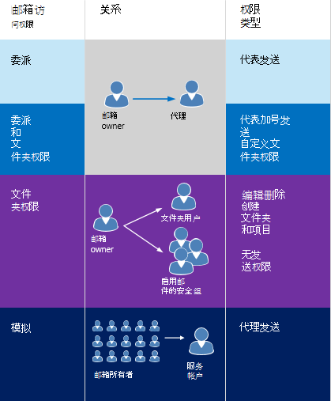

# 在 Exchange 中的模拟和 EWSImpersonation and EWS in Exchange

了解如何以及何时在 Exchange [服务应用程序](ews-application-types.md)中使用模拟。Learn how and when to use impersonation in your Exchange [service applications](ews-application-types.md).
  
可通过以下三种方式之一使用户能够访问其他用户的邮箱：You can enable users to access other users' mailboxes in one of three ways:
  
- 为每个代理添加代理并指定权限。By adding delegates and specifying permissions for each delegate.
    
- 直接修改文件夹权限。By modifying folder permissions directly.
    
- 使用模拟。By using impersonation.
    
何时应选择模拟，而不是代理或者或文件夹权限呢？When should you choose impersonation over delegation or folder permissions? 以下准则将帮助你确定：The following guidelines will help you decide:
  
- 如果想要为用户提供对文件夹的访问权限，但不希望用户拥有“代表某人发送”的权限，请使用文件夹权限。Use folder permissions when you want to provide a user access to a folder but do not want the user to have "send on behalf of" permissions. 
    
- 当你想给一个用户代表其他用户执行工作的权限时，请使用代理访问权限。Use delegate access when you want to give one user permission to perform work on behalf of another user. 通常情况下，这是一对一或一对多的权限，例如，单一管理助手管理管理员的日历，或单一分组讨论室计划程序管理一组会议室的日历。Typically, this is a one-to-one or one-to-a-few permission - for example, a single administrative assistant managing the calendar for an administrator, or a single room scheduler managing the calendars for a group of meeting rooms.
    
- 如果服务应用程序需要访问多个邮箱并“充当”邮箱的所有者，请使用模拟。Use impersonation when you have a service application that needs to access multiple mailboxes and "act as" the mailbox owner.
    
当你处理多个邮箱时，模拟是最佳选择，因为你可以轻松地对一个服务帐户授予对数据库中每个邮箱的访问权限。Impersonation is the best choice when you're dealing with multiple mailboxes because you can easily grant one service account access to every mailbox in a database. 代理和文件夹权限最适用于仅授予几个用户访问权限的情况，因为你必须对每个邮箱单独添加权限。Delegation and folder permissions are best when you're only granting access to a few users, because you have to add permissions individually to each mailbox. 图 1 显示了每种类型的访问权限之间的一些差异。Figure 1 shows some of the differences between each type of access.
  
**图 1。访问其他用户邮箱的方式****Figure 1. Ways to access other users' mailboxes**

  
模拟非常适用于连接到 Exchange Online 的应用程序、作为 Office 365 一部分的 Exchange Online 和本地版本的 Exchange ，以及执行操作（例如，存档电子邮件、为休假的用户自动设置外出，或任何需要应用程序充当邮箱所有者的其他任务）。Impersonation is ideal for applications that connect to Exchange Online, Exchange Online as part of Office 365, and on-premises versions of Exchange and perform operations, such as archiving email, setting OOF automatically for users on vacation, or any other task that requires that the application act as the owner of a mailbox. 如果应用程序使用模拟发送邮件，则电子邮件将看起来像是由邮箱所有者发送。When an application uses impersonation to send a message, the email appears to be sent from the mailbox owner. 收件人无法知道该邮件是由服务帐户发送的。There is no way for the recipient to know the mail was sent by the service account. 另一方面，代理则可向另一个邮箱帐户授予代表邮箱所有者操作的权限。Delegation, on the other hand, gives another mailbox account permission to act on behalf of a mailbox owner. 当代理发送电子邮件时，“发件人”值将标识邮箱所有者，并且“发送者”值将标识发送邮件的代理。When an email message is sent by a delegate, the "from" value identifies the mailbox owner, and the "sender" value identifies the delegate that sent the mail. 
  
## 模拟的安全注意事项Security considerations for impersonation

模拟使呼叫者能够模拟给定的用户帐户。Impersonation enables a caller to impersonate a given user account. 这使呼叫者能够使用与模拟帐户相关联的权限来执行操作，而不是与呼叫者帐户相关联的权限。This enables the caller to perform operations by using the permissions that are associated with the impersonated account, instead of the permissions that are associated with the caller's account. 因此，应注意以下安全注意事项：For this reason, you should be aware of the following security considerations:
  
- 只有 Exchange 服务器管理员授予 **ApplicationImpersonation** 角色的帐户可以使用模拟。Only accounts that have been granted the **ApplicationImpersonation** role by an Exchange server administrator can use impersonation. 
    
- 你应该创建管理范围，限制只有指定帐户组可以使用模拟。You should create a management scope that limits impersonation to a specified group of accounts. 如果未创建管理范围，则 **ApplicationImpersonation** 角色会被授予组织中的所有帐户。If you do not create a management scope, the **ApplicationImpersonation** role is granted to all accounts in an organization. 
    
- 通常情况下， **ApplicationImpersonation** 角色会被授予专用于特定应用程序或应用程序组的服务帐户，而不是用户帐户。Typically, the **ApplicationImpersonation** role is granted to a service account dedicated to a particular application or group of applications, rather than a user account. 你可以根据需要创建多个或少个服务帐户。You can create as many or as few service accounts as you need. 
    
你可以阅读有关 [配置模拟](how-to-configure-impersonation.md)的详细信息，但应与 Exchange 管理员合作，确保你使用 [权限和访问](https://technet.microsoft.com/library/dd351175%28v=exchg.150%29.aspx) 来创建需要的且能满足组织安全要求的服务账户。You can read more about [configuring impersonation](how-to-configure-impersonation.md), but you should work with your Exchange administrator to ensure that the service accounts that you need are created with the [permissions and access](https://technet.microsoft.com/library/dd351175%28v=exchg.150%29.aspx) that meet the security requirements of your organization. 
  
## 本节内容In this section

- [配置模拟Configure impersonation](how-to-configure-impersonation.md)
    
- [标识要模拟的帐户Identify the account to impersonate](how-to-identify-the-account-to-impersonate.md)
    
- [使用 Exchange 模拟添加约会Add appointments by using Exchange impersonation](how-to-add-appointments-by-using-exchange-impersonation.md)

## EWS 模拟的性能注意事项Performance considerations for EWS impersonation

使用 EWS 模拟时，应始终正确设置 X-AnchorMailbox。When EWS Impersonation is used, the X-AnchorMailbox should always be correctly set.  否则，可能会时不时收到错误消息 500 或 503。Otherwise, you may get error messages 500 or 503 at times. 这对于 Exchange Online/Exchange 2013 的性能和通知是至关重要的。It is critical for performance and also for notifications with Exchange Online/Exchange 2013.  不设置的话可能会用上两倍或更长的时间来完成调用。Not setting it can double or more the time it takes to complete the call. 在某些情况下，你还可能会超时。In some cases, you can also get timeouts. 
    
## 另请参阅See also

- [开发 Exchange Web 服务客户端Develop web service clients for Exchange](develop-web-service-clients-for-exchange.md)
    
- [Exchange 中的代理访问和 EWSDelegate access and EWS in Exchange](delegate-access-and-ews-in-exchange.md)
    
- [Exchange 2013 权限Exchange 2013 Permissions](https://technet.microsoft.com/library/dd351175%28v=exchg.150%29.aspx)
    

