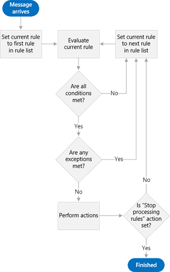

# Inbox management and EWS in Exchange

了解如何通过使用收件箱规则和阻止发件人列表来管理 EWS 托管 API 或 EWS 应用程序中的收件箱。
  
Exchange 邮箱附带功能，可帮助用户自动组织传入邮件。 这些功能都在服务器上运行，无需用户干预，但它们满足不同的需求。 EWS 托管 API 和 EWS 提供了对这些功能的访问权限，使用户可以管理其收件箱。
  
**表1。收件箱管理功能**

|**如果您想要 .。。**|**使用 .。。**|
|:-----|:-----|
|根据特定条件（如发件人、主题或附件）对传入邮件执行操作（例如将其移动到其他文件夹或将其删除）    |收件箱规则    |
|删除来自特定发件人的所有传入邮件    |阻止发件人列表    |
   
## 收件箱规则

让我们面对 it：并不是每封电子邮件的创建都相等。 对于用户从其经理那里获得的每封电子邮件，从 Internet cat 视频通讯组列表中有一个，他或她以前加入了几年，而从未收到离开。 尽管 Internet cat 视频非常有趣，但通讯组列表获取的流量可能已过期，并且在收件箱中通讯组列表邮件的海洋中可以很容易地丢失重要邮件。 许多用户会转到收件箱规则，帮助 pare 这些邮件，并使其收件箱地利用的位置变得很多。 通过 Exchange Web 服务（EWS），应用程序可以让规则的强大功能得以承受。
  
EWS 托管 API 提供用于处理规则的[GetInboxRules](https://msdn.microsoft.com/library/microsoft.exchange.webservices.data.exchangeservice.getinboxrules%28v=exchg.80%29.aspx)和[ExchangeService](https://msdn.microsoft.com/library/microsoft.exchange.webservices.data.exchangeservice.updateinboxrules%28v=exchg.80%29.aspx)方法。 EWS 提供用于处理规则的[GetInboxRules](https://msdn.microsoft.com/library/b4b2701a-4a23-4acc-8c75-19f7955ad7ae%28Office.15%29.aspx)和[UpdateInboxRules](https://msdn.microsoft.com/library/f982a237-471e-45c5-a2b5-468cfc53150b%28Office.15%29.aspx)操作。 但是，请注意，在使用收件箱规则时，EWS 托管 API 和 EWS 具有以下限制： 
  
- EWS 无法访问或创建 "仅客户端" 规则或在 Outlook 中设置为 "仅在此计算机上运行" 的规则。
    
- 若要使用 EWS 更改当前的一组规则，必须删除 Outlook 规则 BLOB （如果存在）。 这意味着，使用 EWS 修改规则将删除以前使用 Outlook 关闭（禁用）的任何规则。 
    
### 规则的工作原理

规则引擎充当用户邮箱的网关守卫。 当邮件到达用户的邮箱，但在收件箱中显示该邮件之前，将根据规则的排序列表对该邮件进行评估。 请注意，这仅发生在到达时，并且仅发生在收件箱中。 这些规则由三部分组成：[条件](#bk_Conditions)、[操作](#bk_Actions)和[例外](#bk_Exceptions)。
  
从规则列表顶部的规则开始，规则引擎将执行以下步骤，直至到达规则列表的末尾：
  
1. 检查邮件以确定它是否符合规则中指定的所有条件。
    
1. 如果它满足所有条件，请继续执行步骤2评估。
    
2. 如果它不符合所有条件，规则引擎将加载规则列表中的下一个规则，然后在步骤1中启动。
    
2. 检查邮件以确定它是否符合规则中指定的任何例外。
    
1. 如果它满足任何例外，规则引擎将加载规则列表中的下一个规则，然后在步骤1中启动。
    
2. 如果它不符合任何例外，请继续执行步骤3评估。
    
3. 对邮件执行规则中指定的操作。
    
1. 如果指定了 "停止处理更多规则" 操作，规则引擎将对邮件执行所有其他操作，然后退出而不评估邮件的任何其他规则。
    
2. 如果未指定 "停止处理更多规则" 操作，规则引擎将加载规则列表中的下一个规则，然后在步骤1中启动。
    
下图显示规则引擎遵循的过程。
  
**图1：规则引擎概述**

  
### 将组成部分放在一起-规则的各个部分

可视化规则的各个部分的一种方法是假设您向负责组织传入电子邮件的人员提供说明。 您可以向此人说： "当邮件到达时" \<insert conditions here\> ，则 \<insert actions here\> 除非邮件 \<insert exceptions here\> 。 让我们进一步了解每个部分。
  
#### 条件

[条件](https://msdn.microsoft.com/library/f049a48c-9585-43f7-8549-0b8cb19a5eea%28Office.15%29.aspx)描述应何时应用规则。 虽然您可以省略规则的条件（结果是应用于每个收到的邮件的规则），但对于规则而言，有一些条件适用于传入邮件的子集更常见。 一些示例包括 "当邮件来自 Sadie" 或 "当邮件发送到 ' Cat Video Lovers 更改 ' 通讯组列表 ' 时"。 规则可以有多个条件。 当规则具有多个条件时，必须满足所有条件，规则引擎才能执行指定的操作。 
  
#### 操作

[操作](https://msdn.microsoft.com/library/c5aa96b1-2d8b-422f-8c2f-f118572ab23f%28Office.15%29.aspx)描述应用规则时所发生的情况。 例如 "将邮件移动到 ' 猫 ' 文件夹" 或 "使用 ' 重要性 ' 较低的邮件标记"。 规则可以有多个操作。 当您为某个规则指定多个操作时，将在应用该规则时执行所有操作。 
  
#### 异常

[异常](https://msdn.microsoft.com/library/7cd63ac2-3441-4ed4-915b-6f90af4b28fc%28Office.15%29.aspx)描述规则不应应用的时间，即使满足条件中指定的条件也是如此。 例如，"仅将邮件发送给我" 或 "邮件来自 Mom" 时除外。 一个规则可以有多个例外。 如果规则具有多个异常，并且满足了任何异常，则不会应用该规则。 
  
### 示例： Herding 这些猫

我们来看看您的用户如何使用规则来消除来自该 Internet cat 视频通讯组列表的流量。 让我们假定以下内容：
  
- 这些邮件将被发送到名为 "Internet Cat Video 爱好者" 的通讯组列表。
    
- 您的用户希望最终阅读这些邮件，它们只是不希望他们打乱其收件箱。 而是将其文件放在名为 "猫" 的文件夹中。
    
- 您的用户希望立即阅读通过其母亲发送到此通讯组列表的邮件，因为 Mom 发送 funniest 视频。
    
这将告知规则引擎以下内容： "当邮件到达时发送到 ' Internet Cat 视频爱好者 ' 通讯组 ' 列表时，请将其移至" 猫 "文件夹，除非邮件来自 Mom。" 
  
**表2。规则定义**

|**规则部件**|**值**|
|:-----|:-----|
|条件    |发送到 "Internet Cat 视频爱好者" 通讯组列表    |
|操作    |将邮件移动到 "猫" 文件夹    并停止处理更多规则    |
|异常    |从 "Mom"    |
   
> [!NOTE]
> 请注意，"停止处理更多规则" 是结果规则中的操作之一。 通常，最好将此操作包括在内，以避免因规则对任何给定的邮件起作用而产生困惑。 但是，通过省略此操作并正确地对规则进行排序，可以实现对传入邮件的更高级处理。 在这种情况下，可能是因为 Internet cat 视频邮件不需要很多高级处理方式。 
  
在创建此规则后不久，将会收到一封新邮件。 同事希望向通讯组列表发送一封邮件。 如果我们 mentally 执行规则引擎的工作，则邮件将满足所有条件（它将发送到 "Internet Cat 视频爱好者"），并且不会满足任何例外（不是来自 "Mom"），因此规则将应用并将邮件移动到 "猫" 文件夹。
  
下图显示了如何将规则应用于传入邮件。
  
**图2。传入邮件由规则处理**

  
## 阻止发件人

虽然您可以创建将来自特定发件人的所有邮件移动到 "垃圾邮件" 文件夹的规则，但您也可以通过使用 "垃圾邮件" 选项中的阻止发件人列表来执行此操作。 由于用户可以拥有的规则数有限制，因此使用阻止的发件人列表很有意义。 您可以使用[ExchangeService](https://msdn.microsoft.com/library/microsoft.exchange.webservices.data.exchangeservice.markasjunk%28v=exchg.80%29.aspx) EWS 托管 API 方法或[MarkAsJunk](https://msdn.microsoft.com/library/1f71f04d-56a9-4fee-a4e7-d1034438329e%28Office.15%29.aspx) Ews 操作在[阻止发件人列表中添加或删除特定的电子邮件地址](how-to-add-and-remove-email-addresses-from-blocked-senders-list-by-using-ews.md)。 请注意，为了使 EWS 能够访问阻止的发件人列表，用户的邮箱必须包含来自您要添加或删除的电子邮件地址的电子邮件。 
  
## 本节内容

- [使用 Exchange 中的 EWS 管理收件箱规则](how-to-manage-inbox-rules-by-using-ews-in-exchange.md)
    
- [使用 Exchange 中的 EWS 在阻止的发件人列表中添加和删除电子邮件地址](how-to-add-and-remove-email-addresses-from-blocked-senders-list-by-using-ews.md)
    
## 另请参阅

- [开发 Exchange Web 服务客户端](develop-web-service-clients-for-exchange.md)
    
- [GetInboxRules 操作](https://msdn.microsoft.com/library/b4b2701a-4a23-4acc-8c75-19f7955ad7ae%28Office.15%29.aspx)
    
- [UpdateInboxRules 操作](https://msdn.microsoft.com/library/f982a237-471e-45c5-a2b5-468cfc53150b%28Office.15%29.aspx)
    
- [MarkAsJunk 操作](https://msdn.microsoft.com/library/1f71f04d-56a9-4fee-a4e7-d1034438329e%28Office.15%29.aspx)
    

