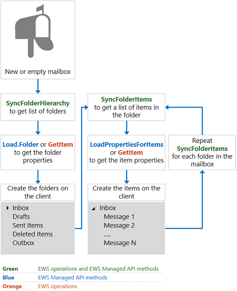
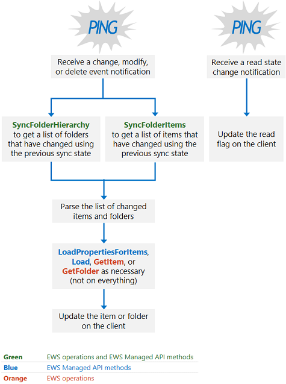

# 邮箱同步和交换中的 EWSMailbox synchronization and EWS in Exchange

了解当您使用 EWS 访问 Exchange 时，邮箱同步的工作方式。Find out how mailbox synchronization works when you use EWS to access Exchange.
  
Exchange 中的 EWS 使用两种类型的同步来检索邮箱内容和对邮箱内容所做的更改：EWS in Exchange uses two types of synchronization to retrieve mailbox content and changes to mailbox content:
  
- 文件夹同步Folder synchronization
    
- 项目同步Item synchronization
    
在本文中，您将了解这两种类型的同步、同步的工作方式、同步设计模式和同步最佳实践。In this article, you'll learn about both types of synchronization, how synchronization works, synchronization design patterns, and synchronization best practices.
  
## 文件夹和项目同步Folder and item synchronization

文件夹同步同步文件夹结构或文件夹层次结构。Folder synchronization syncs a folder structure, or folder hierarchy. 项目同步将同步文件夹中的项目。Item synchronization syncs the items within a folder. 在同步项目时，您必须单独同步邮箱中的每个文件夹。When you synchronize items, you have to sync each folder in the mailbox independently. 您可以在应用程序中使用 EWS 或 EWS 托管 API 来实现文件夹和项目同步。You can use EWS or the EWS Managed API in your application to implement both folder and item synchronization.
  
**表1。用于同步文件夹和项目的 EWS 操作和 EWS 托管 API 方法****Table 1. EWS operations and EWS Managed API methods for syncing folders and items**

|**EWS 操作****EWS operation**|**EWS 托管的 API 方法****EWS Managed API method**|
|:-----|:-----|
|[SyncFolderHierarchySyncFolderHierarchy](https://msdn.microsoft.com/library/b31916b1-bc6c-4451-a475-b7c5417f752d%28Office.15%29.aspx)   |[ExchangeService 方法ExchangeService.SyncFolderHierarchy method](https://msdn.microsoft.com/library/microsoft.exchange.webservices.data.exchangeservice.syncfolderhierarchy%28v=exchg.80%29.aspx)   |
|[SyncFolderItemsSyncFolderItems](https://msdn.microsoft.com/library/7f0de089-8876-47ec-a871-df118ceae75d%28Office.15%29.aspx)   |[ExchangeService 方法ExchangeService.SyncFolderItems method](https://msdn.microsoft.com/library/microsoft.exchange.webservices.data.exchangeservice.syncfolderitems%28v=exchg.80%29.aspx)   |
   
发生的同步的范围因是初始同步还是持续同步而有所不同，如下所示：The scope of the synchronization that occurs differs depending on whether it is an initial or an ongoing sync, as follows:
  
- 初始同步将服务器上的所有文件夹或项目同步到客户端。An initial synchronization syncs all folders or items on the server to the client. 初始同步之后，客户端将拥有存储的同步状态以供将来同步。After the initial synchronization, the client has a sync state that it stores for future synchronizations. 同步状态表示服务器与客户端通信的所有更改。The sync state represents all the changes on the server that the server communicated to the client.
    
- 正在进行的同步同步自上次同步以来添加、删除或更改的任何项目或文件夹。Ongoing synchronizations sync any items or folders that have been added, deleted, or changed since the previous synchronization. 在每个正在进行的同步循环期间，服务器使用同步状态计算要报告给客户端的更改。The server uses the sync state to calculate the changes to report to the client during each of the ongoing synchronization loops.
    
每个同步方法或操作都会返回更改的列表，而不是实际更改的文件夹或邮件。Each synchronization method or operation returns a list of changes, not the actual folder or message that changed. 对项目和文件夹所做的更改通过以下更改类型进行报告：Changes to items and folders are reported by means of the following change types:
  
- 创建—指示应在客户端上创建一个新的项目或文件夹。Create — Indicates that a new item or folder should be created on the client.
    
- Update-指示应在客户端上更改项目或文件夹。Update — Indicates that an item or folder should be changed on the client.
    
- 删除—指示应在客户端上删除某个项目或文件夹。Delete — Indicates that an item or folder should be deleted on the client.
    
- ReadStateChange for EWS 或 ReadFlagChange for EWS 托管 API —指示项目的读取状态已更改，可以从 "已读" 更改为 "已读"，也可以读取为 "未读"。ReadStateChange for EWS or ReadFlagChange for the EWS Managed API — Indicates that that the read state of the item has changed, either from unread to read, or read to unread.
    
在 Exchange Online 中，作为 Office 365 的一部分的 Exchange Online 和从 Exchange 2010 SP2 开始的 Exchange 版本，将按从新到旧的顺序返回项目和文件夹。In Exchange Online, Exchange Online as part of Office 365, and versions of Exchange starting with Exchange 2010 SP2, items and folders are returned in order from newest to oldest. 在早期版本的 Exchange 中，项目和文件夹从最旧到最新返回。In previous versions of Exchange, items and folders are returned from oldest to newest.
  
## EWS 同步的工作原理是什么？How does EWS synchronization work?

简言之，如果您是第一次同步邮箱，请使用图1中所示的过程。In a nutshell, if you're synchronizing a mailbox for the first time, use the process as shown in Figure 1. 虽然您可以使用其他[同步设计模式](mailbox-synchronization-and-ews-in-exchange.md#bk_syncpatterns)，但我们建议对可伸缩应用程序使用此方法。Although you can use other [synchronization design patterns](mailbox-synchronization-and-ews-in-exchange.md#bk_syncpatterns), we recommend this approach for scalable applications.
  
**图1。初始同步设计模式****Figure 1. Initial synchronization design pattern**

  
如果您在客户端上使用现有同步状态来同步邮箱，我们建议您实现设计模式，如图2中所示。If you're using an existing sync state on the client to synchronize a mailbox, we recommend that you implement the design pattern as shown in Figure 2. 
  
**图2。持续的同步设计模式****Figure 2. Ongoing synchronization design pattern**

  
## 同步设计模式Synchronization design patterns

您可以在应用程序中使用两种同步设计模式之一，使邮箱保持最新：基于通知的同步或仅同步方法。You can use one of two synchronization design patterns in your application to keep your mailboxes up to date: notification-based synchronization, or the synchronization-only approach.
  
基于通知的同步（如[图 2](mailbox-synchronization-and-ews-in-exchange.md#bk_howdoesitwork)中所示）依赖于通知客户端以调用 EWS 托管 API [SyncFolderItems](https://msdn.microsoft.com/library/microsoft.exchange.webservices.data.exchangeservice.syncfolderitems%28v=exchg.80%29.aspx)或[SyncFolderHierarchy](https://msdn.microsoft.com/library/microsoft.exchange.webservices.data.exchangeservice.syncfolderhierarchy%28v=exchg.80%29.aspx)方法或 EWS [SyncFolderHierarchy](https://msdn.microsoft.com/library/b31916b1-bc6c-4451-a475-b7c5417f752d%28Office.15%29.aspx)或[SyncFolderItems](https://msdn.microsoft.com/library/7f0de089-8876-47ec-a871-df118ceae75d%28Office.15%29.aspx)操作的通知。Notification-based synchronization, as illustrated in [Figure 2](mailbox-synchronization-and-ews-in-exchange.md#bk_howdoesitwork), relies on notifications to alert the client to make a call to the EWS Managed API [SyncFolderItems](https://msdn.microsoft.com/library/microsoft.exchange.webservices.data.exchangeservice.syncfolderitems%28v=exchg.80%29.aspx) or [SyncFolderHierarchy](https://msdn.microsoft.com/library/microsoft.exchange.webservices.data.exchangeservice.syncfolderhierarchy%28v=exchg.80%29.aspx) methods, or the EWS [SyncFolderHierarchy](https://msdn.microsoft.com/library/b31916b1-bc6c-4451-a475-b7c5417f752d%28Office.15%29.aspx) or [SyncFolderItems](https://msdn.microsoft.com/library/7f0de089-8876-47ec-a871-df118ceae75d%28Office.15%29.aspx) operations. 此类型的同步通常建议用于可伸缩应用程序，但它可能不是每个人的最佳方法。This type of synchronization is generally recommended for scalable applications, but it might not be the best approach for everyone. 基于通知的同步具有以下优点：Notification-based synchronization has the following advantage: 
  
- 对通知进行了优化，以减少对后端 Exchange 数据库的调用。Notifications are optimized to reduce calls to the backend Exchange database. 事件队列和订阅由邮箱服务器（或 Exchange 2010 中的客户端访问服务器和 Exchange 2007）管理;但是，事件和订阅的管理使用的资源比替代方案更少，这是对 Exchange 数据库的更频繁的同步调用。Event queues and subscriptions are managed by the mailbox server (or the Client Access server in Exchange 2010 and Exchange 2007); however, the management of the events and subscriptions uses fewer resources than the alternative, which is more frequent synchronization calls to the Exchange database. 此外，Exchange 具有针对通知和订阅的特定[限制策略](ews-throttling-in-exchange.md)，以保护资源的消耗。In addition, Exchange has specific [throttling policies](ews-throttling-in-exchange.md) for notifications and subscriptions, to safeguard consumption of resources. 
    
但是，使用基于通知的同步还有一些缺点：However, there are also some drawbacks to using notification-based synchronization:
  
- 通知会发出干扰，因为大多数方案都涉及针对一个用户意图的多个通知。Notifications are noisy because most scenarios involve multiple notifications for one user intent. 对于 "日历" 文件夹，尤其如此。This is especially true of the Calendar folder. 例如，当收到单个会议请求时，将创建多个项目和文件夹通知，包括通知以创建该项目以及另一个用于修改项目的通知。For example, when a single meeting request is received, multiple item and folder notifications are created, including a notification to create the item and another to modify the item. 缓解此缺点的一种方法是在[Load](https://msdn.microsoft.com/library/microsoft.exchange.webservices.data.serviceobject.load%28v=exchg.80%29.aspx)、 [LoadPropertiesForItems](https://msdn.microsoft.com/library/microsoft.exchange.webservices.data.exchangeservice.loadpropertiesforitems%28v=exchg.80%29.aspx)、 [GetItem](https://msdn.microsoft.com/library/exchange/aa565934%28v=exchg.150%29.aspx.aspx)或[GetFolder](https://msdn.microsoft.com/library/exchange/aa580274%28v=exchg.150%29.aspx.aspx)调用中构建几秒钟的延迟。One way to mitigate this drawback is to build a delay of a few seconds into your [Load](https://msdn.microsoft.com/library/microsoft.exchange.webservices.data.serviceobject.load%28v=exchg.80%29.aspx), [LoadPropertiesForItems](https://msdn.microsoft.com/library/microsoft.exchange.webservices.data.exchangeservice.loadpropertiesforitems%28v=exchg.80%29.aspx), [GetItem](https://msdn.microsoft.com/library/exchange/aa565934%28v=exchg.150%29.aspx.aspx), or [GetFolder](https://msdn.microsoft.com/library/exchange/aa580274%28v=exchg.150%29.aspx.aspx) call. 在会议请求的情况下，如果您立即调用**GetItem**操作，您可能会有一个调用来创建该项目，另一个则用于修改项目。In the case of a meeting request, if you made calls to the **GetItem** operation immediately, you might have one call to create the item and another to modify the item. 相反，通过延迟调用，可以一次调用**GetItem**操作，并同时获取同时包含创建和修改项的更改。Instead, by delaying the call, you can call the **GetItem** operation once and get the changes that encompass the creation and the modification of the item at the same time. 
    
- 在邮箱服务器上对通知进行排队，并将订阅保存在邮箱服务器上。Notifications are queued on the mailbox server and subscriptions are saved on the mailbox server. 如果管理订阅的邮箱服务器不可用，则会丢失任何新通知，邮箱将不会同步，并且必须重新订阅通知。If the mailbox server that manages the subscription is unavailable, you lose any new notifications, your mailbox won't synchronize, and you'll have to resubscribe to the notifications.
    
- 当通知失败时，您需要规划缓解策略。You'll need to plan for mitigation strategies in the event that notifications fail. 这样一来，第二种方法（仅同步设计模式）比基于通知的同步更具弹性，因为它只要求客户端保持同步状态，因此与管理订阅的邮箱服务器之间没有任何相关性问题。In this way, the second approach, the synchronization-only design pattern, is more resilient than notification-based synchronization, because it only requires that the client maintain the sync state — there are no issues with affinity to the mailbox server managing the subscription.
    
如果按建议实现，基于通知的订阅设计模式依赖于：If implemented as recommended, the notification-based subscription design pattern relies on: 
  
- 用于确定数据更改*时间*的通知。Notifications to determine  *when*  the data changed. 
    
- EWS 托管 API **SyncFolderHierarchy**或**SyncFolderItems**方法，或 ews **SyncFolderHierarchy**或**SyncFolderItems**操作来确定已更改的*内容*，并优化返回的同步事件数。The EWS Managed API **SyncFolderHierarchy** or **SyncFolderItems** methods, or the EWS **SyncFolderHierarchy** or **SyncFolderItems** operations to determine  *what*  changed, optimizing the number of sync events returned. 是创建、更新还是删除了新项？Was a new item created, updated, or deleted? 这就是这些方法所需了解的全部，而不依赖于它们的更改属性列表。That's all you need to know from these methods, don't rely on them for the property list of changes. （不要在返回的所有项目或文件夹中执行**GetItem**或**LoadPropertiesForItems**调用）。(Don't do a **GetItem** or **LoadPropertiesForItems** call on all items or folders returned). 
    
- 使用 EWS 托管 API 中的**Load**或**LoadPropertiesForItems**方法，或 ews **GetItem**操作来确定数据更改的*方式*，并根据需要从服务器检索属性，根据返回的数据量组织批处理请求。Using the **Load** or **LoadPropertiesForItems** methods in the EWS Managed API, or the EWS **GetItem** operation to determine  *how*  the data changed and to retrieve properties from the server as needed, organizing batched requests based on the amount of data that will be returned. 接下来是比较客户端上的属性和刚刚从服务器返回的属性，最后是在客户端上创建、删除或修改项目或文件夹。This is followed by a comparison of the properties on the client and those just returned from the server, and ultimately the creation, deletion, or modification of the item or folder on the client. 
    
仅同步方法完全依赖于**SyncFolderItems**和**SYNCFOLDERHIERARCHY** ews 托管 API 方法，或者是**SyncFolderHierarchy**或**SyncFolderItems** ews 操作，可以连续调用，也可以作为定时事件调用。The synchronization-only approach relies entirely on the **SyncFolderItems** and **SyncFolderHierarchy** EWS Managed API methods, or the **SyncFolderHierarchy** or **SyncFolderItems** EWS operations, which you can either call continuously, or as a timed event. 此选项也有优缺点。There are pros and cons to this option as well. 仅同步方法更具弹性，因为同步状态存储在邮箱级别的客户端上，而同步状态和维护通知订阅的任何邮箱服务器之间的唯一关系则不是必需的。The synchronization-only approach is more resilient because the sync state is stored on the client at the mailbox level and a unique relationship between the sync state and any the mailbox server that maintains the notification subscription is not required. 同步方法可经受邮箱故障转移，因为它独立于邮箱服务器。The synchronization approach can survive a mailbox failover because of its independence from the mailbox server. 但是，同步方法会增加用户的延迟时间，因为项目会定期同步，而不是在项目到达时实时同步。However, the synchronization approach increases latency for the user because items are synchronized on a timed or intermittent basis — not in real time when items arrive. 此方法的成本也更高，因为在可能发生任何更改时，您正在调用 Exchange 数据库。This approach is also more costly, because you're making calls to the Exchange database when it's possible that no changes have occurred. 
  
## 同步最佳实践Synchronization best practices

对于高度可伸缩的应用程序，我们建议您遵循以下最佳实践来同步您的应用程序中的邮箱：For highly scalable applications, we recommend that you apply the following best practices to synchronize mailboxes in your application:
  
- 调用 EWS 托管 API **SyncFolderItems**或**SyncFolderHierarchy**方法时，使用_propertySet_参数的_IdOnly_值，或者在使用 EWS **SyncFolderHierarchy**或**SyncFolderItems**操作时使用 IdOnly 值的**BaseShape**值来减少[BaseShape](https://msdn.microsoft.com/library/42c04f3b-abaa-4197-a3d6-d21677ffb1c0%28Office.15%29.aspx)对 Exchange 数据库的调用。When calling the EWS Managed API **SyncFolderItems** or **SyncFolderHierarchy** method use the  _IdOnly_ value for the  _propertySet_ parameter, or when using the EWS **SyncFolderHierarchy** or **SyncFolderItems** operations use the **IdOnly** value for the [BaseShape](https://msdn.microsoft.com/library/42c04f3b-abaa-4197-a3d6-d21677ffb1c0%28Office.15%29.aspx) value to reduce calls to the Exchange database. 您在**SyncFolderItems**或**SyncFolderHierarchy**调用的属性集中请求的属性越多，创建的后端调用就越多。The more properties you request in the property set of the **SyncFolderItems** or **SyncFolderHierarchy** call, the more backend calls are created. 对每个请求的属性值进行一次新的 RPC 调用，而只进行一个用于检索请求的所有**ItemIds**的 rpc 调用-无论要报告的结果数是多少。A new RPC call is made for every property value requested, whereas only one RPC call is made to retrieve all the **ItemIds** for a request - no matter the number of results to report. 因此， **IdOnly**请求将导致一个数据库调用，而主题和发件人的属性包请求将导致三个数据库调用：一个用于一个**主题**，一个用于**发件人**，另一个用于**ItemId**。So an **IdOnly** request results in one database call, whereas a property bag request for the subject and sender results in three database calls: one for the **Subject**, one for the **Sender**, and one for the **ItemId**.
    
- 请勿在同步响应中的每个项目上调用 EWS 托管 API **Load**或**LoadPropertiesForItems**方法，或者 ews **GetItem**或**GetFolder**操作。Don't call the EWS Managed API **Load** or **LoadPropertiesForItems** methods, or the EWS **GetItem** or **GetFolder** operations, on every item in a synchronization response. 而是分析结果;查找不需要检索所有属性的更改，如读取状态更改。Instead, parse the results; look for changes that don't require all the properties to be retrieved, like read state changes. 如果响应包括读取状态更改，只需更新客户端上的标志，即可完成操作;无需获取所有项目属性。If a response includes a read state change, just update the flag on the client and you're done; no need to get all the item properties. 并确保您不会通过进行来自同一客户端的更改来重复工作。And make sure that you don't duplicate effort by making changes that originated from the same client. 例如，如果同步响应包括删除项目，并且在本地客户端上进行了删除，则无需再次删除邮件或获取该项目的所有属性。For example, if the synchronization response includes the deletion of an item, and the deletion happened on the local client, you don't need to delete the message again or get all the properties for that item. 
    
- 通过执行以下操作，避免受到限制：Avoid getting throttled, by doing the following:
    
  - 当您调用 EWS 托管 API **LoadPropertiesForItems**方法或 ews **GetItem**操作以获取批次中的项时，在请求中的项目不会过多。否则，您可能会受到[限制](ews-throttling-in-exchange.md)。When you do call the EWS Managed API **LoadPropertiesForItems** method or the EWS **GetItem** operation to get the items in a batch, do not batch too many items in your request; otherwise, you might get [throttled](ews-throttling-in-exchange.md). 建议每批次包含10个项目。We recommend that you include 10 items per batch.
    
  - 请勿在过短的时间内进行太多请求。Don't make too many requests in too short a time. 这也将导致限制，并延长响应时间，而不是缩短它。This will also cause throttling, and increase the response time, rather than shorten it. 
    
  - 如果要批处理项目，请使用与[FolderId](https://msdn.microsoft.com/library/00d14e3e-4365-4f21-8f88-eaeea73b9bf7%28Office.15%29.aspx)元素的**Id**和**ChangeKey**属性相同的值对所有项目进行批处理。If you are batching items, batch all items with the same values for the **Id** and **ChangeKey** attributes of the [FolderId](https://msdn.microsoft.com/library/00d14e3e-4365-4f21-8f88-eaeea73b9bf7%28Office.15%29.aspx) element. 
    
  - 如果确实受到限制，请停止发送请求。If you do get throttled, stop sending requests. 重新发送请求将延长恢复工作量。Resending requests will prolong the recovery effort. 而是等待后端关闭时间过期，然后再次尝试发送同步请求。Instead, wait for the back off time to expire, and then try sending your sync requests again.
    
- 根据收到的[通知事件](notification-subscriptions-mailbox-events-and-ews-in-exchange.md#bk_eventtypes)的类型：Depending on the type of [notification event](notification-subscriptions-mailbox-events-and-ews-in-exchange.md#bk_eventtypes) received: 
    
  - 对于**NewMail**或**修改**的事件，请调用 ews Managed API **SyncFolderItems**方法或 EWS **SyncFolderItems**操作，因为通知不提供**ChangeKey**，并且通知不会调用读取状态更改。For **NewMail** or **Modified** events, call the EWS Managed API **SyncFolderItems** method or the EWS **SyncFolderItems** operation because notifications do not provide a **ChangeKey**, and notifications do not call out read state changes.
    
  - 对于**已删除**事件，如果通知订阅在之前的同步之前处于活动状态，则只需在本地删除该事件即可。For **Deleted** events, if the notification subscription was active before the previous sync, just delete the event locally. 您无需在删除后立即调用 EWS Managed API **SyncFolderItems**方法或 ews **SyncFolderItems**操作。You do not need to call the EWS Managed API **SyncFolderItems** method or the EWS **SyncFolderItems** operation immediately after the deletion. 
    
  - 如果**修改**的事件是由读取状态更改导致的，请勿调用 EWS 托管 API **LOADPROPERTIESFORITEMS**方法或 ews **GetItem**操作，只需更改项目上的标志即可。If a **Modified** event was caused by a read state change, do not call the EWS Managed API **LoadPropertiesForItems** method or the EWS **GetItem** operation , just change the flag on the item. 
    
- 同步日历数据时，请执行以下操作：When synchronizing calendar data, proceed as follows:
    
  - 使用类似于基于通知的同步的方法。Use an approach similar to notification-based synchronization. 由于**SyncFolderItem**不包含任何日历逻辑，请使用 EWS 托管 api [FindAppointments](https://msdn.microsoft.com/library/dd633767%28v=exchg.80%29.aspx)方法，或使用包含[CalendarView](https://msdn.microsoft.com/library/a4a953b8-0710-416c-95ef-59e51eba9982%28Office.15%29.aspx)元素的 ews [FindItem 操作](https://msdn.microsoft.com/library/ebad6aae-16e7-44de-ae63-a95b24539729%28Office.15%29.aspx)查看两个日期之间的约会，然后调用 EWS 托管 API **LoadPropertiesForItems**方法，或使用 ews **GetItem**操作检索日历项目的项目属性。Because **SyncFolderItem** does not include any calendaring logic, use the EWS Managed API [FindAppointments](https://msdn.microsoft.com/library/dd633767%28v=exchg.80%29.aspx) method, or the EWS [FindItem operation](https://msdn.microsoft.com/library/ebad6aae-16e7-44de-ae63-a95b24539729%28Office.15%29.aspx) with the [CalendarView](https://msdn.microsoft.com/library/a4a953b8-0710-416c-95ef-59e51eba9982%28Office.15%29.aspx) element to view appointments between two dates, and then call the EWS Managed API **LoadPropertiesForItems** method, or the EWS **GetItem** operation to retrieve the item properties for the calendar item. 
    
  - 请勿使用 EWS 托管 API **FindAppointments**方法进行轮询，或使用**CALENDARVIEW**元素进行 ews **FindItem**操作。Do not poll using the EWS Managed API **FindAppointments** method, or the EWS **FindItem** operation with a **CalendarView** element. 
    
- 同步搜索文件夹时：When synchronizing search folders:
    
  - 使用类似于基于通知的同步的方法。Use an approach similar to notification-based synchronization. 
    
  - 使用通知确定数据更改的时间。Use notifications to determine when data changes.
    
  - 由于无法在搜索文件夹中使用**SyncFolderItem** ，因此请使用已排序和分页的 EWS 托管 API [FindItems](https://msdn.microsoft.com/library/microsoft.exchange.webservices.data.exchangeservice.finditems%28v=exchg.80%29.aspx)方法，或使用[FractionalPageItemView](https://msdn.microsoft.com/library/4111afec-35e7-4c6f-b291-9bbba603f633%28Office.15%29.aspx)和[SortOrder](https://msdn.microsoft.com/library/c2413f0b-8c03-46ae-9990-13338b3c53a6%28Office.15%29.aspx)元素集的 ews **FindItem**操作来确定已更改的内容。Because you can't use **SyncFolderItem** in a search folder, use a sorted and paged EWS Managed API [FindItems](https://msdn.microsoft.com/library/microsoft.exchange.webservices.data.exchangeservice.finditems%28v=exchg.80%29.aspx) method, or EWS **FindItem** operation with the [FractionalPageItemView](https://msdn.microsoft.com/library/4111afec-35e7-4c6f-b291-9bbba603f633%28Office.15%29.aspx) and [SortOrder](https://msdn.microsoft.com/library/c2413f0b-8c03-46ae-9990-13338b3c53a6%28Office.15%29.aspx) element set, to determine what changed. 
    
  - 使用 EWS 托管 API **LoadPropertiesForItems**方法或 ews **GetItem**操作检索数据。Use the EWS Managed API **LoadPropertiesForItems** method or the EWS **GetItem** operation to retrieve data. 
    
## 筛选的同步Filtered synchronization

EWS Managed API **SyncFolderItems**方法和 ews **SyncFolderItems**操作使您能够通过在 EWS 托管 API 或 ews 中的[ignore](https://msdn.microsoft.com/library/7789eec5-ceec-43f2-84d5-d0d15b734076%28Office.15%29.aspx)元素中设置_ignoreItemIds_参数，来忽略特定项目（基于其 ItemIds）。The EWS Managed API **SyncFolderItems** method and the EWS **SyncFolderItems** operation enable you to ignore specific items, based on their ItemIds, by setting the  _ignoreItemIds_ parameter in the EWS Managed API or the [Ignore](https://msdn.microsoft.com/library/7789eec5-ceec-43f2-84d5-d0d15b734076%28Office.15%29.aspx) element in EWS. 例如，当个人开始答复发送给公司中每个人的电子邮件时，这是理想的选择。This is ideal when, for example, individuals begin to reply all to an email message sent to everyone in the company. 
  
您可能会想，如果特定属性发生更改，是否可以筛选通知（从而仅触发同步）？You might wonder, can I filter my notifications (and therefore only trigger synchronization) if specific properties change? 虽然这似乎是合理的，但由于通知订阅是基于更改的类型（创建、更新、删除），而不是基于要更新的属性，因此无法通过这种方式筛选通知。Although that does seem reasonable, because notification subscriptions are based on the type of change (create, update, delete), and not the property being updated, you cannot filter notifications in this way. 相反，您可以执行以下操作：Instead, you can do the following:
  
- 使用基于通知的订阅设计模式。Use the notification-based subscription design pattern.
    
- 在将_propertySet_参数设置为_IdOnly_时，反复调用 EWS 托管 API **SyncFolderItems**和**SyncFolderHierarchy**方法，以使同步状态成为当前同步状态。Call the EWS Managed API **SyncFolderItems** and **SyncFolderHierarchy** methods repeatedly with the  _propertySet_ parameter set to  _IdOnly_ to make your sync state current. 或者，如果使用 EWS，则在**BaseShape**值设置为**IdOnly**的情况下重复调用**SyncFolderHierarchy**和**SyncFolderItems**操作。Or if using EWS, call the **SyncFolderHierarchy** and **SyncFolderItems** operations repeatedly with the **BaseShape** value set to **IdOnly**. 
    
- 放弃响应（不要对其进行分析或进行任何属性比较）。Discard the response (don't parse it or do any property comparisons).
    
- 使用 EWS 托管 API **FindItems**方法或 ews **FindItem**操作和排序和页面预填充所关注的筛选作用域中的项目。Use the EWS Managed API **FindItems** method or the EWS **FindItem** operation and sort and page to prepopulate the items in the filtered scope that you care about. 
    
- 使用您的同步状态可继续调用 EWS 托管 API **SyncFolderItems**方法或 ews **SyncFolderItems**操作，但只监视已筛选的项目集中的更改。Use your synchronization state to continue to call the EWS Managed API **SyncFolderItems** method or the EWS **SyncFolderItems** operation, but only monitor the changes in the filtered item set. 如果创建了新项目，则必须查看这些新项目是否在筛选过的范围内。If new items are created, you'll have to see if those new items are within your filtered scope. 
    
## 本节内容In this section

- [使用 Exchange 中的 EWS 同步文件夹Synchronize folders by using EWS in Exchange](how-to-synchronize-folders-by-using-ews-in-exchange.md)
    
- [使用 Exchange 中的 EWS 同步项目Synchronize items by using EWS in Exchange](how-to-synchronize-items-by-using-ews-in-exchange.md)
    
- [在 Exchange 中处理 EWS 中与同步相关的错误Handling synchronization-related errors in EWS in Exchange](handling-synchronization-related-errors-in-ews-in-exchange.md)
    
## 另请参阅See also

- [开发 Exchange Web 服务客户端Develop web service clients for Exchange](develop-web-service-clients-for-exchange.md)
    
- [SyncFolderItems 方法SyncFolderItems method](https://msdn.microsoft.com/library/microsoft.exchange.webservices.data.exchangeservice.syncfolderitems%28v=exchg.80%29.aspx)
    
- [SyncFolderHierarchy 方法SyncFolderHierarchy method](https://msdn.microsoft.com/library/microsoft.exchange.webservices.data.exchangeservice.syncfolderhierarchy%28v=exchg.80%29.aspx)
    
- [SyncFolderHierarchy 操作SyncFolderHierarchy operation](https://msdn.microsoft.com/library/b31916b1-bc6c-4451-a475-b7c5417f752d%28Office.15%29.aspx)
    
- [SyncFolderItems 操作SyncFolderItems operation](https://msdn.microsoft.com/library/7f0de089-8876-47ec-a871-df118ceae75d%28Office.15%29.aspx)
    

