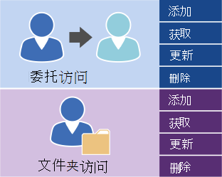

# 使用 EWS 在 Exchange 管理用户访问Managing user access by using EWS in Exchange

了解用于管理用户帐户访问您的 Exchange 服务器，您的选项。Find out what your options are for managing user account access to your Exchange server.
  
Exchange Web Services (EWS) 和 EWS 托管 API 提供有限的操作的可用来管理 Exchange Online、 Exchange Online 作为 Office 365 的一部分或的开头 Exchange 2013 的 Exchange 版本上的帐户。Exchange Web Services (EWS) and the EWS managed API provide a limited number of operations that you can use to manage accounts on Exchange Online, Exchange Online as part of Office 365, or a version of Exchange starting with Exchange 2013. 管理委派并设置其他帐户的文件夹的访问权限，可以使用下面的图中所示的操作。You can use the operations shown in the following figure to manage delegates and to set folder access permissions for other accounts. 
  
**委托和文件夹访问 EWS 操作****EWS operations for delegate and folder access**

  
如果您的应用程序需要其他控制 Exchange 服务器上的帐户，您可以使用 Exchange 命令行管理程序 cmdlet 管理帐户。If your application needs additional control over the accounts on an Exchange server, you can use Exchange Management Shell cmdlets to manage the accounts. 您可以通过执行以下某项操作来呼叫的 Exchange 命令行管理程序 cmdlet:You can call the Exchange Management Shell cmdlets by doing one of the following:
  
- 编写使用 C# 或 Visual Basic 调用的 Exchange 命令行管理程序 cmdlet 的应用程序。Writing an application using C# or Visual Basic that calls the Exchange Management Shell cmdlets. 您可以查看[Exchange Management Shell API 文档](../management/exchange-management-shell.md)，以了解如何调用 cmdlet 中的示例代码。You can look at the sample code in the [Exchange Management Shell API documentation](../management/exchange-management-shell.md) to learn how to call a cmdlet. 
    
- 使用 Windows PowerShell 和 Windows PowerShell 脚本呼叫 Exchange Management Shell cmdlet。Using Windows PowerShell and Windows PowerShell scripts to call Exchange Management Shell cmdlets. 您可以找到[Exchange Server PowerShell (Exchange Management Shell)](https://docs.microsoft.com/en-us/powershell/exchange/exchange-server/exchange-management-shell?view=exchange-ps)，以及介绍如何使用它们的示例的完整列表。You can find a complete list of the [Exchange Server PowerShell (Exchange Management Shell)](https://docs.microsoft.com/en-us/powershell/exchange/exchange-server/exchange-management-shell?view=exchange-ps), along with examples that show how to use them. 
    
## 另请参阅See also

- [EWS 应用程序设置Setting up your EWS application](setting-up-your-ews-application.md)   
- [Exchange 2013 CmdletExchange 2013 Cmdlets](https://docs.microsoft.com/en-us/powershell/exchange/?view=exchange-ps)  
    

