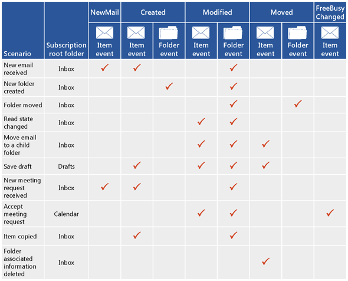

# 通知订阅、 邮箱事件和 Exchange 中的 EWSNotification subscriptions, mailbox events, and EWS in Exchange

了解有关通知订阅和 EWS 中的邮箱事件在 Exchange。Find out about notification subscriptions and mailbox event in EWS in Exchange.
  
您可以使用 EWS 托管 API 和 Exchange Web Services (EWS) 订阅事件发生在邮箱，或在一个或多个邮箱中的一个文件夹中时收到通知。You can use both the EWS Managed API and Exchange Web Services (EWS) to subscribe to receive notifications when events occur in a mailbox, or in one or more of the folders in a mailbox. 有三个订阅类型： 流式传输通知，拉通知和推送通知。Three subscription types are available: streaming notifications, pull notifications, and push notifications. 每个订阅类型使用不同的技术来接收或检索通知。Each of these subscription types uses different techniques to receive or retrieve the notifications.
  
## 获取通知-我的选项什么？Getting notifications - what are my options?

EWS 包括三个独立工作向客户端的服务器上更改通知的订阅类型。EWS includes three subscription types that work independently to notify the client of changes on the server. 预订类型选择，您将有权访问所有相同通知事件最终-无论它是只需如何获取它们。No matter which subscription type you choose, you'll have access to all the same notification events in the end - it's just a matter of how you get them.
  
**表 1。预订类型****Table 1. Subscription types**

|**选项****Option**|**说明****Description**|**适合它为我？****Is it right for me?**|
|:-----|:-----|:-----|
|流式处理通知Streaming notifications    |由服务器通过指定时间内保持打开状态的连接发送的通知。Notifications that are sent by the server through a connection that remains open for a specified period of time.    |流式通知通常建议对于大多数应用程序中。Streaming notifications are generally recommended for most applications. 它们类似于拉和推送通知，并提供这两个领域的优势。They're similar to pull and push notifications, and offer the best of both worlds. 在建立通知订阅之后，连接将保持打开的最多 30 分钟，以便向客户端的推送通知的服务器。After you establish your notification subscription, the connection remains open for up to 30 minutes to allow the server to push notifications back to the client. 像即可与请求订阅，并且您无需创建 web 侦听器应用程序强制订阅像请求更新，无需。No need to request updates, like you would with a pull subscription, and you don't have to create a web service listener application like you would with a push subscription.    |
|提取通知Pull notifications    |所请求 （或中拉取） 由客户端的通知。Notifications that are requested (or pulled) by the client.    |拉通知是通常最适合松散耦合客户端，其中客户端不可靠地连接到网络。Pull notifications are generally most appropriate for loosely coupled clients, where the client is not reliably connected to the network. 拉通知可以创建客户端和服务器之间的多余流量，因为客户端将频繁请求发送到服务器以检索通知，并且不是所有请求所都产生的检索的通知。Pull notifications can create excess traffic between the client and the server because the client is sending frequent requests to the server to retrieve notifications, and not all requests result in notifications retrieved.    |
|推送通知Push notifications    |通知要发送 （或推送） 客户端到服务器的 web 服务通过回调地址。Notifications that are sent (or pushed) by the server to a client-side web service via a callback address.    |通常，推送通知提供比拉通知的较小通知延迟，并且适合紧密耦合的客户端到服务器具有可靠地访问和客户端是 IP 寻址。Generally, push notifications provide for smaller notification latency than pull notifications and are suited for tightly coupled clients to which the server has reliable access and the client is IP addressable. 但是，推送通知已弃用不以来的流通知在 Exchange 2010 一起工作。However, push notifications have fallen out of favor since the advent of streaming notifications in Exchange 2010. 如果可能，我们建议您使用流式通知，而不是循序的推送通知。If possible, we recommend that you use streaming notifications instead of push notifications going forward. 推送通知要求您编写侦听器应用程序，它是其中推送通知到。Push notifications require that you write a listener application, which is where the notifications are pushed to. 它可以减少网络通信，但它需要单独的应用程序添加开销，这会通过拉通知有少许收益。This has a slight benefit over pull notifications in that it reduces wire traffic, but it adds overhead by requiring a separate application.    |
   
## 可以订阅的 EWS 中的哪些事件？What EWS events can I subscribe to?

由 EWS 托管 API 的[EventType](http://msdn.microsoft.com/zh-cn/library/microsoft.exchange.webservices.data.eventtype%28v=exchg.80%29.aspx)枚举或 EWS 的[EventType](http://msdn.microsoft.com/library/04b70f9e-c226-4130-958e-0db0275cf58b%28Office.15%29.aspx)元素定义的客户端订阅的 EWS 事件的类型。The types of EWS events that clients subscribe to are defined by the [EventType](http://msdn.microsoft.com/zh-cn/library/microsoft.exchange.webservices.data.eventtype%28v=exchg.80%29.aspx) enumeration for the EWS Managed API or the [EventType](http://msdn.microsoft.com/library/04b70f9e-c226-4130-958e-0db0275cf58b%28Office.15%29.aspx) element for EWS. 以下 EWS 事件供订阅：The following EWS events are available for subscription: 
  
- NewMail — 新消息到达收件箱中。NewMail — A new message arrived in the Inbox.
    
- 删除 — 一条消息，很难从收件箱中删除。Deleted — A message was hard deleted from the Inbox. 若要了解有关已删除的邮件通知的详细信息，请参阅[使用 EWS 在 Exchange 中删除项目](deleting-items-by-using-ews-in-exchange.md)并[在 Exchange 拉 EWS 删除相关邮箱事件通知](pull-notifications-for-ews-deletion-related-mailbox-events-in-exchange.md)。To learn more about deleted item notifications, see [Deleting items by using EWS in Exchange](deleting-items-by-using-ews-in-exchange.md) and [Pull notifications for EWS deletion-related mailbox events in Exchange](pull-notifications-for-ews-deletion-related-mailbox-events-in-exchange.md).
    
- 修改 — 项目或文件夹已更改。Modified — An item or folder was changed.
    
- 移动 — 项目或文件夹已移动。Moved — An item or folder was moved. 
    
- 复制 — 项目或文件夹已复制。Copied — An item or folder was copied.
    
- 创建 — 项目或文件夹的创建。Created — An item or folder was created. 
    
- FreeBusyChanged — 已更改用户的忙/闲信息。FreeBusyChanged — A user's free busy information has been changed.
    
另一种 EWS 事件类型，状态事件中，定义[EventType](http://msdn.microsoft.com/zh-cn/library/microsoft.exchange.webservices.data.eventtype%28v=exchg.80%29.aspx)元素，但不订阅此事件。Another EWS event type, the Status event, is defined by the [EventType](http://msdn.microsoft.com/zh-cn/library/microsoft.exchange.webservices.data.eventtype%28v=exchg.80%29.aspx) element, but you don't subscribe to this event. 相反，它是发送服务器检查客户端的流式传输和推送通知的状态。Instead, it's sent by the server to check the status of the client for streaming and push notifications only. 客户端需要响应这个事件需求或客户端将超时时间。The client needs to respond to this event needs or the client will time out. 
  
通常的单个用户操作导致的多个通知创建。A single user action often results in the creation of multiple notifications. 为了说明这一点下, 图显示了一些常见方案和为每个创建的通知。To illustrate this, the following figure shows some common scenarios and the notifications created for each one. 客户端设置会影响收到，通知，因此这不是所有配置选项和生成通知的详尽列表。Client settings have an impact on the notifications received, so this is not an exhaustive list of all the configuration options and resulting notifications.
  
**图 1。返回的通知订阅的事件类型****Figure 1. Event types returned by notification subscriptions**

  
图 1 简化了通知过程。Figure 1 simplifies the notification process. 实际上，可以为单个用户操作创建多个通知 （甚至相同类型的多个通知）。In reality, multiple notifications (even multiple notifications of the same type) can be created for a single user action. 例如，对于文件夹移动操作，三个文件夹创建事件： 一个用于要修改的文件夹、 旧的父文件夹，和新的父文件夹。For example, in the case of a folder move operation, three folder events are created: one for the folder being modified, one for the old parent folder, and one for the new parent folder. 因为许多事件可以为单个操作而触发，我们建议您[构建一个几秒钟到同步操作的等待时间](mailbox-synchronization-and-ews-in-exchange.md#bk_bestpractices)，以便仅同步操作完成后，而不是通过操作的一部分。Because numerous events can be fired for a single operation, we recommend that you [build a wait time of a few seconds into your synchronization operations](mailbox-synchronization-and-ews-in-exchange.md#bk_bestpractices), so that you only synchronize when the action is complete, instead of partway through the operation.
  
也很重要认识到，每个用户选择的配置设置会影响创建的通知。It's also important to realize that the configuration settings that each user chooses will affect which notifications are created. 例如，某些用户的忙/闲数据将被自动更新和时收到新会议请求，甚至他们已经阅读该项目之前创建的 FreeBusyChanged 事件。For example, some users' free busy data is updated automatically and the FreeBusyChanged event is created when a new meeting request is received, even before they've read the item. 和其他用户的忙/闲数据不更新接受会议之后，直到创建不 FreeBusyChanged 事件。For other users, free busy data isn't updated and the FreeBusyChanged event isn't created until after the meeting has been accepted. 这些设置会对由服务器创建通知相当大的影响。These settings can have a considerable impact on the notifications created by the server.
  
## EWS 通知的工作方式？How do EWS notifications work?

EWS 通知订阅逐个处理。EWS notifications are handled on a subscription basis. 通常没有有一个订阅每个邮箱，并且内的邮箱订阅您可以订阅的部分或所有文件夹。Typically there's one subscription per mailbox, and within the mailbox subscription you can subscribe to some or all folders. 您决定哪种类型的通知订阅 （流视频、 请求或推送） 和哪种类型的事件您想要接收 （NewMail、 创建、 删除、 修改时间等），然后创建订阅。You decide what kind of notification to subscribe to (streaming, pull, or push) and what kind of events you'd like to receive (NewMail, Created, Deleted, Modified, etc.), and then you create a subscription. EWS 事件是然后异步从邮箱服务器发送到客户端。The EWS events are then sent asynchronously from the mailbox server to the client. (历史记录课： 事件都是在 Exchange 2007-同步和事件都存储在 Exchange 2010 客户端访问服务器上，但没有更多 ！)。(History lesson: events are synchronous in Exchange 2007 - and events are stored on the Client Access server in Exchange 2010, but no more!).
  
根据已的订阅的类型，其中通知发送到客户端的方式会有所不同。Depending on the type of subscription you have, the ways in which the notifications are sent to the client vary. 本节介绍每种类型的订阅中更多详细信息的方式。This section describes how each type of subscription works in more detail.
  
### EWS 流式通知EWS streaming notifications

流式通知依赖悬挂 get 请求的服务器上的流式订阅连接保持打开状态，以便连接处于活动状态时出现的任何事件流式传输到客户端立即。Streaming notifications rely on a hanging get request on the server to keep a streaming subscription connection open, so that any events that occur while the connection is active are streamed to the client immediately. 可以通过单个连接，并连接保持打开，直到间隔过期，或者最多 30 分钟的课程发送多个通知。Multiple notifications can be sent over the course of a single connection, and the connection stays open until the interval expires, or for a maximum of 30 minutes. 客户端连接过期后，发送溢出再次 get 请求。After the connection expires, the client sends the hanging get request again. 图 2 显示了如何工作流订阅和流式处理通知。Figure 2 shows how streaming subscriptions and streaming notifications work.
  
**图 2。流式处理通知概述 （英文）****Figure 2. Streaming notification overview**

  
有关创建流式通知的信息，请参阅[有关使用 EWS 在 Exchange 邮箱事件的流通知](how-to-stream-notifications-about-mailbox-events-by-using-ews-in-exchange.md)。For information about creating streaming notifications, see [Stream notifications about mailbox events by using EWS in Exchange](how-to-stream-notifications-about-mailbox-events-by-using-ews-in-exchange.md).
  
### EWS 拉通知EWS pull notifications

拉通知依赖于客户端上，客户端管理间隔要求通知。Pull notifications rely on the client asking for the notifications on an interval that the client manages. 这会导致 GetEvents 响应与任何通知。This can result in GetEvents responses with no notifications. 图 3 显示请求订阅和拉通知的工作方式。Figure 3 shows how pull subscriptions and pull notifications work.
  
**图 3。提取通知概述 （英文）****Figure 3. Pull notification overview**

  
有关创建拉通知的信息，请参阅[有关使用 EWS 在 Exchange 邮箱事件出现通知](how-to-pull-notifications-about-mailbox-events-by-using-ews-in-exchange.md)。For information about creating pull notifications, see [Pull notifications about mailbox events by using EWS in Exchange](how-to-pull-notifications-about-mailbox-events-by-using-ews-in-exchange.md).
  
### EWS 推送通知EWS push notifications

推送通知依赖于服务器返回到客户端推送通知。Push notifications rely on the server pushing notifications back to the client. 没有通知时仅流量。There's only traffic if there's a notification. 图 4 显示强制订阅和推送通知的工作方式。Figure 4 shows how push subscriptions and push notifications work.
  
**图 4。推送通知概述 （英文)****Figure 4. Push notification overview**

  
如果您使用[与 Exchange 2010 的推送通知](http://msdn.microsoft.com/library/db1f8523-fa44-483f-bdb6-ab5939b52eee%28Office.15%29.aspx)，请考虑升级应用程序[使用流式通知](http://code.msdn.microsoft.com/exchange/Exchange-2013-Set-push-82738cc5)，以便您无需单独的应用程序以接收事件。If you are using [push notifications with Exchange 2010](http://msdn.microsoft.com/library/db1f8523-fa44-483f-bdb6-ab5939b52eee%28Office.15%29.aspx), consider upgrading your application to [use streaming notifications](http://code.msdn.microsoft.com/exchange/Exchange-2013-Set-push-82738cc5), so that you don't need a separate application to receive the events.
  
## 如何订阅通知？How do I subscribe to notifications?

根据您想要创建的订阅的类型，您有多种选项可供选择的订阅通知。Depending on the type of subscription you'd like to create, you have a number of options to choose from for subscribing to notifications.
  
**表 2。操作和用于订阅通知的方法****Table 2. Operations and methods for subscribing to notifications**

|**预订类型****Subscription type**|**EWS 操作****EWS operation**|**EWS 托管 API 方法****EWS Managed API methods**|**它的用途****What it does**|
|:-----|:-----|:-----|:-----|
|流式处理Streaming    |[订阅操作Subscribe operation](http://msdn.microsoft.com/library/f17c3d08-c79e-41f1-ba31-6e41e7aafd87%28Office.15%29.aspx)   |[ExchangeService.BeginSubscribeToStreamingNotifications 方法ExchangeService.BeginSubscribeToStreamingNotifications method](http://msdn.microsoft.com/zh-cn/library/microsoft.exchange.webservices.data.exchangeservice.beginsubscribetostreamingnotifications%28v=exchg.80%29.aspx)   [ExchangeService.BeginSubscribeToStreamingNotificationsOnAllFolders 方法ExchangeService.BeginSubscribeToStreamingNotificationsOnAllFolders method](http://msdn.microsoft.com/zh-cn/library/microsoft.exchange.webservices.data.exchangeservice.beginsubscribetostreamingnotificationsonallfolders%28v=exchg.80%29.aspx)   [ExchangeService.SubscribeToStreamingNotificationsOnAllFolders 方法ExchangeService.SubscribeToStreamingNotificationsOnAllFolders method](http://msdn.microsoft.com/zh-cn/library/microsoft.exchange.webservices.data.exchangeservice.subscribetostreamingnotifications%28v=exchg.80%29.aspx)   |创建订阅通知流式处理的请求。Creates a request to subscribe to streaming notifications.    |
|提取Pull    |[订阅操作Subscribe operation](http://msdn.microsoft.com/library/f17c3d08-c79e-41f1-ba31-6e41e7aafd87%28Office.15%29.aspx)   |[ExchangeService.BeginSubscribeToPullNotifications 方法ExchangeService.BeginSubscribeToPullNotifications method](http://msdn.microsoft.com/zh-cn/library/microsoft.exchange.webservices.data.exchangeservice.beginsubscribetopullnotifications%28v=exchg.80%29.aspx)   [ExchangeService.BeginSubscribeToPullNotificationsOnAllFolders 方法ExchangeService.BeginSubscribeToPullNotificationsOnAllFolders method](http://msdn.microsoft.com/zh-cn/library/microsoft.exchange.webservices.data.exchangeservice.beginsubscribetopullnotificationsonallfolders%28v=exchg.80%29.aspx)   [ExchangeService.SubscribeToPullNotifications 方法ExchangeService.SubscribeToPullNotifications method](http://msdn.microsoft.com/zh-cn/library/microsoft.exchange.webservices.data.exchangeservice.subscribetopullnotifications%28v=exchg.80%29.aspx)   [ExchangeService.SubscribeToPullNotificationsOnAllFolders 方法ExchangeService.SubscribeToPullNotificationsOnAllFolders method](http://msdn.microsoft.com/zh-cn/library/microsoft.exchange.webservices.data.exchangeservice.subscribetopullnotificationsonallfolders%28v=exchg.80%29.aspx)   |创建订阅拉通知的请求。Creates a request to subscribe to pull notifications.    |
|推送Push    |[订阅操作Subscribe operation](http://msdn.microsoft.com/library/f17c3d08-c79e-41f1-ba31-6e41e7aafd87%28Office.15%29.aspx)   |[ExchangeService.BeginSubscribeToPushNotifications 重载方法ExchangeService.BeginSubscribeToPushNotifications overloaded method](http://msdn.microsoft.com/zh-cn/library/microsoft.exchange.webservices.data.exchangeservice.beginsubscribetopushnotifications%28v=exchg.80%29.aspx)   [ExchangeService.BeginSubscribeToPushNotificationsOnAllFolders 重载方法ExchangeService.BeginSubscribeToPushNotificationsOnAllFolders overload method](http://msdn.microsoft.com/zh-cn/library/microsoft.exchange.webservices.data.exchangeservice.beginsubscribetopushnotificationsonallfolders%28v=exchg.80%29.aspx)   [ExchangeService.SubscribeToPushNotifications 重载方法ExchangeService.SubscribeToPushNotifications overloaded method](http://msdn.microsoft.com/zh-cn/library/microsoft.exchange.webservices.data.exchangeservice.subscribetopushnotifications%28v=exchg.80%29.aspx)   [ExchangeService.SubscribeToPushNotificationsOnAllFolders 重载方法ExchangeService.SubscribeToPushNotificationsOnAllFolders overloaded method](http://msdn.microsoft.com/zh-cn/library/microsoft.exchange.webservices.data.exchangeservice.subscribetopushnotificationsonallfolders%28v=exchg.80%29.aspx)   |创建订阅推送通知的请求。Creates a request to subscribe to push notifications.    |
   
## 如何获取 EWS 事件？How do I get EWS events?

创建订阅后，在其中的实际事件发送到客户端的方式取决于预订类型。After the subscription is created, the way in which the actual events are sent to the client depends on the subscription type. 
  
进行流式处理通知，必须先创建传输的订阅连接，然后订阅添加到该连接。For streaming notifications, a streaming subscription connection must be created, and then the subscription is added to the connection. 您可以阅读更多有关此过程中[使用 EWS 在 Exchange 邮箱事件有关的流通知](how-to-stream-notifications-about-mailbox-events-by-using-ews-in-exchange.md)。You can read more about this process in [Stream notifications about mailbox events by using EWS in Exchange](how-to-stream-notifications-about-mailbox-events-by-using-ews-in-exchange.md). 
  
出现通知订阅对象已初始化时创建订阅，因此只需调用**GetEvent**方法或要从服务器中检索事件的操作。For pull notifications, the subscription object was initialized when the subscription was created, so you just have to call the **GetEvent** method or operation to retrieve the events from the server. 您可以阅读更多有关此中[提取有关使用 EWS 在 Exchange 邮箱事件的通知](how-to-pull-notifications-about-mailbox-events-by-using-ews-in-exchange.md)。You can read more about this in [Pull notifications about mailbox events by using EWS in Exchange](how-to-pull-notifications-about-mailbox-events-by-using-ews-in-exchange.md). 
  
下表列出的操作和检索事件所需的类。The following table lists the operations and classes required to retrieve events. 
  
**表 3。元素和类可用于创建连接和获取事件****Table 3. Elements and classes for creating a connection and getting events**

|**预订类型****Subscription type**|**EWS 操作****EWS operation**|**EWS 托管的 API 方法****EWS Managed API method**|**它的用途****What it does**|
|:-----|:-----|:-----|:-----|
|流式处理Streaming    |[GetStreamingEvents 操作GetStreamingEvents operation](http://msdn.microsoft.com/library/8da95423-72bc-4034-90a8-162eedcd059b%28Office.15%29.aspx)   |[StreamingSubscriptionConnection.AddSubscription 方法StreamingSubscriptionConnection.AddSubscription method](http://msdn.microsoft.com/zh-cn/library/microsoft.exchange.webservices.data.streamingsubscriptionconnection.addsubscription%28v=exchg.80%29.aspx)   |创建悬挂事件发生时做出响应的服务器上的 get 请求。Creates a hanging get request on the server, which is responded to when events occur.    |
|提取Pull    |[GetEvents 操作GetEvents operation](http://msdn.microsoft.com/library/f268efe5-9a1a-41a2-b6a6-51fcde7720a1%28Office.15%29.aspx)   |[PullSubscription.GetEvents 方法PullSubscription.GetEvents method](http://msdn.microsoft.com/zh-cn/library/microsoft.exchange.webservices.data.pullsubscription.getevents%28v=exchg.80%29.aspx)   |获取从服务器中请求通知事件。Gets pull notification events from the server.    |
|推送Push    |不适用。Not applicable.    |不适用。Not applicable.    |推送通知会自动发送给 web 服务侦听器 (订阅请求中指定的回调 URL)。Push notifications are automatically sent to the web service listener (the callback URL specified in the subscription request). 没有其他方法或操作需要调用。No additional methods or operations need to be called.    |
   
## 如何取消订阅通知？How do I unsubscribe to notifications?

下表列出了您可以在其中取消订阅的每种类型的方式。The following table lists the ways in which you can unsubscribe to each type of subscription.
  
**表 4。操作和通知取消订阅的方法****Table 4. Operations and methods for unsubscribing to notifications**

|**预订类型****Subscription type**|**EWS****EWS**|**EWS Managed API****EWS Managed API**||
|:-----|:-----|:-----|:-----|
|流式处理Streaming    |[取消操作Unsubscribe operation](http://msdn.microsoft.com/library/994a9d2b-1501-4804-90f0-12bd914496ec%28Office.15%29.aspx)   |[StreamingSubscription.BeginUnsubscribe 方法StreamingSubscription.BeginUnsubscribe method](http://msdn.microsoft.com/zh-cn/library/microsoft.exchange.webservices.data.streamingsubscription.beginunsubscribe%28v=exchg.80%29.aspx)   [StreamingSubscription.EndUnsubscribe 方法StreamingSubscription.EndUnsubscribe method](http://msdn.microsoft.com/zh-cn/library/microsoft.exchange.webservices.data.streamingsubscription.endunsubscribe%28v=exchg.80%29.aspx)   [StreamingSubscription.Unsubscribe 方法StreamingSubscription.Unsubscribe method](http://msdn.microsoft.com/zh-cn/library/microsoft.exchange.webservices.data.streamingsubscription.unsubscribe%28v=exchg.80%29.aspx)   ||
|提取Pull    |[取消操作Unsubscribe operation](http://msdn.microsoft.com/library/994a9d2b-1501-4804-90f0-12bd914496ec%28Office.15%29.aspx)   |[PullSubscription.BeginUnsubscribe 方法PullSubscription.BeginUnsubscribe method](http://msdn.microsoft.com/zh-cn/library/microsoft.exchange.webservices.data.pullsubscription.beginunsubscribe%28v=exchg.80%29.aspx)   [PullSubscription.EndUnsubscribe 方法PullSubscription.EndUnsubscribe method](http://msdn.microsoft.com/zh-cn/library/microsoft.exchange.webservices.data.pullsubscription.endunsubscribe%28v=exchg.80%29.aspx)   [PullSubscription.Unsubscribe 方法PullSubscription.Unsubscribe method](http://msdn.microsoft.com/zh-cn/library/microsoft.exchange.webservices.data.pullsubscription.unsubscribe%28v=exchg.80%29.aspx)   ||
|推送Push    |[SendNotificationResponseMessage](http://msdn.microsoft.com/library/2c6d681b-67ac-4331-bc6b-a2e709b638e3%28Office.15%29.aspx)的[StatusFrequency](http://msdn.microsoft.com/library/917474e2-a426-4166-b825-53783a41dad4%28Office.15%29.aspx)元素中返回**取消订阅**Return **Unsubscribe** in the [StatusFrequency](http://msdn.microsoft.com/library/917474e2-a426-4166-b825-53783a41dad4%28Office.15%29.aspx) element of the [SendNotificationResponseMessage](http://msdn.microsoft.com/library/2c6d681b-67ac-4331-bc6b-a2e709b638e3%28Office.15%29.aspx)   |不可用。Not applicable. 而是让订阅超时。Let the subscription time out instead.    ||
   
此外，您可以让每个订阅超时。Alternatively, you can let each of the subscriptions time out. 
  
**表 5。订阅超时****Table 5. Subscription time-outs**

|**预订类型****Subscription type**|**Ews 的超时值****Timeout value in EWS**|**EWS 托管 API 中的超时值****Timeout value in the EWS Managed API**|**超时处理****Timeout handling**|
|:-----|:-----|:-----|:-----|
|流式处理Streaming    |[ConnectionTimeout](http://msdn.microsoft.com/library/14da68a0-bcca-4281-a774-47644baa4ee9%28Office.15%29.aspx)元素[ConnectionTimeout](http://msdn.microsoft.com/library/14da68a0-bcca-4281-a774-47644baa4ee9%28Office.15%29.aspx) element    | *生存期* [StreamingSubscriptionConnection](http://msdn.microsoft.com/zh-cn/library/microsoft.exchange.webservices.data.streamingsubscriptionconnection.streamingsubscriptionconnection%28v=exchg.80%29.aspx)构造函数参数*lifetime*  parameter of the [StreamingSubscriptionConnection](http://msdn.microsoft.com/zh-cn/library/microsoft.exchange.webservices.data.streamingsubscriptionconnection.streamingsubscriptionconnection%28v=exchg.80%29.aspx) constructor    |对于 EWS 托管 API 后经过的超时值， [OnDisconnect](http://msdn.microsoft.com/zh-cn/library/microsoft.exchange.webservices.data.streamingsubscriptionconnection.ondisconnect%28v=exchg.80%29.aspx)事件引发。For the EWS Managed API, after the timeout value elapses, the [OnDisconnect](http://msdn.microsoft.com/zh-cn/library/microsoft.exchange.webservices.data.streamingsubscriptionconnection.ondisconnect%28v=exchg.80%29.aspx) event is raised. 如果未调用[StreamingSubscriptionConnection.Open](http://msdn.microsoft.com/zh-cn/library/microsoft.exchange.webservices.data.streamingsubscriptionconnection.open%28v=exchg.80%29.aspx)方法，则连接已关闭。If the [StreamingSubscriptionConnection.Open](http://msdn.microsoft.com/zh-cn/library/microsoft.exchange.webservices.data.streamingsubscriptionconnection.open%28v=exchg.80%29.aspx) method is not called, the connection is closed.    对于 EWS 后经过的超时值，, [GetUserConfigurationResponse](http://msdn.microsoft.com/library/5e418c91-c836-4de0-a80d-f0dad0c684d7%28Office.15%29.aspx)消息返回[ConnectionStatus](http://msdn.microsoft.com/library/4300f9d6-8bf9-48c2-9f07-d80197864e17%28Office.15%29.aspx)值的已关闭。For EWS, after the timeout value elapses, the [GetUserConfigurationResponse](http://msdn.microsoft.com/library/5e418c91-c836-4de0-a80d-f0dad0c684d7%28Office.15%29.aspx) message returns a [ConnectionStatus](http://msdn.microsoft.com/library/4300f9d6-8bf9-48c2-9f07-d80197864e17%28Office.15%29.aspx) value of Closed.    |
|提取Pull    |[超时](http://msdn.microsoft.com/library/c2e1ca5a-6667-4f6f-aac4-89de33bddc54%28Office.15%29.aspx)元素[Timeout](http://msdn.microsoft.com/library/c2e1ca5a-6667-4f6f-aac4-89de33bddc54%28Office.15%29.aspx) element    | *timeout*参数的[SubscribeToPullNotification](http://msdn.microsoft.com/zh-cn/library/microsoft.exchange.webservices.data.exchangeservice.subscribetopullnotifications%28v=exchg.80%29.aspx)方法*timeout*  parameter of the [SubscribeToPullNotification](http://msdn.microsoft.com/zh-cn/library/microsoft.exchange.webservices.data.exchangeservice.subscribetopullnotifications%28v=exchg.80%29.aspx) method    |回拨此前的超时值后，服务器中删除订阅。After the timeout value elapses, the server deletes the subscription.    |
|推送Push    |[StatusFrequency](http://msdn.microsoft.com/library/917474e2-a426-4166-b825-53783a41dad4%28Office.15%29.aspx)元素[StatusFrequency](http://msdn.microsoft.com/library/917474e2-a426-4166-b825-53783a41dad4%28Office.15%29.aspx) element    | *频率* [SubscribeToPushNotification](http://msdn.microsoft.com/zh-cn/library/microsoft.exchange.webservices.data.exchangeservice.subscribetopushnotifications%28v=exchg.80%29.aspx)方法参数*frequency*  parameter of the [SubscribeToPushNotification](http://msdn.microsoft.com/zh-cn/library/microsoft.exchange.webservices.data.exchangeservice.subscribetopushnotifications%28v=exchg.80%29.aspx) method    |如果服务器未收到对推送通知或状态 ping 的响应，它重试停止发送通知前几次发送通知。If the server does not receive a response to a push notification or status ping, it retries sending the notification several times before it stops sending the notifications. 有关详细信息，请参阅[StatusFrequency](http://msdn.microsoft.com/library/917474e2-a426-4166-b825-53783a41dad4%28Office.15%29.aspx)。For more information, see [StatusFrequency](http://msdn.microsoft.com/library/917474e2-a426-4166-b825-53783a41dad4%28Office.15%29.aspx).    |
   
## 可以将限制订阅？Can I limit subscriptions?

在本地部署中，您可以限制的每个用户的订阅数的限制策略的[EwsMaxSubscriptions 限制参数](ews-throttling-in-exchange.md)。In an on-premises deployment, you can limit the number of subscriptions per user with the [EwsMaxSubscriptions throttling parameter](ews-throttling-in-exchange.md) of the throttling policy. 可以将该策略应用于所有用户还是仅特定用户。That policy can be applied to all users or just specific users. 限制策略**EwsMaxSubscriptions**不可用于 Exchange Online 配置。The **EwsMaxSubscriptions** throttling policy is not configurable for Exchange Online. 
  
## 本节内容In this section

- [有关在 Exchange 中使用 EWS 邮箱事件流通知Stream notifications about mailbox events by using EWS in Exchange](how-to-stream-notifications-about-mailbox-events-by-using-ews-in-exchange.md)
    
- [在 Exchange 使用 EWS 提取有关邮箱事件的通知Pull notifications about mailbox events by using EWS in Exchange](how-to-pull-notifications-about-mailbox-events-by-using-ews-in-exchange.md)
    
- [在 Exchange 维护一组订阅和邮箱服务器之间的关联Maintain affinity between a group of subscriptions and the Mailbox server in Exchange](how-to-maintain-affinity-between-group-of-subscriptions-and-mailbox-server.md)
    
- [在 Exchange 处理与通知相关 EWS 中的错误Handling notification-related errors in EWS in Exchange](handling-notification-related-errors-in-ews-in-exchange.md)
    
## 另请参阅See also

- [开发 Exchange Web 服务客户端Develop web service clients for Exchange](develop-web-service-clients-for-exchange.md)
- [Exchange web 服务引用Web services reference for Exchange](../web-service-reference/web-services-reference-for-exchange.md)
- [Start using web services in ExchangeStart using web services in Exchange](start-using-web-services-in-exchange.md)
- [邮箱同步和交换中的 EWSMailbox synchronization and EWS in Exchange](mailbox-synchronization-and-ews-in-exchange.md)
- [推送通知示例应用程序Push Notification Sample Application](http://msdn.microsoft.com/library/db1f8523-fa44-483f-bdb6-ab5939b52eee%28Office.15%29.aspx)
    

