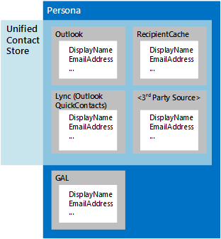

# 人员和 Exchange 中的 EWS 中的联系人

了解角色、统一的联系人存储以及如何在 Exchange 中使用 EWS 托管 API 或 EWS 处理联系人。 
  
联系人是 Exchange 中的项目，用于存储有关个人、组或组织的信息。 联系人可以包括姓名和电子邮件地址，以及其他信息，包括 IM 地址、物理地址、生日、家庭信息以及表示联系人的照片或图像。
  
联系人信息存储在以下两个位置之一：
  
- Active Directory 域服务（AD DS）（如果联系人在组织内）。
    
- 用户邮箱中的 "联系人" 文件夹或其他文件夹（如果该联系人位于组织外部）。
    
多个联系人项目可以代表单个个人。 Exchange 使用角色帮助将这些不同的联系人项目放在一起。 *角色*是来自不同源的同一个人的联系人信息的聚合。 除了 Exchange 中的联系信息之外，还可以根据邮箱的收件人缓存中的信息、名为 QuickContacts 的 IM 联系人的隐藏文件夹和第三方数据源对角色进行聚合。 Exchange 中的统一联系人存储使 IM 客户端可以使用此聚合;唯一的区别是统一联系人存储不会聚合 AD DS 中的信息，如图1中所示。 
  
**图1。角色的联系人信息源和统一的联系人存储库**

  
**表1。用于处理联系人的 EWS 托管 API 方法和 EWS 操作**

|**如果您想要 .。。**|**使用此 EWS 托管 API 方法**|**使用此 EWS 操作**|
|:-----|:-----|:-----|
|创建新联系人    |实例化新的[contact](https://msdn.microsoft.com/library/office/microsoft.exchange.webservices.data.contact%28v=exchg.80%29.aspx)对象，并使用[Contact。保存](https://msdn.microsoft.com/library/office/microsoft.exchange.webservices.data.contact.save%28v=exchg.80%29.aspx)   |[CreateItem](https://msdn.microsoft.com/library/417e994b-0a17-4c24-9527-04796b80b029%28Office.15%29.aspx)   |
|复制联系人    |[联系人。复制](https://msdn.microsoft.com/library/office/microsoft.exchange.webservices.data.contact.copy%28v=exchg.80%29.aspx)   |[CopyItem](https://msdn.microsoft.com/library/bcc68f9e-d511-4c29-bba6-ed535524624a%28Office.15%29.aspx)   |
|移动联系人    |[Contact。 Move](https://msdn.microsoft.com/library/office/microsoft.exchange.webservices.data.contact.move%28v=exchg.80%29.aspx)   |[MoveItem](https://msdn.microsoft.com/library/dcf40fa7-7796-4a5c-bf5b-7a509a18d208%28Office.15%29.aspx)   |
|更新现有联系人    |[Contact. Bind](https://msdn.microsoft.com/library/office/microsoft.exchange.webservices.data.contact.bind%28v=exchg.80%29.aspx)和[contact。 Update](https://msdn.microsoft.com/library/office/microsoft.exchange.webservices.data.contact.update%28v=exchg.80%29.aspx)   |[UpdateItem](https://msdn.microsoft.com/library/298fdd71-a83d-4407-9728-4f0a8e2d857c%28Office.15%29.aspx)   |
|删除联系人    |[Contact. Bind](https://msdn.microsoft.com/library/office/microsoft.exchange.webservices.data.contact.bind%28v=exchg.80%29.aspx)和[contact。 Delete](https://msdn.microsoft.com/library/office/microsoft.exchange.webservices.data.contact.delete%28v=exchg.80%29.aspx)   |[DeleteItem](../web-service-reference/deleteitem-operation.md)   |
|搜索联系人    |[ExchangeService。 FindItems](https://msdn.microsoft.com/library/office/microsoft.exchange.webservices.data.exchangeservice.finditems%28v=exchg.80%29.aspx)   |[FindItem](https://msdn.microsoft.com/library/ebad6aae-16e7-44de-ae63-a95b24539729%28Office.15%29.aspx)   |
|搜索人员    |不适用    |[FindPeople](https://msdn.microsoft.com/library/446106b7-ff2d-4107-90c1-29f4d38ba128%28Office.15%29.aspx)   |
|展开通讯组    |[ExchangeService。 ExpandGroup](https://msdn.microsoft.com/library/office/microsoft.exchange.webservices.data.exchangeservice.expandgroup%28v=exchg.80%29.aspx)   |[ExpandDL](https://msdn.microsoft.com/library/1f7837e7-9eff-4e10-9577-c40f7ed6af94%28Office.15%29.aspx)   |
|解析一个不明确的名称    |[ExchangeService。 ResolveName](https://msdn.microsoft.com/library/office/microsoft.exchange.webservices.data.exchangeservice.resolvename%28v=exchg.80%29.aspx)   |[ResolveNames](https://msdn.microsoft.com/library/6b4eb4b3-9ad6-4804-a09f-7e20cfea4dbb%28Office.15%29.aspx)   |
|获取角色    |不适用    |[GetPersona](https://msdn.microsoft.com/library/e2146df0-53d0-4caf-9758-b600bbc14b6a%28Office.15%29.aspx)   |
|处理联系人照片    |[SetContactPicture](https://msdn.microsoft.com/library/office/microsoft.exchange.webservices.data.contact.setcontactpicture%28v=exchg.80%29.aspx)、 [GetContactPictureAttachment](https://msdn.microsoft.com/library/office/microsoft.exchange.webservices.data.contact.getcontactpictureattachment%28v=exchg.80%29.aspx)或[contact RemoveContactPicture](https://msdn.microsoft.com/library/office/microsoft.exchange.webservices.data.contact.setcontactpicture%28v=exchg.80%29.aspx)   |[GetUserPhoto](https://msdn.microsoft.com/library/f6e8143d-4235-428e-8f9c-ab6e9b1cfa6e%28Office.15%29.aspx)或[GetAttachment](https://msdn.microsoft.com/library/24d10a15-b942-415e-9024-a6375708f326%28Office.15%29.aspx)   |
   
## 人数

直到最近，联系人通常存储在一个位置（通常是电子邮件客户端）上。 目前，在许多不同位置（例如电话、社交网络网站、Exchange 邮箱中的联系人文件夹或组织的目录服务中）存储联系人变得更加常见。 随着联系信息的激增，有可能代表同一个人的多个联系人包含不同的信息;例如，一个联系人可能包括公司电话号码和另一个个人电话号码，或者与手机上存储在同一个人联系人的联系人文件夹中的联系人可能具有不同的名称。
  
在 Exchange Online 中，Exchange Online 作为 Office 365 的一部分，并以 exchange 2013 开头的 Exchange 的本地版本，来自不同来源的联系人与 Exchange 相关联，类似于将电子邮件通过通用链接 ID 聚集到对话中的方式。 当 Exchange 服务器返回聚合的联系人信息时，它包含每个联系人的一组属性，如源文件夹、显示名称、ID 和源 ID。 返回的属性和属性的总和称为角色，返回的一组属性称为[角色的形状](https://msdn.microsoft.com/library/61d87cd5-3270-40d1-bab7-d0d5bf938607%28Office.15%29.aspx)。
  
由于构成角色的信息未存储在单个位置中，并且在任何时候都可以更改该信息，因此仅当您向 Exchange 服务器发出请求时，才会创建一个角色。 您可以使用[FindPeople](https://msdn.microsoft.com/library/446106b7-ff2d-4107-90c1-29f4d38ba128%28Office.15%29.aspx) EWS 操作生成角色搜索请求。 您的请求可以包含排序顺序，并且可以根据查询字符串进行筛选，以帮助您通过对结果进行排序和筛选来查找正确的角色。 例如，可以从 "联系人" 文件夹、Hotmail 帐户、LinkedIn 帐户和公司目录服务中检索与特定联系人关联的显示名称和一组所有电子邮件地址，也可以检索具有 IM 地址的所有角色的集合。 根据识别存储在不同设备上的联系人之间的关系的算法，自动将联系人链接到角色。 
  
> [!NOTE]
> EWS 托管 API 无法实现此功能。 
  
**表2。用于处理角色的 EWS 操作**

|**操作名称**|**说明**|
|:-----|:-----|
|[FindPeople](https://msdn.microsoft.com/library/446106b7-ff2d-4107-90c1-29f4d38ba128%28Office.15%29.aspx)   |从指定的 "联系人" 文件夹中返回所有可用的角色，或检索与指定的查询字符串匹配的联系人。    |
|[GetPersona](https://msdn.microsoft.com/library/e2146df0-53d0-4caf-9758-b600bbc14b6a%28Office.15%29.aspx)   |返回与特定角色相关联的一组属性，如指定角色 ID 的所有 IM 地址或显示名称。    |
   
您可以使用**GetPersona**和**FindPeople**操作从多个源中有效地检索联系人信息。 由于与某个角色相关的所有项目都与一个链接 ID 相关联，因此您可以在各种使用联系人数据的应用程序中使用这些操作。 下面是一些示例： 
  
- 在用户呼叫联系人时使用**GetPersona**操作的移动电话应用程序，如果没有应答，则提供要呼叫的其他电话号码。 
    
- 使用**FindPeople**操作扫描电子邮件地址的收件箱邮件的应用程序，以确定是否在现有角色中找到了这些地址。 尚未与角色相关联的地址可用于创建销售线索或列出与该角色代表的人员的所有最近通信。 
    
- [适用于 Outlook 的邮件应用](mail-apps-for-outlook-and-ews-in-exchange.md)程序，根据信件是正式还是非正式提供不同的称呼。 正式称呼由目录服务中的显示名称提供，而非正式称呼来自于社交网络联系人中产生的显示名称。 
    
## 统一联系人存储

角色不仅仅局限于电子邮件客户端。 如果您正在开发 IM 客户端，则可能会询问自己以下任一或所有内容：
  
- 如何使用一组默认的 IM 联系人项目来设置 Lync 客户端应用程序？
    
- 如何管理 IM 联系人和组列表？
    
- 如何管理自定义 Lync 客户端对 IM 联系人和 IM 组的访问权限？
    
统一联系人存储在 Exchange 中的幕后工作，以便将来自 Exchange 和其他源的联系人数据聚合到一个实体或角色中。 尽管用于访问统一联系人存储区的 EWS 操作是特定于 IM 联系人的，但您可以在 Exchange 中使用统一的联系人存储库来处理所有类型的应用程序中的角色。 请注意，统一联系人存储无法访问联系人数据 AD DS。
  
IM 联系人存储在名为 "QuickContacts" 的隐藏文件夹中。 您可以使用**AddNewImContactToGroup**和**AddImContactToGroup**操作将联系人添加到存储在此隐藏文件夹中的组。 由于您可以使用统一联系人存储对 IM 联系人进行分组，因此您可以更轻松地访问和更新联系人组。 
  
> [!NOTE]
> EWS 托管 API 无法实现此功能。 
  
**表3。用于访问统一联系人存储区的 EWS 操作**

|**操作名称**|**说明**|
|:-----|:-----|
|[AddNewImContactToGroup](https://msdn.microsoft.com/library/0cb5525f-faa3-48f1-9551-df55ffc26f46%28Office.15%29.aspx)   |将新的 IM 联系人添加到 IM 组，最多为1000个联系人。    |
|[AddImContactToGroup](https://msdn.microsoft.com/library/376acc42-2684-4596-aca1-82a4a10865c9%28Office.15%29.aspx)   |将现有 IM 联系人添加到 IM 组，最多为1000个联系人。    |
|[AddImGroup](https://msdn.microsoft.com/library/6df6e504-b7c8-4773-b10f-ffa5defac229%28Office.15%29.aspx)   |添加新的 IM 组，最多为64个组。    |
|[AddDistributionGroupToImList](https://msdn.microsoft.com/library/5aa9bec8-71cf-4a6e-8ec8-b4965b40fd4a%28Office.15%29.aspx)   |向 IM 组中添加新的通讯组，最多为64个组。    |
|[GetImItemList](https://msdn.microsoft.com/library/e31d14e1-0c1f-4b69-98b7-157d59c13698%28Office.15%29.aspx)   |检索 IM 组和 IM 联系人角色的列表。    |
|[GetImItems](https://msdn.microsoft.com/library/51186691-46d2-4d5c-b8bc-4ee2bb20fbe7%28Office.15%29.aspx)   |检索有关特定 IM 组和 IM 联系人角色的信息。    |
|[RemoveContactFromImList](https://msdn.microsoft.com/library/28ec96c3-45af-48ff-9f17-718a527dc0ad%28Office.15%29.aspx)   |从 IM 组中删除联系人。    |
|[RemoveImContactFromGroup](https://msdn.microsoft.com/library/a190bbec-c71b-4e6a-880b-55854c724d8c%28Office.15%29.aspx)   |从 IM 组中删除 IM 联系人。    |
|[RemoveDistributionGroupFromImList](https://msdn.microsoft.com/library/252bddf2-98b6-4824-b548-2fba2bda5384%28Office.15%29.aspx)   |从 IM 组中删除通讯组。    |
|[RemoveImGroup](https://msdn.microsoft.com/library/5e788016-68e0-4a3f-9243-03f6b6c6b389%28Office.15%29.aspx)   |删除 IM 组。    |
|[SetImGroup](https://msdn.microsoft.com/library/2d48aa07-8152-4c3d-a519-061253e80174%28Office.15%29.aspx)   |更改 IM 组的显示名称。    |
   
## 本节内容

- [使用 Exchange 中的 EWS 在批处理中处理联系人](how-to-process-contacts-in-batches-by-using-ews-in-exchange.md)
    
- [使用 Exchange 2013 中的 EWS 解析不明确的名称](how-to-resolve-ambiguous-names-by-using-ews-in-exchange-2013.md)
    
- [使用 Exchange 中的 EWS 获取用户照片](how-to-get-user-photos-by-using-ews-in-exchange.md)
    
## 另请参阅

- [开发 Exchange Web 服务客户端](develop-web-service-clients-for-exchange.md)
    
- [Start using web services in Exchange](start-using-web-services-in-exchange.md)
    
- [Exchange 的 EWS 客户端设计概述](ews-client-design-overview-for-exchange.md)
    

