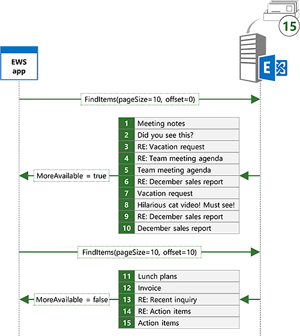
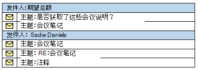

# <a name="search-and-ews-in-exchange"></a><span data-ttu-id="25a98-103">搜索和 Exchange 中的 EWS</span><span class="sxs-lookup"><span data-stu-id="25a98-103">Search and EWS in Exchange</span></span>

<span data-ttu-id="25a98-104">了解如何使用 EWS 托管 API 或 EWS 在 Exchange 搜索的项目。</span><span class="sxs-lookup"><span data-stu-id="25a98-104">Find out how to search for items in Exchange by using the EWS Managed API or EWS.</span></span>
  
<span data-ttu-id="25a98-105">这听起来熟悉？</span><span class="sxs-lookup"><span data-stu-id="25a98-105">Does this sound familiar?</span></span> <span data-ttu-id="25a98-106">最后，您刚开始您已拖延周，该项目，您需要有关您的经理发送您在以前的电子邮件周内的项目的信息。</span><span class="sxs-lookup"><span data-stu-id="25a98-106">You're finally starting that project you've been putting off for weeks, and you need information about the project that your manager sent you in email weeks ago.</span></span> <span data-ttu-id="25a98-107">收件箱中有成百上千或许消息的数目。</span><span class="sxs-lookup"><span data-stu-id="25a98-107">Your Inbox has hundreds or perhaps thousands of messages in it.</span></span> <span data-ttu-id="25a98-108">你是做什么工作的？</span><span class="sxs-lookup"><span data-stu-id="25a98-108">What do you do?</span></span> <span data-ttu-id="25a98-109">滚动电子邮件扫描每个主题和发件人，直到找到它？</span><span class="sxs-lookup"><span data-stu-id="25a98-109">Do you scroll through your email scanning each subject and sender until you find it?</span></span> <span data-ttu-id="25a98-110">或者您使用的搜索功能您喜欢的电子邮件客户端中快速零，在您需要哪种产品？</span><span class="sxs-lookup"><span data-stu-id="25a98-110">Or do you use the search feature in your favorite email client to quickly zero in on what you need?</span></span>
  
<span data-ttu-id="25a98-111">搜索无疑任何电子邮件客户端必须功能。</span><span class="sxs-lookup"><span data-stu-id="25a98-111">Search is arguably a must-have feature for any email client.</span></span> <span data-ttu-id="25a98-112">但是，可用于搜索远不止使用户可以搜索其邮箱。</span><span class="sxs-lookup"><span data-stu-id="25a98-112">But search can be used for a lot more than just enabling users to search their mailbox.</span></span> <span data-ttu-id="25a98-113">您的应用程序是否需要处理在特定时间范围内的约会？</span><span class="sxs-lookup"><span data-stu-id="25a98-113">Does your app need to process appointments that fall within specific time windows?</span></span> <span data-ttu-id="25a98-114">也许您需要报告所有任务项目的特定状态，或将用特定的公司名称的所有联系人都移动到另一个文件夹。</span><span class="sxs-lookup"><span data-stu-id="25a98-114">Maybe you need to report on all task items with a specific status, or move all contacts with a specific company name to a different folder.</span></span> <span data-ttu-id="25a98-115">搜索可帮助进行所有这些要求。</span><span class="sxs-lookup"><span data-stu-id="25a98-115">Search can help with all of these requirements.</span></span>
  
## <a name="search-basics"></a><span data-ttu-id="25a98-116">搜索基础知识</span><span class="sxs-lookup"><span data-stu-id="25a98-116">Search basics</span></span>
<span data-ttu-id="25a98-117"><a name="bk_SearchBasics"> </a></span><span class="sxs-lookup"><span data-stu-id="25a98-117"></span></span>

<span data-ttu-id="25a98-118">EWS 托管 API 和 EWS 提供两种基本方法用于指定搜索。</span><span class="sxs-lookup"><span data-stu-id="25a98-118">The EWS Managed API and EWS offer two basic methods for specifying a search.</span></span> <span data-ttu-id="25a98-119">您可以使用[查询字符串](how-to-perform-an-aqs-search-by-using-ews-in-exchange.md)或[搜索筛选器](how-to-use-search-filters-with-ews-in-exchange.md)。</span><span class="sxs-lookup"><span data-stu-id="25a98-119">You can use a [search filter](how-to-use-search-filters-with-ews-in-exchange.md) or a [query string](how-to-perform-an-aqs-search-by-using-ews-in-exchange.md).</span></span> <span data-ttu-id="25a98-120">所用的方法取决于您的搜索背后用途。</span><span class="sxs-lookup"><span data-stu-id="25a98-120">The method you use depends on the intent behind your search.</span></span>
  
<span data-ttu-id="25a98-121">**表 1。搜索筛选器和搜索查询方案**</span><span class="sxs-lookup"><span data-stu-id="25a98-121">**Table 1. Scenarios for search filters and search queries**</span></span>

|<span data-ttu-id="25a98-122">**如果您希望...**</span><span class="sxs-lookup"><span data-stu-id="25a98-122">**If you want to…**</span></span>|<span data-ttu-id="25a98-123">**使用...**</span><span class="sxs-lookup"><span data-stu-id="25a98-123">**Use a…**</span></span>|<span data-ttu-id="25a98-124">**备注**</span><span class="sxs-lookup"><span data-stu-id="25a98-124">**Notes**</span></span>|
|:-----|:-----|:-----|
|<span data-ttu-id="25a98-125">将搜索限制为特定属性或一组属性</span><span class="sxs-lookup"><span data-stu-id="25a98-125">Limit your search to a specific property or set of properties</span></span>  <br/> |<span data-ttu-id="25a98-126">搜索筛选器</span><span class="sxs-lookup"><span data-stu-id="25a98-126">Search filter</span></span>  <br/> |<span data-ttu-id="25a98-127">搜索筛选器提供最佳级别的控制哪些要搜索的属性。</span><span class="sxs-lookup"><span data-stu-id="25a98-127">Search filters provide the best level of control over which properties are searched.</span></span> <span data-ttu-id="25a98-128">虽然查询字符串可以使用高级查询语法 (AQS) 确定目标一组有限的属性，可以指定搜索筛选器的目标任何属性。</span><span class="sxs-lookup"><span data-stu-id="25a98-128">Although query strings can target a limited set of properties by using Advanced Query Syntax (AQS), search filters can target any property.</span></span>  <br/> |
|<span data-ttu-id="25a98-129">创建具有多个条件的搜索</span><span class="sxs-lookup"><span data-stu-id="25a98-129">Create searches with multiple criteria</span></span>  <br/> |<span data-ttu-id="25a98-130">搜索筛选器</span><span class="sxs-lookup"><span data-stu-id="25a98-130">Search filter</span></span>  <br/> |<span data-ttu-id="25a98-131">与搜索筛选器，可以与逻辑混用 And 或 Or，如"主题包含会议便笺和发件人等于 Sadie Daniels'"搜索允许一起加入多个搜索条件。</span><span class="sxs-lookup"><span data-stu-id="25a98-131">With search filters, multiple search criteria can be joined together with logical ANDs or ORs, allowing for searches like "subject contains 'Meeting Notes' AND sender equals 'Sadie Daniels'".</span></span> <span data-ttu-id="25a98-132">虽然查询字符串也可以加入多个搜索条件，它们是限制为查询字符串支持的属性集。</span><span class="sxs-lookup"><span data-stu-id="25a98-132">Although query strings can also join multiple search criteria, they are limited to the set of properties supported by query strings.</span></span>  <br/> |
|<span data-ttu-id="25a98-133">搜索自定义属性</span><span class="sxs-lookup"><span data-stu-id="25a98-133">Search custom properties</span></span>  <br/> |<span data-ttu-id="25a98-134">搜索筛选器</span><span class="sxs-lookup"><span data-stu-id="25a98-134">Search filter</span></span>  <br/> |<span data-ttu-id="25a98-135">搜索筛选器可以指定自定义属性的目标。</span><span class="sxs-lookup"><span data-stu-id="25a98-135">Search filters can target custom properties.</span></span> <span data-ttu-id="25a98-136">查询字符串不搜索自定义属性。</span><span class="sxs-lookup"><span data-stu-id="25a98-136">Query strings do not search custom properties.</span></span>  <br/> |
|<span data-ttu-id="25a98-137">执行区分大小写的搜索字符串属性</span><span class="sxs-lookup"><span data-stu-id="25a98-137">Perform a case sensitive search of string properties</span></span>  <br/> |<span data-ttu-id="25a98-138">搜索筛选器</span><span class="sxs-lookup"><span data-stu-id="25a98-138">Search filter</span></span>  <br/> |<span data-ttu-id="25a98-139">查询字符串搜索不区分大小写。</span><span class="sxs-lookup"><span data-stu-id="25a98-139">Query string searches are not case sensitive.</span></span>  <br/> |
|<span data-ttu-id="25a98-140">搜索字符串属性时控制包容模式</span><span class="sxs-lookup"><span data-stu-id="25a98-140">Control the containment mode when searching string properties</span></span>  <br/> |<span data-ttu-id="25a98-141">搜索筛选器</span><span class="sxs-lookup"><span data-stu-id="25a98-141">Search filter</span></span>  <br/> |<span data-ttu-id="25a98-142">查询字符串搜索始终是子字符串搜索。</span><span class="sxs-lookup"><span data-stu-id="25a98-142">Query string searches are always substring searches.</span></span> <span data-ttu-id="25a98-143">如果您需要以搜索特定前缀，或需要完全匹配，则搜索筛选器是最佳选择。</span><span class="sxs-lookup"><span data-stu-id="25a98-143">If you need to search for specific prefixes, or require exact matches, a search filter is the best choice.</span></span>  <br/> |
|<span data-ttu-id="25a98-144">搜索文件夹</span><span class="sxs-lookup"><span data-stu-id="25a98-144">Search for folders</span></span>  <br/> |<span data-ttu-id="25a98-145">搜索筛选器</span><span class="sxs-lookup"><span data-stu-id="25a98-145">Search filter</span></span>  <br/> |<span data-ttu-id="25a98-146">EWS 不支持搜索文件夹的查询字符串。</span><span class="sxs-lookup"><span data-stu-id="25a98-146">EWS does not support searching for folders with a query string.</span></span>  <br/> |
|<span data-ttu-id="25a98-147">创建搜索文件夹</span><span class="sxs-lookup"><span data-stu-id="25a98-147">Create a search folder</span></span>  <br/> |<span data-ttu-id="25a98-148">搜索筛选器</span><span class="sxs-lookup"><span data-stu-id="25a98-148">Search filter</span></span>  <br/> |<span data-ttu-id="25a98-149">EWS 不支持的查询字符串创建搜索文件夹。</span><span class="sxs-lookup"><span data-stu-id="25a98-149">EWS does not support creating search folders with a query string.</span></span>  <br/> |
|<span data-ttu-id="25a98-150">搜索所有常用属性</span><span class="sxs-lookup"><span data-stu-id="25a98-150">Search across all commonly used properties</span></span>  <br/> |<span data-ttu-id="25a98-151">查询字符串</span><span class="sxs-lookup"><span data-stu-id="25a98-151">Query string</span></span>  <br/> |<span data-ttu-id="25a98-152">不包含 AQS 查询字符串将搜索所有常用的属性。</span><span class="sxs-lookup"><span data-stu-id="25a98-152">Query strings that do not contain AQS will search across all commonly used properties.</span></span> <span data-ttu-id="25a98-153">例如，"Mack Chaves"的查询字符串值将返回所有由 Mack Chaves 以及正文或主题中具有"Mack Chaves"的任何邮件发送的邮件。</span><span class="sxs-lookup"><span data-stu-id="25a98-153">For example, a query string value of "Mack Chaves" will return all messages sent by Mack Chaves as well as any messages that have "Mack Chaves" in the body or subject.</span></span>  <br/> |
|<span data-ttu-id="25a98-154">构建基于简单的用户输入的搜索</span><span class="sxs-lookup"><span data-stu-id="25a98-154">Construct a search based on simple user input</span></span>  <br/> |<span data-ttu-id="25a98-155">查询字符串</span><span class="sxs-lookup"><span data-stu-id="25a98-155">Query string</span></span>  <br/> |<span data-ttu-id="25a98-156">查询字符串是非常好的选择允许最终用户如何快速搜索通过键入以下内容中的简单的字符串。</span><span class="sxs-lookup"><span data-stu-id="25a98-156">A query string is a great choice for allowing an end user to do a quick search by typing in a simple string.</span></span> <span data-ttu-id="25a98-157">由于查询字符串搜索包括所有常用的属性，结果将包含任何项目包含用户的搜索词。</span><span class="sxs-lookup"><span data-stu-id="25a98-157">Because a query string search includes all commonly used properties, the results will contain any items that contain the user's search terms.</span></span>  <br/> |
   
### <a name="using-a-search-filter"></a><span data-ttu-id="25a98-158">使用搜索筛选器</span><span class="sxs-lookup"><span data-stu-id="25a98-158">Using a search filter</span></span>

<span data-ttu-id="25a98-159">搜索筛选器为您提供了各种搜索选项和最大程度的控制如何执行搜索。</span><span class="sxs-lookup"><span data-stu-id="25a98-159">Search filters give you a wide range of search options and the greatest degree of control over how the search is performed.</span></span> <span data-ttu-id="25a98-160">您可以使用搜索筛选器执行基本的等价和比较搜索，但也可以在字符串属性的内容中搜索或位掩码比较。</span><span class="sxs-lookup"><span data-stu-id="25a98-160">You can use search filters to perform basic equality and comparison searches, but you can also search within the contents of string properties or do bitmask comparisons.</span></span>
  
<span data-ttu-id="25a98-161">例如，您可以通过使用 EWS 托管 API 中的[SearchFilter.ContainsSubstring](http://msdn.microsoft.com/zh-cn/library/microsoft.exchange.webservices.data.searchfilter.containssubstring%28v=exchg.80%29.aspx)类搜索项目的主题的内容。</span><span class="sxs-lookup"><span data-stu-id="25a98-161">For example, you can search the contents of the subject of items by using the [SearchFilter.ContainsSubstring](http://msdn.microsoft.com/zh-cn/library/microsoft.exchange.webservices.data.searchfilter.containssubstring%28v=exchg.80%29.aspx) class in the EWS Managed API.</span></span> <span data-ttu-id="25a98-162">本示例中，创建的搜索筛选器来搜索子字符串"会议注意，"忽略大小写的主题。</span><span class="sxs-lookup"><span data-stu-id="25a98-162">In this example, a search filter is created to search the subject for the substring "meeting notes", ignoring case.</span></span> 
  
```cs
SearchFilter.ContainsSubstring subjectFilter = new SearchFilter.ContainsSubstring(ItemSchema.Subject,
    "meeting notes", ContainmentMode.Substring, ComparisonMode.IgnoreCase);
```

<span data-ttu-id="25a98-163">您还可以对自定义属性进行搜索。</span><span class="sxs-lookup"><span data-stu-id="25a98-163">You can also search against custom properties.</span></span> <span data-ttu-id="25a98-164">本示例中， **ItemIndex**的自定义属性值大于 3 搜索。</span><span class="sxs-lookup"><span data-stu-id="25a98-164">In this example, the custom property **ItemIndex** is searched for values greater than 3.</span></span> 
  
```cs
Guid MyAppGuid = new Guid("{AA3DF801-4FC7-401F-BBC1-7C93D6498C2E}");
ExtendedPropertyDefinition customPropDefinition =
    new ExtendedPropertyDefinition(MyAppGuid, "ItemIndex", MapiPropertyType.Integer); 
SearchFilter.IsGreaterThan customPropFilter =
    new SearchFilter.IsGreaterThan(customPropDefinition, 3);
```

<span data-ttu-id="25a98-165">您还可以结合多个搜索筛选器创建更复杂的搜索。</span><span class="sxs-lookup"><span data-stu-id="25a98-165">You can also combine multiple search filters to create more complex searches.</span></span> <span data-ttu-id="25a98-166">例如，可以通过使用[SearchFilter.SearchFilterCollection](http://msdn.microsoft.com/zh-cn/library/microsoft.exchange.webservices.data.searchfilter.searchfiltercollection%28v=exchg.80%29.aspx)类与逻辑 AND 组合以前的两个筛选器。</span><span class="sxs-lookup"><span data-stu-id="25a98-166">For example, you can combine the previous two filters with a logical AND by using the [SearchFilter.SearchFilterCollection](http://msdn.microsoft.com/zh-cn/library/microsoft.exchange.webservices.data.searchfilter.searchfiltercollection%28v=exchg.80%29.aspx) class.</span></span> 
  
```cs
SearchFilter.SearchFilterCollection compoundFilter =
    new SearchFilter.SearchFilterCollection(LogicalOperator.And, subjectFilter, customPropFilter);
```

### <a name="using-a-query-string"></a><span data-ttu-id="25a98-167">使用查询字符串</span><span class="sxs-lookup"><span data-stu-id="25a98-167">Using a query string</span></span>

<span data-ttu-id="25a98-168">查询字符串提供不同的方法来搜索。</span><span class="sxs-lookup"><span data-stu-id="25a98-168">Query strings provide a different approach to search.</span></span> <span data-ttu-id="25a98-169">您必须对要搜索的字段和使用查询字符串搜索时如何执行搜索较少控制。</span><span class="sxs-lookup"><span data-stu-id="25a98-169">You have less control over the fields that are searched and how the search is performed when you use a query string search.</span></span> <span data-ttu-id="25a98-170">不，它是错误 ！</span><span class="sxs-lookup"><span data-stu-id="25a98-170">Not that that's a bad thing!</span></span> <span data-ttu-id="25a98-171">在某些情况下，您可能想要强制转换宽 net，这样说。</span><span class="sxs-lookup"><span data-stu-id="25a98-171">In some cases, you might want to cast a wider net, so to speak.</span></span>
  
<span data-ttu-id="25a98-172">例如，您也可以通过使用[ExchangeService.FindItems](http://msdn.microsoft.com/zh-cn/library/jj223808%28v=exchg.80%29.aspx) EWS 托管 API 方法搜索"会议笔记"。</span><span class="sxs-lookup"><span data-stu-id="25a98-172">For example, you can search for "meeting notes" by using the [ExchangeService.FindItems](http://msdn.microsoft.com/zh-cn/library/jj223808%28v=exchg.80%29.aspx) EWS Managed API method.</span></span> 
  
```cs
FindItemsResults<Item> results = service.FindItems(folder, "meeting notes", view);
```

<span data-ttu-id="25a98-173">如果比较结果**SearchFilter.ContainsSubstring**搜索示例前面的此搜索结果，此搜索将包含更多结果。</span><span class="sxs-lookup"><span data-stu-id="25a98-173">If you compare the results of this search to the results of the **SearchFilter.ContainsSubstring** search example earlier, this search will contain more results.</span></span> <span data-ttu-id="25a98-174">搜索筛选器搜索将返回此搜索将返回具有主题、 正文和其他字段中的"会议笔记"的项时，有"会议笔记"主题中的项目。</span><span class="sxs-lookup"><span data-stu-id="25a98-174">The search filter search will return only items that have "meeting notes" in the subject, while this search will return items that have "meeting notes" in the subject, body, and other fields.</span></span> 
  
<span data-ttu-id="25a98-175">我们来看一下如何可以优化的查询字符串以获取更接近于您的搜索筛选器中看到的结果。</span><span class="sxs-lookup"><span data-stu-id="25a98-175">Let's take a look at how you can refine the query string to get closer to the results you see from the search filter.</span></span> <span data-ttu-id="25a98-176">使用 AQS，您可以限制对主题的搜索。</span><span class="sxs-lookup"><span data-stu-id="25a98-176">Using AQS, you can limit your search to the subject.</span></span>
  
```cs
FindItemsResults<Item> results = service.FindItems(folder, "subject:meeting notes", view);
```

<span data-ttu-id="25a98-177">这是靠近，但结果仍然不完全相同。</span><span class="sxs-lookup"><span data-stu-id="25a98-177">This is closer, but the results are still not quite the same.</span></span> <span data-ttu-id="25a98-178">使用查询字符串的多个词语，当您将看到匹配项，或即使单词不按顺序指定，即使它们不是彼此相邻。</span><span class="sxs-lookup"><span data-stu-id="25a98-178">When you use a query string with multiple words, you will get matches even if the words are not in the order you specify, or even if they're not adjacent to each other.</span></span> <span data-ttu-id="25a98-179">带有查询字符串"subject： 会议笔记"中，您将获取匹配进行"会议注释"、"会议中的注释"，依此类推。</span><span class="sxs-lookup"><span data-stu-id="25a98-179">With the query string "subject:meeting notes", you will get matches for "meeting notes", "notes from the meeting", and so on.</span></span> <span data-ttu-id="25a98-180">以便进一步，您可以用双引号括起来，以指示您希望该短语只环绕的搜索词。</span><span class="sxs-lookup"><span data-stu-id="25a98-180">To further refine, you can wrap the search terms in double quotes to indicate that you want that phrase only.</span></span>
  
```cs
FindItemsResults<Item> results = service.FindItems(folder, "subject:\"meeting notes\"", view);
```

## <a name="requesting-specific-properties-in-search-results"></a><span data-ttu-id="25a98-181">在搜索结果中请求特定属性</span><span class="sxs-lookup"><span data-stu-id="25a98-181">Requesting specific properties in search results</span></span>
<span data-ttu-id="25a98-182"><a name="bk_RequestSpecific"> </a></span><span class="sxs-lookup"><span data-stu-id="25a98-182"></span></span>

<span data-ttu-id="25a98-183">默认情况下，搜索结果将包含符合搜索的项目上的所有属性。</span><span class="sxs-lookup"><span data-stu-id="25a98-183">By default, search results will contain all properties on the items that match the search.</span></span> <span data-ttu-id="25a98-184">在某些情况下这可能是所需的但在大多数情况下您的应用程序只需要一组不同的属性。</span><span class="sxs-lookup"><span data-stu-id="25a98-184">In some cases this might be what you want, but in most cases your application only requires a discrete set of properties.</span></span> <span data-ttu-id="25a98-185">在这种情况下，您应限制了一组属性返回对属性仅应用程序的需求。</span><span class="sxs-lookup"><span data-stu-id="25a98-185">In this case, you should limit the set of properties that are returned to only the properties your application needs.</span></span> <span data-ttu-id="25a98-186">在以下示例中，[属性查看](http://msdn.microsoft.com/zh-cn/library/microsoft.exchange.webservices.data.itemview%28v=exchg.80%29.aspx)类用于限制为主题，返回的属性收到，日期/时间和项的 ID。</span><span class="sxs-lookup"><span data-stu-id="25a98-186">In the following example, the [ItemView](http://msdn.microsoft.com/zh-cn/library/microsoft.exchange.webservices.data.itemview%28v=exchg.80%29.aspx) class is used to limit the returned properties to the subject, date/time received, and ID of the items.</span></span> 
  
```cs
ItemView view = new ItemView(10);
// Creating a new PropertySet with this constructor includes 
// ItemSchema.Id.
view.PropertySet = new PropertySet(ItemSchema.Subject, ItemSchema.DateTimeReceived);
```

## <a name="controlling-search-depth"></a><span data-ttu-id="25a98-187">控制搜索深度</span><span class="sxs-lookup"><span data-stu-id="25a98-187">Controlling search depth</span></span>
<span data-ttu-id="25a98-188"><a name="bk_SearchDepth"> </a></span><span class="sxs-lookup"><span data-stu-id="25a98-188"></span></span>

<span data-ttu-id="25a98-189">在视图中设置遍历控制的深度和搜索范围。</span><span class="sxs-lookup"><span data-stu-id="25a98-189">Setting the traversal on the view controls the depth and scope of the search.</span></span> 
  
<span data-ttu-id="25a98-190">**表 2。搜索遍历值**</span><span class="sxs-lookup"><span data-stu-id="25a98-190">**Table 2. Search traversal values**</span></span>

|<span data-ttu-id="25a98-191">**遍历值**</span><span class="sxs-lookup"><span data-stu-id="25a98-191">**Traversal value**</span></span>|<span data-ttu-id="25a98-192">**适用于**</span><span class="sxs-lookup"><span data-stu-id="25a98-192">**Applies to**</span></span>|<span data-ttu-id="25a98-193">**说明**</span><span class="sxs-lookup"><span data-stu-id="25a98-193">**Description**</span></span>|
|:-----|:-----|:-----|
|<span data-ttu-id="25a98-194">浅</span><span class="sxs-lookup"><span data-stu-id="25a98-194">Shallow</span></span>  <br/> |<span data-ttu-id="25a98-195">项目和文件夹</span><span class="sxs-lookup"><span data-stu-id="25a98-195">Items and Folders</span></span>  <br/> |<span data-ttu-id="25a98-196">浅表搜索被限制为要搜索的文件夹的直接子级。</span><span class="sxs-lookup"><span data-stu-id="25a98-196">Shallow searches are limited to direct children of the folder being searched.</span></span>  <br/> |
|<span data-ttu-id="25a98-197">深</span><span class="sxs-lookup"><span data-stu-id="25a98-197">Deep</span></span>  <br/> |<span data-ttu-id="25a98-198">（仅与搜索文件夹） 项和文件夹</span><span class="sxs-lookup"><span data-stu-id="25a98-198">Items (only with search folders) and Folders</span></span>  <br/> |<span data-ttu-id="25a98-199">深入搜索以递归方式搜索所搜索的文件夹和子文件夹。</span><span class="sxs-lookup"><span data-stu-id="25a98-199">Deep searches recursively search the folder being searched and subfolders.</span></span>  <br/> |
|<span data-ttu-id="25a98-200">关联</span><span class="sxs-lookup"><span data-stu-id="25a98-200">Associated</span></span>  <br/> |<span data-ttu-id="25a98-201">项目</span><span class="sxs-lookup"><span data-stu-id="25a98-201">Items</span></span>  <br/> |<span data-ttu-id="25a98-202">关联的搜索仅包括相关的项，从要搜索的文件夹。</span><span class="sxs-lookup"><span data-stu-id="25a98-202">Associated searches only include associated items from the folder being searched.</span></span> <span data-ttu-id="25a98-203">关联的项目的文件夹中的隐藏的项目。</span><span class="sxs-lookup"><span data-stu-id="25a98-203">Associated items are hidden items within the folder.</span></span>  <br/> |
|<span data-ttu-id="25a98-204">带有 SoftDeleted</span><span class="sxs-lookup"><span data-stu-id="25a98-204">SoftDeleted</span></span>  <br/> |<span data-ttu-id="25a98-205">项目和文件夹</span><span class="sxs-lookup"><span data-stu-id="25a98-205">Items and Folders</span></span>  <br/> |<span data-ttu-id="25a98-206">此遍历类型已被弃用。</span><span class="sxs-lookup"><span data-stu-id="25a98-206">This traversal type is deprecated.</span></span> <span data-ttu-id="25a98-207">带有 SoftDeleted 搜索仅包含项目中的转储程序。</span><span class="sxs-lookup"><span data-stu-id="25a98-207">SoftDeleted searches only include items that are in the dumpster.</span></span> <span data-ttu-id="25a98-208">转储程序已由[Recoverable Items Folder](http://technet.microsoft.com/zh-cn/library/ee364755%28v=exchg.150%29.aspx(Office.15).aspx) in Exchange Online、 Exchange Online 作为 Office 365 的一部分和版本的 Exchange 启动与 Exchange 2010 取代。</span><span class="sxs-lookup"><span data-stu-id="25a98-208">The dumpster has been replaced by the [Recoverable Items Folder](http://technet.microsoft.com/zh-cn/library/ee364755%28v=exchg.150%29.aspx(Office.15).aspx) in Exchange Online, Exchange Online as part of Office 365, and versions of Exchange starting with Exchange 2010.</span></span>  <br/> |
   
## <a name="managing-search-results"></a><span data-ttu-id="25a98-209">管理搜索结果</span><span class="sxs-lookup"><span data-stu-id="25a98-209">Managing search results</span></span>
<span data-ttu-id="25a98-210"><a name="bk_ManageSearchResults"> </a></span><span class="sxs-lookup"><span data-stu-id="25a98-210"></span></span>

<span data-ttu-id="25a98-211">EWS 托管 API 和 EWS 还允许您更改搜索结果如何返回。</span><span class="sxs-lookup"><span data-stu-id="25a98-211">The EWS Managed API and EWS also allow you to change how your search results are returned.</span></span> <span data-ttu-id="25a98-212">可以使用视图指定在结果中包含哪些属性、 排序结果，和页上的搜索结果仅得到每响应的结果集数。</span><span class="sxs-lookup"><span data-stu-id="25a98-212">You can use views to specify which properties are included in the results, sort results, and page your results to only get back a set number of results per response.</span></span> <span data-ttu-id="25a98-213">您还可以通过指定遍历类型分组按特定字段值和控件的深度的搜索结果。</span><span class="sxs-lookup"><span data-stu-id="25a98-213">You can also group results by specific field values and control the depth of a search by specifying a traversal type.</span></span> <span data-ttu-id="25a98-214">最后，您可以使用搜索文件夹创建新项目到达时动态更新的持久搜索。</span><span class="sxs-lookup"><span data-stu-id="25a98-214">Finally, you can use search folders to create persistent searches that are updated dynamically as new items arrive.</span></span>
  
### <a name="sorting"></a><span data-ttu-id="25a98-215">排序</span><span class="sxs-lookup"><span data-stu-id="25a98-215">Sorting</span></span>

<span data-ttu-id="25a98-216">您可以获取服务器返回排序的结果，可以更加轻松地显示或处理顺序中的项目。</span><span class="sxs-lookup"><span data-stu-id="25a98-216">You can get the server to return sorted results, which can make it easier to display or process items in order.</span></span> <span data-ttu-id="25a98-217">本示例中，将按收到与最新项目正在第一个日期/时间排序结果。</span><span class="sxs-lookup"><span data-stu-id="25a98-217">In this example, the results will be sorted by the date/time received, with the newest items being first.</span></span>
  
```cs
view.OrderBy.Add(ItemSchema.DateTimeReceived, SortDirection.Descending);
```

### <a name="paging"></a><span data-ttu-id="25a98-218">Paging</span><span class="sxs-lookup"><span data-stu-id="25a98-218">Paging</span></span>

<span data-ttu-id="25a98-219">当您使用 EWS 托管 API 或 EWS 发送搜索请求时，您可以指定视图大小，用于控制返回的项的最大数目。</span><span class="sxs-lookup"><span data-stu-id="25a98-219">When you send a search request by using the EWS Managed API or EWS, you specify a view size, which controls the maximum number of items returned.</span></span> <span data-ttu-id="25a98-220">但是，在服务器上的匹配您的搜索的项目数可能大于视图大小。</span><span class="sxs-lookup"><span data-stu-id="25a98-220">However, the number of items on the server that match your search might be larger than the view size.</span></span> <span data-ttu-id="25a98-221">在这种情况下，服务器指示项目可用。</span><span class="sxs-lookup"><span data-stu-id="25a98-221">In this case, the server indicates that more items are available.</span></span> <span data-ttu-id="25a98-222">您可以[使用分页重复搜索](how-to-perform-paged-searches-by-using-ews-in-exchange.md)并获取下一组结果。</span><span class="sxs-lookup"><span data-stu-id="25a98-222">You can [use paging to repeat your search](how-to-perform-paged-searches-by-using-ews-in-exchange.md) and get the next set of results.</span></span> 
  
<span data-ttu-id="25a98-223">例如，您可以发送搜索请求视图大小为 10。</span><span class="sxs-lookup"><span data-stu-id="25a98-223">For example, you can send a search request with a view size of 10.</span></span> <span data-ttu-id="25a98-224">可能会出现在服务器上的 15 项匹配您的搜索，但您只获得的前 10 个，以及指示符 ( [FindItemsResults\<TItem\>。MoreAvailable](http://msdn.microsoft.com/zh-cn/library/dd635477%28v=exchg.80%29.aspx)属性，如果您使用 EWS 托管 API) 的服务器上有更多结果。</span><span class="sxs-lookup"><span data-stu-id="25a98-224">There might be 15 items on the server that match your search, but you will only get back the first 10, along with an indicator (the [FindItemsResults\<TItem\>.MoreAvailable](http://msdn.microsoft.com/zh-cn/library/dd635477%28v=exchg.80%29.aspx) property if you're using the EWS Managed API) that there are more results on the server.</span></span> <span data-ttu-id="25a98-225">您然后可以发送和偏移量为 10，以匹配您的搜索的接下来的 10 项请求相同的搜索。</span><span class="sxs-lookup"><span data-stu-id="25a98-225">You can then send the same search with an offset of 10 to ask for the next 10 items that match your search.</span></span> <span data-ttu-id="25a98-226">服务器将返回剩余的五个项目。</span><span class="sxs-lookup"><span data-stu-id="25a98-226">The server will return the remaining five items.</span></span> 
  
<span data-ttu-id="25a98-227">**图 1。分页的搜索示例**</span><span class="sxs-lookup"><span data-stu-id="25a98-227">**Figure 1. Paged search example**</span></span>


  
### <a name="grouping"></a><span data-ttu-id="25a98-231">分组</span><span class="sxs-lookup"><span data-stu-id="25a98-231">Grouping</span></span>

 <span data-ttu-id="25a98-232">Exchange 使您能够将搜索结果分组依据的特定字段。</span><span class="sxs-lookup"><span data-stu-id="25a98-232">Exchange enables you to group search results by a specific field.</span></span> <span data-ttu-id="25a98-233">这可以帮助拆分到更易于管理设置的搜索结果。</span><span class="sxs-lookup"><span data-stu-id="25a98-233">This can help break up search results into more manageable sets.</span></span> <span data-ttu-id="25a98-234">例如，您可以搜索"会议笔记"并按发件人结果进行分组。</span><span class="sxs-lookup"><span data-stu-id="25a98-234">For example, you can search for "meeting notes" and group the results by sender.</span></span> <span data-ttu-id="25a98-235">下图中所示，则返回的项将分隔成组，所有符合来自合一相同的发件人的条件的项目进行分组，来自另一个组中的另一个发件人的所有匹配项等等。</span><span class="sxs-lookup"><span data-stu-id="25a98-235">As shown in the following figure, the items returned will be separated into groups, with all the items that match the criteria from the same sender in one group, all the matching items from another sender in another group, and so on.</span></span> 
  
<span data-ttu-id="25a98-236">**图 2。按发件人分组的搜索结果**</span><span class="sxs-lookup"><span data-stu-id="25a98-236">**Figure 2. Search results grouped by sender**</span></span>


  
## <a name="search-folders"></a><span data-ttu-id="25a98-238">搜索文件夹</span><span class="sxs-lookup"><span data-stu-id="25a98-238">Search folders</span></span>
<span data-ttu-id="25a98-239"><a name="bk_SearchFolders"> </a></span><span class="sxs-lookup"><span data-stu-id="25a98-239"></span></span>

<span data-ttu-id="25a98-240">使用正则搜索中，执行搜索、 结果返回到你的应用程序处理和搜索将不再存在。</span><span class="sxs-lookup"><span data-stu-id="25a98-240">With a regular search, the search is executed, the results are returned to your application for processing, and the search ceases to exist.</span></span> <span data-ttu-id="25a98-241">搜索文件夹提供一种方法，以使搜索持久。</span><span class="sxs-lookup"><span data-stu-id="25a98-241">Search folders provide a way to make a search persistent.</span></span> <span data-ttu-id="25a98-242">这是选项非常适合于您知道您需要多次执行的搜索。</span><span class="sxs-lookup"><span data-stu-id="25a98-242">This is a great option for searches that you know you will want to execute multiple times.</span></span> <span data-ttu-id="25a98-243">而不是重复执行相同的搜索，从而导致服务器评估从头搜索每次时，搜索文件夹使始终打开、 允许服务器以更新现有结果从搜索范围删除或设置为项目添加到搜索。</span><span class="sxs-lookup"><span data-stu-id="25a98-243">Rather than executing the same search repeatedly, causing the server to evaluate the search from scratch each time, a search folder makes a search always on, allowing the server to update the existing result set as items are added to or removed from the search scope.</span></span> <span data-ttu-id="25a98-244">搜索文件夹操作类似于普通文件夹，它们显示为包含字样项目的文件夹。</span><span class="sxs-lookup"><span data-stu-id="25a98-244">Search folders act like regular folders, in that they appear as folders that have items in them.</span></span> <span data-ttu-id="25a98-245">不同之处在于，在文件夹中包含的唯一项是那些符合搜索条件的与文件夹关联。</span><span class="sxs-lookup"><span data-stu-id="25a98-245">The difference is that the only items contained in the folder are those that match the search criteria that are associated with the folder.</span></span> <span data-ttu-id="25a98-246">创建搜索文件夹后，您的应用程序可以获取最新搜索结果，只需通过检查该文件夹的内容。</span><span class="sxs-lookup"><span data-stu-id="25a98-246">After a search folder is created, your application can get up-to-date results of the search just by checking the contents of the folder.</span></span>
  
<span data-ttu-id="25a98-247">创建搜索文件夹是简单，当您掌握了创建搜索筛选器。</span><span class="sxs-lookup"><span data-stu-id="25a98-247">Creating a search folder is simple when you've mastered creating search filters.</span></span> <span data-ttu-id="25a98-248">在以下示例中，创建搜索文件夹显示主题包含"会议笔记"的所有电子邮件。</span><span class="sxs-lookup"><span data-stu-id="25a98-248">In the following example, a search folder is created to show all email with a subject that contains "meeting notes".</span></span>
  
```cs
static void CreateSearchFolder(ExchangeService service)
{
    SearchFilter.ContainsSubstring subjectFilter = new SearchFilter.ContainsSubstring(ItemSchema.Subject,
        "meeting notes", ContainmentMode.Substring, ComparisonMode.IgnoreCase);
    SearchFolder searchFolder = new SearchFolder(service);
    searchFolder.DisplayName = "Meeting Notes";
    searchFolder.SearchParameters.RootFolderIds.Add(WellKnownFolderName.Inbox);
    searchFolder.SearchParameters.Traversal = SearchFolderTraversal.Deep;
    searchFolder.SearchParameters.SearchFilter = subjectFilter;
    searchFolder.Save(WellKnownFolderName.SearchFolders);
}
```

## <a name="in-this-section"></a><span data-ttu-id="25a98-249">本节内容</span><span class="sxs-lookup"><span data-stu-id="25a98-249">In this section</span></span>
<span data-ttu-id="25a98-250"><a name="bk_InThisSection"> </a></span><span class="sxs-lookup"><span data-stu-id="25a98-250"></span></span>

- [<span data-ttu-id="25a98-251">在 Exchange 中使用 EWS 使用搜索筛选器</span><span class="sxs-lookup"><span data-stu-id="25a98-251">Use search filters with EWS in Exchange</span></span>](how-to-use-search-filters-with-ews-in-exchange.md)
    
- [<span data-ttu-id="25a98-252">在 Exchange 使用 EWS 执行 AQS 搜索</span><span class="sxs-lookup"><span data-stu-id="25a98-252">Perform an AQS search by using EWS in Exchange</span></span>](how-to-perform-an-aqs-search-by-using-ews-in-exchange.md)
    
- [<span data-ttu-id="25a98-253">在 Exchange 使用 EWS 执行分页的搜索</span><span class="sxs-lookup"><span data-stu-id="25a98-253">Perform paged searches by using EWS in Exchange</span></span>](how-to-perform-paged-searches-by-using-ews-in-exchange.md)
    
- [<span data-ttu-id="25a98-254">在 Exchange 使用 EWS 执行分组的搜索</span><span class="sxs-lookup"><span data-stu-id="25a98-254">Perform grouped searches by using EWS in Exchange</span></span>](how-to-perform-grouped-searches-by-using-ews-in-exchange.md)
    
- [<span data-ttu-id="25a98-255">在 Exchange 使用 EWS 使用搜索文件夹</span><span class="sxs-lookup"><span data-stu-id="25a98-255">Work with search folders by using EWS in Exchange</span></span>](how-to-work-with-search-folders-by-using-ews-in-exchange.md)
    
## <a name="see-also"></a><span data-ttu-id="25a98-256">另请参阅</span><span class="sxs-lookup"><span data-stu-id="25a98-256">See also</span></span>


- [<span data-ttu-id="25a98-257">开发 Exchange Web 服务客户端</span><span class="sxs-lookup"><span data-stu-id="25a98-257">Develop web service clients for Exchange</span></span>](develop-web-service-clients-for-exchange.md)
    
- <span data-ttu-id="25a98-258">[可恢复的项目文件夹](http://technet.microsoft.com/zh-cn/library/ee364755%28v=exchg.150%29.aspx(Office.15).aspx)</span><span class="sxs-lookup"><span data-stu-id="25a98-258">[Recoverable Items Folder](http://technet.microsoft.com/zh-cn/library/ee364755%28v=exchg.150%29.aspx(Office.15).aspx)</span></span>
    
- [<span data-ttu-id="25a98-259">ExchangeService.FindItems</span><span class="sxs-lookup"><span data-stu-id="25a98-259">ExchangeService.FindItems</span></span>](http://msdn.microsoft.com/zh-cn/library/microsoft.exchange.webservices.data.exchangeservice.finditems%28v=exchg.80%29.aspx)
    
- [<span data-ttu-id="25a98-260">影响 EWS 的限制策略参数搜索操作</span><span class="sxs-lookup"><span data-stu-id="25a98-260">Throttling policy parameters that affect EWS search operations</span></span>](ews-throttling-in-exchange.md#bk_ThrottlingSearch)
    

