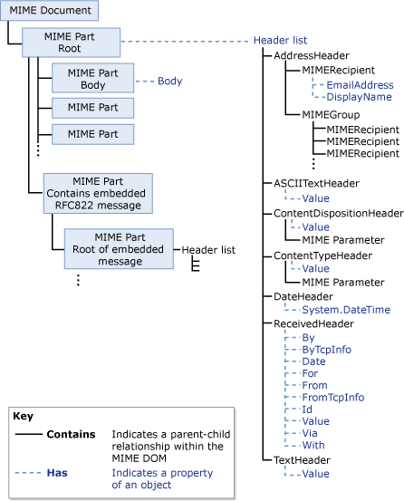
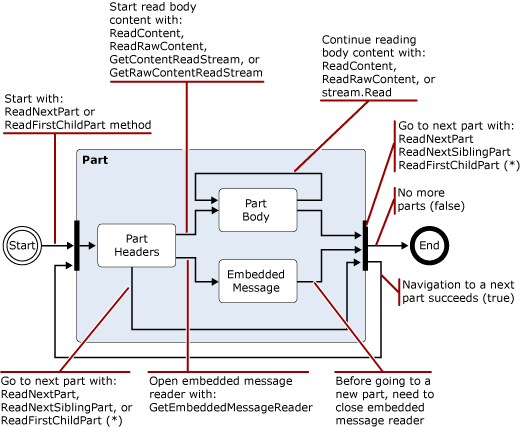
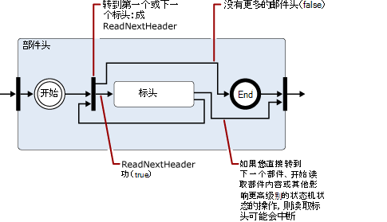
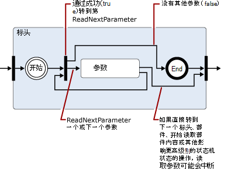
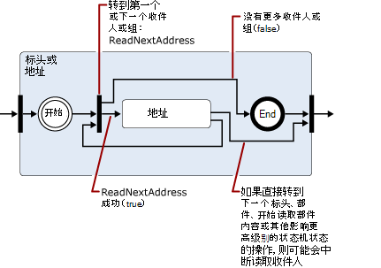
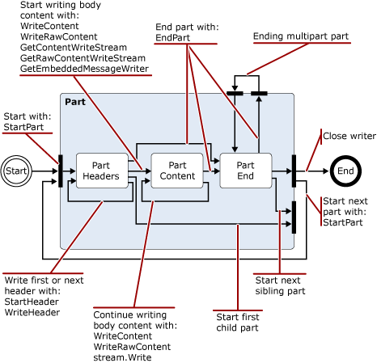
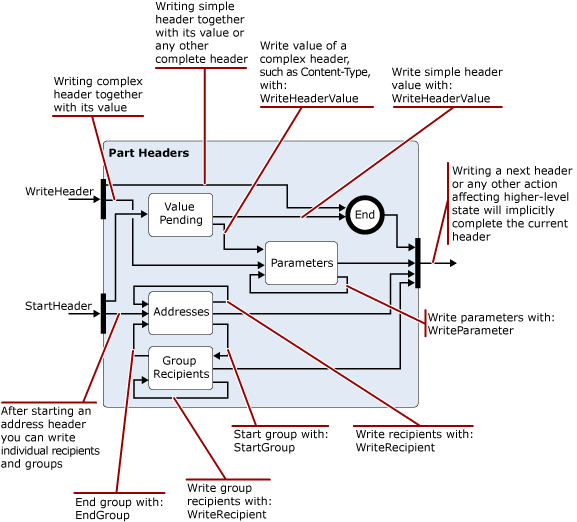

# 读取和修改 Exchange 2013 传输管道中的邮件Reading and modifying messages in the Exchange 2013 transport pipeline

了解可以在 Exchange 2013 传输代理中用于读取、写入和修改邮件的 .NET Framework 类。Learn about the .NET Framework classes you can use in your Exchange 2013 transport agents to read, write, and modify messages.
  
**适用于：** Exchange Server 2013**Applies to:** Exchange Server 2013
  
- 用于读取、写入或修改邮件的类Classes used to read, write, or modify messages
- 编码器命名空间Encoders namespace
- iCalendar 命名空间iCalendar namespace
- MIME 命名空间MIME namespace
- TextConverters 命名空间TextConverters namespace
- Tnef 命名空间Tnef namespace
- vCard 命名空间vCard namespace
  
当邮件通过传输管道传递时，传输代理可以在不同数据格式之间读取、写入和转换邮件内容。As messages pass through the transport pipeline, your transport agent can read, write, and convert message content between different data formats. 例如，您可以读取和写入 MIME 数据，识别以 Uuencoded 或可标记为可打印（qp）格式的传入邮件，然后将其转换为组织使用的标准，或者读取并保存与传入邮件关联的日历或联系人信息。For example, you can read and write MIME data, identify incoming messages that are in Uuencoded or Quoted-printable (qp) format, and then convert them to a standard used by your organization, or read and then save calendar or contact information associated with incoming messages. 
  
您还可以确定会带来安全威胁的内容，并移动或删除内容或包含这些内容的邮件;例如，通过删除 HTML 邮件中的链接。You can also identify content that poses a security threat and move or delete the content or the messages that contain them; for example, by removing links in an HTML message.
  
本文提供了有关可用于读取、写入和修改邮件的 .NET Framework 类的信息。This article provides information about the .NET Framework classes that you can use to read, write, and modify messages.
  
> [!CAUTION]
> 内容转换 Api 中的许多属性和参数都允许足够大的值来导致性能问题，包括拒绝服务。Many of the properties and parameters in the content conversion APIs allow values large enough to cause performance problems, including denial of service. 在传输代理中使用内容转换 Api 时，应对在读取或写入时支持的属性和参数值大小实施限制，以便限制代理的资源消耗。When you use the content conversion APIs in a transport agent, you should implement limits on the property and parameter value sizes you support when reading or writing in order to limit resource consumption by your agent. 

## 用于读取、写入或修改邮件的类Classes used to read, write, or modify messages

下表列出了可用于读取、写入和修改电子邮件的 .NET Framework 类。The following table lists the .NET Framework classes that you can use to read, write, and modify email messages.
  
**.NET Framework 邮件处理命名空间****.NET Framework message processing namespaces**

|**.NET Framework 命名空间****.NET Framework namespace**|**课程****Classes**|
|:-----|:-----|
|[（即，模拟编码器）Microsoft.Exchange.Data.Mime.Encoders](https://msdn.microsoft.com/library/Microsoft.Exchange.Data.Mime.Encoders.aspx)   |包含内存中的编码和解码的类、接受关联枚举中包含的一个编码器或解码器类的编码器流类，以及编码器和解码器的[ByteEncoder](https://msdn.microsoft.com/library/Microsoft.Exchange.Data.Mime.Encoders.ByteEncoder.aspx)基类和[ByteEncoderException](https://msdn.microsoft.com/library/Microsoft.Exchange.Data.Mime.Encoders.ByteEncoderException.aspx)异常类。Contains classes for in-memory encoding and decoding, an encoder stream class that accepts one of the encoder or decoder classes contained in an associated enumeration, and the [ByteEncoder](https://msdn.microsoft.com/library/Microsoft.Exchange.Data.Mime.Encoders.ByteEncoder.aspx) base class and [ByteEncoderException](https://msdn.microsoft.com/library/Microsoft.Exchange.Data.Mime.Encoders.ByteEncoderException.aspx) exception class for the encoders and decoders.    |
|[ContentTypes 的数据。Microsoft.Exchange.Data.ContentTypes.iCalendar](https://msdn.microsoft.com/library/Microsoft.Exchange.Data.ContentTypes.iCalendar.aspx)   |包含使您能够读取和写入包含日历信息的数据流的类型。Contains types that enable you to read and write data streams that contain calendar information. 包括一个日历读取器和编写器、一个异常对象、一个重复的对象，以及可帮助您返回有关日历项目的属性信息的结构和枚举。Includes a calendar reader and writer, an exception object, a recurrence object, and structures and enumerations that help you return property information about calendar items.    |
|[Microsoft. 数据 MimeMicrosoft.Exchange.Data.Mime](https://msdn.microsoft.com/library/Microsoft.Exchange.Data.Mime.aspx)   |包含可用于创建、读取、写入、遍历、编码和解码 MIME 数据的类、结构、枚举和委托。Contains classes, structures, enumerations, and delegates that you can use to create, read, write, traverse, encode, and decode MIME data. 包含一个基于流的读取器和编写器，可提供对 MIME 数据流的仅向前读写访问权限，以及可以在 MIME 文档中使用的基于 DOM 的方法和类。Includes a stream-based reader and writer that gives you forward-only read and write access to MIME data streams, as well as DOM-based methods and classes you can use on MIME documents.    |
|[Microsoft TextConvertersMicrosoft.Exchange.Data.TextConverters](https://msdn.microsoft.com/library/Microsoft.Exchange.Data.TextConverters.aspx)   |包含允许您读取和写入数据流并在特定数据类型之间执行转换的类、结构、枚举和委托;例如，HTML 到 Rtf 格式。Contains classes, structures, enumerations, and delegates that allow you to read and write a data stream and perform conversions between specific data types; for example, HTML to Rich Text Format (RTF). 文本转换器使您能够将文档流的格式从一个表单更改为另一个表单，还可以有选择地删除可能带来安全风险的文档的元素。Text converters enable you to change the format of a document stream from one form to another as well as selectively remove elements of a document that might pose a security risk.    |
|["ContentTypes"。Microsoft.Exchange.Data.ContentTypes.Tnef](https://msdn.microsoft.com/library/Microsoft.Exchange.Data.ContentTypes.Tnef.aspx)   |包含仅向前流读取器和编写器、异常类以及有助于读取和写入传输中性封装格式（TNEF）数据的结构和枚举。Contains a forward-only stream reader and writer, an exception class, and structures and enumerations that facilitate reading and writing Transport Neutral Encapsulation Format (TNEF) data.    |
|[ContentTypes 的电子名片Microsoft.Exchange.Data.ContentTypes.vCard](https://msdn.microsoft.com/library/Microsoft.Exchange.Data.ContentTypes.vCard.aspx)   |包含仅向前流读取器和编写器、异常类以及便于读取和写入电子名片格式的联系人数据的结构和枚举。Contains a forward-only stream reader and writer, an exception class, and structures and enumerations that facilitate reading and writing vCard-formatted contact data.    |
   
## 编码器命名空间Encoders namespace

编码器命名空间包含内存中的编码和解码的类。The Encoders namespace contains classes for in-memory encoding and decoding. 这些类型继承自[ByteEncoder](https://msdn.microsoft.com/library/Microsoft.Exchange.Data.Mime.Encoders.ByteEncoder.aspx)基类。These inherit from the [ByteEncoder](https://msdn.microsoft.com/library/Microsoft.Exchange.Data.Mime.Encoders.ByteEncoder.aspx) base class. 对 Base64、BinHex、带引号的可打印（qp）和 Unix 到 Unix （Uu）的类进行编码和解码。Classes encode and decode for Base64, BinHex, Quoted-printable (qp), and Unix-to-Unix (Uu). 以下类用于内存中的编码和解码：The following classes are used for in-memory encoding and decoding: 
  
- [Base64EncoderBase64Encoder](https://msdn.microsoft.com/library/Microsoft.Exchange.Data.Mime.Encoders.Base64Encoder.aspx)
    
- [Base64DecoderBase64Decoder](https://msdn.microsoft.com/library/Microsoft.Exchange.Data.Mime.Encoders.Base64Decoder.aspx)
    
- [BinHexEncoderBinHexEncoder](https://msdn.microsoft.com/library/Microsoft.Exchange.Data.Mime.Encoders.BinHexEncoder.aspx)
    
- [BinHexDecoderBinHexDecoder](https://msdn.microsoft.com/library/Microsoft.Exchange.Data.Mime.Encoders.BinHexDecoder.aspx)
    
- [QPEncoderQPEncoder](https://msdn.microsoft.com/library/Microsoft.Exchange.Data.Mime.Encoders.QPEncoder.aspx)
    
- [QPDecoderQPDecoder](https://msdn.microsoft.com/library/Microsoft.Exchange.Data.Mime.Encoders.QPDecoder.aspx)
    
- [UUEncoderUUEncoder](https://msdn.microsoft.com/library/Microsoft.Exchange.Data.Mime.Encoders.UUEncoder.aspx)
    
- [UUDecoderUUDecoder](https://msdn.microsoft.com/library/Microsoft.Exchange.Data.Mime.Encoders.UUDecoder.aspx)
    
编码器和解码器继承自[ByteEncoder](https://msdn.microsoft.com/library/Microsoft.Exchange.Data.Mime.Encoders.ByteEncoder.aspx)基类，并使用[ByteEncoderException](https://msdn.microsoft.com/library/Microsoft.Exchange.Data.Mime.Encoders.ByteEncoderException.aspx)异常类进行错误处理。The encoders and decoders inherit from the [ByteEncoder](https://msdn.microsoft.com/library/Microsoft.Exchange.Data.Mime.Encoders.ByteEncoder.aspx) base class and use the [ByteEncoderException](https://msdn.microsoft.com/library/Microsoft.Exchange.Data.Mime.Encoders.ByteEncoderException.aspx) exception class for error handling. 
  
此外，命名空间还包含[MacBinaryHeader](https://msdn.microsoft.com/library/Microsoft.Exchange.Data.Mime.Encoders.MacBinaryHeader.aspx)类，它标识 MacBinary 编码文件并读取其关联的文件头。Additionally, the namespace contains the [MacBinaryHeader](https://msdn.microsoft.com/library/Microsoft.Exchange.Data.Mime.Encoders.MacBinaryHeader.aspx) class, which identifies MacBinary encoded files and reads their associated file header. 
  
最后， [EncoderStream](https://msdn.microsoft.com/library/Microsoft.Exchange.Data.Mime.Encoders.EncoderStream.aspx)类对数据流（而不是内存中的对象）执行转换。Finally, the [EncoderStream](https://msdn.microsoft.com/library/Microsoft.Exchange.Data.Mime.Encoders.EncoderStream.aspx) class performs a conversion on a data stream instead of an in-memory object. 此类接受一个编码器或解码器类，并根据关联的[EncoderStreamAccess](https://msdn.microsoft.com/library/Microsoft.Exchange.Data.Mime.Encoders.EncoderStreamAccess.aspx)枚举进行读取或写入。This class accepts one of the encoder or decoder classes and either reads or writes according to the associated [EncoderStreamAccess](https://msdn.microsoft.com/library/Microsoft.Exchange.Data.Mime.Encoders.EncoderStreamAccess.aspx) enumeration. 
  
## iCalendar 命名空间iCalendar namespace

ICalendar 命名空间提供仅向前读取器和写入程序的 iCalendar 数据，以及用于创建、访问和修改 iCalendar 流的支持结构和类。The iCalendar namespace provides a forward-only reader and writer for iCalendar data, in addition to supporting structures and classes for creating, accessing, and modifying iCalendar streams.
  
[CalendarReader](https://msdn.microsoft.com/library/Microsoft.Exchange.Data.ContentTypes.iCalendar.CalendarReader.aspx)和[CalendarWriter](https://msdn.microsoft.com/library/Microsoft.Exchange.Data.ContentTypes.iCalendar.CalendarWriter.aspx)类用于读取和写入 iCalendar 流数据。The [CalendarReader](https://msdn.microsoft.com/library/Microsoft.Exchange.Data.ContentTypes.iCalendar.CalendarReader.aspx) and [CalendarWriter](https://msdn.microsoft.com/library/Microsoft.Exchange.Data.ContentTypes.iCalendar.CalendarWriter.aspx) classes are used to read and write iCalendar stream data. 
  
CalendarReader 采用可读[流](https://msdn.microsoft.com/library/System.IO.Stream.aspx)作为其构造函数的参数。The CalendarReader takes a readable [Stream](https://msdn.microsoft.com/library/System.IO.Stream.aspx) as an argument to its constructors. 然后，可以使用[ReadFirstChildComponent](https://msdn.microsoft.com/library/Microsoft.Exchange.Data.ContentTypes.iCalendar.CalendarReader.ReadFirstChildComponent.aspx)、 [ReadNextSiblingComponent](https://msdn.microsoft.com/library/Microsoft.Exchange.Data.ContentTypes.iCalendar.CalendarReader.ReadNextSiblingComponent.aspx)和[ReadNextComponent](https://msdn.microsoft.com/library/Microsoft.Exchange.Data.ContentTypes.iCalendar.CalendarReader.ReadNextComponent.aspx)方法按顺序访问数据流中的 iCalendar 组件。You can then use the [ReadFirstChildComponent](https://msdn.microsoft.com/library/Microsoft.Exchange.Data.ContentTypes.iCalendar.CalendarReader.ReadFirstChildComponent.aspx), [ReadNextSiblingComponent](https://msdn.microsoft.com/library/Microsoft.Exchange.Data.ContentTypes.iCalendar.CalendarReader.ReadNextSiblingComponent.aspx), and [ReadNextComponent](https://msdn.microsoft.com/library/Microsoft.Exchange.Data.ContentTypes.iCalendar.CalendarReader.ReadNextComponent.aspx) methods to sequentially access the iCalendar components in the data stream. 根据您为[ComplianceMode](https://msdn.microsoft.com/library/Microsoft.Exchange.Data.ContentTypes.iCalendar.CalendarReader.ComplianceMode.aspx)属性设置的值，iCalendar 流中的错误将导致引发异常，或者将导致[ComplianceStatus](https://msdn.microsoft.com/library/Microsoft.Exchange.Data.ContentTypes.iCalendar.CalendarReader.ComplianceStatus.aspx)属性设置为非[兼容](https://msdn.microsoft.com/library/microsoft.exchange.data.contenttypes.icalendar.calendarcompliancestatus.aspx)的值。Based on the value that you have set for the [ComplianceMode](https://msdn.microsoft.com/library/Microsoft.Exchange.Data.ContentTypes.iCalendar.CalendarReader.ComplianceMode.aspx) property, errors in the iCalendar stream will cause an exception to be thrown or will cause the [ComplianceStatus](https://msdn.microsoft.com/library/Microsoft.Exchange.Data.ContentTypes.iCalendar.CalendarReader.ComplianceStatus.aspx) property to be set to a value other than [Compliant](https://msdn.microsoft.com/library/microsoft.exchange.data.contenttypes.icalendar.calendarcompliancestatus.aspx). 您可以检查此属性以发现传入 iCalendar 数据存在的任何问题。You can check this property to discover any issues with incoming iCalendar data. 
  
[CalendarWriter](https://msdn.microsoft.com/library/Microsoft.Exchange.Data.ContentTypes.iCalendar.CalendarWriter.aspx)类采用可写[流](https://msdn.microsoft.com/library/System.IO.Stream.aspx)作为其构造函数的参数。The [CalendarWriter](https://msdn.microsoft.com/library/Microsoft.Exchange.Data.ContentTypes.iCalendar.CalendarWriter.aspx) class takes a writable [Stream](https://msdn.microsoft.com/library/System.IO.Stream.aspx) as an argument to its constructors. 
  
## MIME 命名空间MIME namespace

MIME 命名空间提供了使您能够创建、访问和修改 MIME 文档的类。The MIME namespace provides classes that enable you to create, access, and modify MIME documents. 您可以通过使用基于流的方法或基于 DOM 的方法来处理 MIME 文档。You can work with MIME documents by using either a stream-based or DOM-based method.
  
### MimeDocument 类和 MIME DOMMimeDocument class and the MIME DOM

[MimeDocument](https://msdn.microsoft.com/library/Microsoft.Exchange.Data.Mime.MimeDocument.aspx)类启用对 MIME 文档的 DOM 访问。The [MimeDocument](https://msdn.microsoft.com/library/Microsoft.Exchange.Data.Mime.MimeDocument.aspx) class enables DOM access to a MIME document. 当您具有加载整个 DOM 的可用内存，并且您必须对邮件的头和内容具有随机访问权限时，请使用此类型的对象。Use objects of this type when you have the available memory to load a whole DOM and you must have random access to the headers and content of the message. 
  
您可以使用[GetLoadStream](https://msdn.microsoft.com/library/Microsoft.Exchange.Data.Mime.MimeDocument.GetLoadStream.aspx)或[load](https://msdn.microsoft.com/library/Microsoft.Exchange.Data.Mime.MimeDocument.Load.aspx)方法将数据加载到[MimeDocument](https://msdn.microsoft.com/library/Microsoft.Exchange.Data.Mime.MimeDocument.aspx)对象中。You load data into a [MimeDocument](https://msdn.microsoft.com/library/Microsoft.Exchange.Data.Mime.MimeDocument.aspx) object by using the [GetLoadStream](https://msdn.microsoft.com/library/Microsoft.Exchange.Data.Mime.MimeDocument.GetLoadStream.aspx) or [Load](https://msdn.microsoft.com/library/Microsoft.Exchange.Data.Mime.MimeDocument.Load.aspx) methods. 然后，您可以浏览 DOM 层次结构，并创建、修改或删除 MIME 数据。You can then walk the DOM hierarchy and create, modify, or remove MIME data. 修改 MIME 数据之后，可以使用[WriteTo](https://msdn.microsoft.com/library/Microsoft.Exchange.Data.Mime.MimeNode.WriteTo.aspx)方法之一将其写入 stream。After you have modified the MIME data, you can write it to a stream by using one of the [WriteTo](https://msdn.microsoft.com/library/Microsoft.Exchange.Data.Mime.MimeNode.WriteTo.aspx) methods. 
  
下图显示了[MimeDocument](https://msdn.microsoft.com/library/Microsoft.Exchange.Data.Mime.MimeDocument.aspx)对象中的数据的结构。The following figure shows the structure of data within a [MimeDocument](https://msdn.microsoft.com/library/Microsoft.Exchange.Data.Mime.MimeDocument.aspx) object. 
  
**图1。MimeDocument 对象的结构****Figure 1. Structure of MimeDocument objects**

  
### MimeReader 和 MimeWriter 类以及基于流的 MIME 分析MimeReader and MimeWriter classes and stream-based MIME parsing

[MimeReader](https://msdn.microsoft.com/library/Microsoft.Exchange.Data.Mime.MimeReader.aspx)和[MimeWriter](https://msdn.microsoft.com/library/Microsoft.Exchange.Data.Mime.MimeWriter.aspx)类启用对 MIME 流的仅向前访问。The [MimeReader](https://msdn.microsoft.com/library/Microsoft.Exchange.Data.Mime.MimeReader.aspx) and [MimeWriter](https://msdn.microsoft.com/library/Microsoft.Exchange.Data.Mime.MimeWriter.aspx) classes enable forward-only access to MIME streams. 当您无需更改需要已读或写数据的 MIME 数据时，请使用这些类。Use these classes when you do not have to change the MIME data that requires data that has already been read or written. 例如，如果要打印适合预定义格式的邮件，则[MimeWriter](https://msdn.microsoft.com/library/Microsoft.Exchange.Data.Mime.MimeWriter.aspx)类可能是理想的。For example, if you want to print messages that fit a predefined format, the [MimeWriter](https://msdn.microsoft.com/library/Microsoft.Exchange.Data.Mime.MimeWriter.aspx) class might be ideal. 
  
[MimeDocument](https://msdn.microsoft.com/library/Microsoft.Exchange.Data.Mime.MimeDocument.aspx)类封装 DOM。The [MimeDocument](https://msdn.microsoft.com/library/Microsoft.Exchange.Data.Mime.MimeDocument.aspx) class encapsulates a DOM. [MimeReader](https://msdn.microsoft.com/library/Microsoft.Exchange.Data.Mime.MimeReader.aspx)和[MimeWriter](https://msdn.microsoft.com/library/Microsoft.Exchange.Data.Mime.MimeWriter.aspx)类表示状态计算机。The [MimeReader](https://msdn.microsoft.com/library/Microsoft.Exchange.Data.Mime.MimeReader.aspx) and [MimeWriter](https://msdn.microsoft.com/library/Microsoft.Exchange.Data.Mime.MimeWriter.aspx) classes represent state computers. 它们的状态根据接收的输入和调用的方法而变化。Their states change based on the input received and the methods called. 图2至步骤5是简化的状态转换图表，为[MimeReader](https://msdn.microsoft.com/library/Microsoft.Exchange.Data.Mime.MimeReader.aspx)对象显示了有效的方法，可以从每个状态中调用，以及将产生的状态。Figures 2 through 5 are simplified state transition diagrams that show, for the [MimeReader](https://msdn.microsoft.com/library/Microsoft.Exchange.Data.Mime.MimeReader.aspx) object, which methods are valid to call from each state and the state that will result. 
  
若要使用这些关系图，请从一个状态到下一个状态的箭头，注意方法调用或返回导致状态更改的值。To use these diagrams, follow the arrows from one state to the next, noting the method calls or return values that cause the state to change. 例如，在第一个图表中，假定您位于属于您创建的 MimeReader 的流的开头。For example, in the first diagram, assume that you are at the start of the stream that belongs to the MimeReader that you have created. 若要获取部件标头状态，请按该顺序调用[ReadNextPart](https://msdn.microsoft.com/library/Microsoft.Exchange.Data.Mime.MimeReader.ReadNextPart.aspx)或[ReadFirstChildPart](https://msdn.microsoft.com/library/Microsoft.Exchange.Data.Mime.MimeReader.ReadFirstChildPart.aspx)之一。To get to the Part Headers state, call one of [ReadNextPart](https://msdn.microsoft.com/library/Microsoft.Exchange.Data.Mime.MimeReader.ReadNextPart.aspx) or [ReadFirstChildPart](https://msdn.microsoft.com/library/Microsoft.Exchange.Data.Mime.MimeReader.ReadFirstChildPart.aspx), in that order. 如果有标头（即 MIME 的格式是否正确），您将进入部件标头状态。If there are headers (that is, if the MIME is well-formed), you will enter into the Part Headers state. 否则，将引发异常。Otherwise, an exception will be thrown. 
  
**图2。MimeReader 对象的简化状态转换关系图****Figure 2. Simplified state transition diagram for MimeReader objects**

  
> [!NOTE]
> 图3、4和5扩展了上述每个图表中显示的状态。Figures 3, 4, and 5 expand on states shown in each of the previous diagrams. 
  
**图3。从图2扩展部件标头状态****Figure 3. Expansion of Part Headers state from Figure 2**

  
**图4。在标头中遇到参数时从图3扩展了标头状态****Figure 4. Expansion of Header state from Figure 3 when a parameter has been encountered in a header**

  
> [!NOTE]
> 图5表示的状态是递归的，如果遇到地址组，则可以使用[GroupRecipientReader](https://msdn.microsoft.com/library/Microsoft.Exchange.Data.Mime.MimeAddressReader.GroupRecipientReader.aspx)属性读取组中的地址。The state represented by Figure 5 is recursive in that, if an address group is encountered, you can use the [GroupRecipientReader](https://msdn.microsoft.com/library/Microsoft.Exchange.Data.Mime.MimeAddressReader.GroupRecipientReader.aspx) property to read the addresses in the group. 
  
**图5。遇到地址或地址组时，从图3扩展标头状态****Figure 5. Expansion of Header state from Figure 3 when an address or address group is encountered**

  
图6和7显示了[MimeWriter](https://msdn.microsoft.com/library/Microsoft.Exchange.Data.Mime.MimeWriter.aspx)对象的简化状态转换图表。Figures 6 and 7 show simplified state transition diagrams for the [MimeWriter](https://msdn.microsoft.com/library/Microsoft.Exchange.Data.Mime.MimeWriter.aspx) object. 
  
> [!NOTE]
> 图7针对图6中所示的部件标题状态展开。Figure 7 expands on the Part Headers state shown in Figure 6. 
  
**图6。MimeWriter 对象的简化状态转换关系图****Figure 6. Simplified state transition diagram for MimeWriter objects**

  
**图7。从图6扩展部件标头状态****Figure 7. Expansion of Part Headers state from Figure 6**

  
## TextConverters 命名空间TextConverters namespace

TextConverters 命名空间包含支持电子邮件内容转换的类型。The TextConverters namespace contains types that support the conversion of the contents of email messages. 这些类型可以执行代码页转换，删除不安全的 HTML，并对电子邮件正文执行其他转换。These types can perform code page conversion, remove HTML that is not secure, and perform other transformations on email message bodies. [TextConverters](https://msdn.microsoft.com/library/Microsoft.Exchange.Data.TextConverters.aspx)命名空间包括从[TextConverter](https://msdn.microsoft.com/library/Microsoft.Exchange.Data.TextConverters.TextConverter.aspx)抽象类派生的以下类：The [Microsoft.Exchange.Data.TextConverters](https://msdn.microsoft.com/library/Microsoft.Exchange.Data.TextConverters.aspx) namespace includes the following classes that derive from the [TextConverter](https://msdn.microsoft.com/library/Microsoft.Exchange.Data.TextConverters.TextConverter.aspx) abstract class: 
  
- [EnrichedToHtmlEnrichedToHtml](https://msdn.microsoft.com/library/Microsoft.Exchange.Data.TextConverters.EnrichedToHtml.aspx)
    
- [EnrichedToTextEnrichedToText](https://msdn.microsoft.com/library/Microsoft.Exchange.Data.TextConverters.EnrichedToText.aspx)
    
- [HtmlToEnrichedHtmlToEnriched](https://msdn.microsoft.com/library/Microsoft.Exchange.Data.TextConverters.HtmlToEnriched.aspx)
    
- [HtmlToHtmlHtmlToHtml](https://msdn.microsoft.com/library/Microsoft.Exchange.Data.TextConverters.HtmlToHtml.aspx)
    
- [HtmlToRtfHtmlToRtf](https://msdn.microsoft.com/library/Microsoft.Exchange.Data.TextConverters.HtmlToRtf.aspx)
    
- [HtmlToTextHtmlToText](https://msdn.microsoft.com/library/Microsoft.Exchange.Data.TextConverters.HtmlToText.aspx)
    
- [RtfCompressedToRtfRtfCompressedToRtf](https://msdn.microsoft.com/library/Microsoft.Exchange.Data.TextConverters.RtfCompressedToRtf.aspx)
    
- [RtfToHtmlRtfToHtml](https://msdn.microsoft.com/library/Microsoft.Exchange.Data.TextConverters.RtfToHtml.aspx)
    
- [RtfToRtfRtfToRtf](https://msdn.microsoft.com/library/Microsoft.Exchange.Data.TextConverters.RtfToRtf.aspx)
    
- [RtfToRtfCompressedRtfToRtfCompressed](https://msdn.microsoft.com/library/Microsoft.Exchange.Data.TextConverters.RtfToRtfCompressed.aspx)
    
- [RtfToTextRtfToText](https://msdn.microsoft.com/library/Microsoft.Exchange.Data.TextConverters.RtfToText.aspx)
    
- [TextToHtmlTextToHtml](https://msdn.microsoft.com/library/Microsoft.Exchange.Data.TextConverters.TextToHtml.aspx)
    
- [TextToRtfTextToRtf](https://msdn.microsoft.com/library/Microsoft.Exchange.Data.TextConverters.TextToRtf.aspx)
    
- [TextToTextTextToText](https://msdn.microsoft.com/library/Microsoft.Exchange.Data.TextConverters.TextToText.aspx)
    
利用这些文本转换器，可以更改文档流的格式，或从 HTML 文档中删除不安全的元素。These text converters enable you to change the format of a document stream or to remove elements that are not secure from an HTML document. 这些类本身可用于执行转换，方法是对[TextConverter](https://msdn.microsoft.com/library/Microsoft.Exchange.Data.TextConverters.TextConverter.aspx)基类中的任一转换方法执行一次调用，也可以将其传递给转换器的构造函数，以使用它执行转换的读取或写入。These classes can be used by themselves to perform a conversion by using a single call to one of the Convert methods in the [TextConverter](https://msdn.microsoft.com/library/Microsoft.Exchange.Data.TextConverters.TextConverter.aspx) base class, or they can be passed to a constructor of the converter, which uses it to perform converted reads or writes. 
  
当您有足够的空间来存储原始文档及其转换输出时，或者当您要存储转换结果时，从基类继承的功能非常有用。The functionality inherited from the base class is useful for performing conversions when you have sufficient space to store the original document and its converted output, or when you want to store the results of the conversion. **Convert**方法采用输入和输出流、文本读取器或文本编写器，并将输入内容转换为相关联的输出。The **Convert** method takes input and output streams, text readers, or text writers, and converts the content of the input to the associated output. 
  
命名空间中还包含以下文本读取器、编写器和 stream 类：Also included in the namespace are the following text reader, writer, and stream classes:
  
- [ConverterReader](https://msdn.microsoft.com/library/Microsoft.Exchange.Data.TextConverters.ConverterReader.aspx) —派生自**TextReader**。[ConverterReader](https://msdn.microsoft.com/library/Microsoft.Exchange.Data.TextConverters.ConverterReader.aspx) — Derived from **System.IO.TextReader**. 
    
- [ConverterWriter](https://msdn.microsoft.com/library/Microsoft.Exchange.Data.TextConverters.ConverterWriter.aspx) —派生自**system.object**。[ConverterWriter](https://msdn.microsoft.com/library/Microsoft.Exchange.Data.TextConverters.ConverterWriter.aspx) — Derived from **System.IO.TextWriter**. 
    
- [ConverterStream](https://msdn.microsoft.com/library/Microsoft.Exchange.Data.TextConverters.ConverterStream.aspx) —从**system.object**派生。[ConverterStream](https://msdn.microsoft.com/library/Microsoft.Exchange.Data.TextConverters.ConverterStream.aspx) — Derived from **System.IO.Stream**. 
    
当您在从流中接收输入信息或将输出发送到流时，或者当您希望输出仅用于索引或搜索时，或者不希望存储转换结果时，可以使用这些文件执行转换（如果没有空间存储原始或转换的输出）。These are used to perform conversions when you do not have room to store the original or its converted output, when you receive the input from or send the output to a stream, or when you want the output only for indexing or search purposes and therefore do not want to store the result of a conversion.
  
## Tnef 命名空间Tnef namespace

Tnef 命名空间包含的类和类型可启用仅向前流的 TNEF 数据的读取和写入。The Tnef namespace contains classes and types that enable forward-only stream-based reading and writing of TNEF data. TNEF 是一种数据格式，用于封装无法解释 MAPI 的客户端的 MAPI 属性。TNEF is a data format that is used to encapsulate MAPI properties for clients that cannot interpret MAPI.
  
[TnefReader](https://msdn.microsoft.com/library/Microsoft.Exchange.Data.ContentTypes.Tnef.TnefReader.aspx)和[TnefWriter](https://msdn.microsoft.com/library/Microsoft.Exchange.Data.ContentTypes.Tnef.TnefWriter.aspx)类提供[ContentTypes](https://msdn.microsoft.com/library/Microsoft.Exchange.Data.ContentTypes.Tnef.aspx)命名空间中的核心功能。The [TnefReader](https://msdn.microsoft.com/library/Microsoft.Exchange.Data.ContentTypes.Tnef.TnefReader.aspx) and [TnefWriter](https://msdn.microsoft.com/library/Microsoft.Exchange.Data.ContentTypes.Tnef.TnefWriter.aspx) classes provide the core functionality in the [Microsoft.Exchange.Data.ContentTypes.Tnef](https://msdn.microsoft.com/library/Microsoft.Exchange.Data.ContentTypes.Tnef.aspx) namespace. 
  
[TnefReader](https://msdn.microsoft.com/library/Microsoft.Exchange.Data.ContentTypes.Tnef.TnefReader.aspx)类采用可读流作为其构造函数的参数。The [TnefReader](https://msdn.microsoft.com/library/Microsoft.Exchange.Data.ContentTypes.Tnef.TnefReader.aspx) class takes a readable stream as an argument to its constructors. 然后，使用[ReadNextAttribute](https://msdn.microsoft.com/library/Microsoft.Exchange.Data.ContentTypes.Tnef.TnefReader.ReadNextAttribute.aspx)方法按顺序读取 TNEF 流中的属性。You then use the [ReadNextAttribute](https://msdn.microsoft.com/library/Microsoft.Exchange.Data.ContentTypes.Tnef.TnefReader.ReadNextAttribute.aspx) method to sequentially read the attributes in the TNEF stream. 读取属性后，除了获取[TnefPropertyReader](https://msdn.microsoft.com/library/Microsoft.Exchange.Data.ContentTypes.Tnef.TnefPropertyReader.aspx)以读取当前属性之外，还可以使用[TnefReader](https://msdn.microsoft.com/library/Microsoft.Exchange.Data.ContentTypes.Tnef.TnefReader.aspx)对象上的任意只读属性访问有关该属性的信息。After you have read an attribute, you can access information about the attribute by using any of the read-only properties on the [TnefReader](https://msdn.microsoft.com/library/Microsoft.Exchange.Data.ContentTypes.Tnef.TnefReader.aspx) object, in addition to getting a [TnefPropertyReader](https://msdn.microsoft.com/library/Microsoft.Exchange.Data.ContentTypes.Tnef.TnefPropertyReader.aspx) to read the current property. 您还可以使用[ReadAttributeRawValue](https://msdn.microsoft.com/library/Microsoft.Exchange.Data.ContentTypes.Tnef.TnefReader.ReadAttributeRawValue.aspx)方法直接访问当前属性。You can also directly access the current attribute by using the [ReadAttributeRawValue](https://msdn.microsoft.com/library/Microsoft.Exchange.Data.ContentTypes.Tnef.TnefReader.ReadAttributeRawValue.aspx) method. 
  
[TnefWriter](https://msdn.microsoft.com/library/Microsoft.Exchange.Data.ContentTypes.Tnef.TnefWriter.aspx)类采用可写[流](https://msdn.microsoft.com/library/System.IO.Stream.aspx)作为其构造函数的参数。The [TnefWriter](https://msdn.microsoft.com/library/Microsoft.Exchange.Data.ContentTypes.Tnef.TnefWriter.aspx) class takes a writable [Stream](https://msdn.microsoft.com/library/System.IO.Stream.aspx) as an argument to its constructors. [TnefWriter](https://msdn.microsoft.com/library/Microsoft.Exchange.Data.ContentTypes.Tnef.TnefWriter.aspx)类提供了多种向此流中写入数据的方法。The [TnefWriter](https://msdn.microsoft.com/library/Microsoft.Exchange.Data.ContentTypes.Tnef.TnefWriter.aspx) class provides multiple ways in which to write data to this stream. 
  
## vCard 命名空间vCard namespace

VCard 命名空间包含用于读取和写入电子邮件中包含在 vCard 数据格式中的联系人信息的类、结构和枚举。The vCard namespace contains classes, structures, and enumerations used to read and write contact information contained in an email message that is in the vCard data format. 命名空间包含联系人读取器和编写器、异常类、属性读取器、参数读取器以及支持的枚举，使您能够读取与电子邮件关联的 vCard 数据。The namespace contains a contact reader and writer, an exception class, a property reader, a parameter reader, and supporting enumerations that allow you to read vCard data associated with an email message.
  
## 另请参阅See also

- [Exchange 中的传输代理Transport agents in Exchange](transport-agents-in-exchange-2013.md)  
- [Exchange 2013 中的传输代理概念Transport agent concepts in Exchange 2013](transport-agent-concepts-in-exchange-2013.md) 
- [Exchange 2013 的传输代理参考Transport agent reference for Exchange 2013](transport-agent-reference-for-exchange-2013.md)
- [MIME 媒体类型MIME Media Types](http://www.iana.org/assignments/media-types)
    

