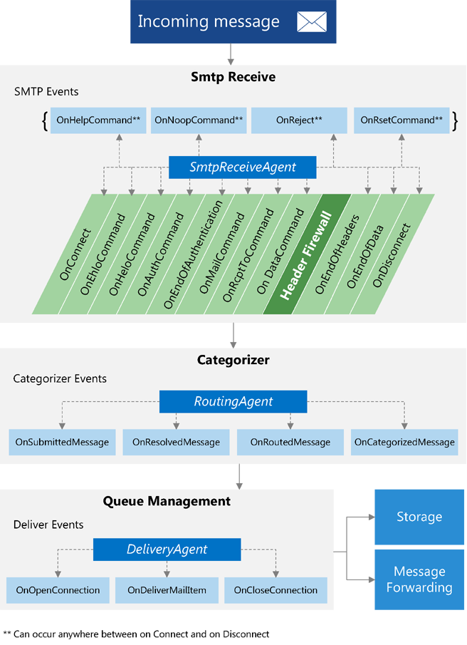
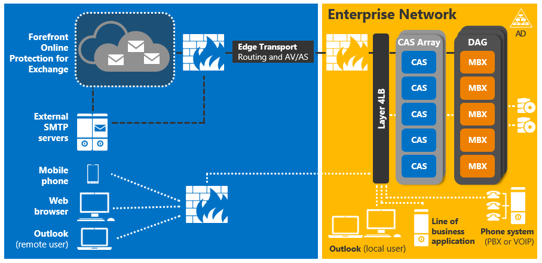
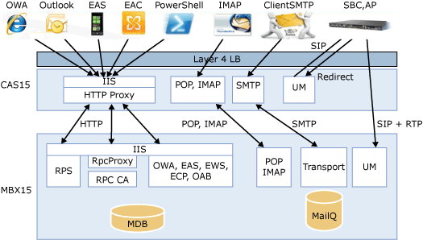

# Exchange 2013 中的传输代理概念

查找有关 Exchange 2013 中的传输代理管道和服务器角色体系结构如何影响传输代理开发的信息，以及可用于开发传输代理的类。 
  
**适用于：** Exchange Server 2013 
  
您可以使用 Exchange Server 2013 中提供的类库来实现为事件注册的传输代理，并在邮件通过传输管道时对邮件执行操作。 您还可以使用传输代理来修改邮件和转换内容。 
  
本文提供有关传输代理和传输管道体系结构的信息。 请务必了解传输管道的体系结构，以便您可以修改传输行为以满足组织的需求。 本文还提供了有关 Exchange 2013 体系结构中的更改的信息，这些更改会影响传输代理和可用于开发传输代理的类。 
  
## 传输管道中的传输代理

传输代理是从以下三个类之一派生的：
  
- [SmtpReceiveAgent](https://msdn.microsoft.com/library/Microsoft.Exchange.Data.Transport.Smtp.SmtpReceiveAgent.aspx)
- [RoutingAgent](https://msdn.microsoft.com/library/Microsoft.Exchange.Data.Transport.Routing.RoutingAgent.aspx)
- [DeliveryAgent](https://msdn.microsoft.com/library/Microsoft.Exchange.Data.Transport.Delivery.DeliveryAgent.aspx)
    
传输管道指的是 Exchange 2013 组织边界内的邮件数据流。 管道包含下表中列出的服务。
  
**表1。传输管道服务**

|**服务**|**说明**|**支持的类**|
|:-----|:-----|:-----|
|前端传输    |在所有[客户端访问服务器](https://technet.microsoft.com/library/dd298114%28v=exchg.150%29.aspx)上运行，并充当 Exchange 2013 组织的所有入站和出站外部 SMTP 流量的无状态代理。 前端传输服务不检查邮件内容，也不会在本地将任何邮件排成队列。 它与[邮箱服务器](https://technet.microsoft.com/library/jj150491%28v=exchg.150%29.aspx)上的传输服务进行通信。    |[SmtpReceiveAgent](https://msdn.microsoft.com/library/Microsoft.Exchange.Data.Transport.Smtp.SmtpReceiveAgent.aspx)   |
|Transport    |在所有邮箱服务器上运行，类似于 Exchange Server 2010 中的[集线器传输服务器](https://technet.microsoft.com/library/bb123494%28v=exchg.141%29.aspx)角色。 传输服务在其自身与邮箱传输服务和前端传输服务之间路由邮件。 此服务不与邮箱数据库直接通信。    |[SmtpReceiveAgent](https://msdn.microsoft.com/library/Microsoft.Exchange.Data.Transport.Smtp.SmtpReceiveAgent.aspx)   [RoutingAgent](https://msdn.microsoft.com/library/Microsoft.Exchange.Data.Transport.Routing.RoutingAgent.aspx)   [DeliveryAgent](https://msdn.microsoft.com/library/Microsoft.Exchange.Data.Transport.Delivery.DeliveryAgent.aspx)   |
|邮箱传输    |在所有邮箱服务器上运行，并包含两个单独的服务：邮箱传输提交和邮箱传输传递。 邮箱传输传递从传输服务接收 SMTP 邮件，并使用 Exchange 远程过程调用（RPC）连接到邮箱数据库以传递邮件。 邮箱传输提交使用 RPC 连接到邮箱数据库以检索邮件，并通过 SMTP 将邮件提交到传输服务。    |无。    |
   
### 传输事件

您可以通过先注册事件来实现传输代理，然后在触发该事件时采取措施。 这三种代理类型中的每一种都可以注册一组不同的事件。
  
下图显示了传输管道传输代理可以在何处注册事件。
  
**图1。传输事件**

  
当邮件进入传输管道时，从[SmtpReceiveAgent](https://msdn.microsoft.com/library/Microsoft.Exchange.Data.Transport.Smtp.SmtpReceiveAgent.aspx)类派生的传输代理可以在注册了代理的任何 SMTP 事件过程中对邮件执行操作。 从[RoutingAgent](https://msdn.microsoft.com/library/Microsoft.Exchange.Data.Transport.Routing.RoutingAgent.aspx)类派生的代理可以操作它已注册的四个分类程序事件中的任何事件。 从[DeliveryAgent](https://msdn.microsoft.com/library/Microsoft.Exchange.Data.Transport.Delivery.DeliveryAgent.aspx)类派生的代理可在其注册的任何传递事件过程中对邮件执行操作。 
  
## 传输代理和服务器角色

对 Exchange 2013 中的服务器角色体系结构所做的更改会影响传输代理以及传输代理可以执行的操作。 Exchange 2013 包括以下服务器角色：
  
- 邮箱服务器—包括客户端访问协议、传输服务、邮箱数据库和统一消息组件。 邮箱服务器直接与 Active Directory 域服务（AD DS）、客户端访问服务器和邮件客户端（如 Outlook）进行通信。
    
- 客户端访问服务器—提供身份验证、有限重定向、代理服务和客户端访问协议，如 HTTP、POP、IMAP 和 SMTP。
    
- 边缘传输服务器—将电子邮件路由到组织并将其传出。 边缘传输服务器通常位于 Exchange 拓扑的外围。
    
此合并结构减少了需要在 Exchange 2013 环境中部署的服务器的数量。 管理员不再需要在每个包含邮箱服务器的 Active Directory 站点中部署集线器传输服务器和客户端访问服务器，并且不再需要更新所有服务器角色，以便利用新功能。
  
这些对服务器角色体系结构的更改可能会影响代理可以在管道中响应事件的位置。 如果已创建早于 Exchange 2013 的 Exchange 版本的传输代理，请务必查看体系结构更改，以确定是否需要对代理进行任何更改。
  
下图显示了 Exchange 2013 中的体系结构更改如何导致简化的合并传输管道。 在此图中，客户端访问服务器被标记为 CAS。 和邮箱服务器标记为 MBX。
  
**图2。Exchange 2013 服务器角色体系结构**

  
下图显示了 Exchange 2013 服务器角色之间的交互。
  
**图3。邮箱和客户端访问服务器交互**

  
有关 Exchange 2013 服务器角色体系结构中的更改的详细信息，请参阅 exchange 2013 中[的新增功能在 exchange 2013 中的](https://technet.microsoft.com/library/jj150540%28v=exchg.150%29.aspx)[体系结构](https://technet.microsoft.com/library/jj150540%28v=exchg.150%29.aspx#BKMK_Arch)。 
  
## 传输代理类

你的传输代理派生的类决定了代理可为其注册的事件。 您的代理通常包含代理类、代理工厂、一个或多个事件处理程序以及执行您希望代理执行的操作的代码。
  
下表列出了要为每个代理类型派生的类。
  
**表2。代理类**

||||
|:-----|:-----|:-----|
|代理类型    |工厂基类    |代理基类    |
|SMTP 接收    |[SmtpReceiveAgentFactory](https://msdn.microsoft.com/library/Microsoft.Exchange.Data.Transport.Smtp.SmtpReceiveAgentFactory.aspx)   |[SmtpReceiveAgent](https://msdn.microsoft.com/library/Microsoft.Exchange.Data.Transport.Smtp.SmtpReceiveAgent.aspx)   |
|路径    |[RoutingAgentFactory](https://msdn.microsoft.com/library/Microsoft.Exchange.Data.Transport.Routing.RoutingAgentFactory.aspx)   |[RoutingAgent](https://msdn.microsoft.com/library/Microsoft.Exchange.Data.Transport.Routing.RoutingAgent.aspx)   |
|Delivery    |[DeliveryAgentFactory\<Manager\>](https://msdn.microsoft.com/library/dd877550(v=exchg.150).aspx)   |[DeliveryAgent](https://msdn.microsoft.com/library/microsoft.exchange.data.transport.delivery.deliveryagent(v=exchg.150).aspx)   |
   
这些工厂和代理基类提供了可用于访问传输事件和邮件的属性和方法。 在代理中实现从这些类继承的类。 在代理工厂派生类中，重写**CreateAgent**方法，以使其返回代理类的新实例。 
  
传递给事件的参数可以包含[EmailMessage](https://msdn.microsoft.com/library/Microsoft.Exchange.Data.Transport.Email.EmailMessage.aspx)类的实例，可以使用它来更改基础邮件的属性和内容。 并非所有邮件信息在每个事件中都可用。 您必须确定哪个代理以及哪种事件最适合要完成的任务。 
  
以下命名空间包含可用于读取、写入和修改传输管道中的邮件的类型：
  
- [（即，模拟编码器）](https://msdn.microsoft.com/library/Microsoft.Exchange.Data.Mime.Encoders.aspx)
    
- [ContentTypes 的数据。](https://msdn.microsoft.com/library/Microsoft.Exchange.Data.ContentTypes.iCalendar.aspx)
    
- [Microsoft. 数据 Mime](https://msdn.microsoft.com/library/Microsoft.Exchange.Data.Mime.aspx)
    
- ["ContentTypes"。](https://msdn.microsoft.com/library/Microsoft.Exchange.Data.ContentTypes.Tnef.aspx)
    
- [ContentTypes 的电子名片](https://msdn.microsoft.com/library/Microsoft.Exchange.Data.ContentTypes.vCard.aspx)
    
在编写传输代理后，通过使用 Exchange 命令行管理[程序来安装和管理代理](https://technet.microsoft.com/library/bb125175%28v=exchg.150%29.aspx)。 有关详细信息，请参阅为[Exchange 2013 创建传输代理](creating-transport-agents-for-exchange-2013.md)。 
  
## 另请参阅

- [Exchange 中的传输代理](transport-agents-in-exchange-2013.md)    
- [Exchange 2013 的传输代理参考](transport-agent-reference-for-exchange-2013.md)   
- [读取和修改 Exchange 2013 传输管道中的邮件](reading-and-modifying-messages-in-the-exchange-2013-transport-pipeline.md)    
- [Exchange 2013 中的新增功能](https://technet.microsoft.com/library/jj150540%28v=exchg.150%29.aspx)   
- [Exchange 2013 服务器角色体系结构](https://blogs.technet.com/b/exchange/archive/2013/01/23/exchange-2013-server-role-architecture.aspx)    
- [邮箱服务器和客户端访问服务器](https://technet.microsoft.com/library/jj150519%28v=exchg.150%29.aspx)   
- [Exchange Server 2013 邮件流](https://technet.microsoft.com/library/aa996349.aspx)
- [Exchange Server 2013 邮件路由](https://technet.microsoft.com/library/aa998825%28v=exchg.150%29.aspx)   
- [Exchange Server PowerShell （Exchange 命令行管理程序）](https://docs.microsoft.com/powershell/exchange/exchange-server/exchange-management-shell?view=exchange-ps)
    

